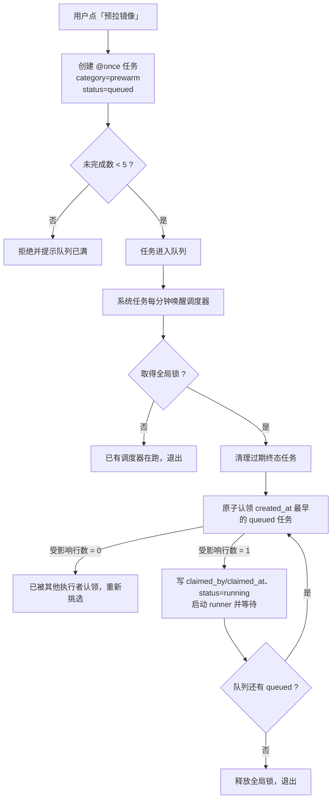

# 应用镜像预拉与安装取消方案

**版本：** 1.2（可实施版）
**日期：** 2026-09-29
**状态：** Draft（待决策，未实施）

> 本文基于当前代码与容器运行时行为的结论。`【实测】` 表示已核对 `websoft9-dev` 现有代码或环境验证，`【待验】` 表示必须在开发环境补充验证。本文只定义设计，未做任何代码改动。
>
> **v1.2 说明：** 本版已完成快速实施复核。v1.1 针对代码复核发现的 5 项 P0 与 8 项 P1 问题做了修订（对照表见 §15）；v1.2 明确了预拉队列的持久化状态、租约和进程组取消边界。最重要的三处变更：
> ①「预拉成功后自动删除任务」改为**终态保留 7 天**——现有 `delete_task` 会删除任务行与日志目录，而 `get_run_log` 又先校验任务存在，立即删除会让成功记录与日志必然 404；
> ② 排队从「调度器 + 全局锁」升级为**原子认领（claim/lease）**——现有「立即执行」直接 `Popen(runner, "manual")`，绕过调度器，串行无法成立；
> ③ 取消不再表述为「秒级终止」，改为**尽力请求 + 编排层专用终态**——现有安装编排的 `except Exception` 会把取消改写成 status=4 并删除 Gitea 仓库。

---

## 1. 目标与范围

解决两个直接相关的体验问题：

| 问题 | 现状 | 目标 |
|---|---|---|
| 镜像下载慢，安装可能超过 1 小时 | 用户只能干等，无法提前准备 | 允许用户提前把镜像拉到本地，安装时跳过下载 |
| 安装过程中无法取消 | 网络慢时任务长期挂住，只能等 | 允许在耗时阶段取消安装，立即释放用户 |

两者共用同一套"拉取中断"能力，因此合并为一份方案。

**范围外：** 不做通用安装编排重构，不引入新的镜像仓库，不做镜像清理与磁盘回收策略，不改动 Portainer 内部的部署行为。为实现取消而在既有安装编排中新增取消异常、阶段边界和终态处理，属于本方案范围。

---

## 2. 现状与实测发现

### 2.1 安装流程与耗时分布

`install_app` 的实际步骤：

| 步骤 | 执行方 | 典型耗时 | 可取消性 |
|---|---|---|---|
| Step 1 创建 Gitea 仓库 | AppHub | 秒级 | 可 |
| Step 2 复制 library 模板 → 写 `.env` → push 到 Gitea | AppHub | 十几秒 | 可 |
| **Step 3 拉取镜像** | **AppHub 自己**（`pull_images_from_yml` + `pull_with_fallback`） | **几十分钟** | **可** |
| Step 4 通过 Portainer 建栈 | Portainer API（AppHub 阻塞等待） | 通常几十秒 | 不可（仅能请求，等调用返回） |
| Step 5 绑定域名 | AppHub（NPM） | 秒级 | 可 |

【实测】关键结论：**AppHub 在 Step 3 先自行拉取全部镜像**，目的是让 Portainer 建栈时不需要再拉（本地已有镜像，compose up 直接命中缓存）。

因此：

- 用户感知的"一小时"，**100% 落在 Step 3**，而 Step 3 完全运行在 AppHub 的安装线程内 → **可取消**。
- Portainer 建栈时若仍发现缺镜像会自行补拉（`create_stack_standlone_repository` 不传 `PullImage`，走 compose up 语义），**这一段无法从 AppHub 取消**，但正常情况不会发生。

### 2.2 安装状态与定位机制

【实测】以下机制已经存在，不需要新建：

| 机制 | 位置 | 说明 |
|---|---|---|
| 阶段记录 | `install_stages` 表 | 每个 stage 带 `stage_order`，日志挂在其下 |
| 阶段写入 | `add_installing_logs(uuid, stage, log)` | 首次写入自动创建 stage |
| 当前阶段 | 前端计算 | `[...stages].reverse().find(s => s.sub_logs?.length)` |
| 阶段序列 | `app_manager.install_app` | Initializing installation → Pulling docker image → Starting the services → Configuring the domain → Installation complete |
| 日志窗口 | `MAX_SUB_LOGS = 30` | 每个阶段只保留最近 30 行 |
| 写库粒度 | `append_log` | **每一条进度行写一次 SQLite**，并刷新 `updated_at` |
| 状态集合 | `appInstalling = InstallStateCollection(store, (3,))` | **只认 status=3** |
| 过期清理 | `_is_stale_install_task(timeout_minutes=30)` | 30 分钟未更新且无栈则自动标记为 error |

### 2.3 现有资源清理能力

【实测】`remove_error_app` → `_cleanup_error_app_resources(app_id)` 已经实现了完整的回滚式清理：

- 删除 Portainer 栈 + 卷
- 删除 Gitea 仓库
- 删除 NPM 代理

**这说明产品现有模式就是"失败只标记状态，用户删除时才清理资源"。** 取消功能应当对齐这一模式，而不是另立一套。

### 2.4 现有删除入口

| 接口 | 约束 | 是否可用于取消 |
|---|---|---|
| `DELETE /apps/{app_id}/uninstall` | 要求栈已存在且非 inactive | 否 |
| `DELETE /apps/{app_id}/remove` | 要求栈存在且 inactive | 否 |
| `DELETE /apps/{app_id}/error/remove` | 要求 status=4（错误） | 需扩展 |

【实测】前端删除对话框类型为 `RemoveType = 'inactive' | 'error'`，**安装中（status=3）的应用没有任何删除或取消入口**。

### 2.5 计划任务能力

【实测】可直接复用的能力：

| 能力 | 实现 |
|---|---|
| 手动运行不依赖 cron | `run_task()` 直接 `subprocess.Popen([runner, "manual"])` |
| 并发保护 | 运行器脚本内 `flock -n`，重复执行记为 `skipped` |
| 超时 | `timeout {timeout_seconds} bash -c <command>` |
| 自动重试 | `retry_count`（默认 3），命令级重试 |
| 运行日志 | 每次运行独立日志文件，支持分页读取与下载 |
| 运行记录 | JSON + SQLite，自动保留 7 天 / 50 次 |
| 执行周期 | **必须为 5 段 cron 表达式**（`croniter` 校验） |
| 系统任务 | 只读，且**禁止手动运行**（`_require_mutable` 返回 403） |

### 2.6 拉取层技术事实

| 事实 | 值 | 来源 |
|---|---|---|
| docker-py 默认超时 | `DEFAULT_TIMEOUT_SECONDS = 60` | 【实测】 |
| Docker Engine 版本 | 29.7.2 | 【实测】 |
| 拉取实现 | `client.api.pull(stream=True, decode=True)` 返回生成器 | 【实测】 |
| 流读取方式 | `_stream_helper` 中 `reader.read(1)` 阻塞读取 | 【实测】 |
| 取消语义 | SDK 文档原文：*"Make sure to consume the generator, otherwise pull **might** get cancelled."* | 【实测】 |
| 流引用 | `_pull` 未保留生成器引用，异常逃逸后连接释放依赖 GC | 【实测】 |

**修正后的推论：停止消费生成器是取消的*必要条件*，不是引擎承诺。** SDK 用的是 `might`（可能），daemon 端是否真正中止该次拉取必须实测（§11）；且 `_pull` 未显式 `close()`。因此全文统一表述为「发出取消请求，延迟上限受读超时约束」，**不得对外承诺秒级终止**。

---

## 3. 设计决策汇总

| # | 决策 | 取值 | 说明 |
|---|---|---|---|
| D1 | `latest` 是否可预拉 | **允许但降级措辞** | 只能提示「可能漂移 / 缓存候选」，不得承诺版本一致（v1.1 修订） |
| D2 | 排队实现 | **调度器 + 原子认领（claim/lease）+ 全局锁** | 使用独立 `queue_state`，全局锁只防调度器重入，串行由认领保证 |
| D3 | 预拉成功后 | **保留 7 天**（不自动删除） | 立即删除会让运行历史与日志 404（v1.1 修订） |
| D4 | 队列上限 | **5** | 未完成任务数（待执行 + 运行中） |
| D5 | 预拉任务超时 | **`timeout_seconds=7200` 且 `retry_count=0`** | runner 的 timeout 是*每次尝试*上限，非总时长（v1.1 修订） |
| D6 | 拉取层超时 | **保持默认 60 秒** | 作为卡死检测与换源驱动 |
| D7 | 取消语义 | **终止 + 标记，不清理资源** | 需新增专用终态通道；现有 `except Exception` 会回滚并删仓库（v1.1 修订） |
| D8 | 可取消窗口 | **Step 1～3** | 边界须以状态 CAS 封闭，不能只写标志位（v1.1 修订） |
| D9 | 手动重跑路径 | **统一经调度器入队** | 不得沿用现有直启 runner 的「立即执行」（v1.1 新增） |
| D10 | 预拉任务归属 | **operator 作用域 + `category='prewarm'`** | 端点必须持有已认证 operator（v1.1 新增） |
| D11 | 磁盘预检 | **弱校验**（仅 Docker root 与 data root 同盘时有效） | 容器看不到宿主 Docker RootDir（v1.1 修订） |
| D12 | 预拉 CLI 面 | **内部命令，仅接受任务元数据** | 不接受任意路径/命令片段（v1.1 新增） |

---

## 4. 方案 A：镜像预拉

### 4.1 任务模型

| 属性 | 取值 |
|---|---|
| 粒度 | **1 个应用 = 1 个任务**（该应用的全部镜像一起下载） |
| 名称 | `预拉镜像 <应用名> <版本>` |
| 执行周期 | 一次性（`@once`） |
| 超时 | 7200 秒（上限 86400） |
| 自动重试 | **`retry_count=0`**（v1.1 修订，原因见 §4.4） |
| 归属 | operator 作用域任务（`origin='user'` + `category='prewarm'`），但**禁止通用「立即执行」直启 runner**（见 §4.3） |
| 实际命令 | `/usr/local/bin/websoft9 images prewarm --app <name> --version <version>` |

命令由平台生成，用户不接触。

### 4.2 一次性执行周期

新增 `@once` 类型，语义：

- **不写入 `/etc/cron.d/websoft9-tasks`**，永不被定时触发。
- 只能通过调度器入队启动（用户点「重跑」等同于重新入队）。
- 下次运行时间显示为 `-`，执行周期显示为「一次性」。
- 执行完成后不自动重跑。

需要修改的判定点（v1.1 补全：原表漏了主机侧与创建入口两处）：

| 位置 | 改动 |
|---|---|
| `_normalize_payload` | 放行 `@once`，跳过 5 段 cron 校验；**同时拒绝 `target='host'` 的 `@once`** |
| `create_task` | 计算 `next_run_at` 时不得调用 `croniter('@once')`（会抛异常） |
| `_sync_tasks` | 渲染容器 cron 行时跳过 `@once` |
| `_list_enabled_host_tasks` / `_sync_host_tasks` | **同样跳过 `@once`**：`_host_cron_block` 会把 `task['schedule']` 原样写进远端 crontab |
| `_next_run` | 对 `@once` 返回空 |
| `_public_task` | 展示为「一次性」，`next_run_at` 为 `null` |
| 前端创建对话框 | **不提供**「一次性」选项：`@once` 仅供内部预拉使用 |

### 4.3 排队机制

要求：每次只跑一个应用，其余自动排队，前一个结束（成功或失败）后进入下一个。



实现要点（v1.1 重写：原「串行 = 全局锁」不成立）：

| 要点 | 说明 |
|---|---|
| 单飞（锁） | 全局锁只保证**只有一个调度器在挑选任务**，它本身不保证串行 |
| 串行（认领） | 串行由**原子认领**保证：`UPDATE ... SET queue_state='running', claimed_by=?, claimed_at=? WHERE task_id=? AND queue_state='queued'`，受影响行数必须为 1，否则重新挑选 |
| 顺序 | FIFO（`created_at` 升序），用户看到的队列顺序即执行顺序 |
| 状态准确 | 只有 `running` 显示「运行中」，`queued` 显示「待执行」；**不得用 `last_status` 判断活跃**（它依赖后续同步才刷新） |
| 崩溃恢复 | 锁随进程退出释放；重启后 `running` 且 `claimed_at` 超过 `timeout_seconds + 5 分钟` 的租约才视为孤儿，回收为失败或重新入队。租约不得短于 7200 秒任务上限，否则会重复拉取 |
| 手动重跑 | 用户点「重跑」= **重新入队**（`failed → queued`），由调度器统一启动；**不得**直接 `Popen(runner, "manual")` |
| 失败不阻塞 | 失败任务不再入选，队列继续 |
| 调度器自身 | 以系统任务 + `--skip-if-running` 注册，并显式设置 `timeout_seconds`（如 300 秒）与 `retry_count=0` |

新增系统任务：

```
system:image-prewarm-dispatch    * * * * *    websoft9 images dispatch --skip-if-running
```

### 4.4 超时设计（两个层面）

这是最容易设错的地方，必须区分：

| | 计划任务超时 `timeout_seconds` | 拉取层超时（docker 客户端读超时） |
|---|---|---|
| 实现 | 运行器 `timeout N bash -c ...` | urllib3 socket 读超时 |
| 语义 | **每次尝试**的总时长上限（非整条任务） | 单次流读取的**空闲上限** |
| 默认 | 30 秒 | 60 秒 |
| 触发后 | 杀进程，任务记失败 | 抛异常 → **自动切换下一个来源** |
| 作用 | 安全网，防永久挂住 | 卡死检测 + 加速器回退驱动 |

结论：

- **慢 ≠ 卡死**。持续有数据则读超时不触发，可以跑几小时。
- **卡死才换源**，这是"慢网络自动重试其他来源"的机制，**不要修改**。
- 预拉任务必须显式设置 `timeout_seconds = 7200`；默认 30 秒会立刻杀掉任务。
- **修正（v1.1）：`timeout_seconds` 是*每次尝试*的上限，不是整条任务的总时长。** 现运行器在 `while` 重试循环内逐次执行 `timeout N bash -c ...`，因此 `retry_count=3` 的理论最坏时长是 `4 × 7200s`。所以预拉任务必须同时设 `retry_count = 0`，只保留拉取链路自身的「直连 → 加速器」回退。若将来确需任务级总时限，应在 CLI 内用 deadline 计算剩余时间，而不是叠加 runner 重试。
- 一个应用含多个镜像时，串行下载总时间需按镜像数量估算，并据此选择 `timeout_seconds`。

### 4.5 生命周期与队列上限

| 事件 | 处理 |
|---|---|
| 创建 | 校验：未完成（待执行 + 运行中）任务数 < 5，否则拒绝 |
| 成功 | **保留 7 天**，由调度器清理过期终态任务（v1.1 修订） |
| 失败 | **保留**，提供「重跑（入队）」与「删除」 |
| 用户取消排队 | `queued` 直接置 `cancelled`；`running` 向已记录的进程组发终止信号并等待 runner 写终态（见 §9 陷阱 9） |

**v1.1 修订：取消「成功即自动删除」。** 现有 `delete_task` 会删除任务行、runner、日志目录与 runs 目录，而 `get_run_log` / `list_runs` 都先经 `_get_task` 校验任务存在，删除后必然 404 —— 这与 §4.7「在计划任务查看进度与日志」直接冲突。改为终态保留 7 天。

> **「镜像已就绪」仍然不能从任务记录读取，必须查询本地 Docker 镜像。** 理由不变（更准确），且天然覆盖用户手动删除任务的情况。

### 4.6 镜像解析

必须与安装同源，否则会出现"预拉成功但安装仍要下载"的假命中：

```
library/apps/<app_name>/
  → 复制到临时目录
  → materialize_profile_template(profile)
  → 写入 W9_ID / W9_APP_NAME / W9_VERSION(=用户所选版本) / W9_DIST
  → collect_compose_images(compose, env_values)   ← 复用现有函数
  → pull_with_fallback(..., on_progress=print)     ← 复用现有管线
```

【实测】库目录样例：`/websoft9/library/apps/<app>/` 含 `docker-compose.yml`、`.env`、`variables.json`；镜像引用形如 `image: ${W9_REPO}:${W9_VERSION}`，因此**版本变化会改变镜像引用**。

本期约束：预拉按**默认配置**解析。若安装时选择了不同 profile（如外部数据库），镜像集合可能不同，未命中的镜像在安装时照常拉取，不影响正确性。

### 4.7 交互设计

**入口：应用详情的安装对话框，「安装」按钮左侧**

```
应用版本  [ 6.3.0 ▾ ]

ⓘ 预拉镜像：先把该版本所需的镜像下载到服务器。
  网络较慢时建议先预拉，安装时无需等待下载。

                    [ 预拉镜像 ]  [ 安 装 ]
```

规则：

| 场景 | 行为 |
|---|---|
| 未选版本 | 按钮禁用，提示"请先选择版本" |
| 已在队列 | 按钮显示「已在队列中」，不重复创建 |
| 已就绪 | 按钮显示「镜像已就绪」 |
| 点击成功后 | 提示：`✓ 已加入预下载队列（当前排在第 N 位）  查看进度 →「计划任务」` |

**查看位置：计划任务页面**

- 列表显示状态：待执行 / 运行中 / 成功 / 失败
- 「日志」→ 运行历史 → 运行日志（docker 拉取输出）
- 支持「加载更早」与下载完整日志
- **不做百分比进度**；运行日志即进度

CLI 在日志中按固定格式输出，便于人眼定位：

```
=== [1/3] wordpress:6.3.0 ===
=== [2/3] mysql:8.0 ===
=== done: 3 ok, 0 failed ===
```

**安装页面显示（预拉完成后）**

（a）再次打开该应用的安装对话框：

```
✓ 镜像已就绪（6.3.0）
  安装将跳过下载，预计更快完成
```

（b）版本下拉：已就绪版本加「已就绪」后缀。

（c）安装过程中：

```
Pulling docker image
  使用本地缓存镜像 wordpress:6.3.0
  使用本地缓存镜像 mysql:8.0
```

（d）若用户改选未预拉的版本：提示消失，行为与现状一致。

**失败显示**

- 安装对话框：`✗ 预拉失败，可重试`
- 计划任务：状态「失败」+ 运行日志中逐来源失败原因（复用 `describe_pull_failure` 输出）
- 重试：点「重跑」将任务**重新入队**（docker 层幂等，重跑只补缺失层）

---

## 5. 方案 B：安装取消

### 5.1 语义：终止，不是暂停

| | 语义 | 说明 |
|---|---|---|
| 取消 | **终止**当前安装 + 标记已取消 | 不可恢复 |
| 重新安装 | **新建**安装任务 | 镜像层已缓存，速度接近秒级 |

**不提供"恢复安装"。** 原因：

- 安装线程已退出，`/tmp` 下的中间状态不保证完整。
- 也不需要：docker 层是幂等的，重新安装会复用已下载层。

UI 文案使用「取消安装」，取消后引导用户「重新安装」，不出现"暂停/继续"字样。

### 5.2 可取消窗口

```
Step 1 建仓库 ─┐
Step 2 推模板 ─┤ 可取消
Step 3 拉镜像 ─┘ ★ 耗时区
─────────────── 建栈前检查点（最后一个可取消点）
Step 4 建栈   ─┐
Step 5 域名   ─┘ 不可取消
```

过了建栈前检查点后，取消请求被拒绝，提示"已进入部署阶段，请等待完成或稍后删除"。

设计目的：避免出现"取消了一半、栈还在运行"的中间态。

### 5.3 定位当前阶段

不需要新建定位模型，复用现有机制：

| 需要知道的 | 从哪来 |
|---|---|
| 当前在哪个阶段 | 最新的有日志的 stage |
| 阶段内细粒度位置 | 拉取日志中的 `=== [2/3] mysql:8.0 ===` |
| 是否真的在推进 | `updated_at`（每条进度行都会刷新） |

### 5.4 拉取时如何取消（核心）

调用链与生效点：

```
POST /apps/{app_id}/install/cancel
  └─ 写 cancel_requested=1 + 设置 threading.Event        ← 新增

安装线程：
  install_app()
    └─ Step 3: pull_images_from_yml(app_tmp_dir, app_uuid)
         └─ for image in collect_compose_images(...):
              ├─ ★ 检查点①：镜像开始前
              └─ pull_with_fallback(client, image, on_progress=report)
                   └─ for attempt in build_pull_plan(...):      ← 直拉 → 各加速器
                        └─ _pull(client, attempt, failures, on_progress)
                             └─ for line in client.api.pull(stream=True, decode=True):
                                  └─ on_progress(line)
                                       └─ report(line)
                                            ├─ ★ 检查取消标记 → raise InstallCancelled
                                            └─ add_installing_logs(...)
```

**为什么这里抛异常「可能」取消**：`pull()` 的文档说停止消费生成器时拉取 `might get cancelled`。异常打断 `for line in ...` 循环即停止消费，这是取消的**必要条件**；daemon 端是否真正中止必须实测（§11）。

**生效频率**：有进度行时**通常**秒级生效；**连接卡死无回调时只能等读超时（约 60 秒）**。因此接口与文案统一表述为「已请求取消」，UI 显示「正在取消…」。

**v1.1 补充：取消的生效点不只在拉取层。** 抛出 `InstallCancelled` 后，异常还会向上穿过 `pull_images_from_yml` → `install_app` 的 Step 3 `except Exception`，而该分支当前会 `giteaManager.remove_repo(app_id)` + `modify_app_information()`（写 status=4）。**必须先建立编排层专用终态通道，否则「取消」会表现为「失败 + 仓库被删」，与 §5.6 的设计意图相反。**

### 5.5 检查点清单

| 检查点 | 位置 | 作用 |
|---|---|---|
| ★ 主检查点 | `report(line)` 回调内 | 覆盖全部耗时 |
| ① 每张镜像开始前 | `collect_compose_images` 循环 | 多镜像不被全部拉完 |
| ② 每张镜像结束后 | 同上 | — |
| ③ **建栈前** | Step 4 开始处 | 保证不产生半成品 |
| ④ 进入 Step 4 | 在调用 Portainer 前封闭 `phase` | 此后取消接口一律拒绝，不再设置取消标志 |

> **v1.1 补充：检查点不是原子边界。** 若取消接口只写 `cancel_requested=1`，会与「通过建栈前检查点」竞争：线程可能已进入 Step 4 而接口仍返回取消成功。必须持久化明确的 `phase`（如 `preparing` / `pulling` / `deploying` / `done`），并在进入部署阶段时以条件更新封闭可取消窗口；取消接口只有在 `phase` 仍属可取消值时才能成功。

### 5.6 取消 vs 删除

| 动作 | 做什么 | **不做什么** |
|---|---|---|
| **取消** | ①线程在检查点抛异常退出 ②标记为「已取消」③保留日志 | **不删仓库、不删栈、不删卷** |
| **删除** | 复用 `_cleanup_error_app_resources` | — |

理由：

- **取消够快**：只停 + 标记，不会卡在清理 API 上。
- **误点安全**：取消不删除任何资源。
- **与现有模式一致**：失败应用本来就是"标记 + 用户删除时才清理"。

因此干净的清理逻辑已经存在，只需让删除入口认「已取消」状态。

> **v1.1 实施前提（P0）**：当前 `install_app` 的 Step 1–3 都以 `except Exception` 收尾，其中 Step 3 还会 `remove_repo` 并写 status=4。若直接抛出取消异常，用户会看到「Error + 仓库已删」，与上表「取消不删资源」相反。因此必须先落地：① 定义 `InstallCancelled`；② 在每个 `except` 之前先 `except InstallCancelled: raise`；③ 在最外层统一捕获，写「已取消」终态（不调用 `modify_app_information`、不删除资源）。

### 5.7 状态模型

| 值 | 含义 | UI |
|---|---|---|
| 3 | installing（保持） | 显示进度 + 「取消安装」 |
| 4 | error | 显示错误 + 「移除」 |
| 6 | cancelled（新增） | 显示「已取消」+ 「移除」 |

过渡态**不新增状态码**，改用 `cancel_requested` 列：

> **陷阱**：`appInstalling = InstallStateCollection(store, (3,))` 只认 status=3。若取消时把状态改为新值（如 5），应用会**立刻从 My Apps 列表消失**，用户看不到"正在取消"。

所以：过渡期间保持 `status=3` + `cancel_requested=1`，UI 据此显示「正在取消…」；线程退出后置 `status=6`。

**v1.1 补充：仅新增 status=6 不会让它可见。** 现有代码里 `appInstalling=(3,)`、`appInstallingError=(4,)`，`get_apps` 只合并这两个集合；`remove_error_app` 也只检查 `appInstallingError` 成员。因此「已取消」必须同时补齐：
① 新增 `appCancelled = InstallStateCollection(store, (6,))`；
② `get_apps` 合并 status=6 条目（否则应用从列表消失）；
③ 删除入口接受 status=6（含 `remove_error_app` 的成员判定）；
④ 前端 `StatusFilter`、`statusCounts`、`getStatusLabel/BadgeClass`、`RemoveType` 增加对应分支。

### 5.8 动作矩阵

| 用户动作 | 线程行为 | 状态 | 资源 |
|---|---|---|---|
| 取消（Step 1-3） | 检查点抛异常退出 | 已取消 | 全部保留 |
| 取消（Step 4 之后） | 接口返回 409，不设置取消标志 | 不变 | — |
| 删除 | 已是终态 | 记录删除 | 复用 `_cleanup_error_app_resources` |
| 重新安装 | 起新线程 | 新任务 | 复用已缓存镜像层 |

---

## 6. 数据模型变更

| 表 | 变更 | 说明 |
|---|---|---|
| `install_tasks` | 新增 `cancel_requested INTEGER DEFAULT 0`、`phase TEXT` | **迁移机制是版本化 `schema_version` + `CURRENT_SCHEMA_VERSION`，不是 `PRAGMA`/`ALTER`**（v1.1 修正：`PRAGMA table_info` + `ALTER TABLE` 是 `scheduled_tasks` 的机制，两者不可混用） |
| `scheduled_tasks` | 新增 `category TEXT`（`'prewarm'`）、`queue_state TEXT`（`queued/running/success/failed/cancelled`）、`claimed_at TEXT`、`claimed_by TEXT`、`runner_pgid INTEGER` | `category` 区分预拉与用户自建；`queue_state` 是预拉队列唯一真相；`claimed_*` 支撑原子认领；`runner_pgid` 让运行中任务可被可靠终止（§4.3）。该表确有 `PRAGMA table_info` 自动补列机制可复用 |
| `scheduled_task_runs` | 无变更 | 复用 |

进程内额外维护：

```python
_prewarm_cancel_events: dict[str, threading.Event]   # 安装取消信号，回调内零成本检查
```

**为什么必须用进程内 Event**：`append_log` 每条进度行都写一次 SQLite，若取消检查再读一次 DB，等于把写压力翻倍。Event 作为快速路径，DB 列仅用于展示与持久化。

---

## 7. API 变更

| 接口 | 类型 | 说明 |
|---|---|---|
| `POST /apps/{app_id}/install/cancel` | 新增 | 写入取消标记 + 设置进程内 Event，瞬时返回；**须以 `phase` CAS 判定可取消窗口**（§5.5） |
| `POST /apps/images/prewarm` | 新增 | 创建一次性预拉任务，返回任务 ID、`queue_state` 与队列位置；含队列上限校验 |
| `GET /apps/images/prewarm/status` | 新增 | 查询某应用某版本的镜像是否已就绪（**查本地镜像，不查任务**） |
| `DELETE /apps/{app_id}/error/remove` | 扩展 | 同时支持 status=6（已取消） |
| 计划任务相关接口 | 需调整 | `_public_task` 暴露 `category`、`queue_state`；预拉任务的「重跑」改为**入队**，不得直启 runner（§4.3）；运行历史与日志接口复用 |

**v1.1 补充（认证与路由归属）**：`ScheduledTaskService.create_task()` 首行即 `_require_authenticated_operator(session_token)`，而现有 `app.py` 路由没有该参数。因而：
- `POST /apps/images/prewarm` 可以保留在 `app.py`，但必须像 `scheduled_tasks.py` / `setup_wizard.py` 一样显式接受并传递会话 Cookie；
- 两个新端点必须持有已认证 operator 后再创建或查询其预拉任务；
- 注意认证关闭的部署上 `_require_authenticated_operator` 抛 **403**（不是 401），端点需按现有约定处理。

---

## 8. 前端变更

| 位置 | 变更 |
|---|---|
| 安装对话框 | 新增「预拉镜像」按钮 + 说明文案 + 就绪提示条 |
| 版本下拉 | 已就绪版本加后缀 |
| 我的应用卡片 | 安装中显示「取消安装」；取消后显示「已取消」+「移除」 |
| 取消确认框 | 文案说明：镜像层会保留，应用资源不会被自动清理 |
| 计划任务页 | `category='prewarm'` 时以 **`queue_state`**（不是滞后的 `last_status`）显示待执行/运行中/成功/失败/已取消；列表展示「一次性」与预拉标识；「重跑」走**入队**而非直启 runner |
| `RemoveType` | 由 `'inactive' \| 'error'` 扩展为增加 `'cancelled'` |

---

## 9. 关键实现要点与陷阱

| # | 要点 | 说明 |
|---|---|---|
| 1 | **取消异常必须穿透来源回退** | `_pull` 现在的 `except Exception` 会把取消当成"来源失败"并继续试下一个加速器。必须在前面加 `except InstallCancelled: raise`，`_pull_checked`、`pull_with_fallback`、`pull_with_fallback_async` 同理。**漏了这一步取消就完全失效。** |
| 2 | **显式关闭拉取流** | 现代码未保留生成器引用；应 `stream = client.api.pull(...)` 并在 `finally` 中 `stream.close()`，否则连接释放依赖 GC 时机 |
| 3 | **回调内不查数据库** | 使用进程内 Event |
| 4 | **取消原因不能被日志窗口挤掉** | `MAX_SUB_LOGS = 30`，取消时新建 `Installation cancelled` 终态 stage，不写入拉取阶段滑窗 |
| 5 | **stale 清理排除 status=6** | 否则已取消任务会被 30 分钟阈值扫描改写成 error |
| 6 | **`@once` 绝不写入 cron** | 否则会被定时触发 |
| 7 | **预拉任务超时必须显式设大** | 默认 30 秒 |
| 8 | **就绪判定查本地镜像** | 任务成功后即删除，不能依赖任务记录 |
| 9 | **删除/取消预拉任务时终止 runner** | 调度器以 `start_new_session=True` 启动 runner 后立即持久化 `runner_pgid`；运行中取消或删除时 `killpg`，再由 runner/调度器写终态并清空 `runner_pgid`。现在的删任务只删记录与文件，进程仍在跑 |
| 10 | **取消与完成的竞态** | 已完成则返回 409「安装已完成，无法取消」 |
| 11 | **端口释放** | `reserved_ports` 随任务离开 `appInstalling` 自然释放 |
| 12 | **取消必须绕过回滚分支** | `install_app` Step 1–3 的 `except Exception` 会写 status=4，Step 3 还会 `remove_repo`；取消异常必须在这些分支之前被拦截（§5.6） |
| 13 | **`timeout_seconds` 是每次尝试的上限** | 运行器在重试循环内逐次 `timeout`，`retry_count>0` 会成倍放大；预拉必须 `retry_count=0` |
| 14 | **status=6 需要全套接线** | 集合、列表合并、删除校验、前端筛选与徽标缺一不可（§5.7） |
| 15 | **删除任务会连带删除日志** | `delete_task` 删 runner/日志/runs 目录，`get_run_log` 又校验任务存在 → 成功任务不能立即删除 |
| 16 | **「立即执行」绕过调度器** | `run_task` 直接 `Popen(runner, "manual")`；预拉任务必须走认领 + 入队，否则串行失效 |
| 17 | **`@once` 也会进主机 crontab** | `_host_cron_block` 原样写入 `task['schedule']`；须在 `_list_enabled_host_tasks` 一并过滤，并拒绝 host 目标的 `@once` |
| 18 | **认领必须原子** | 需条件更新（`UPDATE ... WHERE status='queued'`，受影响行数=1 才算成功）+ 租约过期回收，不能「先查后改」 |
| 19 | **容器看不到宿主 Docker RootDir** | `shutil.disk_usage(DockerRootDir)` 必失败；磁盘预检仅在 Docker root 与 data root 同盘时才有意义（§10） |
| 20 | **重启后 Event 丢失** | 进程内 Event 不持久；启动恢复须把 `status=3 AND cancel_requested=1` 收敛为取消态，避免被 30 分钟 stale 清理改写成 error |

---

## 10. 风险与限制

| 风险 | 说明 | 处理 |
|---|---|---|
| 取消延迟 | 连接卡死时无进度回调，需等读超时（约 60 秒） | UI 显示「正在取消…」，不假装即时 |
| daemon 是否继续拉取 | 客户端断开后 daemon 行为需实测（SDK 仅称 `might`） | 已下载层会保留；**未证实前不对外承诺秒级终止** |
| `latest` 漂移 | 预拉后上游更新，安装仍用本地旧镜像 | UI 提示；允许预拉是明确决策 |
| profile 不一致 | 预拉按默认配置解析 | 未命中镜像安装时照常拉取 |
| 磁盘增长 | 预拉显著增加占用，平台无镜像清理能力 | 预检为**弱校验**：容器看不到宿主 Docker RootDir，仅当 Docker root 与 data root 同盘时该值才能代表镜像层空间；否则依赖 daemon 的真实失败信息 |
| 重复拉取 | 预拉与安装同时拉同一镜像 | 安装时检测到在拉则等待或提示 |
| 重启残留 | 容器重启后 running 状态残留 | 用 `queue_state + claimed_at` 租约回收；不能只看 flock 或 `last_status` |
| 队列失控 | 用户大量创建任务 | 未完成任务上限 5 |

---

## 11. 需要实测确认

| # | 待验项 | 方法 |
|---|---|---|
| 1 | 取消后 daemon 是否真的停止拉取 | 观察容器网络流量 / `docker system df` 变化 |
| 2 | 卡死状态下取消的实际延迟 | 断网模拟，测量从标记到退出的时间 |
| 3 | 取消后已下载层是否保留并可复用 | 取消后重装，观察是否重新下载 |
| 4 | Portainer 建栈时是否会补拉镜像 | 故意让 Step 3 漏一张镜像，观察建栈耗时 |

---

## 12. 测试与验收

### 12.1 预拉

1. 创建预拉任务后，`/etc/cron.d/websoft9-tasks` 中不出现该任务。
2. 「重跑」将任务重新入队，且不依赖 cron。
3. 运行日志可见逐应用、逐镜像输出。
4. 预拉完成后安装不再下载（日志出现「使用本地缓存镜像」）。
5. 失败后重跑一次即补齐，不重复下载已有层。
6. 多个预拉任务并发时不争抢带宽，按 FIFO 串行。
7. 成功任务保留 7 天后被清理；失败任务保留且可重跑、可删除。
8. 队列未完成数达到 5 时拒绝新建。
9. 预拉失败不影响安装主流程。
10. 磁盘不足时给出明确失败原因。

### 12.2 取消

1. 拉取中取消 → 响应迅速（通常秒级；连接卡死时受读超时约束），状态转「已取消」，资源保留。
2. 单镜像下载中取消 → 不继续下一张镜像。
3. 建栈后取消 → 拒绝并提示，状态不变。
4. 安装刚完成时取消 → 409，状态不变。
5. 卡死时取消 → 约 60 秒内生效。
6. 取消后重新安装 → 已下载层复用，不重复下载。
7. 取消后「移除」→ 复用 `_cleanup_error_app_resources` 清理仓库/栈/卷/代理。
8. 取消后不会被 stale 清理改写成 error。
9. 连续点击取消 → 幂等，无异常。
10. 排队的预拉任务取消 → runner 进程被终止。

---

## 13. 分期建议

| 阶段 | 内容 | 价值 |
|---|---|---|
| 一 | `@once` 执行周期 + `images prewarm` CLI + 调度器 + **原子认领/租约** + 队列上限 + 终态保留策略 + 安装对话框按钮与就绪提示 | 核心能力闭环 |
| 二 | 安装取消（`InstallCancelled` + 编排层专用终态 + 检查点 + 显式关闭流 + status=6 全套接线 + 移除入口） | 解决慢网络无法退出 |
| 三 | 磁盘预检与镜像清理、Gitea router 降噪等配套优化 | 长期可维护性 |

取消与预拉共用拉取中断能力：建议一期就把 `InstallCancelled` 类型与「显式关闭流」落地（成本极低），二期直接复用；但一期的串行保证**不依赖**取消能力，两者可独立验收。

---

## 14. 非目标

- 不提供"恢复安装"（取消是终止）
- 不提供跨应用的镜像共享缓存管理界面
- 不改造 Portainer 内部部署逻辑
- 不做预拉任务的优先级/插队
- 不做百分比进度与剩余时间估算
- 不做自动镜像清理与磁盘回收策略

---

## 15. v1.1 复核结论对照

复核以现有代码为准（`app_manager.py`、`image_pull.py`、`app_status.py`、`scheduled_tasks.py`、`my-apps-page.tsx`、`scheduled-tasks-page.tsx`）。结论：**方案方向成立**，但按 v1.0 原样实施会出现「取消变失败」「队列不串行」「成功记录不可读」三类缺陷。

### 15.1 P0（必须修订，已并入正文）

| # | 问题 | 代码证据 | 正文修订 |
|---|---|---|---|
| 1 | 队列没有真正串行保证 | `run_task` 直接 `Popen(runner,"manual")`；无原子认领；全局锁只防调度器重入 | D2/D9、§4.3 |
| 2 | 7200s 不是任务总超时 | `_runner_content` 在重试循环内逐次 `timeout` | D5、§4.4 |
| 3 | 取消会被改写成失败并删资源 | Step 3 `except Exception` → `remove_repo` + status=4 | §5.6 编排层专用终态 |
| 4 | 「停止消费即取消」不是保证 | SDK 原文为 `might`；`_pull` 未 `close()` | §2.6、§5.4 |
| 5 | 取消边界未原子化 | 标志位写入与检查点通过存在竞态 | D8、§5.5 `phase` CAS |

### 15.2 P1（实施前定稿，已并入正文）

| # | 问题 | 正文修订 |
|---|---|---|
| 6 | status=6 不可见、不可删 | §5.7 四项接线 |
| 7 | 成功即删导致日志 404 | D3、§4.5 改为保留 7 天 |
| 8 | `@once` 也会写入主机 crontab | §4.2 补主机侧过滤 + 拒绝 host 目标 |
| 9 | 删除任务不终止 runner | §4.5、§9 陷阱 9：须保存进程组并终止 |
| 10 | 迁移机制描述错误 | §6 修正为版本化迁移（`install_tasks`） |
| 11 | `latest` 就绪语义过强 | D1 降级为「缓存候选」 |
| 12 | 磁盘预检前提不成立 | D11、§10 降级为弱校验 |
| 13 | 预拉端点认证缺口 | §7 认证与路由归属补充 |

### 15.3 P2（体验与可维护性）

- 取消日志不要写进 `Pulling docker image` 这个 30 行滑窗，应新建终态 stage。
- 调度器需显式运行上限、独立全局锁路径与重启恢复规则；不得用 `last_status` 判断活跃。
- 预拉 CLI 收敛为内部命令组，仅接受服务端生成的任务元数据。

### 15.4 待实测（决定对外承诺）

§11 的 4 项仍是发布先决条件，其中 #1（daemon 是否真正停止拉取）与 #2（卡死时取消延迟）直接决定 UI 文案能否写「秒级」。
