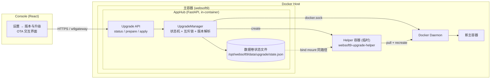
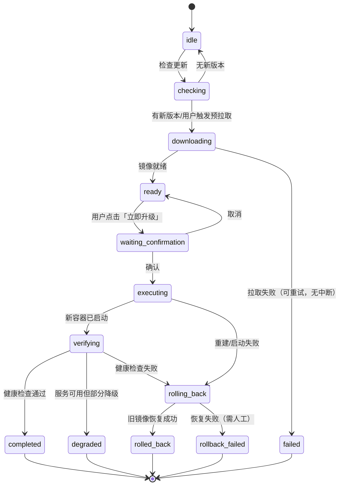
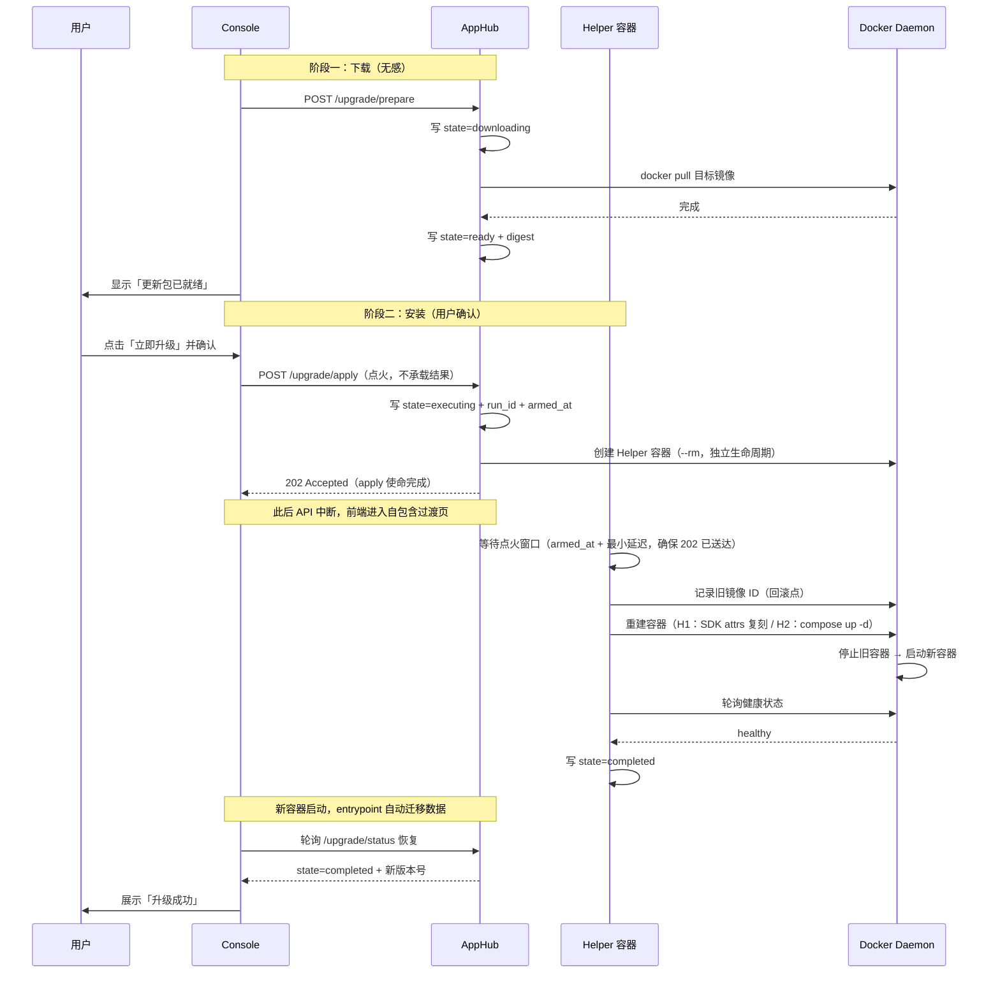
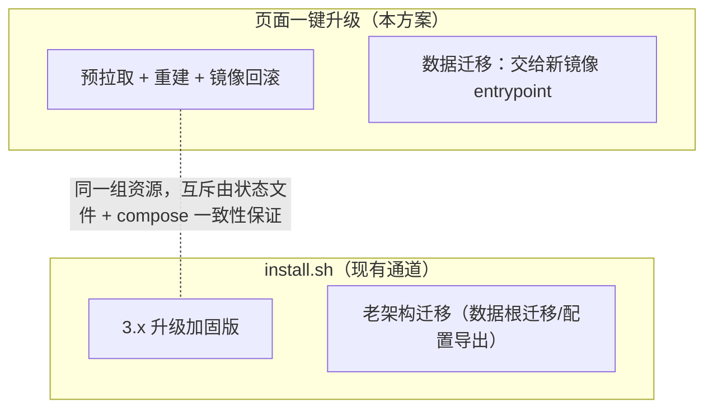
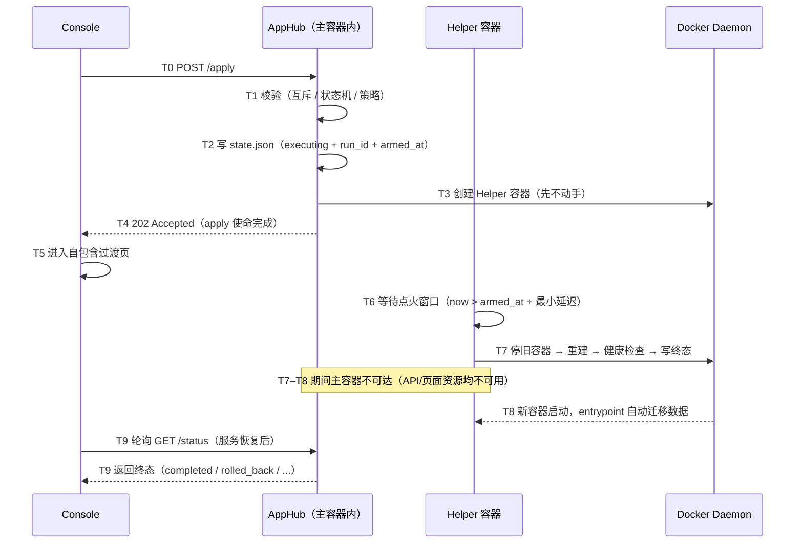

# Websoft9 控制台内一键升级方案（In-Console One-Click Upgrade Solution）

**Author:** Websoft9
**Date:** 2026-09-11
**Status:** Draft
**Version:** 1.9
**Related Documents:**
[Upgrade Architecture](./platform-release-upgrade-architecture.md) ·
[Upgrade PRD](./platform-release-upgrade-prd.md) ·
[Upgrade Epics](./platform-release-upgrade-epics.md) ·
[Story 5.1](../implementation-artifacts/5-1-build-the-upgrade-precheck-and-migration-summary.md)

> **方法论声明（v1.1）**：本文档所有事实性结论以**实际代码与运行时实测**为准；`_bmad-output` 下的规划文档仅作背景参考，不作为事实依据。规划文档与代码的已核查偏差汇总于 §2.6。任何实现开工前必须先按 §2.2 的验证方法复核当前代码状态，不得直接引用本文结论。
>
> **v1.2 变更**：新增 §4.8「断连窗口设计」——明确 apply 请求的「点火」语义与 Helper 延迟动手约束、结果获取的唯一路径、页面存亡矩阵与前端强制项；同步更新 §3.4 时序图、§4.2.3、§4.5、附录 B。
>
> **v1.3 变更**：复核后补全——新增 §2.7「影响面」（应用访问中断的实证结论）、§4.9「与相邻系统的共存」；Helper 健康判定改为**分层**（runtime-status.json 为权威信号，修正"--readiness 被误当作全组件健康"的隐患）；补 Helper 幂等可恢复设计与孤儿清理；前置检查增加应用安装任务/计划任务/磁盘/更新器检测；失败矩阵补 2 个场景（#11/#12）；备份设计对齐 install.sh 受管目录清单（替代不适合的 restic 方案）；风险补 R8/R9。
>
> **v1.4 变更（二次复核，含实测纠错）**：① 修正 `startup.html` 的**乐观结论**——实测网关在 AppHub 不可达时返回 **502**（非 500），现有 `error_page 500` 不会触发、日志中该路径 0 次命中，故补充"扩展错误码映射"的优化方案；② H1 重建补**网络显式复刻**（实测旧容器 `NetworkMode=websoft9`）与 **HostConfig 整体透传**（原伪代码仅挑 3 个字段，会丢失日志驱动等配置）；③ 新增 §4.1「镜像身份与 tag 副作用」——Helper 必须用 `from_image_id`、回滚必须回退 tag、预拉取会移动浮动 tag（新增风险 R10）；④ §4.6 明确 **API 端点级认证缺失**的实测事实与审计身份要求；⑤ 健康判定**三级门槛**（degraded 仅在网关可用时成立，否则回滚，新增 R12）；⑥ 修正 C1 措辞（允许写平台数据根）；⑦ 修正 `sessionStorage` 的能力边界。

> **v1.5 变更（三次复核，含实测纠错与一处自我更正）**：① **更正上一轮中间结论**——`/w9gateway/healthz` **确实存在且有效**（`docker/gateway/platform-gateway-routes.conf` 第 5 行，静态 `return 200`，不依赖 apphub、无需认证），§4.3 第 3 层探针保留并补实测证据；② 修正 H1 入口脚本路径与挂载路径不一致（原为 `{data_root}/upgrade/helper.py` 却把入口写成 `/state/upgrade/helper.py` → 必然启动失败）；③ 修正 `auto_remove` 与 `restart: on-failure` **不可并用**（Docker 明确拒绝 `--rm` + `--restart`），给出二选一策略；④ 实测推翻"HostConfig 整体透传即可"：`create_host_config(**inspect_HostConfig)` 会 `TypeError`（PascalCase vs snake_case），补两种可行路径与白名单；⑤ 补齐 `Config` 保真字段（TTY/STDIN/StopSignal/StopTimeout/Domainname/MacAddress/匿名卷等）；⑥ 修正健康探针的**回环地址陷阱**（Helper 用 `127.0.0.1:9000` 探测的是自己，必须改用主容器网络别名）；⑦ 前置检查落到真实库表与状态值（`install-tracking.sqlite` status=3/4；`scheduled-tasks.sqlite` 的 `last_status`/`sync_status`），并指出计划任务实际在**远端 SSH 主机**执行、本地无法强判定；⑧ 新增 R13–R15。

> **v1.6 变更（四次复核 + 收敛）**：本轮不再逐条追加，而是**一次性列出全部剩余缺口**（§2.9）并给出**唯一的收敛路径**（§8.3 Phase B0 验收矩阵）。新增静态确认的 5 项缺口：① Helper 容器规格**缺少网络参数**，默认落 `bridge`，无法解析主容器别名 → L3 探针必然失败（R16）；② 新主容器仍用**可变 tag** `TO_IMAGE` 创建，准备与执行之间 tag 可能再次漂移，与用户确认的 digest 不一致 → 必须用 `to_image_id`（R17）；③ 状态文件**无跨容器锁与原子写协议**（旧 AppHub 与 Helper 不共享进程内锁），存在半截 JSON/状态倒退风险（R18）；④ 伪代码**缺少端口释放等待**且用非强制删除（install.sh 用 `docker rm -f` 并对 80/443/console 轮询 30s）；⑤ entrypoint 的 `ensure_platform_network` 兜底补网**不写别名**（`POST /networks/{id}/connect` 仅传 `Container`），故绝不能依赖它来"事后修正"网络。

> **v1.7 变更（五次复核后的修复）**：① **修正 L3 探针端口依据**——网关监听端口是**硬编码 `9000`**（`platform-start-gateway.sh#render_default_server` 无条件渲染 `listen 9000`），而 `WEBSOFT9_PLATFORM_HTTP_PORT` 等于**宿主发布端口** `CONSOLE_PORT`（compose：`ports: "${CONSOLE_PORT}:9000"`）；改控制台端口后按旧写法探针会打错端口 → degraded 被误判为 failed 并触发**不必要回滚**（新增 R19、B0-11）；② **标注 H2 与 C1 冲突**——H2 需写入宿主 `.env`、属"修改宿主 Compose 物料"，与 C1 直接矛盾，降级为"放宽 C1 后的运维模式"，**不计入合规路径**（新增 A7）；③ **修正 §4.4.1 的锁实现与证据引用**——明确为 Python `fcntl.flock(LOCK_EX)`，并改用**同镜像内**先例（`files_agent.py` 的 `os.replace`）；原引用的 `scheduled_tasks.py` flock 跑在**远端 SSH 主机**上，属于不准确引用（新增 A6）；④ **更正上一轮的中间结论**：`flock`/`fcntl` 在镜像内**均可用**（实测 `/usr/bin/flock`、`import fcntl` OK，Dockerfile 安装了 `util-linux`），因此"旧镜像可能缺少 flock"的判断**不成立**。

> **v1.8 变更（六次复核的实测发现，含对 v1.6 修复的纠正）**：① **纠正 v1.6 的 A2**——用 **image ID 创建主容器会破坏 install.sh 的容器识别**：实测 `docker create <short-id>` 后 `Config.Image=40fdaea59a38`、`docker ps --format {{.Image}}` 同值，而 `common.sh#_detect_websoft9_container` 仅匹配 `websoft9dev/websoft9:*` / `public.ecr.aws/...:*` 前缀 → 识别失败，**违反 C3**；改为"**用 repo:tag 创建 + 创建前校验 tag 已指向 `to_image_id`**"（新增 R20、B0-13）；② **实测目标 tag 的真实形态**——远端 `manifest.json` 的 `image.default_tag` 对 release 为 **`latest`**、dev 为 **`dev`**（浮动），`image.version_tag` 为 **`2.4.1`**（精确），并带 `alias_tags`（`latest/2.4.1/2/2.4`）→ **正常升级就是"同一浮动 tag 换 digest"**，R10 是**主路径**风险而非常规例外；③ **给出 R10 的可落地解法**——`prepare` 改用 **`version_tag`** 预拉到独立 tag（**不移动 `default_tag`**），`apply` 时再把浮动 tag 指向该 digest（新增 R21、B0-14）；④ 回滚规则补**精确版本 tag 分支**（否则会篡改目标 tag，导致"以新版本之名启动旧镜像"），并在状态 Schema 补 `from_image` / `prepare_tag`（新增 R22）；⑤ 修正 §4.1 的**拉取回退来源**——`install/lib/common.sh` 是宿主侧 bash 物料、容器内不存在，应改用 apphub 的 `download_image_accelerators()` + `api.pull` → accelerator → `api.tag` 模式（新增 A11）。

> **v1.9 变更（七次复核，覆盖面扩展到认证/磁盘/凭证）**：① **产品认证关闭时新端点必然 403**——`product_auth.py#_require_authenticated_operator` 首行即 `_assert_enabled()`，认证关闭会抛 **403**（非 401）；而网关 `auth_request` 此时走「204 放行」分支（`auth.py#check_embedded_gateway_access` 在 `not enabled` 时直接 `return Response(204)`）→ **没有任何可用的会话凭证**，一键升级在该类部署上完全不可用；补 §4.6 前置条件与 403 错误码（新增 R23、B0-15）；② **磁盘预检不可按原描述实现**——`overview_service._load_host_runtime_summary` 用 `shutil.disk_usage(DockerRootDir)`，但容器内宿主 docker root 路径**不可见**（实测 `/var/lib/docker` 不存在）→ 必然回退到 `disk_usage("/")`（容器自身文件系统）；本机实测 data root 与 docker root 同盘（均 `total=41882943488 / free=5147107328`，宿主 `df` 均为 `/dev/vda3`），故"用 data root 的剩余空间代表镜像层+备份所需空间"**仅在同盘部署成立**，分盘部署会误判（新增 R24、A13）；③ **补记会话凭证现状**——`auth.py#_set_session_cookie` 使用 `httponly=True` + `samesite="lax"`（`secure` 视请求协议），因此新增 `POST` 端点对**跨站 POST 天然具备 CSRF 防护**（Lax 不随跨站 POST 发送 Cookie）；实现时**不要**自造 CSRF token 或改动 SameSite（新增 A14，附 §4.6 说明）。

---

## 1. 背景与目标

### 1.1 背景

Websoft9 3.x 采用单容器运行时（supervisor 管理 Gitea、Portainer、Nginx Proxy Manager、AppHub、平台网关等多进程）。平台升级的本质是**换镜像 + 数据自动迁移**：

- 数据全部持久化在数据根 `/opt/websoft9/data`（容器内外同路径 bind mount）；
- 迁移逻辑内置在新镜像的 entrypoint（配置补键、资产增量同步、SQLite schema 迁移、产品状态迁移、第三方组件自迁移），已实测验证；
- 当前产品指引的升级通道是 `install.sh`（本质是 `docker compose pull + up` 的加固封装，带备份、回滚、健康校验、计划任务恢复）；控制台设置页目前只展示该命令供用户复制（代码依据：`settings.py` 生成 `install_command`，`settings-page.tsx` 提供复制按钮）。

**痛点**：用户必须登录服务器、执行脚本或 compose 命令，对非技术用户不友好。

### 1.2 目标

在控制台「设置 → 版本与升级」页面实现 **OTA 式（手机升级式）一键升级**：

1. 页面自动检查更新，展示当前版本 / 最新版本；
2. 后台静默预拉取新镜像（等同手机「下载更新包」）；
3. 用户点击一次确认（等同手机「立即重启并安装」）；
4. 平台自动完成容器重建与数据迁移，页面自动恢复并展示结果；
5. 全过程可观测、失败可自动回滚。

### 1.3 硬约束

| # | 约束 | 说明 |
|---|------|------|
| C1 | 不要求用户在宿主机安装/配置任何额外组件 | 无 systemd timer、无 Watchtower、无宿主 agent；不修改宿主 Docker 配置、Compose 物料或其他服务路径。**允许**写入 Websoft9 自身数据根 `{data_root}` 内由平台管理的路径（状态文件、Helper 脚本、日志）|
| C2 | 复用现有架构 | 沿用 FastAPI AppHub + Console + 单容器运行时 + 现有产品认证体系 |
| C3 | 与 install.sh 并存互不破坏 | 两条通道操作同一组资源（compose 项目 / 容器 / 数据卷），可互相接管 |
| C4 | 数据迁移保持现状 | 迁移仍由新镜像 entrypoint 负责，本方案不重复实现迁移逻辑 |
| C5 | 范围限定 3.x 内升级 | 老 Cockpit 多容器 → 3.0 迁移继续走 install.sh，不在本方案范围 |

---

## 2. 现状与可行性（已验证事实）

### 2.1 现有升级体系盘点

| 通道 | 机制 | 安全网 | 技术要求 |
|------|------|--------|----------|
| `install.sh` | 环境探测 → 物料准备 → pull → compose up → 校验 | 备份、配置导出、端口释放等待、失败回滚、计划任务恢复 | 需 SSH + root |
| 手动 compose | `docker compose pull && up -d` | 无 | 需理解 compose |
| **本方案（页面）** | 预拉取 + Helper 容器自重建 | 镜像级自动回滚 + 状态可观测（+ 可选备份） | 仅需点击确认 |

### 2.2 容器内执行能力验证

在本项目的运行环境实测（只读验证；容器名按实际替换）：

| 能力 | 验证结果 | 证据（代码 / 运行时实测） |
|------|----------|---------------------------|
| Docker socket 可用 | ✅ | 容器挂载 `/var/run/docker.sock:/var/run/docker.sock`（dev 与 prod compose 均有） |
| Python Docker SDK 可用 | ✅ | 容器内 `docker.from_env()` 实测连接成功 |
| 读取自身容器完整配置 | ✅ | 实测可读 `Image`、`ImageID`、`RestartPolicy`、`PortBindings`、`Binds`、`Networks` |
| compose 元数据标签齐全 | ✅ | dev 实测：`project=websoft9-dev`、`config_files=/root/workspace/websoft9/docker/docker-compose.dev.yml`、`working_dir=.../docker`；生产值取自 install.sh 代码（`/opt/websoft9/docker-compose.yml`），**上线前须在生产实测复核** |
| 容器内**无** docker / compose CLI | ⚠️ 硬约束 | 实测 `command -v docker`、`command -v docker-compose` 均无输出；Dockerfile apt 列表亦无 docker.io |
| 容器内**不可见** compose 文件 | ⚠️ 硬约束 | 实测 `/opt/websoft9/` 下仅有 `data/`；compose 标签指向的是宿主路径 |
| healthcheck 已定义且可用 | ✅ | 实测 `Health=healthy`、`HealthcheckDefined=yes`；Dockerfile `HEALTHCHECK ... platform-healthcheck.sh --readiness` |
| 已有 Helper 容器模式 | ✅（有前提） | `files_agent.py` 的 `DockerHelperManager` 生产在用（label + TTL 清理）；**存在 entrypoint 覆盖缺陷，不能照搬，见 §4.3 / §2.6 D6** |

验证命令（可复现）：

```bash
# 1. compose 标签（宿主侧）
docker inspect <container> --format '{{json .Config.Labels}}' | python3 -m json.tool | grep compose

# 2. 容器内 CLI 缺失确认 + SDK 能力
docker exec <container> sh -c 'command -v docker; command -v docker-compose; echo CLI_CHECK_DONE'
docker exec <container> sh -lc 'PYTHONPATH=/opt/websoft9-pydeps:/websoft9/apphub python3 -c "
import docker; c=docker.from_env(); me=c.containers.get(\"<container>\")
print(me.attrs[\"Config\"][\"Image\"], me.attrs[\"Image\"])
print(me.attrs[\"Config\"][\"Labels\"][\"com.docker.compose.project.config_files\"])
"'

# 3. compose 文件可见性 + healthcheck 实况
docker exec <container> sh -c 'ls /opt/websoft9/'
docker inspect <container> --format 'Health={{.State.Health.Status}} HealthcheckDefined={{if .Config.Healthcheck}}yes{{else}}no{{end}}'
```

### 2.3 启动自迁移能力验证

新镜像启动时 entrypoint 自动执行迁移链（实测事件序列）：

```
ensure_data_managed_paths → sync_runtime_config base → sync_appstore_assets
→ ensure_product_runtime_state → start_supervisor → ensure_platform_network
→ bootstrap_product_auth/gateway/gitea/portainer/npm → sync_runtime_config credentials
→ update_runtime_status strict → monitor_runtime
```

数据层迁移机制（实测 `schema_version=1`，产品状态 `edition=free` 已写入）：

| 数据 | 迁移机制 |
|------|----------|
| `install-tracking.sqlite` | 版本化迁移（`schema_version` 表 + rename→create→copy→drop 无损模式） |
| `scheduled-tasks.sqlite` | `PRAGMA table_info` + `ALTER TABLE ADD COLUMN` 自动补列 |
| `product-auth.sqlite` | `_column_exists` + 自动补列 |
| `host-access.sqlite` | 表结构演进迁移 |
| `config.ini / system.ini` | 首启 bootstrap + 升级 `set_config_if_missing` 补键不覆盖 |
| App Store 资产 | 增量 delta 同步（版本链校验，不匹配回退全量） |
| Gitea / Portainer / NPM | 启动脚本（`platform-start-gitea.sh` / `platform-start-portainer.sh`）负责拉起二进制与配置；DB 迁移依赖各组件二进制内置行为（**推断，启动脚本中未见显式迁移调用，上线前须按目标版本实测**）；NPM 的 nginx 配置路径迁移在 `platform-start-npm-nginx.sh` 中有实证代码 |

**结论**：升级的「数据自愈」环节已经就绪，本方案只需补齐「执行通道 + 状态跟踪 + 前端体验」。

### 2.4 前端与后端现状

| 层 | 位置 | 现状（**以代码为准**） |
|----|------|------------------------|
| 前端 | `console/src/features/settings/settings-page.tsx` | `UpgradeStatus` 类型 + `fetchUpgradeStatus()`（直接 `fetch`，无统一 API client）+ `renderUpgradeRow()`；**仅有「复制命令」按钮，无预检/执行占位按钮** |
| 后端 | `apphub/src/api/v1/routers/settings.py` | **唯一的升级端点** `GET /settings/upgrade/status`（current / latest / channel / upgrade_available / install_command / artifact_url / doc_url）；路由目录（17 个模块）中无任何升级执行端点 |
| 状态字段 | `schemas/overview.py` + `services/overview_service.py` | `upgrade_state` 字段存在但为**死字段**：全仓库唯一"赋值"点硬编码 `"unknown"`（`overview_service.py:270`），无业务写入；前端 `overview-page.tsx` 仅声明类型未渲染 |
| 运行时状态 | `platform-entrypoint.sh` 写 `/run/websoft9/runtime-status.json` | **无 API 暴露**：核查确认 apphub 代码无读取点；ready/degraded 状态仅存于容器内文件系统 |

### 2.5 可行性结论

**可行**。缺口清单（均以代码为准重新核对）：
1. 后端：预拉取与执行端点、状态机、互斥锁（当前均不存在）；
2. 执行器：Helper 容器（自重建引擎）；现有 `DockerHelperManager` 存在 entrypoint 覆盖缺陷，不能照搬（见 §4.3）；
3. 状态：升级状态持久化（数据卷）+ degraded 运行时状态的 API 暴露（当前无）；
4. 前端：OTA 式交互（下载 → 确认 → 过渡 → 结果）。

### 2.6 文档与代码不一致清单（核查记录）

> 本节记录规划/说明文档与当前实际代码的偏差。实现时**一律以代码为准**，本节在每次迭代开工前需要重新核查。

| # | 文档声称 | 代码实际 | 影响 |
|---|----------|----------|------|
| D1 | Story 5.1 称已"预留 precheck 与 execution 入口按钮（disabled/planned）" | `renderUpgradeRow()` 只有版本信息与「复制命令」按钮，**无任何占位按钮** | 方案不能假设 UI 占位存在；Phase A 需自行添加 |
| D2 | `overview` schema 注释 `upgrade_state: "Compact upgrade state"` | 无任何业务写入点，恒定 `"unknown"`；前端未渲染 | 可作为现成载体激活（见 §4.2.1），但**不是**现有能力 |
| D3 | `settings.py` 返回 `doc_url` 指向 `install/upgrade-guide.md` | 该文件在仓库中**不存在**（文件系统实证） | 死链接；兜底引导需补文档或修正 URL |
| D4 | `platform-release-upgrade-architecture.md` 定义 10 阶段共享状态模型 | 代码中**无对应状态机实现**（无枚举、无状态转换代码） | 本方案的"状态机"是设计目标，并非"对齐既有实现" |
| D5 | PRD 描述"组件增量更新/回滚"等能力 | 代码中仅有 App Store 资产同步（`appstore_sync.py` + CLI `upgrade apps`）；平台升级执行无任何实现 | 范围边界以代码为准 |
| D6 | `DockerHelperManager` 被当作"可直接复用的成熟模式" | 实测其 `containers.run(command=...)` **不覆盖 ENTRYPOINT**；用主镜像时会执行 `platform-container-entrypoint.sh`（init_nginx + 平台全栈），不是轻量作业容器 | 升级 Helper **必须显式覆盖 entrypoint 或更换镜像**（见 §4.3） |

### 2.7 影响面（升级窗口内什么不可用、什么不受影响）

复核结论基于容器实际承担的职责（代码实证：supervisord 管理 8 个进程；宿主 80/443/9000 均由本容器发布）：

**窗口内不可用（约 1–2 分钟）**：

| 受影响 | 原因（代码实证） |
|--------|------------------|
| 控制台（:9000） | `platform-gateway` 在容器内服务 `/etc/websoft9/console` 静态资源 |
| **所有应用的域名访问（:80/:443）** | **NPM 的 nginx 在容器内**（`platform-start-npm-nginx.sh` 直接 exec nginx）；宿主 80/443 由本容器发布，应用流量全部经它代理 |
| 集成入口（Gitea / Portainer / NPM admin） | 三者均为容器内 supervisor 托管进程 |
| AppHub API（:8080） | 容器内进程 |

**不受影响**：

| 不受影响 | 说明 |
|----------|------|
| **应用容器本身** | 应用是宿主上的独立容器（各自 compose stack），平台容器重建不触碰它们，进程继续运行、数据完好 |
| 应用数据 | 在各自卷中，平台升级不读写 |
| 宿主其他服务 | 不涉及 |

**推论（必须落实到 UI 文案）**：确认框不能只写"控制台将短暂不可用"，必须如实告知「**控制台与所有应用的访问**将中断约 1–2 分钟，应用容器不会停止」。这是"诚实呈现"原则（§3.1）的具体要求，也是用户预期管理的关键。
### 2.8 三次复核的实测结论（含一处自我更正）

> 本节记录 v1.5 复核中**新增获得**的实测事实，以及**对上一轮中间结论的更正**。所有条目均给出可复现证据。

| # | 事项 | 实测结论 | 证据 | 对方案的影响 |
|---|------|----------|------|--------------|
| V1 | 网关健康接口是否存在 | ✅ **存在且有效**（**更正**：上一轮复核的中间结论曾误判为"不存在"） | `docker/gateway/platform-gateway-routes.conf:5` `location = /w9gateway/healthz { return 200 '{"status":"ok",...}' }`，位于 `default.conf` 监听 `9000` 的 server 内；静态返回，不依赖 apphub、不经 `auth_request` | §4.3 第 3 层探针**保留**，并补硬前提（须用网络别名，禁用 `127.0.0.1`） |
| V2 | 网络归属与别名 | `HostConfig.NetworkMode=websoft9`；`NetworkSettings.Networks.websoft9.Aliases=[websoft9-dev, product]`，容器 IP `172.18.0.2` | `docker inspect websoft9-dev`（实测） | 网络名/别名**必须动态读取**，不得写死（R11/R14） |
| V3 | docker-py 是否能把 inspect 的 HostConfig 字典展开为关键字参数 | ❌ **不能**：`create_host_config(**inspect_HostConfig)` → `TypeError: HostConfig.__init__() got an unexpected keyword argument 'Binds'`（PascalCase vs snake_case，且值形状不同） | 本机 `docker-py 7.2.0` 实测；源码 `docker/api/client.py#create_host_config` 直接 `HostConfig(*args, **kwargs)` | 推翻 v1.4"整体透传/建议 create_host_config"的模糊表述，改为白名单 + 明确两条可路径（§4.3） |
| V4 | 原始字典直接传给 `create_container(host_config=dict)` 的行为 | 该字典会被**原样**写入请求体 `HostConfig`（docker-py 客户端不校验字段） | 源码 `docker/types/containers.py#ContainerConfig.__init__`：`self.update({..., 'HostConfig': host_config, ...})` | 可作为白名单方案的实现基础，但必须 dev 演练（跨 Engine 版本非法字段会 400） |
| V5 | `auto_remove` 与重启策略能否并存 | ❌ **不能**：Docker 明确拒绝 `--rm` + `--restart` | `strings $(command -v docker)` 含冲突校验文案 `--restart and --rm`（实测）；语义上自动删除与重启策略亦矛盾 | 生命周期必须二选一（§4.3 容器规格、R15） |
| V6 | `create_container` 支持但伪代码遗漏的 Config 字段 | 支持且**必须复刻**：`tty`、`stdin_open`、`detach`、`domainname`、`mac_address`、`stop_signal`、`stop_timeout`、`volumes`、`network_disabled` | `inspect.signature(ContainerApiMixin.create_container)`（实测） | 补齐 §4.3 伪代码；登记 R13 |
| V7 | 应用安装任务状态模型 | `{data_root}/config/apphub/install-tracking.sqlite` → `install_tasks(status INTEGER)`；`1`=active、`2`=inactive、`3`=installing、`4`=error | `apphub/src/services/app_status.py`（`InstallStateCollection(..., (3,))` / `(4,)`、`create_task(status: int = 3)`） | §4.2.3 第 5 项落到真实路径与状态值 |
| V8 | 计划任务状态模型与执行位置 | 库：`{data_root}/config/scheduled-tasks/scheduled-tasks.sqlite`，字段 `last_status`(`never/running/success/failed`)、`sync_status`(`synced/unreachable/failed`)；**任务实际推送到远端 SSH 主机的 crontab 执行**（远端状态目录 `~/.local/state/websoft9/scheduled-tasks`） | `apphub/src/services/scheduled_tasks.py`（`HostAccessService`、`_run_remote`、`_write_task`）；`host_access.py` 同源路径 | §4.2.3 第 6 项改为**尽力而为、不阻断**（本地无法强判定远端运行态） |
| V9 | 容器内默认 cron 内容 | 仅一条：App Store 每日自动同步 `0 3 * * *` | `docker/crontab` | 升级窗口可仅规避该时段，无需复杂调度协调 |
| V10 | 平台网络内别名可解析性 | 在 `websoft9` 网络内 `getent hosts product` / `getent hosts websoft9-dev` 均返回 `172.18.0.2` | `docker exec websoft9-dev getent hosts ...`（实测） | 别名探针**仅在同一个自定义网络内有效**；Helper 不在该网络则无效（V11） |
| V11 | Helper 未指定网络时的落点 | `docker network inspect bridge` 的 Containers 为**空**；`websoft9` 网络内仅有 `websoft9-dev` | `docker network inspect`（实测）；且 §4.3 容器规格表原本**无网络行** | **缺口**：Helper 会落默认 bridge → 探针与别名解析全部失败（R16） |
| V12 | 新主容器创建所用镜像引用 | §4.3 伪代码为 `image=TO_IMAGE`（**tag**），而 §4.4 Schema 已记录 `to_image_id` | 文档 §4.3 伪代码 vs §4.4 Schema 对读 | **缺口**：prepare→apply 之间 tag 可被再次移动（install.sh / 手动 pull / watchtower），实际启动镜像可能 ≠ 用户确认的 digest（R17） |
| V13 | entrypoint 兜底补网是否带别名 | `ensure_platform_network` 幂等（已附着则跳过），但补网调用为 `POST /networks/{name}/connect` 且**只传 `Container`**，不含 `EndpointConfig.Aliases` | `docker/scripts/platform-entrypoint.sh:302–351`（代码实证） | compose 服务别名 `product` **不会被兜底补回**；H1 必须在创建时显式带 `networking_config`（A5） |
| V15 | 容器内网关真实监听端口 | **硬编码 `9000`**：`render_default_server` 无条件渲染 `listen 9000 default_server;` / `listen [::]:9000`（与 `https_enabled` 无关、与 `WEBSOFT9_PLATFORM_HTTP_PORT` 无关）；容器内 `curl http://127.0.0.1:9000/w9gateway/healthz` → **200** | `docker/scripts/platform-start-gateway.sh`（`render_default_server`）；`docker/gateway/default.conf:2`；容器内 curl（实测） | L3 探针端口必须**写死 9000**（见 R19） |
| V16 | `WEBSOFT9_PLATFORM_HTTP_PORT` 的真实语义 | 等于**宿主发布端口**：compose 传 `WEBSOFT9_PLATFORM_HTTP_PORT: ${CONSOLE_PORT:-9000}` 且 `ports: "${CONSOLE_PORT:-9000}:9000"`；容器内该变量只被 `resolve_platform_cookie_scope` 等用于 cookie 作用域/链接，**不是监听端口** | `docker/docker-compose.yml:13/17`、`docker/docker-compose.dev.yml:18/22`、`platform-start-gateway.sh#resolve_platform_cookie_scope`（实测变量值 `9000`） | **v1.7 修正**：禁止把它当容器内探针端口（默认值恰好相等，改端口即失效） |
| V17 | `flock` / `fcntl` 可用性（**更正上一轮判断**） | **均可用**：容器内 `command -v flock` → `/usr/bin/flock`；`python3 -c "import fcntl"` → OK；Dockerfile apt 列表含 `util-linux`（提供 flock） | 容器内实测 + `docker/Dockerfile` apt 列表 | 上一轮"旧镜像可能缺 flock"的判断**不成立**；但实现仍应统一用 `fcntl.flock`（见 §4.4.1） |
| V18 | **用 image ID 创建容器对识别的影响**（**纠正 v1.6 的 A2**） | `docker create <short-id>` → `Config.Image=40fdaea59a38`，`docker ps` 的镜像列同值；而 `_detect_websoft9_container` 仅匹配 `websoft9dev/websoft9:*` / `public.ecr.aws/w6g2g5k1/websoft9:*` **前缀** → **匹配失败** | 一次性探针容器实测（创建后立即删除）：`docker create --name w9-review-probe 40fdaea59a38` → `inspect Config.Image=40fdaea59a38`；`install/lib/common.sh#_detect_websoft9_container`（取 `docker ps -a` 的 Names 与 Image 两列后做 `case` 前缀匹配） | **推翻 A2 原方案**：主容器必须用 repo:tag 创建，否则 install.sh 无法识别产品容器（R20） |
| V19 | 远端 manifest 的镜像字段实际取值 | `image.default_tag`：release=**`latest`**、dev=**`dev`**（**浮动**）；`image.version_tag`：release=`2.4.1`、dev=`2.4-dev`（**精确**）；`image.alias_tags`：`latest/2.4.1/2/2.4`（release） | `curl https://artifact.websoft9.com/websoft9/{release,dev}/manifest.json` → `image` 段（实测） | **正常升级 = 同一浮动 tag 换 digest**；R10 是**主路径**风险；`prepare` 应改用 `version_tag`（R21） |
| V20 | `.env` 中 tag 的可变形态 | `write_env_file` 写 `IMAGE_TAG=${image_tag}`，其值来自 `_resolve_target_image_tag`（远端 manifest → 本地 manifest → channel 默认 `dev/rc/latest`）；测试用例含 `IMAGE_TAG=2.4.2`；本机存在精确 tag 镜像 `public.ecr.aws/w6g2g5k1/websoft9:2.4.0-dev` | `install/lib/common.sh#write_env_file`、`install/install.sh#_resolve_target_image_tag`、`install/tests/test_image_pull_fallback.sh:88`、`docker images`（实测） | 存在**非浮动 tag 部署** → 回滚必须分支处理（R22） |
| V21 | 宿主侧拉取回退能力的可移植性 | `install/lib/common.sh` 的回退链是**宿主 bash**（compose pull → ECR Public → 前缀镜像）；容器内无 compose CLI、无该文件；容器内等价能力为 `app_manager.py#download_image_accelerators()`（读 `config.ini` 的 `docker_mirror.url`，兜底 `/websoft9/mirrors.json`）+ `api.pull` → accelerator → `api.tag` | `install/lib/common.sh#pull_image_with_mirrors`（ECR 仅当 `image_repo == DEFAULT_IMAGE_REPO`）；`apphub/src/services/app_manager.py#download_image_accelerators/pull_images_from_yml` | **v1.8 修正 §4.1 引用**；容器内实现不得依赖该 bash 库（A11） |
| V22 | **产品认证关闭时的端点行为** | `_require_authenticated_operator` → `_assert_enabled()` → 认证关闭抛 **403**（非 401）；网关侧 `check_embedded_gateway_access` 在 `not enabled` 时 `return Response(204)`（**放行且无会话**） | `apphub/src/services/product_auth.py#_require_authenticated_operator/_assert_enabled/is_enabled`；`apphub/src/api/v1/routers/auth.py#check_embedded_gateway_access`（代码实证） | **缺口**：新端点在认证关闭的部署上恒 403 且无强身份 → 需前置条件 + 前端识别（R23、§4.6） |
| V23 | **宿主磁盘指标的真实来源** | 容器内 **`/var/lib/docker` 不存在**（未挂载）→ `shutil.disk_usage(DockerRootDir)` 必 OSError → 回退 `disk_usage("/")`（容器自身 fs）；实测本机 `disk_usage("/") == disk_usage({data_root})`（`total=41882943488, free=5147107328`），宿主 `df` 对 `/var/lib/docker` 与 `/opt/websoft9/data` 均为 `/dev/vda3`（**同盘**） | 容器内实测 + `docker info --format '{{.DockerRootDir}}'` → `/var/lib/docker` + 宿主 `df -h`；`overview_service.py#_load_host_runtime_summary`（`disk_target = docker_root_dir or "/"` + `except OSError` 回退） | **缺口**：磁盘预检只能测 data root 所在 fs；分盘部署不可测 → 降级警告（R24、A13） |
| V24 | **会话 Cookie 属性与 CSRF** | `set_cookie(httponly=True, samesite="lax", path="/", max_age=3600*SESSION_TTL_HOURS, secure=<x-forwarded-proto==https>)` ⇒ 跨站 POST **不带** Cookie → 基础 CSRF 已被阻断 | `apphub/src/api/v1/routers/auth.py#_set_session_cookie`（代码实证） | 新端点无需自造 CSRF token；**禁止**放宽 SameSite（A14） |

### 2.9 剩余缺口一次性清单（v1.6 收敛）

> 本节是"还有哪些没解决"的**单一事实来源**。A 类可在实现前静态修复；B 类**必须**经 Phase B0 实测确认，禁止再用文档推演代替实测。

**A 类：静态已确认，需在实现中修复**

| # | 缺口 | 修复要求 | 对应位置 |
|---|------|----------|----------|
| A1 | Helper 未加入平台网络 | 创建 Helper 时**显式**加入主容器所在网络（V10/V11），但**不复用**主容器别名，避免名称冲突 | §4.3 容器规格（网络行） |
| A2 | **主容器镜像引用固定**（**v1.8 改写**） | **不要**用 image ID 创建主容器（会破坏 install.sh 识别，V18/R20）：改为**用 repo:tag 创建** + 创建前 `docker tag <to_image_id> <部署tag>` 并**校验 tag 已解析为 `to_image_id`**，不一致即中止 | §4.3 伪代码 2c/2c-guard、§4.2.2、R20 |
| A3 | 状态文件无跨容器一致性协议 | `flock` 独占 + 同目录临时文件 + `fsync` + `os.replace`；状态转换校验 `run_id` 与前序状态 | §4.4「并发与原子性」 |
| A4 | 缺端口释放等待、删除非强制 | stop → `remove(force=True)` → 轮询 80/443/console 释放（最长 30s，对齐 install.sh） | §4.3 伪代码步骤 2 |
| A5 | 依赖 entrypoint 兜底补网 | 明确禁止（兜底不写别名）；网络必须创建时带全 | §4.3 硬约束 4、V13 |
| A6 | 锁实现与证据引用不准确 | 统一为 Python `fcntl.flock(LOCK_EX)`；原子写先例改用**同镜像内**的 `files_agent.py#os.replace`；删除"远端 flock"这一不准确引用 | §4.4.1、V17 |
| A7 | H2 与 C1 矛盾 | H2 需写宿主 install_path / `.env` → 与 C1 冲突；C1 下**只允许 H1**，H2 降级为"放宽 C1 的运维模式"并写入审计（`variant=H2, c1_relaxed=true`） | §4.3 形态表/变体说明/挂载行、§4.7 |
| A8 | L3 探针端口依据错误 | 端口**写死容器内 9000**；禁止使用 `WEBSOFT9_PLATFORM_HTTP_PORT`（= 宿主发布端口） | §4.3 L3 硬前提、伪代码、V15/V16、R19 |
| A9 | `prepare` 用浮动 tag 拉取会移动 `default_tag` | 改用 `image.version_tag` 预拉取（不触碰 `latest`/`dev`），`apply` 时才把部署 tag 指向 digest | §4.1 预拉取行、§4.2.2、V19、R21 |
| A10 | 回滚规则缺"非浮动 tag"分支且 Schema 缺旧 ref | Schema 增 `from_image` / `prepare_tag` / `to_image_version_tag` / `tag_switch_required`；回滚按 `from_image == to_image` 分支：相等才 retag，不等**禁止改 tag** | §4.1 回滚行、§4.3 伪代码步骤 1/4、§4.4 Schema、V20、R22 |
| A11 | 拉取回退引用了容器内不存在的 bash 库 | §4.1 改引用 `app_manager.py#download_image_accelerators/pull_images_from_yml`；若要 ECR 回退须自行实现并**重打 tag 回产品仓库名** | §4.1 镜像回退行、V21 |
| A12 | 认证关闭时端点恒 403 且无身份兜底 | `GET /status` 暴露 `auth_enabled`；认证关闭时默认禁用一键升级并给明确文案；若产品要支持则须实现替代二次确认 + 审计来源 | §4.6 新增行、§4.2.4 403、V22、R23 |
| A13 | 磁盘预检未定义"测哪个文件系统" | 同盘时按 `data_root` 剩余空间阻断；分盘（docker root 不可见）降级为**警告**，不得视为通过 | §4.2.3 第 7 项、V23、R24 |
| A14 | 凭证/CSRF 现状未记录，易被误改 | 明示 `httponly=True` + `samesite="lax"` 已提供基础 CSRF 防护；**禁止**放宽 SameSite；跨站场景才需另加 token | §4.6 新增行、V24 |

**B 类：必须实测（Phase B0 验收矩阵，见 §8.3）**

| # | 待验证 | 为什么静态无法确认 |
|---|--------|--------------------|
| B1 | HostConfig 白名单被目标 Engine 接受 | 客户端不校验字段，非法/未知字段只在 Engine 侧 400 |
| B2 | Config 复刻前后差异是否可接受 | 需对无害容器做真实重建并 diff `inspect` |
| B3 | Helper 探针可达（别名 + 端口） | 依赖真实网络拓扑与监听端口 |
| B4 | `auto_remove` / `restart_policy` 组合被接受 | 组合合法性由 Engine 校验 |
| B5 | 重建后 compose 是否识别为同一容器 | compose 的镜像/配置比对逻辑需实跑确认 |
| B6 | 回滚 tag 指针操作的实际效果 | 涉及本地 tag 与远端不一致的边界 |
| B7 | Helper 崩溃/断电后续跑与恢复 | 时序与幂等需故障注入 |
| B8 | 新容器 entrypoint 迁移链的真实耗时与结果 | 依赖真实数据规模 |

---


## 3. 总体设计

### 3.1 设计原则

1. **下载与安装分离**：预拉取（对用户无感、可重试）与容器重建（用户确认后执行、中断窗口最短）严格分开 —— 这是「手机 OTA 体验」的关键。
2. **单一执行路径**：无论 UI 还是未来 API/CLI 触发，都走同一个执行器与状态机，不产生分支树。
3. **执行者与宿主解耦**：重建动作由**临时 Helper 容器**完成（通过 docker.sock），不依赖宿主机预置任何组件（满足 C1）。
4. **状态先于动作**：执行前先落盘「升级意图」，任何时刻断电/中断后都能从状态文件恢复语义。
5. **可回滚优先**：镜像级自动回滚是默认兜底；数据级备份为可选增强。
6. **诚实呈现**：升级必然造成 1–2 分钟服务中断，UI 必须把「中断」呈现为预期行为而非故障。

### 3.2 组件架构



### 3.3 升级状态机

对齐 `platform-release-upgrade-architecture.md` 的共享状态模型，本方案使用其子集：



状态映射：`waiting_confirmation` 属于短暂前端态；`executing/verifying` 期间 API 不可达，恢复后由状态文件还原。

### 3.4 端到端流程



---

## 4. 详细设计

### 4.1 版本与镜像解析

| 项 | 来源 | 说明 |
|----|------|------|
| 当前版本 | 容器内 `/websoft9/version.json` | 复用 `read_release_version()` |
| 通道 | `version.json` 的 `channel` 字段（**实测当前为空字符串**） | `read_release_channel()` 有空值回退：从 version 推断通道（代码实证） |
| 目标版本 | `https://artifact.websoft9.com/websoft9/{channel}/version.json` | 复用现有 `_latest_remote_version()` |
| 目标镜像（**v1.8 实测补全**） | 远端 `manifest.json` 的 `image.default_tag`（**浮动**：release=`latest`、dev=`dev`）、`image.version_tag`（**精确**：release=`2.4.1`、dev=`2.4-dev`）、`image.alias_tags`（`latest/2.4.1/2/2.4` 等）；本地 `.env` 的 `IMAGE_REPO` / `IMAGE_TAG` | 字段确实存在（`image.*` 段，实测 remote manifest）；与 install.sh `_resolve_target_image_tag` 同源（其解析顺序：远端 manifest → 本地 manifest → channel 默认 `dev/rc/latest`） |
| **预拉取用哪个 tag（v1.8 关键决策）** | **用 `image.version_tag`**（如 `2.4.1`）拉到独立 tag | **不要用 `default_tag` 预拉取**：`default_tag` 恒为浮动 tag，拉取即移动它 → 触发 R10（任何重建都变成"未确认升级"）。用 `version_tag` 则完全不触碰 `latest`/`dev` |
| 镜像回退（**v1.8 修正引用**） | 容器内：Docker SDK `api.pull(image)` → 镜像加速器前缀重试 → `api.tag(accelerated, image)` + `remove_image(accelerated)`；加速器来自 `config.ini` 的 `docker_mirror.url`（URL 或列表），兜底 `/websoft9/mirrors.json` | **不能引用 `install/lib/common.sh`**——它是宿主侧 bash 物料，容器内不存在（§2.2 已实测无 compose CLI、看不到 install_path）。等价能力见 `apphub/src/services/app_manager.py#download_image_accelerators()` / `pull_images_from_yml()`；若要在容器内复刻 ECR Public 回退，需自行补齐（ECR 仅对 `DEFAULT_IMAGE_REPO` 生效，且拉取后**必须重打 tag 回产品仓库名**，见 `install/tests/test_image_pull_fallback.sh`） |

**升级策略（tag 治理）**：

> **实测前提（v1.8）**：`default_tag` 恒为**浮动 tag**（release=`latest`、dev=`dev`），精确版本体现在 `version_tag`（`2.4.1`）与 `alias_tags`。因此**默认升级形态是"同一浮动 tag 换 digest"**——版本号只用于判断"是否值得升级"，镜像解析走 tag。

| 升级类型 | 判定 | 行为 |
|----------|------|------|
| **同 tag 新 digest（默认形态）** | 部署 tag 相同（`latest`/`dev`）、digest 变化 | 允许一键升级；**必须用 `version_tag` 预拉取**（不移动浮动 tag），apply 时才切换（R21） |
| patch / minor（如 2.4.2 → 2.4.5） | 主版本一致 | 允许页面一键升级（默认） |
| major（如 2.4 → 3.0） | 主版本变化 | UI 阻断自动执行，提示走 install.sh / 人工确认流程 |
| **非浮动 tag 部署（`IMAGE_TAG=2.4.1`）** | `.env` 指定精确版本 tag | 允许升级；但**回滚时禁止改动目标 tag**（见 §4.1 回滚行、R22） |

**镜像身份与 tag 副作用（实测确认，必须在实现中显式处理）**：

| 事实（代码/实测） | 后果 | 处理 |
|-------------------|------|------|
| `container.attrs["Config"]["Image"]` 是 **tag 字符串**（实测 `websoft9dev/websoft9:dev`），会被 daemon 重新解析 | 用 tag 创建 Helper 容器 → 会拿到**新镜像**（tag 已被 pull 移动），Helper 不再运行"已知可用代码" | Helper 必须用 `container.attrs["Image"]`（`sha256:...` 不可变 id）创建 |
| `docker pull` / `docker compose pull` **会移动浮动 tag** | **预拉取完成后，任何容器重建都会使用新镜像**（用户手动 `compose up`、Portainer 重启、宿主重启）→ 等同于"未经确认的升级" | ① 风险登记（§9.1 R10）；② UI 在 `ready` 状态明确提示"更新包已就绪，重建容器即生效"；③ 可选增强：拉到独立 tag 后在 apply 时再切换 |
| 回滚时把旧 image id 直接用于 `create`（不改 tag） | tag 仍指向新镜像 → 用户下次 `compose up` 会把容器"修正"回新镜像（意外升级） | 回滚必须**按 tag 形态分支处理（v1.8 修正）**：<br>① `from_image == to_image`（浮动 tag 场景，**默认**）→ `docker tag <rollback_id> <to_image>` 把 tag 指回旧镜像，接受"本地 tag 与远端不一致"（这正是回滚语义）；<br>② `from_image != to_image`（精确版本 tag 场景）→ **直接用 `from_image` 重建，禁止改动任何 tag**；若照 ① 处理会**篡改目标 tag**，使之后 `compose up`（`.env` 指向该 tag）以新版本之名启动旧镜像（静默版本错乱，R22） |
| 旧镜像可能被后续操作/GC 清理 | 回滚目标失效 | 升级前为旧镜像补打 `websoft9-rollback-<run_id>` 标签，并在状态文件记录 `from_image_id` |

### 4.2 后端 API 设计

在 `settings` 路由组内新增（沿用现有产品认证边界）：

#### 4.2.1 `GET /settings/upgrade/status`（扩展）

```json
{
  "current_version": "2.4.2",
  "latest_version": "2.4.5",
  "channel": "release",
  "upgrade_available": true,
  "state": "ready",
  "prepared": {
    "image_ref": "websoft9dev/websoft9:2.4",
    "digest": "sha256:1eff...",
    "prepared_at": "2026-09-11T02:30:00Z"
  },
  "last_run": {
    "run_id": "20260911T023000Z-2.4.2-2.4.5",
    "state": "completed",
    "from_version": "2.4.2",
    "to_version": "2.4.5",
    "finished_at": "2026-09-11T02:33:10Z",
    "error": null
  },
  "install_command": "wget -O install.sh https://artifact.websoft9.com/websoft9/release/install.sh && sudo bash install.sh",
  "doc_url": "https://github.com/Websoft9/websoft9/blob/main/install/upgrade-guide.md"
}
```

要点：
- `install_command` 保留为**兜底通道**（升级失败/回滚失败时展示给高级用户）；
- `state` 与 `last_run` 在 API 恢复后可从状态文件直接还原，天然支持「中断后恢复」；
- **状态透出载体**：详细状态走本端点；若需要首页提示（如「有可用更新」徽标），可**激活** `overview` 的既有 `upgrade_state` 死字段（§2.6 D2）写粗粒度摘要，避免新增重复字段。

> ⚠️ 核查发现：现有 `doc_url` 指向的 `install/upgrade-guide.md` 在当前仓库中不存在（死链接，§2.6 D3）。实现前需补该文档或修正 URL，否则页面兜底引导不可用。

#### 4.2.2 `POST /settings/upgrade/prepare`（预拉取）

- **拉取哪个 tag（v1.8 关键）**：用远端 manifest 的 `image.version_tag`（如 `2.4.1`）作为**预拉取目标**，**不要**用 `default_tag`（`latest`/`dev` 是浮动 tag，拉取即移动它 → 触发 R10）；
- 预拉取完成后记录 `prepare_tag`（version_tag）、`to_image_id`（本地 image id）、`digest`；**不改变**部署 tag 的指向；
- 幂等：同一 `prepare_tag` + 同一 digest 重复调用直接返回就绪；
- 后台任务执行 `docker pull`（容器内 SDK 路径，见 §4.1 镜像回退），进度/结果写入状态文件；
- 失败不中断服务，返回 `state=failed`（可重试）；
- **apply 时的切换动作**：把部署 tag（`default_tag`，如 `latest`）指向 `to_image_id`（纯本地 `docker tag`，不拉取），再以该 tag 创建容器（这样 `Config.Image` 保持 repo:tag 形态，见 R20）。

#### 4.2.3 `POST /settings/upgrade/apply`（执行升级）

> **语义定性：apply 是「点火」，不是「等待」。** 该请求在主容器被替换前完成使命（返回 202），**不承载升级结果**；结果只能通过状态文件 + 恢复后的 `GET status` 获取。完整时序见 §4.8.1。

- 前置校验（按项目实际可查的数据源逐项设计，全部为"快速本地检查"）：
  1. 状态必须为 `ready`（镜像已就绪）或允许内部先补拉取；
  2. 无进行中的升级（互斥锁 + 状态文件）；
  3. 升级类型允许（非 major 跳级）；
  4. 宿主路径假设成立（见 §9.1 风险 R2）；
  5. **无进行中的应用安装任务**（**实测库表**：`{data_root}/config/apphub/install-tracking.sqlite` 的 `install_tasks.status`（INTEGER）；语义由 `app_status.py` 的 `InstallStateCollection` 定义：`1`=active、`2`=inactive、`3`=installing（`appInstalling`）、`4`=error（`appInstallingError`）。存在 `status=3` 的记录 → 阻止并提示，升级会中断安装；`status=4` 仅提示）；
  6. **无正在执行的计划任务**（**实测库表**：`{data_root}/config/scheduled-tasks/scheduled-tasks.sqlite`，字段 `last_status` ∈ `never/running/success/failed`、`sync_status` ∈ `synced/unreachable/failed`；**注意执行位置**：任务由 `scheduled_tasks.py` 通过 `HostAccessService` 推送到**远端 SSH 主机**的 crontab 执行（远端状态目录 `~/.local/state/websoft9/scheduled-tasks`），本地平台**无法强判定**远端是否正在跑；因此本项为**尽力而为**：`last_status=running` 时提示用户，**不阻断**（升级后由 `reconcile-scheduled-tasks` 接管）。容器内默认 cron 仅有 App Store 每日同步（`docker/crontab`：`0 3 * * *`），可选一并避开）；
  7. **磁盘空间预检（v1.9 重写，见 R24/A13）**：
     - **可测**：`shutil.disk_usage({data_root})` —— data root 是**宿主 bind mount**，其剩余空间即宿主对应文件系统（本机实测 `free=5147107328`，与宿主 `df` 的 `/dev/vda3` 一致），可用于"备份所需空间"与"镜像层所需空间"的**同盘假设**校验；
     - **不可测**：宿主 docker root（`docker info` 的 `DockerRootDir`，容器内**不可见**）→ 若 docker root 与 data root **分盘**，容器内无法测量镜像层所在文件系统；
     - **因此**：同盘时按 `data_root` 剩余空间阻断（阈值 + 目标镜像大小/备份估算）；**分盘时降级为警告**（提示用户自行确认 docker root 剩余空间），不得因无法测量而误导为"通过"；
  8. **未检测到外部自动更新器**（若宿主存在 watchtower 类容器且监控本容器 → 警告，见 §4.9）。
- 动作（严格时序）：写状态文件（`state=executing` + `run_id` + `armed_at`）→ 创建 Helper 容器 → 返回 `202`（含 run_id 与预计中断时长）；
- **Helper 延迟动手**：Helper 启动后必须等待点火窗口结束（`armed_at` + 最小延迟）才能停止主容器，否则 202 响应无法送达前端（见 §4.8.1）；
- **幂等**：前端未收到 202 而重试时，后端检测到已有进行中的 run → 返回同一 `202`（同 run_id）或 `409`，不重复创建 Helper；
- 冲突返回 `409`（已有升级进行中）。

#### 4.2.4 错误码

| HTTP | 场景 |
|------|------|
| 401 | 未认证（端点级 `_require_authenticated_operator` 拒绝，§4.6） |
| **403（v1.9 新增）** | **产品认证被关闭**（`product_auth.enabled=false`）——`_require_authenticated_operator` 会先 `_assert_enabled()` 并抛 403「Product Authentication Disabled」，而非 401；此时网关 `auth_request` 走的是 204 放行分支，**没有任何会话可提供**（见 §4.6） |
| 409 | 升级进行中 / 状态不允许执行 |
| 422 | major 跳级被策略阻断 / 环境检查不通过 |
| 500 | 状态文件写入失败 / Helper 创建失败 |

### 4.3 升级执行器（Helper 容器）

**实测确认的四条硬约束**（决定实现形态）：

1. 主容器内**没有** docker / compose CLI（实测 `command -v` 无输出）→ Helper 不能假设 CLI 存在；
2. 主容器内**看不到** compose 文件与 `.env`（实测 `/opt/websoft9/` 仅 `data/`）→ 走 compose 路径必须把宿主 install_path 挂载进 Helper；
3. 现有 `DockerHelperManager` **不覆盖 ENTRYPOINT**（代码实证）→ 用主镜像会执行 `platform-container-entrypoint.sh`（`init_nginx.sh --prepare-only` + 平台全栈）。**升级 Helper 绝不能照搬该模式**，必须显式覆盖入口或更换镜像；
4. 容器的网络归属**在创建时决定**（本机复核实测：`HostConfig.NetworkMode=websoft9`、网络 `websoft9`、别名 `[websoft9-dev, product]`）→ H1 复刻若不带网络参数，新容器会落入默认 `bridge`，只能依赖 entrypoint 的 `ensure_platform_network` 事后补连，结果与 compose 不等价（风险 R11）。**网络名与别名必须从旧容器 `NetworkSettings.Networks` 动态读取，禁止写死**（生产环境网络名可被部署参数改变）；
5. **Helper 自身也是一个容器**：`127.0.0.1` 指向 Helper 自己，任何"探活主容器"的请求都必须走主容器的网络别名或 `NetworkSettings.Networks[net].IPAddress`（本机实测 IP `172.18.0.2`），否则健康判定恒失败（风险 R14）；

**Helper 三种可选形态**：

| 形态 | 镜像 | 重建实现 | 额外拉取 | 评价 |
|------|------|----------|----------|------|
| H1（**暂缓：须先通过 Phase B0 复建保真门禁**） | **旧镜像的 image id**（`from_image_id`，非 tag） | Python docker SDK 脚本，`entrypoint` 显式覆盖 | 无 | 零依赖；SDK 在 `files_agent` / `back_manager` 已有生产先例；用 id 可避免浮动 tag 已被新镜像接管的问题（§4.1）。**但字段保真与探针两处必须实测通过**（§8.1、R13/R14） |
| H2（**受限：与 C1 冲突**，见下） | `docker:cli`（含 compose 插件） | `docker compose -p ... up -d` | 约 10–15 MB（一次，宿主当前**无**此镜像，实测） | 与 install.sh 语义完全一致；但需写入宿主 install_path 与 `.env`，**与 C1「不修改宿主 Compose 物料」直接矛盾** → 仅作"放宽 C1 后的运维模式"，不计入合规路径（A7） |
| H3（不建议） | `python:3.11-slim` / `alpine` | 手工 Docker HTTP API | 需拉取 | 无 SDK、无 compose，脆弱 |

> 形态选择在 `apply` 时按"宿主是否已有镜像"决策；H2 镜像拉取复用现有镜像加速回退机制。
> ⚠️ **C1 合规性约束（v1.7）**：H2 需要写入宿主 install_path / `.env`，与 C1 冲突 → **C1 下只能选 H1**；H2 仅在用户显式选择"放宽 C1"时可用，且必须写入升级状态与审计（`variant=H2, c1_relaxed=true`）。
> **Helper 镜像必须用不可变引用**：H1 用 `from_image_id`（`sha256:...`），H2 用 `docker:cli` 的 digest；**禁止**用 `Config.Image` 的 tag 字符串——预拉取已把 tag 指向新镜像，用 tag 会让 Helper 跑在新镜像上。

**容器规格**：

| 项 | 值 |
|----|-----|
| 名称 | `websoft9-upgrade-helper-{run_id}` |
| 镜像 | 见上表（H1 主镜像 / H2 `docker:cli`） |
| **入口覆盖** | **必须**：H1 用 `entrypoint=["python3","{data_root}/upgrade/helper.py"]` —— **必须与脚本实际落盘路径（数据根挂载路径）完全一致**，禁止写成其他前缀（如 `/state/...`），否则容器秒退；H2 用 `entrypoint=["sh","-c"]` 等显式形式——**禁止继承主镜像 entrypoint** |
| 标签 | `com.websoft9.role=upgrade-helper`、`com.websoft9.run-id={run_id}` |
| **网络（v1.6 新增，必须）** | **必须显式加入主容器所在网络**（从旧容器 `HostConfig.NetworkMode` 动态取），否则落到默认 `bridge`（实测该网络内无任何容器、无容器名 DNS）→ 无法解析 `product`/`websoft9-dev`，L3 探针必然失败。**不要复用主容器别名**（`websoft9-dev`/`product`）以免抢注；Helper 自身用容器名即可被识别。 |
| 生命周期 | **`auto_remove` 与重启策略互斥**（Docker 拒绝 `--rm` + `--restart`，实测 CLI 二进制内含该冲突校验）→ 二选一：<br>**默认方案**：`auto_remove=false` + `restart_policy=on-failure:3`（崩溃可续跑，依赖幂等设计），Helper 写完终态后**自删**，或由新容器 AppHub 的孤儿扫描清理；<br>**备选方案**：`auto_remove=true` 且**不设**重启策略（容器自清理，但崩溃后不会续跑，只能靠状态文件人工兜底）。<br>无论哪种：**独立于主容器**（主容器被删不影响它） |
| 挂载 | ① `/var/run/docker.sock`；② 数据卷 `{data_root}:{data_root}`（读写：状态/脚本/日志；**同路径挂载是入口脚本绝对路径成立的前提**）；③ 宿主 install_path（从 compose 标签推导；H1 只读——**只读即可，不写宿主物料以符合 C1**；H2 需读写 `.env`，**故与 C1 冲突**，见 A7） |
| 工作目录 | 宿主 install_path |

**Helper 脚本来源（关键设计）**：脚本不内联在创建命令里（避免转义问题），由 AppHub 在 `apply` 前写入数据根 `{data_root}/upgrade/helper.py`（H1）或 `helper.sh`（H2），Helper 容器通过数据卷挂载读取。好处：可审计、可版本化、升级中断后仍可人工检查或复跑。

**执行流程（H1 形态：Python SDK）**：

```python
# helper.py —— Helper 容器内运行
# 入口：entrypoint=["python3", "{data_root}/upgrade/helper.py"]（与数据根挂载路径一致；见 §4.3 容器规格）
import docker, time
c = docker.from_env()

# 1. 前置校验
c.ping()                                        # daemon 可达
me = c.containers.get(MAIN_CONTAINER)           # 定位主容器（自身）
attrs = me.attrs                                # ⚠️ 必须在 stop/remove 之前快照完整配置
rollback_image_id = attrs["Image"]              # 记录回滚点（本地 image id）
from_image = attrs["Config"]["Image"]           # 旧容器的引用（repo:tag，v1.8 新增：回滚分支判据）
update_state("executing", step="recreate")

# 2. 重建：停旧 → 删旧 → 等端口释放 → 复刻创建新容器（仅替换镜像）
#    安全性：Helper 是独立容器，不随主容器删除而终止
me.stop(timeout=60)
try:
    c.api.remove_container(MAIN_CONTAINER)
except docker.errors.APIError:
    c.api.remove_container(MAIN_CONTAINER, force=True)   # 对齐 install.sh 的 `docker rm -f` 兜底

# 2-pre. 端口释放等待（对齐 install.sh 的 30s 轮询，v1.6 补充）
#    docker-proxy 释放端口有延迟；不等就创建会得到 "port is already allocated"
wait_host_ports_released(host_config.get("PortBindings"), timeout=30)

# 2a. 网络必须显式复刻，且**从旧容器动态推导**（禁止写死；部署参数可改网络名）
#     本机实测：HostConfig.NetworkMode=websoft9，别名 [websoft9-dev, product]
net_name = attrs["HostConfig"]["NetworkMode"]
old_aliases = attrs["NetworkSettings"]["Networks"][net_name].get("Aliases") or []
networking_config = c.api.create_networking_config({
    net_name: c.api.create_endpoint_config(aliases=old_aliases),
})
# 说明：NetworkMode 不再放进 HostConfig，网络归属由 networking_config 表达；
#      两者同时出现时不同 Engine 版本接受度不一致，须在 dev 演练确认后再固化。

# 2b. HostConfig：**不要**相信"整体透传"就能工作（实测纠错）
#     实测：c.api.create_host_config(**attrs["HostConfig"]) → TypeError:
#           HostConfig.__init__() got an unexpected keyword argument 'Binds'
#           （inspect 是 PascalCase；docker-py 关键字是 snake_case，且值形状也不同）
#     可行路径二选一：
#       (a) 显式白名单 + 原样字典传给 create_container(host_config=dict)（推荐）
#           —— 已验证 docker-py 的 ContainerConfig 会把该字典**原样**写入请求体
#              HostConfig（客户端不做字段校验），Engine 侧 schema 与 inspect 同构；
#              代价：跨 Engine 版本的非法/未知字段会在 Engine 侧 400，必须 dev 演练。
#       (b) 手工 PascalCase→snake_case 映射后调用 create_host_config(...)（更繁琐、易漏）
HOST_CONFIG_ALLOWLIST = (
    "Binds", "PortBindings", "RestartPolicy", "LogConfig", "Devices",
    "DeviceRequests", "DeviceCgroupRules", "Ulimits", "CapAdd", "CapDrop",
    "SecurityOpt", "ShmSize", "ExtraHosts", "Dns", "DnsOptions", "DnsSearch",
    "ReadonlyRootfs", "Privileged", "IpcMode", "PidMode", "CgroupParent",
    "CgroupnsMode", "Memory", "MemorySwap", "MemoryReservation", "NanoCpus",
    "CpuShares", "CpuPeriod", "CpuQuota", "CpusetCpus", "CpusetMems",
    "CpuRealtimePeriod", "CpuRealtimeRuntime", "PidsLimit", "OomScoreAdj",
    "OomKillDisable", "MemorySwappiness", "BlkioWeight",
    "Runtime", "PublishAllPorts", "UTSMode",
)
# 明确剔除：NetworkMode（交给 networking_config）、ContainerIDFile、
#           ConsoleSize / CpuCount / CpuPercent / KernelMemoryTCP（inspect 专有或已废弃）、
#           AutoRemove（由 §4.3 生命周期策略单独决定）
raw_host_config = attrs["HostConfig"]
host_config = {k: v for k, v in raw_host_config.items() if k in HOST_CONFIG_ALLOWLIST}

# 2c. 创建新容器：Config 侧字段需**完整**复刻（原则：能复刻就复刻，只在必须时覆盖）
# 2c. 目标引用必须是 **repo:tag**，不能用 image id（v1.8 纠正 v1.6）
#     实测：用 ID 创建容器 → Config.Image 变成短 ID（如 40fdaea59a38），
#           而 install.sh 的 `_detect_websoft9_container` 只按
#           `websoft9dev/websoft9:*` / `public.ecr.aws/w6g2g5k1/websoft9:*` 前缀匹配
#           → 识别不到容器，破坏 C3（R20）
#     做法：先把部署 tag 指向已确认的 digest（纯本地指针操作，不触发拉取），再用 tag 创建
c.api.tag(TO_IMAGE_ID, TO_IMAGE)                # TO_IMAGE = 部署 tag（default_tag，如 latest）

# 2c-guard. 创建前最后一次校验：tag 必须解析为 prepare 记录的 digest，
#           否则中止（防止 prepare→apply 之间 tag 被再次移动，R17）
if c.api.inspect_image(TO_IMAGE)["Id"] != TO_IMAGE_ID:
    fail_run("target-tag-drifted", expected=TO_IMAGE_ID, actual=c.api.inspect_image(TO_IMAGE)["Id"])

cfg = attrs["Config"]
created = c.api.create_container(
    image=TO_IMAGE,                             # repo:tag（保持 Config.Image 形态，兼容 install.sh / compose / Portainer）
    name=MAIN_CONTAINER,
    command=cfg.get("Cmd"),
    entrypoint=cfg.get("Entrypoint"),
    environment=cfg.get("Env"),
    labels=cfg.get("Labels"),                   # 保留 compose 标签，保持与 install.sh 互操作
    hostname=cfg.get("Hostname"),
    domainname=cfg.get("Domainname"),           # v1.4 遗漏
    user=cfg.get("User"),
    working_dir=cfg.get("WorkingDir"),
    tty=bool(cfg.get("Tty", False)),            # v1.4 遗漏：TTY 影响进程行为
    stdin_open=bool(cfg.get("OpenStdin", False)),  # v1.4 遗漏
    detach=True,
    stop_signal=cfg.get("StopSignal"),          # v1.4 遗漏：影响优雅停止
    stop_timeout=cfg.get("StopTimeout"),        # v1.4 遗漏
    mac_address=cfg.get("MacAddress"),          # v1.4 遗漏（通常为空，非空必须保留）
    volumes=list((cfg.get("Volumes") or {}).keys()),         # v1.4 遗漏：匿名卷声明
    exposed_ports=list((cfg.get("ExposedPorts") or {}).keys()),
    healthcheck=cfg.get("Healthcheck"),
    host_config=host_config,                    # 已按白名单筛选
    networking_config=networking_config,        # 含网络归属 + 别名
)
c.api.start(created["Id"])

# 3. 健康判定（分级门槛 + 最长 300s；degraded 追加观察窗 120s）
#    第 1 层：Docker healthcheck = healthy
#            （注意：镜像的 HEALTHCHECK 是 platform-healthcheck.sh --readiness，
#              只保证 apphub-api / apphub-media / supervisor，不代表全组件就绪）
#    第 2 层：读取新容器内 /run/websoft9/runtime-status.json（entrypoint 写入的权威状态）
#            state=ready     → completed（全组件就绪）
#            state=degraded  → 追加观察窗：每分钟复查，期间转 ready 则按 completed 处理；
#                              120s 仍 degraded → 按下面第 3 层判定
#            容器退出/重启循环、或 state=failed → failed（回滚）
#    第 3 层：degraded 且已过观察窗时，判定"用户是否还能看到提示"
#            ⚠️ 探针地址必须走**主容器的网络别名**，不能用 127.0.0.1——
#               Helper 自己也是容器，127.0.0.1:9000 指向 Helper 自身（必然失败 → 误判回滚）
#            实测：/w9gateway/healthz 真实存在（docker/gateway/platform-gateway-routes.conf:5，
#                 位于 default.conf 监听 9000 的 server 内，静态 return 200，
#                 不依赖 apphub、不经过 auth_request），可作为"控制台入口是否可用"的探针
#            ⚠️ 端口必须写死 9000（网关 listen 端口硬编码）；**不要**替换为
#               WEBSOFT9_PLATFORM_HTTP_PORT（那是宿主发布端口 CONSOLE_PORT，见 R19）
GATEWAY_INTERNAL_PORT = 9000
probe_urls = [f"http://{alias}:{GATEWAY_INTERNAL_PORT}/w9gateway/healthz" for alias in old_aliases]
#            任一探针 200 → degraded（终态可见：页面能展示"部分服务未就绪"+ 修复入口）
#            全部失败（控制台也进不去，用户失去唯一可见入口）
#              → failed（回滚）
for _ in range(75):
    info = c.containers.get(MAIN_CONTAINER).attrs
    if info["State"]["Status"] != "running":
        break                                    # 退出/重启循环 → 失败
    if (info["State"].get("Health") or {}).get("Status") == "healthy":
        raw = c.containers.get(MAIN_CONTAINER).exec_run(
            ["cat", "/run/websoft9/runtime-status.json"]).output
        state = parse_state(raw)                 # ready / degraded / failed / starting
        if state in ("ready", "degraded"):
            break
    time.sleep(4)

# 4. 结果处置
#    completed → state=completed
#    degraded  → state=degraded（不自动回滚：supervisor autorestart 可能自愈，
#                且环境性降级回滚后同样降级；页面展示原因与修复入口）
#    failed    → 回滚：**按 tag 形态分支**（v1.8 修正，见 §4.1/R22）
#        if from_image == TO_IMAGE:              # ① 浮动 tag 场景（默认）
#            c.api.tag(rollback_image_id, TO_IMAGE)   # 把部署 tag 指回旧镜像
#        else:                                   # ② 精确版本 tag 场景（如 IMAGE_TAG=2.4.1）
#            pass                                # 禁止改任何 tag，直接用 from_image 重建
#        以 ROLLBACK_REF = from_image 走同样的复刻流程重建旧容器；
#        验证时只要求容器健康运行（不强制全组件），
#        → rolled_back（成功）/ rollback_failed（失败，输出人工指引）
```

> **H2 变体（v1.7：标注与 C1 冲突）**：Helper 用 `docker:cli` 镜像并挂载宿主 install_path（**需读写**），将「步骤 2」替换为
> `docker compose -p <project> --env-file .env -f docker-compose.yml up -d --force-recreate`，
> 语义与 install.sh 完全一致，并可同步维护 `.env` 中的 tag。
> ⚠️ **与 C1 冲突**：C1 明确"不修改宿主 Docker 配置、Compose 物料或其他服务路径"，而 H2 必须写入宿主 install_path / `.env`。
> 因此 H2 **只作为"放宽 C1 后的运维模式"**（如用户显式选择"用 Compose 语义升级"），**不得**作为 C1 约束下的默认或兜底路径；C1 下唯一合规执行器是只读挂载的 H1。

**重建路径对照**：

| 路径 | 适用形态 | 条件 | 机制 | 特点 |
|------|----------|------|------|------|
| A：compose 语义 | H2 | Helper 内可用 compose CLI + 宿主 compose 文件已挂载 | `docker compose up -d` | 与 install.sh 一致；自动处理项目/网络/标签/配置漂移；可维护 `.env`。**但需写宿主物料 → 与 C1 冲突（A7），非 C1 下的默认路径** |
| B：attrs 复刻 | H1 | 无需宿主文件，仅需 daemon 与自身 attrs | Python SDK create/start | 零宿主文件依赖；需注意保留 compose 标签以维持互操作 |

**端口释放竞态**：沿用 install.sh 的处理 —— 重建后轮询 80/443/console 端口释放（最长 30s），或对 `up -d` 失败做带退避的重试。

**健康判定的分层依据（代码实证）**：

| 层 | 信号 | 覆盖范围 | 用途 |
|----|------|----------|------|
| L1 | Docker healthcheck（`platform-healthcheck.sh --readiness`） | apphub-api / apphub-media / supervisor | 容器存活判定 |
| L2 | `runtime-status.json` 的 `state` | 加入 gateway / gitea / portainer / npm（entrypoint 启动时跑 `--strict` 后写入 `ready` / `degraded`） | **升级成败判定** |
| L3 | `GET http://{主容器网络别名}:9000/w9gateway/healthz` | 仅证明"控制台入口进程可用"（静态 200，与 apphub 无关） | degraded 终态是否对用户可见 |
| 备注 | entrypoint 只有在 readiness 也失败时才 `exit 1` | — | 容器重启循环 = 升级失败信号 |

> **L3 探针的三个硬前提**（实测推导）：① 必须用主容器网络别名（如 `product` / 容器名，本机实测别名 `[websoft9-dev, product]`）或容器 IP，**不可用 `127.0.0.1`**（Helper 自身回环）；② 探针端口**固定写死容器内 `9000`**（v1.7 修正）——网关监听端口在 `platform-start-gateway.sh#render_default_server` 中**硬编码**（`listen 9000 default_server;` / `listen [::]:9000`），与 `WEBSOFT9_PLATFORM_HTTP_PORT` **无关**；**禁止**用 `WEBSOFT9_PLATFORM_HTTP_PORT` 当容器内端口——它等于**宿主发布端口** `CONSOLE_PORT`（compose：`ports: "${CONSOLE_PORT:-9000}:9000"`），仅在默认值 `9000` 时与容器内端口巧合相等（实测：容器内 `curl http://127.0.0.1:9000/w9gateway/healthz` → `200`）；③ 探针必须能容忍"服务尚未起来"的连接拒绝，按重试处理而非直接判定失败。

**Helper 的可恢复设计（幂等，应对 Helper 自身异常）**：

- 脚本按「**目标状态检查-修正**」而非「动作序列」设计：每步先检查现状（旧容器是否还在、新容器是否已创建、镜像是否已拉取）再决定动作 → Helper 意外重启后可从任一步继续，不会重复破坏；
- Helper 容器配置 `restart_policy=on-failure:3`（**不可与 `auto_remove=true` 并用**，见容器规格表）：自身崩溃时可续跑，写完终态后自删；
- 若选择备选的 `auto_remove=true`（不设重启策略），崩溃后不会自动续跑，必须依赖状态文件 + 人工兜底路径；
- 设置总执行时间上限（建议 20 分钟）：超时则写 `failed` + 输出人工指引后退出（此时若主容器未恢复，走 §4.8.5 兜底路径）。

**孤儿 Helper 清理**：新容器的 AppHub 启动时扫描 `com.websoft9.role=upgrade-helper` 标签的遗留容器——若状态文件显示当前无进行中的 run，则记录日志并清理（复用 `DockerHelperManager` 的 prune 模式）。

### 4.4 状态持久化

**位置**：`{data_root}/upgrade/state.json`（如 `/opt/websoft9/data/upgrade/state.json`）。
选择理由：容器重建期间存活、容器内外同路径可见、可被 Helper 与新容器 entrypoint 读取、可被用户直接查看。

**Schema（v1）**：

```json
{
  "schema": 1,
  "run_id": "20260911T023000Z-2.4.2-2.4.5",
  "state": "executing",
  "from_version": "2.4.2",
  "from_image": "websoft9dev/websoft9:latest",
  "from_image_id": "sha256:a66d...",
  "to_version": "2.4.5",
  "to_image": "websoft9dev/websoft9:latest",
  "to_image_version_tag": "2.4.5",
  "prepare_tag": "2.4.5",
  "to_image_id": "sha256:1eff...",
  "tag_switch_required": true,
  "compose_project": "websoft9",
  "compose_file": "/opt/websoft9/docker-compose.yml",
  "helper_container_id": "abc123...",
  "requested_by": "admin@example.com",
  "armed_at": "2026-09-11T02:30:05Z",
  "started_at": "2026-09-11T02:30:00Z",
  "updated_at": "2026-09-11T02:30:42Z",
  "steps": [
    {"name": "prepare", "status": "done", "at": "..."},
    {"name": "recreate", "status": "in_progress", "at": "..."}
  ],
  "error": null
}
```

配套文件：
- `{data_root}/upgrade/helper.log` —— Helper 全过程日志（前端「查看日志」入口）；
- `{data_root}/upgrade/history/` —— 可选，保留最近 N 次升级记录（审计）。

#### 4.4.1 并发与原子性（v1.6 新增，必须实现）

**问题（V14 实测）**：`state.json` 会被**两个不同容器**读写（旧/新 AppHub 与 Helper）。仓库现有的 `threading.RLock`（`app_status.py`、`product_auth.py` 等）是**进程内**锁，跨容器完全无效；AppHub 又是单进程 uvicorn（无 `--workers`），因此"进程内锁够用"的直觉只对容器内成立。若不补协议，会出现半截 JSON、写入覆盖、状态倒退（如 `completed` 被迟到的 `executing` 覆盖）。

**必须实现的写入协议**：

| 要求 | 做法 |
|------|------|
| 跨容器互斥 | 对 `{data_root}/upgrade/state.lock` 使用 **Python `fcntl.flock(fd, LOCK_EX)`**（v1.7 明确：Helper 与 AppHub 都是 Python 进程，`fcntl` 为标准库，免去对 CLI 的依赖；镜像内 `fcntl` 实测可用）；**所有**读-改-写都必须在锁内完成。<br>注意：**不要**引用 `scheduled_tasks.py` 的 `flock` 作为"同镜像先例"——那段是远端 SSH 主机上的 runner（`command -v flock` 检查的是远端能力），与容器内无关 |
| 原子落盘 | 写同目录临时文件（`state.json.tmp`）→ `flush` + `os.fsync` → `os.replace(tmp, state.json)`（原子）；**禁止**原地覆盖写（**同镜像内先例**：`apphub/src/files_agent.py:246/828` 使用 `os.replace`） |
| 状态单调性 | 每次转换校验 `run_id` 与允许的前序状态（见 §3.3 状态机）；出现"时序倒流"时**忽略该写入并告警**，而不是覆盖 |
| 损坏容错 | 读取端若遇到非法 JSON：回退读取 `state.json.prev`（上一次成功落盘副本），并记录 `state_corrupt` 事件；仍失败则按附录 B 的恢复语义处理 |
| 读者约定 | API 侧读取必须"读锁内取快照"，不得跨请求复用同一解析结果对象 |

> 交付要求：该协议属于**实现验收项**，不接受"用进程内锁代替"（跨容器场景必然失效）。

### 4.5 前端体验设计（OTA 式）

**状态 → UI 映射**：

| state | UI 呈现 | 用户动作 |
|-------|---------|----------|
| idle / checking | 「正在检查更新…」 | 无 |
| idle（已是最新） | 当前版本 + 「已是最新」 | 无 |
| downloading | 「正在下载更新包（后台进行）」 | 可离开页面 |
| ready | 最新版本 + **「立即升级」主按钮** | 点击 → 确认弹窗 |
| waiting（确认框） | 「将升级到 v2.4.5，服务中断约 1–2 分钟，并自动回滚保护」 | 确认 / 取消 |
| executing / verifying | **全屏过渡页**：进度指示 + 倒计时 + 「请勿关闭页面」 | 等待（断线为预期） |
| completed | 「升级成功」+ 新版本号 + 自动刷新 | 完成 |
| degraded | 「升级完成，部分服务正在恢复」+ 修复入口（Story 5.3） | 跟进 |
| failed | 「升级准备失败」+ 原因 + 重试按钮（无中断场景） | 重试 |
| rolled_back | 「升级失败，已自动回滚到 v2.4.2」+ 日志入口 | 查看日志 |
| rollback_failed | 「升级失败且自动回滚未成功」+ **兜底命令**（install_command）+ 文档链接 | 按指引处理 |

**断线容忍策略**（关键，完整设计见 §4.8）：

1. 确认后前端立刻切**自包含**过渡页（无 API 依赖元素），不依赖 API 持续可达；
2. 进入过渡页时写入 `sessionStorage` 锚点（run_id / 版本 / 起始时间），用于**同 tab 内**的快速恢复（结果恢复的主路径是服务端 `last_run`，与浏览器状态无关，见 §4.8.4）；
3. 轮询采用退避（2s → 5s → 10s，总窗口 10 分钟）；
4. 请求失败（含网关不可达、502）视为「升级进行中」的正常信号，不报错、不弹异常；
5. 任意一次轮询成功且返回终态（completed / rolled_back / failed / degraded）→ 展示结果并清理锚点；
6. 超时未恢复 → 展示「升级耗时超出预期」+ 刷新指引 + 日志/兜底命令；
7. **刷新行为**：重建窗口内刷新必然加载失败（浏览器错误页，属预期）；服务恢复后刷新或重开则自动恢复结果展示（§4.8.3 矩阵）。

### 4.6 安全与审计

| 项 | 设计 |
|----|------|
| 认证（**端点级，必须显式实现**） | 实测现状：`settings.py` 中仅 `get_internal_product_edition_state` 做了 session 校验（第 235–238 行），`get_upgrade_status` 等其余端点**无端点级校验**，外部访问保护依赖网关的 `auth_request /api/auth/gateway-access`。因此新增的 `POST /prepare` / `POST /apply`（可停止并重建平台的最高危操作）**必须**在端点内按既有模式显式调用 `ProductAuthService()._require_authenticated_operator(session_token)`——不依赖网关作为唯一防线（纵深防御） |
| **认证关闭时的行为（v1.9 新增，必须显式设计）** | `_require_authenticated_operator` 首行 `_assert_enabled()`：当 `product_auth.enabled=false` 时抛 **403「Product Authentication Disabled」**；同时 `auth.py#check_embedded_gateway_access` 在 `not enabled` 时 `return Response(204)` → **网关放行且不提供任何会话**。两者叠加 = 该类部署上端点**恒 403**、且**没有任何可用的强身份**。**处理要求**：① `GET /status` 必须返回 `auth_enabled=false` 供前端识别；② `prepare/apply` 在认证关闭时**默认禁用**并给出明确文案（"请先启用产品认证（设置→安全）后再使用一键升级"）；③ 若产品决定支持该场景，必须实现替代确认机制（如要求输入容器名/版本号二次确认）并显式记录审计来源，**不得**静默放开（R23） |
| **会话凭证与 CSRF（v1.9 新增）** | `auth.py#_set_session_cookie`：`httponly=True`、`samesite="lax"`、`path="/"`、`secure` 依据 `x-forwarded-proto`/scheme。⇒ **跨站 POST 不会携带 Cookie**，新端点对基础 CSRF 天然免疫。**实现要求**：前端同源 `fetch` 即可（同源默认带 Cookie），**不要**自造 CSRF token、**不要**修改 SameSite/HttpOnly（改 Lax→None 会真正引入 CSRF 风险）；若未来要支持跨站调用，必须另加 CSRF token（A14） |
| 操作者身份（审计必需） | 端点通过 `session_token` 取回 operator 身份，写入状态文件的 `requested_by` 与平台运行日志；当前 `get_upgrade_status` 不读 session，若不补此步则**无法追溯发起人** |
| 防重复 | 状态文件 + 进程内互斥锁双保险；`apply` 期间返回 409 |
| 防误触 | 确认弹窗必须显式确认；major 跳级默认阻断 |
| 权限边界 | 能调用该 API 的用户本就拥有平台管理权（平台已挂载 docker.sock，等价宿主机 Docker 权限），不新增权限面 |
| 审计 | 升级事件（发起人、run_id、起止、结果）写入状态历史与平台运行日志 |

### 4.7 与 entrypoint / install.sh 的边界



- 页面升级 = install.sh 安全网的**子集**：不包含跨代迁移、不包含 `/data → /opt/websoft9/data` 数据根搬迁、不包含宿主机 Docker 安装；
- install.sh 升级过的机器可直接使用页面升级；页面升级过的机器（若走了 compose 路径且 `.env` 保持一致）可继续被 install.sh 接管；
- 页面升级失败/回滚失败时，兜底指引回到 install.sh（`install_command`）；
- **执行器选择的边界（v1.7）**：C1 下唯一合规执行器是**只读挂载的 H1**；若在页面提供 H2（compose 语义）选项，必须同时满足：① 用户显式选择"放宽 C1"；② UI 明示"该模式会写入宿主 `.env` / compose 物料"；③ 状态与审计记录 `variant=H2, c1_relaxed=true`。否则 H2 只能作为文档中的运维替代路径，**不得**作为默认或自动兜底（A7）。

### 4.8 断连窗口设计（请求与页面的生命周期）

升级本质上包含一个「容器消失 → 重建」的窗口（约 1–2 分钟）。本节专门回答两个必答问题：**apply 请求的命运**、**前端页面的存亡**。

#### 4.8.1 点火时序（apply 请求的一生）



**为什么 Helper 必须延迟动手（T6 晚于 T4）**：若 Helper 在 T4 前停止主容器，apply 的 HTTP 响应根本发不出去，前端只会拿到"网络错误"，无法区分「点火成功」与「点火失败」——这是必须消除的歧义。

**点火窗口的实现**：
- 首选：`armed_at` 时间戳校验（Helper 轮询状态文件，`now > armed_at + 最小延迟` 才动手）；
- 兜底：固定最小延迟（如 5–10s）；
- 可选增强：前端进入过渡页后回调 `POST /apply/ack`，Helper 收到 ack 立即动手，或超时（15s）后仍动手。

#### 4.8.2 结果从哪来（不依赖 apply 响应）

| 机制 | 承担者 | 说明 |
|------|--------|------|
| 状态文件 | Helper 写，跨容器重建存活 | `{data_root}/upgrade/state.json` 是唯一可信结果源 |
| 恢复后轮询 | 前端 + `GET /status` | 服务恢复后读状态文件返回 `last_run` |
| 完整日志 | `{data_root}/upgrade/helper.log` | 恢复后在页面「查看日志」；平台未恢复时用户可经宿主文件系统查看 |
| 兜底通道 | `install_command` | 平台始终起不来时的最后手段 |

**推论（前端强制约束）**：不得把「升级完成」判定挂在 apply 请求的任何形态上（响应、超时、连接关闭）；**唯一的完成信号 = 服务恢复 + `GET /status` 返回终态**。

#### 4.8.3 页面存亡矩阵（必须向用户讲清的事实）

| 用户动作 | 重建窗口内（服务不可达） | 服务恢复后 |
|----------|--------------------------|------------|
| 停留在过渡页 | ✅ 页面在（纯前端动画，不依赖 API） | ✅ 轮询成功 → 自动展示结果 |
| 刷新页面 | ❌ 静态资源同样加载失败（见下方 startup.html 修正） | ✅ 正常加载 → 查询服务端 status 恢复结果展示 |
| 关闭后重新打开 | ❌ 同上 | ✅ 凭服务端 `last_run` 恢复（**不依赖**浏览器锚点） |
| 打开新标签页 | ❌ API 全部失败 | ✅ 正常（直接查 status） |

**边界说明**：已在浏览器中运行的 SPA 不会凭空消失；真正会失败的是**重新加载**（HTML/JS 同样由容器内网关提供）。这是单容器架构的固有代价，无法通过宿主侧手段绕开（受 C1 约束）。

**关于"启动中"页（`startup.html`）—— 实测结论与修正**：

平台网关确实内置了启动页机制（`location /` 的 `error_page 500 = /__websoft9_starting` → 返回 `/etc/websoft9/platform-gateway/startup.html`），但**实测证明它覆盖不到"AppHub 未就绪"这一主要窗口**：

- 网关错误日志实据：AppHub 不可达时，`auth_request` 子请求得到的是 **502**，而非 500——
  `connect() failed (111: Connection refused) ... subrequest: "/api/auth/gateway-access"`、
  `auth request unexpected status: 502 while sending to client`；
- `error_page` 只声明了 **500**，因此 502 不被拦截，用户看到的是 nginx 默认错误页；
- 访问日志中 `__websoft9_starting` 的历史命中数为 **0**，印证该路径实际未被走到；
- 补充实测细节（v1.5）：`location = /__websoft9_starting` 声明为 **`internal`**（`platform-gateway-routes.conf:54`），因此**浏览器直接访问该路径必然 404**——它只能作为 `error_page` 目标被内部跳转；这也解释了"要么 502 默认页、要么无法直接打开启动页"的现象。同样地，`error_page 500 = /__websoft9_starting` 只出现在 `/` 与 `/setup` 两个 location（`:23`、`:48`），API 类 location 未覆盖。

**优化方案（低成本，建议纳入 Phase B/C）**：为网关补齐错误码映射——`error_page 500 502 503 504 = /__websoft9_starting;`，使"新容器启动中（网关已起、AppHub 未就绪）"的用户刷新能落到友好启动页。落地要求：

- 修改后**必须实测**：停掉 apphub-api → 刷新控制台 → 应看到 `startup.html` 而非 nginx 错误页（auth_request 的错误码能否被 `error_page` 捕获需实测确认，必要时改用命名 location 或 `proxy_intercept_errors`）；
- 过渡页文案与 `startup.html` 统一话术（如"系统正在启动，请稍候"）；
- 可选增强：`startup.html` 增加"数秒后自动刷新"，让窗口后段刷新的用户自动回到控制台；
- 完全停机窗口（容器不存在、网关进程不在）无法被该机制覆盖，仍以"不要刷新"的前端提示为主。

#### 4.8.4 前端设计强制项（由矩阵推导）

1. **过渡页自包含**：进入后不依赖任何 API 元素（无 loading 态、无实时数据、无会失败的交互）；
2. **本地状态锚点（仅作同 tab 优化）**：进入过渡页时向 `sessionStorage` 写入 `{run_id, from, to, started_at}`。注意 `sessionStorage` 是**单 tab 会话级**的（关闭标签页即清除，仅浏览器"恢复上次会话"时可能保留），**不能**承担"关闭后重开仍能恢复"的职责——结果恢复的主路径是服务端 `GET /status` 返回的 `last_run`（对所有已认证访问者可用，与浏览器状态无关）；锚点仅用于同 tab 内的快速恢复与误判防护；
3. **刷新预警**：过渡页显著提示「升级期间请不要刷新或关闭页面」；可选 `beforeunload` 原生确认（慎用，避免惊吓）；
4. **失败 = 进行中**：所有 fetch 失败（含 502/连接拒绝）一律按"升级进行中"处理，退避轮询，不弹错误；
5. **恢复即闭环**：轮询成功且终态 → 展示结果 → 清理本地锚点。

#### 4.8.5 最坏情况的可观测性（平台未恢复时）

若升级失败且平台无法恢复（新容器反复失败、回滚也失败），页面完全不可用，唯一可用的证据链在**宿主文件系统**（这正是状态与日志放数据卷的原因）：

- `{data_root}/upgrade/state.json` —— 卡在哪个状态、错误信息；
- `{data_root}/upgrade/helper.log` —— Helper 全过程日志；
- `docker ps -a | grep upgrade-helper` + `docker logs`（若 Helper 容器未清理）；
- 兜底修复：重新执行 `install.sh`（即 `install_command`）。

交付要求：上述路径与命令必须写入升级 FAQ / 帮助文档（当前 `doc_url` 为死链接，§2.6 D3，需一并补齐）。

### 4.9 与相邻系统的共存（贴合本项目部署现实）

Websoft9 部署在用户自有单台服务器上，可能同时存在多个"操作入口"。本方案需明确与它们的边界：

#### 4.9.1 Portainer（平台容器内托管）

- Portainer 是平台受管服务（容器内 supervisor 进程），**升级窗口内它也不可用**——窗口内不存在"通过 Portainer 与我们并发操作"的问题；
- 升级完成后 Portainer 恢复原状；重建时保留了 compose 标签（H1 复刻路径，§4.3），stack/容器识别与操作不受影响；
- 语义差异需在文档中说明：Portainer 的 "Pull and redeploy" 是**无状态跟踪的手动升级**（无备份、无回滚、无迁移验证）。产品文档应引导用户优先使用控制台升级，把 Portainer 方式定位为高级通道。

#### 4.9.2 install.sh（外部脚本通道）

- 与页面升级操作同一组资源，通过状态文件相互感知（附录 B：外部升级接管检测）；
- install.sh 安全网更完整（备份、回滚、计划任务恢复），页面升级是其"日常轻量版"；
- 文档定位建议：「日常小版本用控制台；跨代迁移 / 异常处置用 install.sh」。

#### 4.9.3 Watchtower 等外部自动更新器（用户自装）

- 若宿主存在 watchtower 类容器且监控 Websoft9 容器，它会**在任意时刻**自动 pull + 重建，与本方案的升级状态跟踪冲突（可能打断升级窗口、造成状态与实况不一致）；
- 处理策略（低成本）：升级前置检查（§4.2.3 第 8 项）检测常见自动更新器容器；检出且疑似监控本容器时：**警告但不阻断**（提示"检测到外部自动更新器，建议将其排除 Websoft9 容器"）。

#### 4.9.4 用户自建脚本（宿主 cron / systemd）

- 无法枚举与防护；依赖状态文件互斥 + 附录 B 的恢复语义兜底；
- 文档层面建议用户避免在升级窗口运行自定义维护任务。

---

## 5. 失败处理与回滚

### 5.1 失败场景矩阵

| # | 阶段 | 场景 | 服务影响 | 处理 | 终态 |
|---|------|------|----------|------|------|
| 1 | prepare | 镜像拉取失败（网络/加速源不可用） | 无 | 回退镜像源；允许重试 | failed（可重试） |
| 2 | prepare | 磁盘空间不足 | 无 | 阻断并提示 | failed |
| 3 | apply 前置 | 状态不允许 / 已有升级中 | 无 | 返回 409/422 | idle/ready |
| 4 | apply 前置 | 宿主路径假设不成立（无法定位 compose） | 无 | 回退 SDK 路径；仍失败则阻断 | failed |
| 5 | executing | compose 重建失败 | 已中断 | 立即转回滚 | rolling_back |
| 6 | verifying | 新容器不健康（超时） | 已中断 | 自动回滚旧镜像 | rolled_back |
| 7 | verifying | 新容器可运行但组件降级 | 部分可用 | 不自动回滚（避免振荡），标记 degraded + 修复入口 | degraded |
| 8 | verifying | 数据迁移失败（entrypoint 报错） | 视错误而定 | 标记 failed/degraded；日志入口 | failed/degraded |
| 9 | rolling_back | 旧镜像拉不回（已被清理） | 中断持续 | 用本地旧 image id 直启（不依赖远程） | rolled_back 或 rollback_failed |
| 10 | rolling_back | 回滚也失败 | 中断持续 | 展示兜底命令 + 文档；**保留全部日志与状态** | rollback_failed |
| 11 | executing | Helper 自身崩溃 / 执行超时（20 分钟） | 视进度而定 | Helper `restart: on-failure` 续跑（幂等设计，§4.3）；超限退出后走人工兜底（§4.8.5） | failed / 人工恢复 |
| 12 | apply 前置 | 存在进行中的应用安装任务（`install_tasks.status=3`） | 无 | 阻断并提示（§4.2.3 第 5 项） | 不变（ready） |
| 13 | verifying | 健康探针地址写错（回环）导致"假失败" | 已中断 | 误判为失败 → 触发不必要回滚（R14） | 演练阶段消除；若线上发生，回滚后可重试 |
| 14 | executing | Helper 生命周期配置非法（`auto_remove` + `restart` 并用）→ 容器创建被 Engine 拒绝 | 无（尚未动手） | apply 直接写 failed 并返回可读原因（§4.2.4 500） | failed（可重试，无中断） |

### 5.2 回滚语义（必须向用户讲清）

| 维度 | 能力 | 说明 |
|------|------|------|
| 镜像回滚 | ✅ 自动 | 旧 image id 保留在本地，回滚不依赖远程仓库 |
| 数据回滚 | ⚠️ 不保证 | 迁移是单向兼容（新读旧）；「镜像回滚 ≠ 数据回滚」 |
| 备份保险 | 可选增强（Phase D） | 设计**对齐 install.sh 既有实践**（代码实证）：`install/lib/backup.sh` 的 `backup_host_directory` 只打包**受管目录清单**（`MODERN_DATA_MANAGED_DIRS`：config / gitea / portainer / nginx / letsencrypt / custom_ssl / database.sqlite / credential.json 等），而非整个数据根。Phase D 据此分级：**L1（默认，秒~十秒级）**= config + credential.json + custom_ssl + letsencrypt 元数据；**L2（可选，分钟级）**= 追加 gitea + portainer。media / localapps 等可从制品源重建，不纳入。注意 `BackupManager`（restic）是**应用级**备份，不适用于平台自身 |

### 5.3 与「数据自愈」的衔接

- 正常路径：新容器 entrypoint 自动完成迁移（配置补键、资产增量同步、SQLite 迁移、产品状态迁移），本方案不干预；
- 降级路径：entrypoint 的 `bootstrap_*` 失败会把运行时状态写成 `degraded`（`/run/websoft9/runtime-status.json`），页面应读取并呈现（作为 Story 5.3 的输入）；
- 可见性增强（建议）：把 `platform-runtime.log` 的关键迁移事件暴露到控制台「运行时日志」页（已有 4-8 页面），让用户可自助排障。

---

## 6. 非目标与边界

| # | 非目标 | 原因 / 去向 |
|---|--------|-------------|
| 1 | 老 Cockpit 架构 → 3.0 跨代迁移 | 归 install.sh（C5） |
| 2 | 宿主机 Docker/OS 级升级 | 不属于产品自升级 |
| 3 | 多节点 / 集群滚动升级 | 当前单容器形态不适用（未来 K8s/GitOps 方向） |
| 4 | 无人值守全自动升级（Watchtower 式） | 与「用户确认」的产品目标冲突；如需可作为可选开关另议 |
| 5 | 数据级自动回滚 | 成本高、语义复杂；以备份 + 单向兼容替代 |
| 6 | 离线环境升级 | 依赖制品源可达；离线走 install.sh 离线包路径 |

---

## 7. 实施计划（对齐 Epic 5）

| 阶段 | 对应 Story | 交付物 | 验收 |
|------|-----------|--------|------|
| **Phase A：预检与状态基座** | 5.1 收尾 | `GET status` 扩展（state / prepared / last_run）；升级前检查项（版本、磁盘、互斥）；UI **补充**真实按钮与状态展示（当前无任何占位按钮，见 §2.6 D1） | 页面能看到真实版本与可用状态；无假按钮 |
| **Phase B0：复建保真演练（前置门禁）** | — | 执行 §8.3 的 **B0-1…B0-10 全量验收矩阵**，产出 `{data_root}/upgrade/b0-report.md`（逐项结论 + 命令输出 + 差异清单 + 接受/修正/淘汰决定） | 全部通过 → 冻结 H1 设计并进入实现；任一项失败 → 淘汰 H1、改用 H2（compose 语义） |
| **Phase B：下载与安装分离** | 5.2 | `POST prepare`（预拉取）+ `POST apply`（Helper 执行器 + 状态机 + 镜像回滚）；前端 OTA 交互与过渡页 | dev 环境完成一次真实「预拉 → 确认 → 升级 → 成功」；故障注入可自动回滚 |
| **Phase C：连续性与修复** | 5.3 | 升级后连续性确认（控制台/网关/组件探活）；degraded 呈现与修复入口；日志可见性 | 升级后自动验证通过；降级场景有明确修复指引 |
| **Phase D：增强** | — | 升级前可选备份（**对齐 install.sh 受管目录清单分级备份**，见 §5.2）；升级历史审计；通知（webhook/邮件） | 可选启用，不阻塞主流程 |

**依赖与顺序**：Phase A 无阻塞可立即开始；Phase B 依赖 A 的状态模型；Phase C 依赖 B 的执行结果状态；Phase D 独立可选。

---

## 8. 测试计划

### 8.1 测试矩阵

| 层 | 用例 | 说明 |
|----|------|------|
| 单元 | 版本解析 / 升级策略判定（patch vs major） | 对齐 `_is_newer_stable_version` 语义 |
| 单元 | 状态机流转（含非法流转拒绝） | 状态文件读写 + 互斥 |
| 集成 | prepare 幂等；多通道镜像回退 | 模拟 registry 不可用 |
| 集成 | Helper 容器创建/清理/孤儿回收 | 复用 files-helper 的 TTL 与 label 清理测试模式 |
| **集成（新增，前置门禁）** | **复建保真演练**：对**无害测试容器**执行一次完整白名单复刻（Config + HostConfig + 网络别名），比对复刻前后 `docker inspect` 差异 | 差异必须可解释且不影响语义；同时验证 `auto_remove`/`restart_policy` 组合被 Engine 接受 |
| **集成（新增）** | **探针可达性验证**：Helper 内用主容器别名访问 `/{gateway}/healthz` 返回 200；用 `127.0.0.1` 应失败（反证） | 固化探针实现，防止 R14 复现 |
| 端到端 | dev 环境真实升级（构建伪新版本镜像 + tag 切换） | `websoft9-dev` 环境演练 |
| 端到端 | 故障注入：拉取失败 / 启动失败 / 健康超时 / 回滚成功 / 回滚失败 | 每项验证状态文件与 UI 呈现 |
| 兼容 | install.sh 升级 → 页面接管；页面升级 → install.sh 接管 | 双向互操作 |
| 回归 | 升级后 dashboard / 应用列表 / 集成会话（Gitea/Portainer/NPM）连续可用 | 对齐 5.3 |

### 8.2 验收标准（Phase B 最小集）

1. 用户在不接触终端的情况下，从「有新版本」到「升级完成」全程 ≤ 4 次点击（进页面、点升级、确认、关闭结果）；
2. 正常升级中断窗口 ≤ 2 分钟（预拉取完成前提下）；
3. 健康检查失败场景 100% 自动回滚旧镜像并恢复可用；
4. 任意中断/刷新场景下，恢复后状态展示正确（不出现「永远转圈」）；
5. `install_command` 兜底在 failed / rollback_failed 状态下可见可复制。

### 8.3 Phase B0 验收矩阵（唯一收敛路径，v1.6 新增）

> **目的**：把"每次复核都冒出新问题"收敛为**一次可执行验收**。B0 全部通过 → 允许进入 H1 实现；任一项失败 → 该路径淘汰，改用 H2（compose 语义）。
> **纪律**：B0 期间只允许操作 `websoft9-dev` 与临时测试容器，**不得**对生产容器执行重建演练。

| 编号 | 验收项 | 方法（必须在 dev 实跑） | 通过判据 |
|------|--------|--------------------------|----------|
| B0-1 | HostConfig 白名单兼容 | 对**无害测试容器**（如 `alpine sleep`）执行白名单复刻创建 | 创建成功，无 Engine 400 |
| B0-2 | Config 复刻保真 | 复刻前后 `docker inspect` 对比 `Config` 全字段 | 差异清单逐条可解释，无非预期差异 |
| B0-3 | 网络与别名 | 复刻容器加入 `websoft9` 网络并恢复别名 | `getent hosts product` 在新容器内可解析 |
| B0-4 | Helper 探针可达 | Helper 侧 `GET http://{alias}:9000/w9gateway/healthz` | 返回 200；同时用 `127.0.0.1` 反证失败 |
| B0-5 | Helper 生命周期 | 创建 Helper（unetwork 正确 + `restart_policy=on-failure:3`） | 容器进入 running；Engine 未拒绝组合 |
| B0-6 | 端口释放 | 停止测试容器后立即复刻，验证 30s 轮询逻辑 | 不再出现 `port is already allocated` |
| B0-7 | 状态锁与原子写 | 两个容器并发写 `state.json`（人为加并发） | 不出现半截 JSON / 状态倒退；`state.json.prev` 生效 |
| B0-8 | 镜像固定（**v1.8 改写**） | 以 repo:tag 创建（先 `docker tag <to_image_id> <部署tag>` + 校验），比对运行容器镜像 ID 与 `to_image_id` | 运行镜像 == `to_image_id`，且 `Config.Image` 保持 repo:tag 形态 |
| B0-9 | compose 接管 | 复刻后执行 `docker compose up -d`（dev compose） | 不产生"又一次非预期重建"；标签/项目识别正确 |
| B0-10 | 故障注入 | 拉取失败 / 启动失败 / 探针失败 / Helper 被杀 | 状态机与回滚行为符合 §5.1 矩阵 |
| B0-11 | **非默认控制台端口的探针**（v1.7 新增，R19） | 以 `CONSOLE_PORT=8080` 启动一次 dev 环境，Helper 侧探针仍打 `{alias}:9000` | 探针返回 200；证明实现未误用 `WEBSOFT9_PLATFORM_HTTP_PORT` |
| B0-12 | **状态锁跨容器并发**（v1.7 细化） | 两容器并发读改写 `state.json`（人为加频次） | 无半截 JSON、无状态倒退；锁等待有超时与可读错误 |
| B0-13 | **容器识别与回滚 tag 分支**（v1.8 新增，R20/R22） | 复刻后检查 `docker ps -a` 的镜像列并跑 install.sh 的 `_detect_websoft9_container`；再分别以浮动 tag / 精确版本 tag 两种部署各做一次回滚 | 产品容器能被正确识别；浮动 tag 场景 tag 被指回旧镜像；精确 tag 场景**未改动任何 tag** |
| B0-14 | **预拉取不移动部署 tag**（v1.8 新增，R21） | 用 `version_tag` 预拉取后，检查 `docker images` 中 `latest`/`dev` 的 ID 是否**未变化** | 部署 tag 仍指向旧镜像，直到 apply 才切换 |
| B0-15 | **产品认证关闭场景**（v1.9 新增，R23/A12） | 在 dev 关闭产品认证（`product_auth.enabled=false`）后访问 `GET /status` 与 `POST /apply` | `/status` 返回 `auth_enabled=false`；`/apply` 返回可读的 403 且**不执行**；前端展示引导文案而非"未知错误" |

**B0 产出物**：`{data_root}/upgrade/b0-report.md` —— 逐项结论 + 原始命令与输出 + 差异清单 + "接受/修正/淘汰"决定。

**门禁规则**：B0-1…B0-10 全通过前，**不得**在文档层继续新增 H1 细节设计（避免持续推演）；全部通过后，H1 相关章节冻结并进入实现。

---

## 9. 风险与开放问题

### 9.1 风险清单

| # | 风险 | 等级 | 缓解 |
|---|------|------|------|
| R1 | 升级中断被误认为故障 | 中 | 过渡页明确「预期中断」；恢复后自动刷新；文档与 FAQ 同步 |
| R2 | 宿主路径假设失效（远程 daemon / DinD / 异常部署） | 中 | 启动时校验 compose 路径与 daemon 视角一致性；失败快速阻断 + 兜底安装命令 |
| R3 | compose 文件与运行容器配置漂移 | 中 | 条件允许时优先 compose 语义（H2）；H1 复刻时完整保留 compose labels，保证 install.sh 可接管 |
| R4 | 数据迁移降级未被用户察觉 | 中 | degraded 状态显式呈现（Story 5.3） |
| R5 | 回滚目标失效（旧镜像被 GC / tag 已被移动） | 中 | 升级前为旧镜像补打 `websoft9-rollback-<run_id>` 标签并记录 `from_image_id`；回滚走**回退 tag** 而非 id 直建（§4.1） |
| R6 | docker.sock 权限面 | 低（既有） | 认证边界不变；增加升级审计；不新增挂载 |
| R7 | 大版本跳跃兼容风险 | 中 | 默认阻断 major 自动升级；策略可配置 |
| R8 | 外部自动更新器（Watchtower 等）并发操作 | 低 | 前置检查检出 + 警告（§4.9.3）；状态文件互斥 |
| R9 | 用户未预期"应用访问也会中断" | 中 | 确认框如实告知影响面（§2.7）；FAQ 说明"应用容器不停止、数据不受影响" |
| R10 | **预拉取移动浮动 tag → 此后任何容器重建都等于未确认升级**（含用户手动 `compose up`、Portainer 重启、宿主重启）。**v1.8 升级为"主路径风险"**：实测 `default_tag` 恒为浮动 tag（release=`latest`、dev=`dev`，V19），若按 `default_tag` 预拉取则**每次都会**移动它 | **高** | **默认改为用 `image.version_tag` 预拉取**（不触碰部署 tag，A9/R21）；仅在 apply 时把部署 tag 指向已确认 digest；UI 在 `ready` 状态仍明示"重建容器即生效" |
| R11 | H1 复刻容器配置不全（网络、日志驱动、其他 HostConfig 字段丢失）→ 与 compose 结果不等价 | **高** | 网络必须显式复刻（`networking_config` 含别名）；HostConfig 整体透传并清理只读字段；升级后校验网络归属与端口映射（§4.3） |
| R12 | `degraded` 且控制台不可达 → 用户无法得知状态 | 中 | 判定门槛三级化：degraded 仅在"网关可用（用户可见）"时成立，否则按 failed 回滚（§4.3） |
| R13 | **H1 复刻字段保真不足**：`Config` 侧 TTY/STDIN/StopSignal/StopTimeout/Domainname/MacAddress/匿名卷等未复刻，或 HostConfig 白名单漏项（日志驱动、设备、ulimit 等）→ 新容器"看着起来了"但行为与 compose 不一致（信号处理、停止超时、日志丢失、设备不可用） | **高** | ① 白名单以旧容器 inspect 的 63 个键为全集逐项判定，禁止"挑几个字段"；② **发布前必须在 dev 对无害测试容器做一次完整复刻演练**（对比复刻前后 `docker inspect` 的 Config + HostConfig 差异），通过后才允许用于主容器；③ 演练未通过则改用 H2 compose 路径 |
| R14 | **Helper 探针回环地址错误**：用 `127.0.0.1:9000` 探活主容器，实际探的是 Helper 自己 → 正常升级被误判失败并触发回滚 | **中高** | 探针必须用主容器网络别名/容器 IP（本机实测别名 `[websoft9-dev, product]`）；并在演练中先验证探针返回 200（§8.1） |
| R15 | **Helper 生命周期配置非法或产生孤儿**：`auto_remove=true` + `restart: on-failure` 被 Engine 拒绝 → apply 直接失败；或 Helper 因权限/网络异常秒退且无人清理 → 残留容器 | 中 | 二选一策略（§4.3 容器规格）；创建后立即校验容器进入 running，否则写 failed；新容器 AppHub 按 label 做孤儿清理（已有设计） |
| R16 | **Helper 落到默认 `bridge`**：容器规格缺少网络参数 → 无法解析 `product`/`websoft9-dev`，L3 探针必然失败（误判回滚）；更严重的是若依赖 entrypoint 兜底补网，`POST /networks/{id}/connect` **不带别名**，compose 服务别名 `product` 永久丢失 | **高** | 创建 Helper 时显式传网络（动态取自旧容器 `HostConfig.NetworkMode`）；**禁止**依赖 entrypoint 兜底补网（V13/A5）；B0-3/B0-4 验收 |
| R17 | **新主容器用可变 tag 创建**：prepare 记录的 `to_image_id` 与 apply 时 tag 实际指向的镜像不一致（期间被 install.sh / 手动 pull / watchtower 再次移动）→ 用户确认的版本与实际运行版本不符；且该失误**不可事后察觉** | **高** | 必须用 `to_image_id` 创建（§4.3 伪代码 2c）；创建后比对运行镜像 ID 与 `to_image_id`，不一致即中止；B0-8 验收 |
| R18 | **`state.json` 跨容器并发损坏**：进程内锁跨容器无效（V14），无 `flock`/原子写 → 半截 JSON、状态倒退（迟到的 `executing` 覆盖 `completed`）、前端展示错误终态 | **中高** | 实现 §4.4.1 写入协议（`fcntl.flock` + 临时文件 + `fsync` + `os.replace` + 状态单调性 + `.prev` 容错）；B0-7 验收 |
| R19 | **L3 探针端口取自 `WEBSOFT9_PLATFORM_HTTP_PORT`**：该变量是**宿主发布端口** `CONSOLE_PORT`，而网关容器内监听端口**硬编码 9000**（V15/V16）→ 用户改过控制台端口（如 `CONSOLE_PORT=8080`）时探针打错端口 → 正常升级被误判 `failed` 并**触发不必要回滚**；默认端口下不暴露，属**潜伏缺陷** | **中高** | 探针端口**写死 9000**（§4.3 L3 硬前提②、伪代码 `GATEWAY_INTERNAL_PORT`）；B0-11 用非默认 `CONSOLE_PORT` 实测 |
| R20 | **用 image ID 创建主容器会破坏 install.sh 识别**：`Config.Image` 变为短 ID（实测 `40fdaea59a38`），`_detect_websoft9_container` 前缀匹配失败 → install.sh 找不到产品容器，破坏 **C3**（并存互不破坏）与后续升级/回滚判据；Portainer/compose 的镜像比对也会异常 | **高** | **主容器必须用 repo:tag 创建**；创建前 `docker tag <to_image_id> <部署tag>` 并校验解析结果（§4.3 2c/2c-guard、A2）；B0-13 验收 |
| R21 | **预拉取使用 `default_tag` 会移动浮动 tag**（V19：`default_tag` 恒为 `latest`/`dev`）→ 预拉取完成瞬间，任何重建（用户 `compose up`、Portainer 重启、宿主重启、watchtower）都会实际换版本，且**未经用户确认** | **高** | 预拉取改用 `image.version_tag`（`2.4.1`）拉到独立 tag，完全不触碰部署 tag；apply 时才 `docker tag <to_image_id> <部署tag>`（A9、§4.2.2）；B0-14 验收 |
| R22 | **回滚篡改目标 tag**（非浮动 tag 场景）：`.env` 使用精确版本 tag（如 `IMAGE_TAG=2.4.1`）时按"回退 tag"处理，会把**新版本的 tag** 指向旧镜像 → 之后 `compose up` 以新版本之名启动旧镜像，**静默版本错乱**且难排查 | **中高** | Schema 增 `from_image`；回滚按 `from_image == to_image` 分支，仅相等时才 retag（§4.1 回滚行、§4.3 步骤 1/4、A10）；B0-13 一并验收 |
| R23 | **产品认证关闭 → 一键升级不可用（或被迫放宽安全）**：`_require_authenticated_operator` 在认证关闭时抛 403，网关此时 204 放行且无会话（V22）→ 要么功能恒失败（体验断裂），要么实现者"顺手"去掉端点校验（**最高危操作失去身份来源与审计**） | **中高** | 端点显式区分 401/403；`GET /status` 暴露 `auth_enabled`；认证关闭时默认禁用并给引导文案；如需支持必须用替代二次确认 + 审计（A12）；B0-15 验收 |
| R24 | **磁盘预检误判**：宿主 docker root 在容器内不可见（V23），若按其值判断会得到容器自身 fs 的数字；同盘部署下可用 data root 代表，**分盘部署**下则会低估/高估可用空间 → 升级过程中镜像层写满宿主盘，可能连带影响所有应用容器 | **中** | 同盘按 `data_root` 阻断；分盘降级为警告并提示用户核查 docker root；预检结果写入状态文件以便事后追溯（A13） |

### 9.2 开放问题

1. **通道策略**：是否允许页面升级到 `rc` 通道？（建议：默认 `release` 跟随，`rc/dev` 仅显式开启）
2. **版本降级**：是否支持「回退到指定历史版本」？（依赖旧镜像保留策略，建议先不做）
3. **过渡页形态**：全屏接管 or 页面内区域？（待 UX 评审，倾向页面内区域 + 全局任务条）
4. **备份默认值**：Phase D 的备份是默认开还是默认关？（大卷备份耗时，建议默认关 + 可配置）
5. **通知渠道**：升级结果通知是否纳入首个版本？（建议 Phase D）

---

## 附录 A：关键代码位置

| 模块 | 路径 |
|------|------|
| 升级状态 API | `apphub/src/api/v1/routers/settings.py` |
| 升级状态占位字段（**未启用**，§2.6 D2） | `apphub/src/schemas/overview.py#upgrade_state` |
| 设置页 UI | `console/src/features/settings/settings-page.tsx` |
| Helper 容器模式参考（**注意 entrypoint 缺陷，§2.6 D6**） | `apphub/src/files_agent.py`（`DockerHelperManager`） |
| 备份服务（Phase D，**应用级**；平台备份需扩展） | `apphub/src/services/back_manager.py` |
| 入口迁移链路 | `docker/scripts/platform-entrypoint.sh` |
| 配置同步 | `docker/scripts/platform-sync-config.sh` |
| 资产同步 | `docker/scripts/platform-sync-runtime-assets.py` |
| 产品状态迁移 | `docker/scripts/platform-ensure-product-metadata.py` |
| install.sh 安全网参考 | `install/lib/upgrade-modern.sh` |
| 平台备份实践参考（受管目录清单） | `install/lib/backup.sh`（`backup_host_directory` / `MODERN_DATA_MANAGED_DIRS`） |
| "启动中"页机制（**实测仅覆盖 500；AppHub 不可达为 502 → 当前不生效，需扩展 error_page，§4.8.3**） | `docker/gateway/platform-gateway-routes.conf`（`error_page 500 = /__websoft9_starting` → `startup.html`） |

## 附录 B：状态持久化与恢复语义

| 场景 | 状态文件行为 | 恢复逻辑 |
|------|--------------|----------|
| 升级中 API 中断 | Helper 持续更新 `state.json` | 新容器 entrypoint 不改动状态文件；API 启动后读取并返回 `last_run` |
| 点火后 Helper 未启动（armed 但无执行者） | `state.json` 停留在 `executing` | API 恢复后检测：无对应 Helper 容器且无容器重建痕迹 → 标记 `failed`（未执行），允许重试 |
| 浏览器在重建窗口内刷新 | 状态文件不受影响（Helper 继续执行） | 服务恢复后页面查询服务端 `last_run` 展示结果；同 tab 命中 `sessionStorage` 锚点时为快速路径（§4.8.4） |
| 预拉取后发生意外容器重建（用户 `compose up` / Portainer 重启 / 宿主重启） | 状态文件仍为 `ready`（未执行 apply），但容器实际已被新镜像替换 | 下次检查时比对 `current_version` 与 `prepared.to_version`：若已相等 → 视为外部完成升级，刷新为 idle；风险已登记（§9.1 R10） |
| 主机断电（执行中） | `state.json` 停留在 `executing` | 重启后若检测到主容器已运行且版本 = `to_version` → 修正为 `completed`；否则标记 `failed` 并提示 |
| 重复点击升级 | `apply` 幂等检查 | 发现未终态 run → 409（或返回同一 run 的 202） |
| 手动 install.sh 升级后 | 状态文件残留旧 run | 检测 `current_version` 与 `last_run.to_version` 关系，> 则视为外部升级接管，刷新为 idle |

## 附录 C：术语表

| 术语 | 含义 |
|------|------|
| 预拉取（prepare） | 提前下载新镜像，等价手机「下载更新包」 |
| 执行器 / Helper | 由主容器创建、通过 docker.sock 重建主容器的临时容器 |
| 回滚点（rollback point） | 旧容器镜像的本地 image id |
| 自重建（self-recreate） | 容器通过外部执行者用新镜像替换自身的过程 |
| 降级（degraded） | 平台可访问但部分托管服务未就绪的状态 |
| OTA 式体验 | 下载与安装分离、用户只做一次确认的升级体验 |

## 附录 D：行业模式取舍对照（贴合单机单容器形态）

> 本方案的原则：**只采用与"单台服务器 + 单容器 + 无编排系统"相匹配的行业实践**，明确拒绝大厂级方案中不适用的部分。

### 采用的模式

| 模式 | 行业代表 | 为什么适用本项目 |
|------|----------|------------------|
| Helper 容器自重建（self-recreate） | Watchtower 自更新机制 | 单容器形态下唯一可行的"自助重建"路径；项目已有 helper 容器先例（`files_agent`） |
| 下载 / 安装分离 | 手机 OTA、Electron 自动更新 | 把下载耗时移出停机窗口；用户只承担"一次确认"的认知成本 |
| 状态文件 + 恢复后轮询 | 单实例应用的维护窗口通用做法 | 无负载均衡可用，断连不可避免；只能以"恢复后自动闭环"设计体验 |
| 分层健康判定（readiness / full） | K8s readiness 与 liveness 分离思想 | 项目的 `platform-healthcheck.sh` 已天然分层（`--readiness` 与 `--strict`），直接复用信号即可 |
| 升级前置检查 | 传统运维 runbook 自动化 | 数据源全部在项目内可查（install-tracking、scheduled-tasks、磁盘、端口） |
| 幂等可恢复执行 | 分布式任务系统的 retry 语义 | Helper 可能异常重启，按"目标状态检查-修正"设计即可续跑 |

### 明确不采用的模式（及原因）

| 模式 | 行业代表 | 不采用的原因 |
|------|----------|--------------|
| 滚动更新 / 蓝绿发布 | K8s rolling update、Swarm | 单副本 + 80/443 独占端口，没有双实例空间；改造成本远超收益 |
| 金丝雀 / 流量切分 | 服务网格 | 单机无流量治理层，无受众可切分 |
| GitOps 声明式升级 | ArgoCD / Flux | 无集群与 GitOps 控制面；install.sh + 页面通道已覆盖 |
| 无人值守自动升级（默认开启） | Watchtower 默认行为 | 与"用户确认"的产品目标冲突；生产风险高（列为可选开关） |
| 宿主侧更新 agent（systemd timer） | 传统软件更新服务 | 违反 C1（不碰宿主机） |
| 平台备份用 restic 快照 | 本项目 `BackupManager` | 它是**应用级**设计（按 app_id 备份应用卷）；平台自身对齐 install.sh 的受管目录 tar 更契合 |
| 升级期间宿主层"维护页" | CDN / 网关维护页 | 维护页只能放在容器外——受 C1 约束不可行；以 `startup.html`（容器内既有机制）+ 前端提示替代 |
