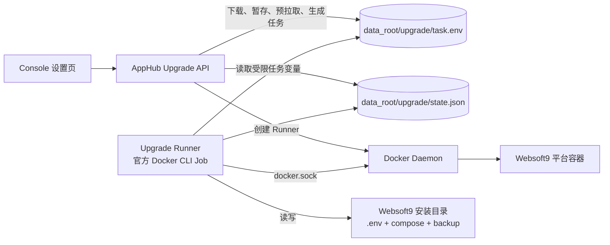

# Websoft9 控制台内一键升级方案

**版本：** 1.0<br>
**日期：** 2026-09-14<br>
**状态：** Draft

> 本文基于实际代码与运行时行为。`【实测】` 为已有证据，`【待验】` 必须在开发环境验证。本文只定义首个可交付版本：简单、可诊断、可回滚，优先复用现有 Compose 升级语义。

## 1. 决策

控制台升级采用临时的 **Websoft9 Upgrade Runner**。AppHub 从当前通道制品获取版本信息、`runner-upgrade.sh` 和 Compose 物料，并预拉取目标镜像；Runner 仅在用户确认后使用固定 digest 的官方 `docker` CLI 镜像，通过 docker.sock 执行已暂存的 Runner 专用脚本和 Compose 命令。数据根持久保存任务、日志和备份；失败时 Runner 恢复物料并以 Compose 回滚。

| 决策 | 说明 |
|---|---|
| 执行模型 | AppHub 负责获取、暂存和预拉取；Runner 是固定 digest 的官方 `docker` CLI 一次性 Job，只执行已暂存的 `runner-upgrade.sh` |
| 物料策略 | 允许受控写入 Websoft9 自身安装目录的 `.env`、`docker-compose.yml` 及随版本发布的部署物料 |
| 重建方式 | 唯一使用 `docker compose --project-name <name> --env-file {install_path}/.env -f {install_path}/docker-compose.yml up -d --force-recreate` |
| 版本策略 | AppHub 获取完整版本，用两位 tag 拉取当前系列镜像并记录 OCI digest；Runner 使用已记录的完整版本和 digest，不再次解析移动 tag |
| 回滚策略 | 恢复升级前 `.env` 和 compose 物料；将旧镜像 ID 标记为临时回滚 tag 后执行 Compose 重建；数据级回滚不承诺 |
| 适用范围 | Websoft9 2.3+ 单容器标准 Compose 安装；异常、手工或无法定位安装目录的部署继续使用 `install.sh` |

## 2. 已验证前提

| 主题 | 事实 | 设计影响 |
|---|---|---|
| 运行形态 | 【实测】2.3+ 是单个平台容器，compose 文件发布 `80`、`443` 和 `${CONSOLE_PORT}:9000` | 重建会短暂中断控制台与所有经平台网关访问的应用 |
| Docker 能力 | 【实测】平台容器挂载 docker.sock，有 Python Docker SDK，但没有 Docker/Compose CLI | AppHub 用 SDK 创建 Runner；官方 `docker/compose` Runner 提供 CLI/Compose |
| 持久化数据 | 【实测】数据根是 bind mount；新镜像 entrypoint 执行配置同步、App Store 资产同步和部分运行时状态初始化 | 重建不复制数据根；新版本对持久数据的兼容处理由其 entrypoint 和各服务负责 |
| 部署物料 | 【实测】`install.sh` 从通道制品获取 Compose，本地生成 `.env` 并写入目标 `IMAGE_REPO`/`IMAGE_TAG`；【待验】首版发布增加 `runner-upgrade.sh` | 页面升级暂存同次获取的 Compose，保留 `.env` 并定点更新镜像字段 |
| 镜像 tag | 【实测】首次安装用两位 tag；正式升级读取通道 manifest 的移动 tag | 页面记录获取时的完整版本与 OCI digest，执行时不再依赖移动 tag |
| 健康检查 | 【实测】Docker HEALTHCHECK 是 `/websoft9/script/platform-healthcheck.sh --readiness`；strict 检查覆盖托管组件 | Runner 以容器 health + `docker exec ... --strict` 判定结果 |
| 认证 | 【实测】认证关闭时 operator 校验返回 403 | 首版认证关闭时禁用一键升级，不降低权限要求 |

### 2.1 现有迁移能力边界

现有 entrypoint 有助于升级后的数据兼容，但不是统一、原子且可回滚的迁移器，Runner 不得将其视为升级成功的唯一依据：

| 范围 | 当前行为 | 升级约束 |
|---|---|---|
| 配置 | 缺失时从镜像 bootstrap；补充部分缺失配置键，并迁移旧 marketplace bootstrap 数据 | 保留用户已有配置；新增配置必须提供安全默认值或由明确、幂等的迁移补齐 |
| App Store 资产 | 启动时同步媒体和 library；失败写入 startup state 和日志后继续启动 | 不能以容器启动或 Docker health 代替资产成功；Runner 和页面必须将失败显示为 `degraded` 并保留日志 |
| SQLite | `install-tracking.sqlite` 有版本化迁移；`product-auth.sqlite`、`host-access.sqlite` 等由各服务初始化时创建表或补列 | 新增 schema 变更必须由所属服务实现幂等迁移并覆盖历史库；不得假定所有 SQLite 库均在 entrypoint 阶段完成迁移 |

产品元数据迁移失败目前仅记录 warning，不能作为升级已完成的依据。对影响核心服务可用性的新增迁移，必须在 strict 健康检查覆盖的启动路径中失败即阻断，或由 Runner 在最终状态前执行专门的可观察验证。

## 3. 架构与流程



### 3.1 用户流程

1. 页面检查更新，显示当前版本与目标版本。
2. 用户点击“下载更新”后，AppHub 获取当前通道的 `version.json`、`runner-upgrade.sh` 与 Compose 物料，校验其 `SHA256SUMS`；再用两位 tag 预拉取目标镜像，读取完整版本和 OCI digest。所有文件与镜像引用暂存到数据根；服务不中断。默认情况下这一步（3.3）会自动发生，无需先点击。
3. 页面显示“立即升级”。用户确认中断影响后，AppHub 创建一次性 Runner 并返回 `202`。
4. Runner 备份物料，更新 `.env` 和 compose 物料，执行 Compose 重建。
5. 页面在短暂断连后轮询状态；Runner 写入成功、降级或回滚结果。

确认框必须明确说明：控制台与所有应用访问将中断约 1-2 分钟；应用容器和应用数据不会被停止或删除。

### 3.2 任务与状态

AppHub 在数据根原子写入 `{data_root}/upgrade/task.env`、`state.json`、暂存物料、日志和备份。`task.env` 仅包含固定键的 `KEY=VALUE`：run ID、目标完整版本、镜像 digest、暂存物料目录、安装目录和 Compose 项目名。Runner 逐行按白名单解析，不使用 source 或 eval，并拒绝未知键、重复键和不符合格式的值。

状态为 `downloading`、`ready`、`applying`、`completed`、`degraded`、`rolled_back` 或失败状态。升级期间控制台阻断新的应用安装/部署操作；无法可靠检测与手动 `install.sh` 或 Portainer redeploy 的并发，页面须提示风险，结果以健康检查和日志为准。

### 3.3 自动预下载（默认开启）

发现新版本后平台直接开始 3.1 的第 2 步，把制品与镜像先放到本地，页面只剩“立即升级”一步确认。开关位于 AppHub 配置 `{data_root}/config/apphub/config.ini`（`ConfigManager` 读取同一文件）：

```ini
[upgrade]
; 缺省（无此段或此项）即为开启；设为 0/false/no/off 可关闭
auto_download = true
```

触发点只有三处，都与版本检查同时发生：每日 03:30 的 `check-update` 定时任务、AppHub 启动时的版本刷新、控制台里操作员显式点击“检查更新”。被动的 `GET status` 只读缓存，不触发下载，避免下载失败被前端轮询放大成反复重试。新安装直接拷贝镜像自带的 `config.ini`（已含该段）；**老部署不会覆盖已有配置**，由容器启动时的 `platform-sync-config.sh` 用 `set_config_if_missing upgrade auto_download true` 补齐，因此升级/重启一次即可在文件里看到该行。

发起下载需同时满足：开关开启、`latest_version` 严格高于当前版本、且没有进行中或已暂存的任务（`downloading`/`applying` 直接跳过；`ready` 且目标版本相同视为已暂存）。它复用与 `POST prepare` 完全相同的入口、升级锁与状态机，因此与页面手动下载天然互斥（并发时后到者拿不到锁）。

失败（制品缺失、镜像拉取失败、磁盘不足）只记日志并写失败状态，页面照旧提供下载入口，手动重试即可；失败不会向定时任务、启动流程或接口抛错。关闭开关后行为回到首版：只有点击“下载更新”才下载。自动预下载只下载和暂存，**不会自动执行升级**。

## 4. Upgrade Runner

### 4.1 镜像、权限与物料

Runner 直接使用官方 `docker:29.8.1-cli@sha256:9f36dfce2d1fd053d700a4eca00c358df79bf7d8cb69d4a9e8d9981af18834ea` 镜像（与部署主机的 Docker Engine 同一发行线），并通过 digest 固定版本；该镜像提供 Docker CLI 与 Compose plugin（实测 `docker compose version` = v5.5.1）。Runner 容器挂载 `docker.sock`，等效于宿主 root 权限，因此**不跟随 `docker:cli` 这类浮动 tag**：只有被审计过的 digest 能运行，且各回退源必须提供同一 digest，否则拉取失败。Websoft9 不构建或维护自定义 Runner 镜像：AppHub 将当前通道制品中的 `runner-upgrade.sh` 与部署物料暂存到数据根，再通过 entrypoint 执行该脚本。Runner 镜像与产品镜像走**同一套拉取回退**（直拉 → ECR Public → 加速器前缀，含 `library/` 兜底）：产品镜像走 ECR 的产品仓库（仅有浮动别名，精确版本映射到两位别名），Docker Hub 官方镜像（如 Runner 的 `docker`）走 `public.ecr.aws/docker/library/<name>`（实测 digest 与 Hub 完全一致）。两者都**始终按 digest 拉取**；但**解析与启动统一用 `repo:tag`**：按 digest 拉取可能不产生 tag，而镜像站拉取会把 digest 记录在镜像站域名下，两者都会让 `repo:tag@sha256:…` 引用无法解析。因此预拉取后端会确保 tag 存在，Runner 启动前再按 tag 解析并校验本地记录中的 digest 值与固定值一致。

Runner 是一次性 Job，不是常驻服务：创建后运行脚本、写入日志并退出。首版不引入 Go、Python、Node、curl、jq、额外 BusyBox 镜像或自定义 Docker Engine API 客户端；版本检查、制品下载、摘要校验、镜像预拉取与任务生成均由 AppHub 在启动 Runner 前完成。

Runner 仅挂载：

- `/var/run/docker.sock`：调用 Docker daemon；
- `{data_root}:{data_root}`：写状态和日志；
- 经交叉验证确定的 Websoft9 安装目录：读写 `.env`、compose 文件和升级备份。

Runner 的固定入口为 `sh {data_root}/upgrade/staging/{run_id}/runner-upgrade.sh`。脚本只读取 AppHub 生成的 `task.env` 和同目录暂存物料，执行备份、物料更新、Compose 重建、健康检查和回滚；不接受 UI 命令或任意脚本。`runner-upgrade.sh` 是内部脚本，不能作为用户升级入口；用户手动升级仍使用 `install.sh`。

安装目录可从主容器的 Compose 自动标签辅助定位，并须通过主容器数据根 bind mount、目录、`.env`、compose 文件、项目名和当前运行容器交叉验证。compose 文件名同样取自主容器标签 `com.docker.compose.project.config_files`，仅接受位于安装目录内的绝对路径，否则回退到 `docker-compose.yml`：按约定名重建会启出第二个容器（名称/端口冲突），而健康检查仍在看原容器，会把实际未升级的运行写成成功。无法安全定位或验证时，拒绝页面升级，不执行任何停止、删除或写入操作，并展示 `install.sh` 兜底命令。

Runner 仅能更新安装目录内的 `.env`、部署实际使用的 compose 文件（取 `task.env` 的 `COMPOSE_FILE`，缺省为 `docker-compose.yml`）和暂存制品明确列出的同目录辅助文件。更新前备份到 `{data_root}/upgrade/backups/{run_id}/`，以临时文件原子替换；拒绝目录外路径、符号链接逃逸和页面传入的路径、镜像、Compose 内容或环境变量。

### 4.2 执行算法

1. AppHub 获取当前通道制品的 `version.json`、`runner-upgrade.sh`、Compose 物料和 `SHA256SUMS`，校验摘要并暂存至 `{data_root}/upgrade/staging/{run_id}/`。
2. AppHub 使用目标 `version_tag` 预拉镜像，顺序与宿主安装一致：直拉 → Amazon ECR Public（仅官方仓库）→ 操作员配置的镜像加速前缀（`docker_mirror.url`，逐条前缀尝试，官方 library 镜像补 `library/` 兜底）。ECR 为节省空间只保留浮动别名（`latest`/`2.x`/`2.x-dev`），所以精确版本 tag（如 `2.4.1`）会映射到它的两位别名（优先后备 `latest`）拉取 —— 实测 `public.ecr.aws/w6g2g5k1/websoft9:2.4` 与 `websoft9dev/websoft9:2.4.1` 的 manifest digest 一致。每个候选（含直拉）拉取后都读取镜像内 `/websoft9/version.json` 与目标版本比对，**不一致的候选丢弃并继续下一个**（读取失败视为不确定，不阻断）。非直拉来源的镜像会 tag 回原引用，并把实际来源的 digest 写入 `task.env`：本地镜像的 RepoDigests 保留该 digest，Runner 的 digest 校验因此仍成立。随后读取完整版本与 OCI digest，只有镜像内版本与 `version.json` 一致时才写入 `task.env` 和 `ready`。
3. Runner 验证 `task.env` 格式、暂存目录、安装目录和当前 Compose 项目；`COMPOSE_FILE` 必须存在且位于安装目录内，缺失则直接失败。确认目标镜像仍在本地且 ID/digest 与任务一致。此阶段不得下载镜像或访问发布站点。
4. 写入 `applying`，备份白名单物料与其权限，记录旧 `IMAGE_REPO`、`IMAGE_TAG` 和旧镜像 ID。Runner 不拉取镜像：目标镜像必须已由 AppHub 预拉并存在于本地且 digest 与任务一致。
5. 原子更新暂存的 Compose 物料（写入 `COMPOSE_FILE` 指向的文件）；仅修改 `.env` 中的 `IMAGE_REPO` 与目标两位 `IMAGE_TAG`，保留其他已有键和值。缺少的 `CONTAINER_NAME`、`CONSOLE_PORT`、`WEBSOFT9_DATA_ROOT`、`TZ` 由 Runner 的固定白名单补充，不覆盖用户定义的值。不得直接调用当前 `write_env_file()` 覆写整个 `.env`。
6. 使用与现有 `resolve_modern_compose_project()` 相同规则解析 Compose 项目名：优先 `.env` 的 `CONTAINER_NAME`，否则为 `websoft9`。Runner 以固定参数执行 `docker compose -p <project> --env-file {install_path}/.env -f {compose_file} up -d --force-recreate`。禁止从前端接受命令参数。
7. 最多等待 300 秒：容器必须处于 `running` 且 Docker health 为 `healthy`，再执行 `docker exec <container> /websoft9/script/platform-healthcheck.sh --strict`。容器启动与 Docker health 仅证明当前 health 覆盖的服务可用，不单独证明资产同步或所有 SQLite schema 迁移成功。
8. Runner 解析 strict 的标准输出：`status=degraded` 时再观察最多 120 秒，并读取 App Store startup state；资产同步失败时写 `degraded` 并保留日志。`status=unready`、超时或其他错误时回滚。不得只按 strict 的退出码判断，因为 degraded 与 unready 均返回非零。
9. 创建失败、容器退出、strict unready、超时或命令错误时：恢复备份物料；将步骤 4 记录的旧镜像 ID 标记为 `rollback-{run_id}`，并在恢复后的 `.env` 中使用该 tag 后执行旧 Compose 参数重建，验证 readiness，写 `rolled_back` 或 `rollback_failed`。数据迁移开始后不承诺数据级回滚。

Runner 不使用 `docker compose down` 作为默认操作。`up -d --force-recreate` 能以 Compose 期望状态替换平台容器；首版必须验证端口切换，若发生端口占用则以有限重试或回滚处理。

平台无法恢复时，页面提供状态、日志和 `install.sh` 恢复指引。

新 Compose 变量必须优先声明安全默认值，例如 `${NEW_VARIABLE:-default}`。只有没有安全默认值且启动必需的变量，才可加入 Runner 的固定补充白名单。

Runner 通过 docker.sock 拥有等价宿主 Docker 管理权限，因此只执行 AppHub 暂存且已完成摘要校验的脚本。任务结束后清理 Runner 容器与 staging 目录；保留日志、备份和 `rollback-{run_id}` 镜像 tag 至少到结果被读取或达到产品定义的保留期。

## 5. API 与前端

| 接口 | 行为 |
|---|---|
| `GET /settings/upgrade/status?run_id=<id>` | 返回当前/目标版本、下载状态、最终状态、日志标识和 `auth_enabled`；未提供 run ID 时返回最近任务 |
| `POST /settings/upgrade/check` | 显式 operator 认证；强制刷新版本缓存，并按 3.3 的规则在后台开始预下载 |
| `POST /settings/upgrade/prepare` | 显式 operator 认证；AppHub 下载并校验当前通道制品、用 Docker SDK 预拉取镜像、暂存物料并生成任务，幂等返回状态（自动预下载与手动下载走同一入口） |
| `POST /settings/upgrade/apply` | 显式 operator 认证；仅 `ready` 可执行，创建唯一执行 Runner，返回 `202` 和 `run_id` |

认证关闭时，`GET status` 返回 `auth_enabled=false`；所有写接口返回 403。不得依赖网关作为唯一的写接口保护。

前端状态：

| 状态 | 呈现 |
|---|---|
| idle / prepare_failed | 当前版本、下载或重试入口 |
| downloading | 后台下载中，可离开页面 |
| ready | 目标版本与“立即升级” |
| applying / verifying / rolling_back | 自包含过渡页；断连视为预期，提示不要刷新 |
| completed | 新版本与成功结果 |
| degraded | 升级完成但部分托管服务仍在恢复，提供日志入口 |
| rolled_back / rollback_failed | 显示回滚结果、日志和 `install.sh` 兜底 |

用户在 apply 返回 `202` 后，前端保存 `run_id` 并以 2s、5s、10s 退避轮询 status，最长十分钟。没有活动 `run_id` 时的 502 或连接失败是普通连接错误，不能伪装为升级中。

## 6. 制品安全

首版发布需在当前通道制品中增加 `runner-upgrade.sh`，并将其与 `version.json`、Compose 物料一同列入 `SHA256SUMS`。.env 不是发布制品；Runner 保留现有文件，只更新镜像字段并按白名单补充缺失键。AppHub 下载后校验每个已使用文件的 SHA-256，并只接受官方镜像仓库。

必须拒绝：目标版本不高于当前版本、缺少或不匹配的摘要、非官方镜像、镜像内完整版本与 `version.json` 不一致、镜像 digest 在准备后发生变化。镜像加速器只能作为下载通道，结果仍必须匹配已记录 digest。当前制品未签名，`SHA256SUMS` 仅用于发现传输损坏，不能抵御同源篡改；发布签名是后续安全增强项。

## 7. 验收

所有演练仅在 `websoft9-dev` 和无害测试容器进行。

| 用例 | 通过标准 |
|---|---|
| 新变量升级 | 新 Compose 变量具有安全默认值并可正常启动；`.env` 的用户自定义键保持不变 |
| Compose 变更升级 | 发布包修改端口、标签、挂载或网络字段后，Compose 重建结果与新物料一致 |
| 正常升级 | 预拉取后确认升级，容器健康且 strict ready，页面恢复为 completed |
| 降级 | strict 输出 `status=degraded` 时页面显示 degraded，不误报成功 |
| 资产同步失败 | 模拟 App Store 同步失败；容器可启动但 Runner 和页面显示 degraded，并能读取同步日志 |
| SQLite schema 升级 | 用每个持久 SQLite 库的历史样本执行升级；所属服务完成幂等 schema 迁移且数据可读；失败按该迁移的阻断策略处理 |
| 启动失败 | 故障镜像或错误 Compose 触发物料恢复、旧版本 Compose 重建和 rolled_back |
| 制品验证 | 文件与 `SHA256SUMS` 不一致、镜像 digest 或版本信息不一致时均被 AppHub 拒绝，未产生 Runner 或容器重建 |
| 职责边界 | AppHub 暂存 `runner-upgrade.sh` 和部署物料、生成 `task.env` 并预拉镜像；修改任务、前端参数或 Runner 远程下载均被拒绝 |
| 部署发现 | 无法通过容器、数据根、安装目录和 Compose 物料交叉验证部署时拒绝执行，不修改任何宿主文件 |
| 认证 | 认证关闭或无有效 session 时不能 prepare/apply |
| 自动预下载 | 默认开启：检测到新版本后无需点击即开始下载，完成后页面直接可“立即升级”；`auto_download = false` 时只有点击才下载；预下载失败不阻塞定时任务、启动流程或接口 |
| 断连恢复 | apply 后页面断连，服务恢复后可读取 run 结果；无 run 的断连显示普通错误 |
| 兼容性 | 升级后 `install.sh`、`docker compose up` 与 Portainer redeploy 均使用新物料，不回退旧版本 |

最小交付指标：预拉取完成后用户只需点击“立即升级”并确认（默认已自动预下载，无需点“下载更新”）；预拉取完成后正常中断不超过两分钟；失败后有状态、日志、物料备份和明确的 `install.sh` 兜底。

首次支持页面升级的版本仍须通过 `install.sh` 或标准 Compose 部署方式安装；页面升级只适用于已包含 Upgrade API 的版本。prepare 阶段必须预检可用磁盘空间、镜像仓库可达性、安装目录可写性和 Runner 镜像可用性。

## 8. 非目标

首版不做自动执行升级、离线升级、指定版本降级、平台数据回滚、多节点发布或自定义 Runner 镜像（自动预下载不属于自动升级：它只下载暂存，见 3.3，默认开启且可用 `[upgrade] auto_download = false` 关闭）。异常、手工或无法定位安装目录的部署继续使用 `install.sh`。