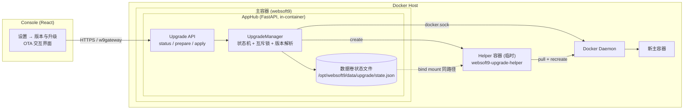
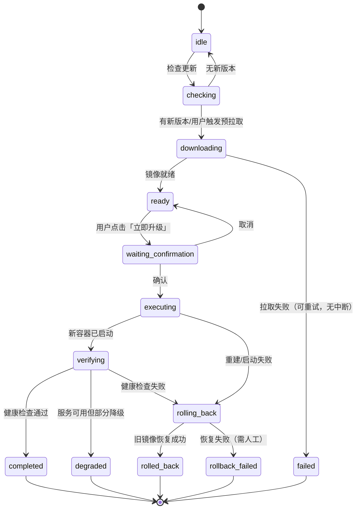
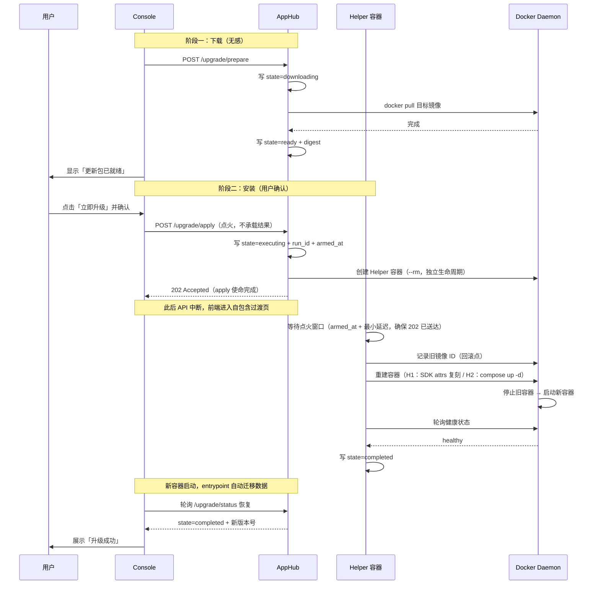
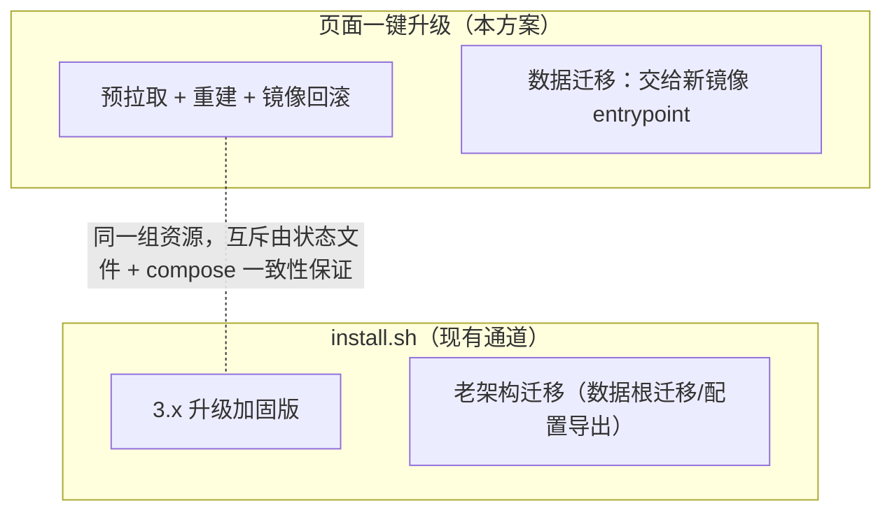
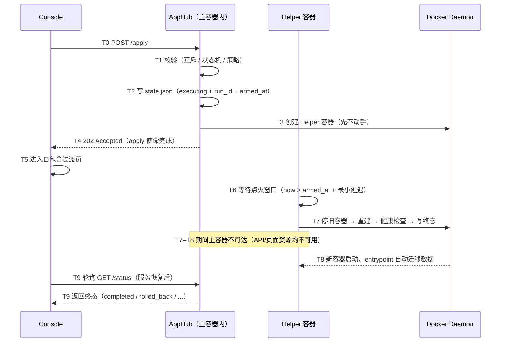

# Websoft9 控制台内一键升级方案（In-Console One-Click Upgrade Solution）

**Author:** Websoft9
**Date:** 2026-09-11
**Status:** Draft
**Version:** 1.3
**Related Documents:**
[Upgrade Architecture](./platform-release-upgrade-architecture.md) ·
[Upgrade PRD](./platform-release-upgrade-prd.md) ·
[Upgrade Epics](./platform-release-upgrade-epics.md) ·
[Story 5.1](../implementation-artifacts/5-1-build-the-upgrade-precheck-and-migration-summary.md)

> **方法论声明（v1.1）**：本文档所有事实性结论以**实际代码与运行时实测**为准；`_bmad-output` 下的规划文档仅作背景参考，不作为事实依据。规划文档与代码的已核查偏差汇总于 §2.6。任何实现开工前必须先按 §2.2 的验证方法复核当前代码状态，不得直接引用本文结论。
>
> **v1.2 变更**：新增 §4.8「断连窗口设计」——明确 apply 请求的「点火」语义与 Helper 延迟动手约束、结果获取的唯一路径、页面存亡矩阵与前端强制项；同步更新 §3.4 时序图、§4.2.3、§4.5、附录 B。
>
> **v1.3 变更**：复核后补全——新增 §2.7「影响面」（应用访问中断的实证结论）、§4.9「与相邻系统的共存」；Helper 健康判定改为**分层**（runtime-status.json 为权威信号，修正"--readiness 被误当作全组件健康"的隐患）；补 Helper 幂等可恢复设计与孤儿清理；前置检查增加应用安装任务/计划任务/磁盘/更新器检测；失败矩阵补 2 个场景（#11/#12）；备份设计对齐 install.sh 受管目录清单（替代不适合的 restic 方案）；风险补 R8/R9。

---

## 1. 背景与目标

### 1.1 背景

Websoft9 3.x 采用单容器运行时（supervisor 管理 Gitea、Portainer、Nginx Proxy Manager、AppHub、平台网关等多进程）。平台升级的本质是**换镜像 + 数据自动迁移**：

- 数据全部持久化在数据根 `/opt/websoft9/data`（容器内外同路径 bind mount）；
- 迁移逻辑内置在新镜像的 entrypoint（配置补键、资产增量同步、SQLite schema 迁移、产品状态迁移、第三方组件自迁移），已实测验证；
- 当前产品指引的升级通道是 `install.sh`（本质是 `docker compose pull + up` 的加固封装，带备份、回滚、健康校验、计划任务恢复）；控制台设置页目前只展示该命令供用户复制（代码依据：`settings.py` 生成 `install_command`，`settings-page.tsx` 提供复制按钮）。

**痛点**：用户必须登录服务器、执行脚本或 compose 命令，对非技术用户不友好。

### 1.2 目标

在控制台「设置 → 版本与升级」页面实现 **OTA 式（手机升级式）一键升级**：

1. 页面自动检查更新，展示当前版本 / 最新版本；
2. 后台静默预拉取新镜像（等同手机「下载更新包」）；
3. 用户点击一次确认（等同手机「立即重启并安装」）；
4. 平台自动完成容器重建与数据迁移，页面自动恢复并展示结果；
5. 全过程可观测、失败可自动回滚。

### 1.3 硬约束

| # | 约束 | 说明 |
|---|------|------|
| C1 | 不要求宿主机任何额外动作 | 不安装 systemd timer、Watchtower、宿主 agent；不在宿主机修改任何文件 |
| C2 | 复用现有架构 | 沿用 FastAPI AppHub + Console + 单容器运行时 + 现有产品认证体系 |
| C3 | 与 install.sh 并存互不破坏 | 两条通道操作同一组资源（compose 项目 / 容器 / 数据卷），可互相接管 |
| C4 | 数据迁移保持现状 | 迁移仍由新镜像 entrypoint 负责，本方案不重复实现迁移逻辑 |
| C5 | 范围限定 3.x 内升级 | 老 Cockpit 多容器 → 3.0 迁移继续走 install.sh，不在本方案范围 |

---

## 2. 现状与可行性（已验证事实）

### 2.1 现有升级体系盘点

| 通道 | 机制 | 安全网 | 技术要求 |
|------|------|--------|----------|
| `install.sh` | 环境探测 → 物料准备 → pull → compose up → 校验 | 备份、配置导出、端口释放等待、失败回滚、计划任务恢复 | 需 SSH + root |
| 手动 compose | `docker compose pull && up -d` | 无 | 需理解 compose |
| **本方案（页面）** | 预拉取 + Helper 容器自重建 | 镜像级自动回滚 + 状态可观测（+ 可选备份） | 仅需点击确认 |

### 2.2 容器内执行能力验证

在本项目的运行环境实测（只读验证；容器名按实际替换）：

| 能力 | 验证结果 | 证据（代码 / 运行时实测） |
|------|----------|---------------------------|
| Docker socket 可用 | ✅ | 容器挂载 `/var/run/docker.sock:/var/run/docker.sock`（dev 与 prod compose 均有） |
| Python Docker SDK 可用 | ✅ | 容器内 `docker.from_env()` 实测连接成功 |
| 读取自身容器完整配置 | ✅ | 实测可读 `Image`、`ImageID`、`RestartPolicy`、`PortBindings`、`Binds`、`Networks` |
| compose 元数据标签齐全 | ✅ | dev 实测：`project=websoft9-dev`、`config_files=/root/workspace/websoft9/docker/docker-compose.dev.yml`、`working_dir=.../docker`；生产值取自 install.sh 代码（`/opt/websoft9/docker-compose.yml`），**上线前须在生产实测复核** |
| 容器内**无** docker / compose CLI | ⚠️ 硬约束 | 实测 `command -v docker`、`command -v docker-compose` 均无输出；Dockerfile apt 列表亦无 docker.io |
| 容器内**不可见** compose 文件 | ⚠️ 硬约束 | 实测 `/opt/websoft9/` 下仅有 `data/`；compose 标签指向的是宿主路径 |
| healthcheck 已定义且可用 | ✅ | 实测 `Health=healthy`、`HealthcheckDefined=yes`；Dockerfile `HEALTHCHECK ... platform-healthcheck.sh --readiness` |
| 已有 Helper 容器模式 | ✅（有前提） | `files_agent.py` 的 `DockerHelperManager` 生产在用（label + TTL 清理）；**存在 entrypoint 覆盖缺陷，不能照搬，见 §4.3 / §2.6 D6** |

验证命令（可复现）：

```bash
# 1. compose 标签（宿主侧）
docker inspect <container> --format '{{json .Config.Labels}}' | python3 -m json.tool | grep compose

# 2. 容器内 CLI 缺失确认 + SDK 能力
docker exec <container> sh -c 'command -v docker; command -v docker-compose; echo CLI_CHECK_DONE'
docker exec <container> sh -lc 'PYTHONPATH=/opt/websoft9-pydeps:/websoft9/apphub python3 -c "
import docker; c=docker.from_env(); me=c.containers.get(\"<container>\")
print(me.attrs[\"Config\"][\"Image\"], me.attrs[\"Image\"])
print(me.attrs[\"Config\"][\"Labels\"][\"com.docker.compose.project.config_files\"])
"'

# 3. compose 文件可见性 + healthcheck 实况
docker exec <container> sh -c 'ls /opt/websoft9/'
docker inspect <container> --format 'Health={{.State.Health.Status}} HealthcheckDefined={{if .Config.Healthcheck}}yes{{else}}no{{end}}'
```

### 2.3 启动自迁移能力验证

新镜像启动时 entrypoint 自动执行迁移链（实测事件序列）：

```
ensure_data_managed_paths → sync_runtime_config base → sync_appstore_assets
→ ensure_product_runtime_state → start_supervisor → ensure_platform_network
→ bootstrap_product_auth/gateway/gitea/portainer/npm → sync_runtime_config credentials
→ update_runtime_status strict → monitor_runtime
```

数据层迁移机制（实测 `schema_version=1`，产品状态 `edition=free` 已写入）：

| 数据 | 迁移机制 |
|------|----------|
| `install-tracking.sqlite` | 版本化迁移（`schema_version` 表 + rename→create→copy→drop 无损模式） |
| `scheduled-tasks.sqlite` | `PRAGMA table_info` + `ALTER TABLE ADD COLUMN` 自动补列 |
| `product-auth.sqlite` | `_column_exists` + 自动补列 |
| `host-access.sqlite` | 表结构演进迁移 |
| `config.ini / system.ini` | 首启 bootstrap + 升级 `set_config_if_missing` 补键不覆盖 |
| App Store 资产 | 增量 delta 同步（版本链校验，不匹配回退全量） |
| Gitea / Portainer / NPM | 启动脚本（`platform-start-gitea.sh` / `platform-start-portainer.sh`）负责拉起二进制与配置；DB 迁移依赖各组件二进制内置行为（**推断，启动脚本中未见显式迁移调用，上线前须按目标版本实测**）；NPM 的 nginx 配置路径迁移在 `platform-start-npm-nginx.sh` 中有实证代码 |

**结论**：升级的「数据自愈」环节已经就绪，本方案只需补齐「执行通道 + 状态跟踪 + 前端体验」。

### 2.4 前端与后端现状

| 层 | 位置 | 现状（**以代码为准**） |
|----|------|------------------------|
| 前端 | `console/src/features/settings/settings-page.tsx` | `UpgradeStatus` 类型 + `fetchUpgradeStatus()`（直接 `fetch`，无统一 API client）+ `renderUpgradeRow()`；**仅有「复制命令」按钮，无预检/执行占位按钮** |
| 后端 | `apphub/src/api/v1/routers/settings.py` | **唯一的升级端点** `GET /settings/upgrade/status`（current / latest / channel / upgrade_available / install_command / artifact_url / doc_url）；路由目录（17 个模块）中无任何升级执行端点 |
| 状态字段 | `schemas/overview.py` + `services/overview_service.py` | `upgrade_state` 字段存在但为**死字段**：全仓库唯一"赋值"点硬编码 `"unknown"`（`overview_service.py:270`），无业务写入；前端 `overview-page.tsx` 仅声明类型未渲染 |
| 运行时状态 | `platform-entrypoint.sh` 写 `/run/websoft9/runtime-status.json` | **无 API 暴露**：核查确认 apphub 代码无读取点；ready/degraded 状态仅存于容器内文件系统 |

### 2.5 可行性结论

**可行**。缺口清单（均以代码为准重新核对）：
1. 后端：预拉取与执行端点、状态机、互斥锁（当前均不存在）；
2. 执行器：Helper 容器（自重建引擎）；现有 `DockerHelperManager` 存在 entrypoint 覆盖缺陷，不能照搬（见 §4.3）；
3. 状态：升级状态持久化（数据卷）+ degraded 运行时状态的 API 暴露（当前无）；
4. 前端：OTA 式交互（下载 → 确认 → 过渡 → 结果）。

### 2.6 文档与代码不一致清单（核查记录）

> 本节记录规划/说明文档与当前实际代码的偏差。实现时**一律以代码为准**，本节在每次迭代开工前需要重新核查。

| # | 文档声称 | 代码实际 | 影响 |
|---|----------|----------|------|
| D1 | Story 5.1 称已"预留 precheck 与 execution 入口按钮（disabled/planned）" | `renderUpgradeRow()` 只有版本信息与「复制命令」按钮，**无任何占位按钮** | 方案不能假设 UI 占位存在；Phase A 需自行添加 |
| D2 | `overview` schema 注释 `upgrade_state: "Compact upgrade state"` | 无任何业务写入点，恒定 `"unknown"`；前端未渲染 | 可作为现成载体激活（见 §4.2.1），但**不是**现有能力 |
| D3 | `settings.py` 返回 `doc_url` 指向 `install/upgrade-guide.md` | 该文件在仓库中**不存在**（文件系统实证） | 死链接；兜底引导需补文档或修正 URL |
| D4 | `platform-release-upgrade-architecture.md` 定义 10 阶段共享状态模型 | 代码中**无对应状态机实现**（无枚举、无状态转换代码） | 本方案的"状态机"是设计目标，并非"对齐既有实现" |
| D5 | PRD 描述"组件增量更新/回滚"等能力 | 代码中仅有 App Store 资产同步（`appstore_sync.py` + CLI `upgrade apps`）；平台升级执行无任何实现 | 范围边界以代码为准 |
| D6 | `DockerHelperManager` 被当作"可直接复用的成熟模式" | 实测其 `containers.run(command=...)` **不覆盖 ENTRYPOINT**；用主镜像时会执行 `platform-container-entrypoint.sh`（init_nginx + 平台全栈），不是轻量作业容器 | 升级 Helper **必须显式覆盖 entrypoint 或更换镜像**（见 §4.3） |

### 2.7 影响面（升级窗口内什么不可用、什么不受影响）

复核结论基于容器实际承担的职责（代码实证：supervisord 管理 8 个进程；宿主 80/443/9000 均由本容器发布）：

**窗口内不可用（约 1–2 分钟）**：

| 受影响 | 原因（代码实证） |
|--------|------------------|
| 控制台（:9000） | `platform-gateway` 在容器内服务 `/etc/websoft9/console` 静态资源 |
| **所有应用的域名访问（:80/:443）** | **NPM 的 nginx 在容器内**（`platform-start-npm-nginx.sh` 直接 exec nginx）；宿主 80/443 由本容器发布，应用流量全部经它代理 |
| 集成入口（Gitea / Portainer / NPM admin） | 三者均为容器内 supervisor 托管进程 |
| AppHub API（:8080） | 容器内进程 |

**不受影响**：

| 不受影响 | 说明 |
|----------|------|
| **应用容器本身** | 应用是宿主上的独立容器（各自 compose stack），平台容器重建不触碰它们，进程继续运行、数据完好 |
| 应用数据 | 在各自卷中，平台升级不读写 |
| 宿主其他服务 | 不涉及 |

**推论（必须落实到 UI 文案）**：确认框不能只写"控制台将短暂不可用"，必须如实告知「**控制台与所有应用的访问**将中断约 1–2 分钟，应用容器不会停止」。这是"诚实呈现"原则（§3.1）的具体要求，也是用户预期管理的关键。

---

## 3. 总体设计

### 3.1 设计原则

1. **下载与安装分离**：预拉取（对用户无感、可重试）与容器重建（用户确认后执行、中断窗口最短）严格分开 —— 这是「手机 OTA 体验」的关键。
2. **单一执行路径**：无论 UI 还是未来 API/CLI 触发，都走同一个执行器与状态机，不产生分支树。
3. **执行者与宿主解耦**：重建动作由**临时 Helper 容器**完成（通过 docker.sock），不依赖宿主机预置任何组件（满足 C1）。
4. **状态先于动作**：执行前先落盘「升级意图」，任何时刻断电/中断后都能从状态文件恢复语义。
5. **可回滚优先**：镜像级自动回滚是默认兜底；数据级备份为可选增强。
6. **诚实呈现**：升级必然造成 1–2 分钟服务中断，UI 必须把「中断」呈现为预期行为而非故障。

### 3.2 组件架构



### 3.3 升级状态机

对齐 `platform-release-upgrade-architecture.md` 的共享状态模型，本方案使用其子集：



状态映射：`waiting_confirmation` 属于短暂前端态；`executing/verifying` 期间 API 不可达，恢复后由状态文件还原。

### 3.4 端到端流程



---

## 4. 详细设计

### 4.1 版本与镜像解析

| 项 | 来源 | 说明 |
|----|------|------|
| 当前版本 | 容器内 `/websoft9/version.json` | 复用 `read_release_version()` |
| 通道 | `version.json` 的 `channel` 字段（**实测当前为空字符串**） | `read_release_channel()` 有空值回退：从 version 推断通道（代码实证） |
| 目标版本 | `https://artifact.websoft9.com/websoft9/{channel}/version.json` | 复用现有 `_latest_remote_version()` |
| 目标镜像 | 远端 `manifest.json` 的 `default_tag`；本地 `.env` 的 `IMAGE_REPO` / `IMAGE_TAG` | 与 install.sh `_resolve_target_image_tag` 同源 |
| 镜像回退 | `docker compose pull` → ECR Public → `mirrors.json` 前缀镜像 | 复用现有拉取回退策略（`install/lib/common.sh`） |

**升级策略（tag 治理）**：

| 升级类型 | 判定 | 行为 |
|----------|------|------|
| patch / minor（如 2.4.2 → 2.4.5） | 主版本一致 | 允许页面一键升级（默认） |
| major（如 2.4 → 3.0） | 主版本变化 | UI 阻断自动执行，提示走 install.sh / 人工确认流程 |
| 同 tag 新 digest（浮动 tag） | tag 相同、digest 变化 | 允许一键升级（预拉取后 digest 比对） |

### 4.2 后端 API 设计

在 `settings` 路由组内新增（沿用现有产品认证边界）：

#### 4.2.1 `GET /settings/upgrade/status`（扩展）

```json
{
  "current_version": "2.4.2",
  "latest_version": "2.4.5",
  "channel": "release",
  "upgrade_available": true,
  "state": "ready",
  "prepared": {
    "image_ref": "websoft9dev/websoft9:2.4",
    "digest": "sha256:1eff...",
    "prepared_at": "2026-09-11T02:30:00Z"
  },
  "last_run": {
    "run_id": "20260911T023000Z-2.4.2-2.4.5",
    "state": "completed",
    "from_version": "2.4.2",
    "to_version": "2.4.5",
    "finished_at": "2026-09-11T02:33:10Z",
    "error": null
  },
  "install_command": "wget -O install.sh https://artifact.websoft9.com/websoft9/release/install.sh && sudo bash install.sh",
  "doc_url": "https://github.com/Websoft9/websoft9/blob/main/install/upgrade-guide.md"
}
```

要点：
- `install_command` 保留为**兜底通道**（升级失败/回滚失败时展示给高级用户）；
- `state` 与 `last_run` 在 API 恢复后可从状态文件直接还原，天然支持「中断后恢复」；
- **状态透出载体**：详细状态走本端点；若需要首页提示（如「有可用更新」徽标），可**激活** `overview` 的既有 `upgrade_state` 死字段（§2.6 D2）写粗粒度摘要，避免新增重复字段。

> ⚠️ 核查发现：现有 `doc_url` 指向的 `install/upgrade-guide.md` 在当前仓库中不存在（死链接，§2.6 D3）。实现前需补该文档或修正 URL，否则页面兜底引导不可用。

#### 4.2.2 `POST /settings/upgrade/prepare`（预拉取）

- 幂等：同一目标 digest 重复调用直接返回就绪；
- 后台任务执行 `docker pull`，进度/结果写入状态文件；
- 失败不中断服务，返回 `state=failed`（可重试）。

#### 4.2.3 `POST /settings/upgrade/apply`（执行升级）

> **语义定性：apply 是「点火」，不是「等待」。** 该请求在主容器被替换前完成使命（返回 202），**不承载升级结果**；结果只能通过状态文件 + 恢复后的 `GET status` 获取。完整时序见 §4.8.1。

- 前置校验（按项目实际可查的数据源逐项设计，全部为"快速本地检查"）：
  1. 状态必须为 `ready`（镜像已就绪）或允许内部先补拉取；
  2. 无进行中的升级（互斥锁 + 状态文件）；
  3. 升级类型允许（非 major 跳级）；
  4. 宿主路径假设成立（见 §9.1 风险 R2）；
  5. **无进行中的应用安装任务**（查 `install-tracking.sqlite`：存在运行态 task → 阻止并提示，升级会中断安装）；
  6. **无正在执行的计划任务**（查 `scheduled-tasks.sqlite` 的 run 状态；仅提示即将触发的任务，不阻止——升级后 `reconcile-scheduled-tasks` 会接管）；
  7. **磁盘空间预检**（目标镜像大小 + 备份所需空间的保守估计）；
  8. **未检测到外部自动更新器**（若宿主存在 watchtower 类容器且监控本容器 → 警告，见 §4.9）。
- 动作（严格时序）：写状态文件（`state=executing` + `run_id` + `armed_at`）→ 创建 Helper 容器 → 返回 `202`（含 run_id 与预计中断时长）；
- **Helper 延迟动手**：Helper 启动后必须等待点火窗口结束（`armed_at` + 最小延迟）才能停止主容器，否则 202 响应无法送达前端（见 §4.8.1）；
- **幂等**：前端未收到 202 而重试时，后端检测到已有进行中的 run → 返回同一 `202`（同 run_id）或 `409`，不重复创建 Helper；
- 冲突返回 `409`（已有升级进行中）。

#### 4.2.4 错误码

| HTTP | 场景 |
|------|------|
| 409 | 升级进行中 / 状态不允许执行 |
| 422 | major 跳级被策略阻断 / 环境检查不通过 |
| 500 | 状态文件写入失败 / Helper 创建失败 |

### 4.3 升级执行器（Helper 容器）

**实测确认的三条硬约束**（决定实现形态）：

1. 主容器内**没有** docker / compose CLI（实测 `command -v` 无输出）→ Helper 不能假设 CLI 存在；
2. 主容器内**看不到** compose 文件与 `.env`（实测 `/opt/websoft9/` 仅 `data/`）→ 走 compose 路径必须把宿主 install_path 挂载进 Helper；
3. 现有 `DockerHelperManager` **不覆盖 ENTRYPOINT**（代码实证）→ 用主镜像会执行 `platform-container-entrypoint.sh`（`init_nginx.sh --prepare-only` + 平台全栈）。**升级 Helper 绝不能照搬该模式**，必须显式覆盖入口或更换镜像。

**Helper 三种可选形态**：

| 形态 | 镜像 | 重建实现 | 额外拉取 | 评价 |
|------|------|----------|----------|------|
| H1（推荐 MVP） | **当前主镜像**（本地必在） | Python docker SDK 脚本，`entrypoint` 显式覆盖 | 无 | 零依赖；SDK 在 `files_agent` / `back_manager` 已有生产先例 |
| H2（正统增强） | `docker:cli`（含 compose 插件） | `docker compose -p ... up -d` | 约 10–15 MB（一次，宿主当前**无**此镜像，实测） | 与 install.sh 语义完全一致；可同步维护 `.env` |
| H3（不建议） | `python:3.11-slim` / `alpine` | 手工 Docker HTTP API | 需拉取 | 无 SDK、无 compose，脆弱 |

> 形态选择在 `apply` 时按"宿主是否已有镜像"决策；H2 镜像拉取复用现有镜像加速回退机制。

**容器规格**：

| 项 | 值 |
|----|-----|
| 名称 | `websoft9-upgrade-helper-{run_id}` |
| 镜像 | 见上表（H1 主镜像 / H2 `docker:cli`） |
| **入口覆盖** | **必须**：H1 用 `entrypoint=["python3","/state/upgrade/helper.py"]`；H2 用 `entrypoint=["sh","-c"]` 等显式形式——**禁止继承主镜像 entrypoint** |
| 标签 | `com.websoft9.role=upgrade-helper`、`com.websoft9.run-id={run_id}` |
| 生命周期 | `auto_remove=true` 或完成后自动 `remove`；**独立于主容器**（主容器被删不影响它） |
| 挂载 | ① `/var/run/docker.sock`；② 数据卷 `{data_root}:{data_root}`（读写：状态/脚本/日志）；③ 宿主 install_path（从 compose 标签推导；H1 只读，H2 需维护 `.env` 时读写） |
| 工作目录 | 宿主 install_path |

**Helper 脚本来源（关键设计）**：脚本不内联在创建命令里（避免转义问题），由 AppHub 在 `apply` 前写入数据根 `{data_root}/upgrade/helper.py`（H1）或 `helper.sh`（H2），Helper 容器通过数据卷挂载读取。好处：可审计、可版本化、升级中断后仍可人工检查或复跑。

**执行流程（H1 形态：Python SDK）**：

```python
# helper.py —— Helper 容器内运行（入口已被 entrypoint 覆盖为 python3 /state/upgrade/helper.py）
import docker, time
c = docker.from_env()

# 1. 前置校验
c.ping()                                        # daemon 可达
me = c.containers.get(MAIN_CONTAINER)           # 定位主容器（自身）
rollback_image_id = me.attrs["Image"]           # 记录回滚点（本地 image id）
update_state("executing", step="recreate")

# 2. 重建：停旧 → 删旧 → 用旧 attrs 复刻创建新容器（仅替换镜像）
#    安全性：Helper 是独立容器，不随主容器删除而终止
me.stop(timeout=60)
c.api.remove_container(MAIN_CONTAINER)
c.api.create_container(
    image=TO_IMAGE,                             # 必须已预拉取（prepare 阶段完成）
    command=me.attrs["Config"]["Cmd"],
    environment=me.attrs["Config"]["Env"],
    labels=me.attrs["Config"]["Labels"],        # 保留 compose 标签，保持与 install.sh 互操作
    host_config=c.api.create_host_config(
        binds=me.attrs["HostConfig"]["Binds"],
        port_bindings=me.attrs["HostConfig"]["PortBindings"],
        restart_policy=me.attrs["HostConfig"]["RestartPolicy"],
    ),
    name=MAIN_CONTAINER,
)
c.api.start(MAIN_CONTAINER)

# 3. 健康判定（分层 + 最长 300s；端口释放竞态用带退避的重试覆盖）
#    第 1 层：Docker healthcheck = healthy
#            （注意：镜像的 HEALTHCHECK 是 platform-healthcheck.sh --readiness，
#              只保证 apphub-api / apphub-media / supervisor，不代表全组件就绪）
#    第 2 层：读取新容器内 /run/websoft9/runtime-status.json（entrypoint 写入的权威状态）
#            state=ready     → 判定成功
#            state=degraded  → 判定"完成但降级"（不回滚；supervisor autorestart 会持续自愈）
#            容器退出/重启循环、或 state=failed → 判定失败
for _ in range(75):
    info = c.containers.get(MAIN_CONTAINER).attrs
    if info["State"]["Status"] != "running":
        break                                    # 退出/重启循环 → 失败
    if (info["State"].get("Health") or {}).get("Status") == "healthy":
        raw = c.containers.get(MAIN_CONTAINER).exec_run(
            ["cat", "/run/websoft9/runtime-status.json"]).output
        state = parse_state(raw)                 # ready / degraded / failed / starting
        if state in ("ready", "degraded"):
            break
    time.sleep(4)

# 4. 结果处置
#    ready    → state=completed
#    degraded → state=degraded（不自动回滚，避免服务振荡；页面给修复入口）
#    失败     → 回滚：把 rollback_image_id 重新 tag 为目标引用，
#              按同样流程重建旧镜像容器
#              → rolled_back（成功）/ rollback_failed（失败，输出人工指引）
```

> **H2 变体**：Helper 用 `docker:cli` 镜像并挂载宿主 install_path，将「步骤 2」替换为
> `docker compose -p <project> --env-file .env -f docker-compose.yml up -d --force-recreate`，
> 语义与 install.sh 完全一致，并可同步维护 `.env` 中的 tag。

**重建路径对照**：

| 路径 | 适用形态 | 条件 | 机制 | 特点 |
|------|----------|------|------|------|
| A：compose 语义 | H2 | Helper 内可用 compose CLI + 宿主 compose 文件已挂载 | `docker compose up -d` | 与 install.sh 一致；自动处理项目/网络/标签/配置漂移；可维护 `.env` |
| B：attrs 复刻 | H1 | 无需宿主文件，仅需 daemon 与自身 attrs | Python SDK create/start | 零宿主文件依赖；需注意保留 compose 标签以维持互操作 |

**端口释放竞态**：沿用 install.sh 的处理 —— 重建后轮询 80/443/console 端口释放（最长 30s），或对 `up -d` 失败做带退避的重试。

**健康判定的分层依据（代码实证）**：

| 层 | 信号 | 覆盖范围 | 用途 |
|----|------|----------|------|
| L1 | Docker healthcheck（`platform-healthcheck.sh --readiness`） | apphub-api / apphub-media / supervisor | 容器存活判定 |
| L2 | `runtime-status.json` 的 `state` | 加入 gateway / gitea / portainer / npm（entrypoint 启动时跑 `--strict` 后写入 `ready` / `degraded`） | **升级成败判定** |
| 备注 | entrypoint 只有在 readiness 也失败时才 `exit 1` | — | 容器重启循环 = 升级失败信号 |

**Helper 的可恢复设计（幂等，应对 Helper 自身异常）**：

- 脚本按「**目标状态检查-修正**」而非「动作序列」设计：每步先检查现状（旧容器是否还在、新容器是否已创建、镜像是否已拉取）再决定动作 → Helper 意外重启后可从任一步继续，不会重复破坏；
- Helper 容器配置 `restart: on-failure`（有限次）：自身崩溃时可续跑；
- 设置总执行时间上限（建议 20 分钟）：超时则写 `failed` + 输出人工指引后退出（此时若主容器未恢复，走 §4.8.5 兜底路径）。

**孤儿 Helper 清理**：新容器的 AppHub 启动时扫描 `com.websoft9.role=upgrade-helper` 标签的遗留容器——若状态文件显示当前无进行中的 run，则记录日志并清理（复用 `DockerHelperManager` 的 prune 模式）。

### 4.4 状态持久化

**位置**：`{data_root}/upgrade/state.json`（如 `/opt/websoft9/data/upgrade/state.json`）。
选择理由：容器重建期间存活、容器内外同路径可见、可被 Helper 与新容器 entrypoint 读取、可被用户直接查看。

**Schema（v1）**：

```json
{
  "schema": 1,
  "run_id": "20260911T023000Z-2.4.2-2.4.5",
  "state": "executing",
  "from_version": "2.4.2",
  "from_image_id": "sha256:a66d...",
  "to_version": "2.4.5",
  "to_image": "websoft9dev/websoft9:2.4",
  "to_image_id": "sha256:1eff...",
  "compose_project": "websoft9",
  "compose_file": "/opt/websoft9/docker-compose.yml",
  "helper_container_id": "abc123...",
  "started_at": "2026-09-11T02:30:00Z",
  "updated_at": "2026-09-11T02:30:42Z",
  "steps": [
    {"name": "prepare", "status": "done", "at": "..."},
    {"name": "recreate", "status": "in_progress", "at": "..."}
  ],
  "error": null
}
```

配套文件：
- `{data_root}/upgrade/helper.log` —— Helper 全过程日志（前端「查看日志」入口）；
- `{data_root}/upgrade/history/` —— 可选，保留最近 N 次升级记录（审计）。

### 4.5 前端体验设计（OTA 式）

**状态 → UI 映射**：

| state | UI 呈现 | 用户动作 |
|-------|---------|----------|
| idle / checking | 「正在检查更新…」 | 无 |
| idle（已是最新） | 当前版本 + 「已是最新」 | 无 |
| downloading | 「正在下载更新包（后台进行）」 | 可离开页面 |
| ready | 最新版本 + **「立即升级」主按钮** | 点击 → 确认弹窗 |
| waiting（确认框） | 「将升级到 v2.4.5，服务中断约 1–2 分钟，并自动回滚保护」 | 确认 / 取消 |
| executing / verifying | **全屏过渡页**：进度指示 + 倒计时 + 「请勿关闭页面」 | 等待（断线为预期） |
| completed | 「升级成功」+ 新版本号 + 自动刷新 | 完成 |
| degraded | 「升级完成，部分服务正在恢复」+ 修复入口（Story 5.3） | 跟进 |
| failed | 「升级准备失败」+ 原因 + 重试按钮（无中断场景） | 重试 |
| rolled_back | 「升级失败，已自动回滚到 v2.4.2」+ 日志入口 | 查看日志 |
| rollback_failed | 「升级失败且自动回滚未成功」+ **兜底命令**（install_command）+ 文档链接 | 按指引处理 |

**断线容忍策略**（关键，完整设计见 §4.8）：

1. 确认后前端立刻切**自包含**过渡页（无 API 依赖元素），不依赖 API 持续可达；
2. 进入过渡页时写入 `sessionStorage` 锚点（run_id / 版本 / 起始时间），供刷新或重开后的自动恢复；
3. 轮询采用退避（2s → 5s → 10s，总窗口 10 分钟）；
4. 请求失败（含网关不可达、502）视为「升级进行中」的正常信号，不报错、不弹异常；
5. 任意一次轮询成功且返回终态（completed / rolled_back / failed / degraded）→ 展示结果并清理锚点；
6. 超时未恢复 → 展示「升级耗时超出预期」+ 刷新指引 + 日志/兜底命令；
7. **刷新行为**：重建窗口内刷新必然加载失败（浏览器错误页，属预期）；服务恢复后刷新或重开则自动恢复结果展示（§4.8.3 矩阵）。

### 4.6 安全与审计

| 项 | 设计 |
|----|------|
| 认证 | 沿用现有 operator 会话（`ProductAuthService`），与其它 settings 写操作同级 |
| 防重复 | 状态文件 + 进程内互斥锁双保险；`apply` 期间返回 409 |
| 防误触 | 确认弹窗必须显式确认；major 跳级默认阻断 |
| 权限边界 | 能调用该 API 的用户本就拥有平台管理权（平台已挂载 docker.sock，等价宿主机 Docker 权限），不新增权限面 |
| 审计 | 升级事件（发起人、run_id、起止、结果）写入状态历史与平台运行日志 |

### 4.7 与 entrypoint / install.sh 的边界



- 页面升级 = install.sh 安全网的**子集**：不包含跨代迁移、不包含 `/data → /opt/websoft9/data` 数据根搬迁、不包含宿主机 Docker 安装；
- install.sh 升级过的机器可直接使用页面升级；页面升级过的机器（若走了 compose 路径且 `.env` 保持一致）可继续被 install.sh 接管；
- 页面升级失败/回滚失败时，兜底指引回到 install.sh（`install_command`）。

### 4.8 断连窗口设计（请求与页面的生命周期）

升级本质上包含一个「容器消失 → 重建」的窗口（约 1–2 分钟）。本节专门回答两个必答问题：**apply 请求的命运**、**前端页面的存亡**。

#### 4.8.1 点火时序（apply 请求的一生）



**为什么 Helper 必须延迟动手（T6 晚于 T4）**：若 Helper 在 T4 前停止主容器，apply 的 HTTP 响应根本发不出去，前端只会拿到"网络错误"，无法区分「点火成功」与「点火失败」——这是必须消除的歧义。

**点火窗口的实现**：
- 首选：`armed_at` 时间戳校验（Helper 轮询状态文件，`now > armed_at + 最小延迟` 才动手）；
- 兜底：固定最小延迟（如 5–10s）；
- 可选增强：前端进入过渡页后回调 `POST /apply/ack`，Helper 收到 ack 立即动手，或超时（15s）后仍动手。

#### 4.8.2 结果从哪来（不依赖 apply 响应）

| 机制 | 承担者 | 说明 |
|------|--------|------|
| 状态文件 | Helper 写，跨容器重建存活 | `{data_root}/upgrade/state.json` 是唯一可信结果源 |
| 恢复后轮询 | 前端 + `GET /status` | 服务恢复后读状态文件返回 `last_run` |
| 完整日志 | `{data_root}/upgrade/helper.log` | 恢复后在页面「查看日志」；平台未恢复时用户可经宿主文件系统查看 |
| 兜底通道 | `install_command` | 平台始终起不来时的最后手段 |

**推论（前端强制约束）**：不得把「升级完成」判定挂在 apply 请求的任何形态上（响应、超时、连接关闭）；**唯一的完成信号 = 服务恢复 + `GET /status` 返回终态**。

#### 4.8.3 页面存亡矩阵（必须向用户讲清的事实）

| 用户动作 | 重建窗口内（服务不可达） | 服务恢复后 |
|----------|--------------------------|------------|
| 停留在过渡页 | ✅ 页面在（纯前端动画，不依赖 API） | ✅ 轮询成功 → 自动展示结果 |
| 刷新页面 | ❌ 静态资源同样加载失败（浏览器错误页） | ✅ 正常加载 → 凭本地锚点 + status 自动恢复结果展示 |
| 关闭后重新打开 | ❌ 同上 | ✅ 同上 |
| 打开新标签页 | ❌ API 全部失败 | ✅ 正常（直接查 status） |

**边界说明**：已在浏览器中运行的 SPA 不会凭空消失；真正会失败的是**重新加载**（HTML/JS 同样由容器内网关提供）。这是单容器架构的固有代价，无法通过宿主侧手段绕开（受 C1 约束）。

**现有缓解机制（代码实证，可直接复用）**：平台网关已内置"启动中"页——`location /` 的 `error_page 500 = /__websoft9_starting` → 返回 `/etc/websoft9/platform-gateway/startup.html`。因此**新容器已启动但组件未全部就绪**的窗口内，用户刷新控制台会看到友好的启动页，而不是浏览器错误页。落地要求：

- 过渡页文案与 `startup.html` 使用同一套话术（如"系统正在启动，请稍候"）；
- 可选低成本增强：给 `startup.html` 增加"数秒后自动刷新"，让窗口后段刷新的用户自动回到控制台；
- 完全停机窗口（容器不存在）无法被该机制覆盖，仍以"不要刷新"的前端提示为主。

#### 4.8.4 前端设计强制项（由矩阵推导）

1. **过渡页自包含**：进入后不依赖任何 API 元素（无 loading 态、无实时数据、无会失败的交互）；
2. **本地状态锚点**：进入过渡页时向 `sessionStorage` 写入 `{run_id, from, to, started_at}`——服务恢复后被刷新/重开时，页面凭锚点自动查询 `status` 并展示结果（无需用户操作）；
3. **刷新预警**：过渡页显著提示「升级期间请不要刷新或关闭页面」；可选 `beforeunload` 原生确认（慎用，避免惊吓）；
4. **失败 = 进行中**：所有 fetch 失败（含 502/连接拒绝）一律按"升级进行中"处理，退避轮询，不弹错误；
5. **恢复即闭环**：轮询成功且终态 → 展示结果 → 清理本地锚点。

#### 4.8.5 最坏情况的可观测性（平台未恢复时）

若升级失败且平台无法恢复（新容器反复失败、回滚也失败），页面完全不可用，唯一可用的证据链在**宿主文件系统**（这正是状态与日志放数据卷的原因）：

- `{data_root}/upgrade/state.json` —— 卡在哪个状态、错误信息；
- `{data_root}/upgrade/helper.log` —— Helper 全过程日志；
- `docker ps -a | grep upgrade-helper` + `docker logs`（若 Helper 容器未清理）；
- 兜底修复：重新执行 `install.sh`（即 `install_command`）。

交付要求：上述路径与命令必须写入升级 FAQ / 帮助文档（当前 `doc_url` 为死链接，§2.6 D3，需一并补齐）。

### 4.9 与相邻系统的共存（贴合本项目部署现实）

Websoft9 部署在用户自有单台服务器上，可能同时存在多个"操作入口"。本方案需明确与它们的边界：

#### 4.9.1 Portainer（平台容器内托管）

- Portainer 是平台受管服务（容器内 supervisor 进程），**升级窗口内它也不可用**——窗口内不存在"通过 Portainer 与我们并发操作"的问题；
- 升级完成后 Portainer 恢复原状；重建时保留了 compose 标签（H1 复刻路径，§4.3），stack/容器识别与操作不受影响；
- 语义差异需在文档中说明：Portainer 的 "Pull and redeploy" 是**无状态跟踪的手动升级**（无备份、无回滚、无迁移验证）。产品文档应引导用户优先使用控制台升级，把 Portainer 方式定位为高级通道。

#### 4.9.2 install.sh（外部脚本通道）

- 与页面升级操作同一组资源，通过状态文件相互感知（附录 B：外部升级接管检测）；
- install.sh 安全网更完整（备份、回滚、计划任务恢复），页面升级是其"日常轻量版"；
- 文档定位建议：「日常小版本用控制台；跨代迁移 / 异常处置用 install.sh」。

#### 4.9.3 Watchtower 等外部自动更新器（用户自装）

- 若宿主存在 watchtower 类容器且监控 Websoft9 容器，它会**在任意时刻**自动 pull + 重建，与本方案的升级状态跟踪冲突（可能打断升级窗口、造成状态与实况不一致）；
- 处理策略（低成本）：升级前置检查（§4.2.3 第 8 项）检测常见自动更新器容器；检出且疑似监控本容器时：**警告但不阻断**（提示"检测到外部自动更新器，建议将其排除 Websoft9 容器"）。

#### 4.9.4 用户自建脚本（宿主 cron / systemd）

- 无法枚举与防护；依赖状态文件互斥 + 附录 B 的恢复语义兜底；
- 文档层面建议用户避免在升级窗口运行自定义维护任务。

---

## 5. 失败处理与回滚

### 5.1 失败场景矩阵

| # | 阶段 | 场景 | 服务影响 | 处理 | 终态 |
|---|------|------|----------|------|------|
| 1 | prepare | 镜像拉取失败（网络/加速源不可用） | 无 | 回退镜像源；允许重试 | failed（可重试） |
| 2 | prepare | 磁盘空间不足 | 无 | 阻断并提示 | failed |
| 3 | apply 前置 | 状态不允许 / 已有升级中 | 无 | 返回 409/422 | idle/ready |
| 4 | apply 前置 | 宿主路径假设不成立（无法定位 compose） | 无 | 回退 SDK 路径；仍失败则阻断 | failed |
| 5 | executing | compose 重建失败 | 已中断 | 立即转回滚 | rolling_back |
| 6 | verifying | 新容器不健康（超时） | 已中断 | 自动回滚旧镜像 | rolled_back |
| 7 | verifying | 新容器可运行但组件降级 | 部分可用 | 不自动回滚（避免振荡），标记 degraded + 修复入口 | degraded |
| 8 | verifying | 数据迁移失败（entrypoint 报错） | 视错误而定 | 标记 failed/degraded；日志入口 | failed/degraded |
| 9 | rolling_back | 旧镜像拉不回（已被清理） | 中断持续 | 用本地旧 image id 直启（不依赖远程） | rolled_back 或 rollback_failed |
| 10 | rolling_back | 回滚也失败 | 中断持续 | 展示兜底命令 + 文档；**保留全部日志与状态** | rollback_failed |
| 11 | executing | Helper 自身崩溃 / 执行超时（20 分钟） | 视进度而定 | Helper `restart: on-failure` 续跑（幂等设计，§4.3）；超限退出后走人工兜底（§4.8.5） | failed / 人工恢复 |
| 12 | apply 前置 | 存在进行中的应用安装任务 | 无 | 阻断并提示（§4.2.3 第 5 项） | 不变（ready） |

### 5.2 回滚语义（必须向用户讲清）

| 维度 | 能力 | 说明 |
|------|------|------|
| 镜像回滚 | ✅ 自动 | 旧 image id 保留在本地，回滚不依赖远程仓库 |
| 数据回滚 | ⚠️ 不保证 | 迁移是单向兼容（新读旧）；「镜像回滚 ≠ 数据回滚」 |
| 备份保险 | 可选增强（Phase D） | 设计**对齐 install.sh 既有实践**（代码实证）：`install/lib/backup.sh` 的 `backup_host_directory` 只打包**受管目录清单**（`MODERN_DATA_MANAGED_DIRS`：config / gitea / portainer / nginx / letsencrypt / custom_ssl / database.sqlite / credential.json 等），而非整个数据根。Phase D 据此分级：**L1（默认，秒~十秒级）**= config + credential.json + custom_ssl + letsencrypt 元数据；**L2（可选，分钟级）**= 追加 gitea + portainer。media / localapps 等可从制品源重建，不纳入。注意 `BackupManager`（restic）是**应用级**备份，不适用于平台自身 |

### 5.3 与「数据自愈」的衔接

- 正常路径：新容器 entrypoint 自动完成迁移（配置补键、资产增量同步、SQLite 迁移、产品状态迁移），本方案不干预；
- 降级路径：entrypoint 的 `bootstrap_*` 失败会把运行时状态写成 `degraded`（`/run/websoft9/runtime-status.json`），页面应读取并呈现（作为 Story 5.3 的输入）；
- 可见性增强（建议）：把 `platform-runtime.log` 的关键迁移事件暴露到控制台「运行时日志」页（已有 4-8 页面），让用户可自助排障。

---

## 6. 非目标与边界

| # | 非目标 | 原因 / 去向 |
|---|--------|-------------|
| 1 | 老 Cockpit 架构 → 3.0 跨代迁移 | 归 install.sh（C5） |
| 2 | 宿主机 Docker/OS 级升级 | 不属于产品自升级 |
| 3 | 多节点 / 集群滚动升级 | 当前单容器形态不适用（未来 K8s/GitOps 方向） |
| 4 | 无人值守全自动升级（Watchtower 式） | 与「用户确认」的产品目标冲突；如需可作为可选开关另议 |
| 5 | 数据级自动回滚 | 成本高、语义复杂；以备份 + 单向兼容替代 |
| 6 | 离线环境升级 | 依赖制品源可达；离线走 install.sh 离线包路径 |

---

## 7. 实施计划（对齐 Epic 5）

| 阶段 | 对应 Story | 交付物 | 验收 |
|------|-----------|--------|------|
| **Phase A：预检与状态基座** | 5.1 收尾 | `GET status` 扩展（state / prepared / last_run）；升级前检查项（版本、磁盘、互斥）；UI **补充**真实按钮与状态展示（当前无任何占位按钮，见 §2.6 D1） | 页面能看到真实版本与可用状态；无假按钮 |
| **Phase B：下载与安装分离** | 5.2 | `POST prepare`（预拉取）+ `POST apply`（Helper 执行器 + 状态机 + 镜像回滚）；前端 OTA 交互与过渡页 | dev 环境完成一次真实「预拉 → 确认 → 升级 → 成功」；故障注入可自动回滚 |
| **Phase C：连续性与修复** | 5.3 | 升级后连续性确认（控制台/网关/组件探活）；degraded 呈现与修复入口；日志可见性 | 升级后自动验证通过；降级场景有明确修复指引 |
| **Phase D：增强** | — | 升级前可选备份（**对齐 install.sh 受管目录清单分级备份**，见 §5.2）；升级历史审计；通知（webhook/邮件） | 可选启用，不阻塞主流程 |

**依赖与顺序**：Phase A 无阻塞可立即开始；Phase B 依赖 A 的状态模型；Phase C 依赖 B 的执行结果状态；Phase D 独立可选。

---

## 8. 测试计划

### 8.1 测试矩阵

| 层 | 用例 | 说明 |
|----|------|------|
| 单元 | 版本解析 / 升级策略判定（patch vs major） | 对齐 `_is_newer_stable_version` 语义 |
| 单元 | 状态机流转（含非法流转拒绝） | 状态文件读写 + 互斥 |
| 集成 | prepare 幂等；多通道镜像回退 | 模拟 registry 不可用 |
| 集成 | Helper 容器创建/清理/孤儿回收 | 复用 files-helper 的 TTL 与 label 清理测试模式 |
| 端到端 | dev 环境真实升级（构建伪新版本镜像 + tag 切换） | `websoft9-dev` 环境演练 |
| 端到端 | 故障注入：拉取失败 / 启动失败 / 健康超时 / 回滚成功 / 回滚失败 | 每项验证状态文件与 UI 呈现 |
| 兼容 | install.sh 升级 → 页面接管；页面升级 → install.sh 接管 | 双向互操作 |
| 回归 | 升级后 dashboard / 应用列表 / 集成会话（Gitea/Portainer/NPM）连续可用 | 对齐 5.3 |

### 8.2 验收标准（Phase B 最小集）

1. 用户在不接触终端的情况下，从「有新版本」到「升级完成」全程 ≤ 4 次点击（进页面、点升级、确认、关闭结果）；
2. 正常升级中断窗口 ≤ 2 分钟（预拉取完成前提下）；
3. 健康检查失败场景 100% 自动回滚旧镜像并恢复可用；
4. 任意中断/刷新场景下，恢复后状态展示正确（不出现「永远转圈」）；
5. `install_command` 兜底在 failed / rollback_failed 状态下可见可复制。

---

## 9. 风险与开放问题

### 9.1 风险清单

| # | 风险 | 等级 | 缓解 |
|---|------|------|------|
| R1 | 升级中断被误认为故障 | 中 | 过渡页明确「预期中断」；恢复后自动刷新；文档与 FAQ 同步 |
| R2 | 宿主路径假设失效（远程 daemon / DinD / 异常部署） | 中 | 启动时校验 compose 路径与 daemon 视角一致性；失败快速阻断 + 兜底安装命令 |
| R3 | compose 文件与运行容器配置漂移 | 中 | 条件允许时优先 compose 语义（H2）；H1 复刻时完整保留 compose labels，保证 install.sh 可接管 |
| R4 | 数据迁移降级未被用户察觉 | 中 | degraded 状态显式呈现（Story 5.3） |
| R5 | 回滚目标失效（旧镜像被 GC） | 低 | 回滚用本地 image id；升级前校验旧镜像存在；必要时提示无法回滚风险 |
| R6 | docker.sock 权限面 | 低（既有） | 认证边界不变；增加升级审计；不新增挂载 |
| R7 | 大版本跳跃兼容风险 | 中 | 默认阻断 major 自动升级；策略可配置 |
| R8 | 外部自动更新器（Watchtower 等）并发操作 | 低 | 前置检查检出 + 警告（§4.9.3）；状态文件互斥 |
| R9 | 用户未预期"应用访问也会中断" | 中 | 确认框如实告知影响面（§2.7）；FAQ 说明"应用容器不停止、数据不受影响" |

### 9.2 开放问题

1. **通道策略**：是否允许页面升级到 `rc` 通道？（建议：默认 `release` 跟随，`rc/dev` 仅显式开启）
2. **版本降级**：是否支持「回退到指定历史版本」？（依赖旧镜像保留策略，建议先不做）
3. **过渡页形态**：全屏接管 or 页面内区域？（待 UX 评审，倾向页面内区域 + 全局任务条）
4. **备份默认值**：Phase D 的备份是默认开还是默认关？（大卷备份耗时，建议默认关 + 可配置）
5. **通知渠道**：升级结果通知是否纳入首个版本？（建议 Phase D）

---

## 附录 A：关键代码位置

| 模块 | 路径 |
|------|------|
| 升级状态 API | `apphub/src/api/v1/routers/settings.py` |
| 升级状态占位字段（**未启用**，§2.6 D2） | `apphub/src/schemas/overview.py#upgrade_state` |
| 设置页 UI | `console/src/features/settings/settings-page.tsx` |
| Helper 容器模式参考（**注意 entrypoint 缺陷，§2.6 D6**） | `apphub/src/files_agent.py`（`DockerHelperManager`） |
| 备份服务（Phase D，**应用级**；平台备份需扩展） | `apphub/src/services/back_manager.py` |
| 入口迁移链路 | `docker/scripts/platform-entrypoint.sh` |
| 配置同步 | `docker/scripts/platform-sync-config.sh` |
| 资产同步 | `docker/scripts/platform-sync-runtime-assets.py` |
| 产品状态迁移 | `docker/scripts/platform-ensure-product-metadata.py` |
| install.sh 安全网参考 | `install/lib/upgrade-modern.sh` |
| 平台备份实践参考（受管目录清单） | `install/lib/backup.sh`（`backup_host_directory` / `MODERN_DATA_MANAGED_DIRS`） |
| "启动中"页机制（可直接复用） | `docker/gateway/platform-gateway-routes.conf`（`/__websoft9_starting` → `startup.html`） |

## 附录 B：状态持久化与恢复语义

| 场景 | 状态文件行为 | 恢复逻辑 |
|------|--------------|----------|
| 升级中 API 中断 | Helper 持续更新 `state.json` | 新容器 entrypoint 不改动状态文件；API 启动后读取并返回 `last_run` |
| 点火后 Helper 未启动（armed 但无执行者） | `state.json` 停留在 `executing` | API 恢复后检测：无对应 Helper 容器且无容器重建痕迹 → 标记 `failed`（未执行），允许重试 |
| 浏览器在重建窗口内刷新 | 状态文件不受影响（Helper 继续执行） | 服务恢复后页面凭 `sessionStorage` 锚点自动查询并展示结果（§4.8.4） |
| 主机断电（执行中） | `state.json` 停留在 `executing` | 重启后若检测到主容器已运行且版本 = `to_version` → 修正为 `completed`；否则标记 `failed` 并提示 |
| 重复点击升级 | `apply` 幂等检查 | 发现未终态 run → 409（或返回同一 run 的 202） |
| 手动 install.sh 升级后 | 状态文件残留旧 run | 检测 `current_version` 与 `last_run.to_version` 关系，> 则视为外部升级接管，刷新为 idle |

## 附录 C：术语表

| 术语 | 含义 |
|------|------|
| 预拉取（prepare） | 提前下载新镜像，等价手机「下载更新包」 |
| 执行器 / Helper | 由主容器创建、通过 docker.sock 重建主容器的临时容器 |
| 回滚点（rollback point） | 旧容器镜像的本地 image id |
| 自重建（self-recreate） | 容器通过外部执行者用新镜像替换自身的过程 |
| 降级（degraded） | 平台可访问但部分托管服务未就绪的状态 |
| OTA 式体验 | 下载与安装分离、用户只做一次确认的升级体验 |

## 附录 D：行业模式取舍对照（贴合单机单容器形态）

> 本方案的原则：**只采用与"单台服务器 + 单容器 + 无编排系统"相匹配的行业实践**，明确拒绝大厂级方案中不适用的部分。

### 采用的模式

| 模式 | 行业代表 | 为什么适用本项目 |
|------|----------|------------------|
| Helper 容器自重建（self-recreate） | Watchtower 自更新机制 | 单容器形态下唯一可行的"自助重建"路径；项目已有 helper 容器先例（`files_agent`） |
| 下载 / 安装分离 | 手机 OTA、Electron 自动更新 | 把下载耗时移出停机窗口；用户只承担"一次确认"的认知成本 |
| 状态文件 + 恢复后轮询 | 单实例应用的维护窗口通用做法 | 无负载均衡可用，断连不可避免；只能以"恢复后自动闭环"设计体验 |
| 分层健康判定（readiness / full） | K8s readiness 与 liveness 分离思想 | 项目的 `platform-healthcheck.sh` 已天然分层（`--readiness` 与 `--strict`），直接复用信号即可 |
| 升级前置检查 | 传统运维 runbook 自动化 | 数据源全部在项目内可查（install-tracking、scheduled-tasks、磁盘、端口） |
| 幂等可恢复执行 | 分布式任务系统的 retry 语义 | Helper 可能异常重启，按"目标状态检查-修正"设计即可续跑 |

### 明确不采用的模式（及原因）

| 模式 | 行业代表 | 不采用的原因 |
|------|----------|--------------|
| 滚动更新 / 蓝绿发布 | K8s rolling update、Swarm | 单副本 + 80/443 独占端口，没有双实例空间；改造成本远超收益 |
| 金丝雀 / 流量切分 | 服务网格 | 单机无流量治理层，无受众可切分 |
| GitOps 声明式升级 | ArgoCD / Flux | 无集群与 GitOps 控制面；install.sh + 页面通道已覆盖 |
| 无人值守自动升级（默认开启） | Watchtower 默认行为 | 与"用户确认"的产品目标冲突；生产风险高（列为可选开关） |
| 宿主侧更新 agent（systemd timer） | 传统软件更新服务 | 违反 C1（不碰宿主机） |
| 平台备份用 restic 快照 | 本项目 `BackupManager` | 它是**应用级**设计（按 app_id 备份应用卷）；平台自身对齐 install.sh 的受管目录 tar 更契合 |
| 升级期间宿主层"维护页" | CDN / 网关维护页 | 维护页只能放在容器外——受 C1 约束不可行；以 `startup.html`（容器内既有机制）+ 前端提示替代 |
