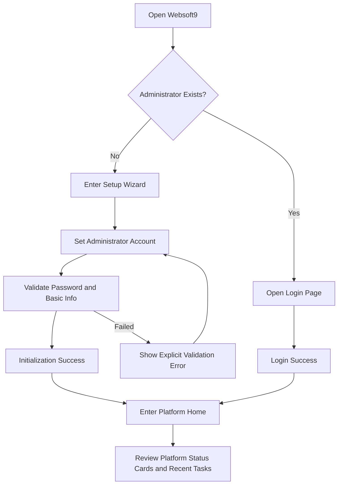
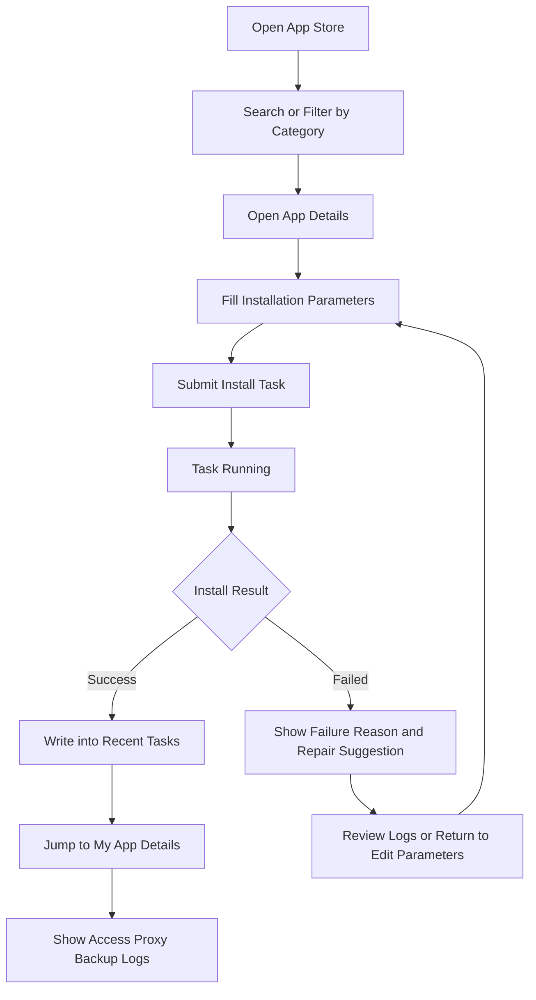
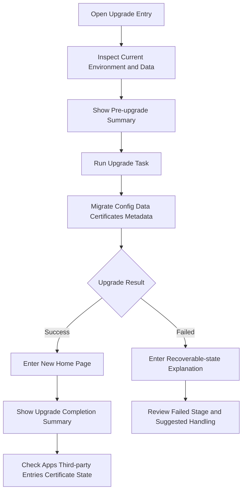

---
stepsCompleted:
  - 1
  - 2
  - 3
  - 4
  - 5
  - 6
  - 7
  - 8
  - 9
  - 10
  - 11
  - 12
  - 13
  - 14
lastStep: 14
workflowComplete: true
completedAt: 2026-04-21
inputDocuments:
  - /workspace/websoft9/_bmad-output/planning-artifacts/prd.md
  - /workspace/websoft9/docs/product/product-brief.md
  - /workspace/websoft9/docs/prd.md
  - /workspace/websoft9/docs/current-architecture-baseline.md
  - /workspace/websoft9/docs/ui-plugin-baseline.md
  - /workspace/websoft9/docs/api-contracts-apphub.md
  - /workspace/websoft9/docs/architecture/tech-architecture.md
  - /workspace/websoft9/docs/sprint-artifacts/stories-overview.md
---

# Websoft9 UX Design Specification

**Author:** Websoft9
**Date:** 2026-04-21

---

## Executive Summary

### Project Vision

The Websoft9 refactor is not a simple UI replacement. It is a product-level consolidation of an experience that is currently spread across Cockpit plugins, host-level privileges, and multiple assembled containers into a true Websoft9-owned control console. The new UX must serve three core goals: first, users should manage the Websoft9 platform and the applications running on it rather than the Linux host itself; second, Gitea, Portainer, and Nginx Proxy Manager must remain continuously accessible while their integration boundaries become explicit; third, existing users must still recognize and continue their high-frequency workflows after a direct upgrade.

As a result, the new experience center is no longer a host resource page. It is organized around platform state, application state, key tasks, risk alerts, and frequent action entry points. The home page owns overview, navigation, and risk signaling; the services page owns diagnostics and metric drill-down; the application pages own lifecycle management; the settings area owns product runtime configuration; and files and terminal access remain controlled capabilities rather than default system-management entry points.

### Target Users

The Websoft9 UX primarily serves three user groups. The first group is SMB IT teams that want to manage multiple self-hosted applications at lower cost and need a stable interface, low learning overhead, and efficient troubleshooting. The second group is developers and technical service providers who care about deployment speed, transparent task feedback, predictable operational actions, and smooth access to proxy, backup, and logs. The third group is existing Websoft9 users whose main concern is preserving core workflows after direct upgrade without relearning a completely unfamiliar product.

What these groups share is that they want to complete platform and application operations, not become host-management experts. The UX should therefore prioritize task completion, state evaluation, risk location, and migration continuity.

### Key Design Challenges

1. The UX must decisively separate the mental model of a Websoft9 product console from that of a generic server panel.
2. Third-party services must remain fully reachable without letting the overall product experience collapse into a collection of embedded iframes.
3. Direct-upgrade users must retain familiar primary paths, including app store, my apps, proxy, backup, settings, and external service entry points.
4. Files, terminal, services, and logs are all high-power capabilities and must remain usable while clearly communicating operational scope and security boundaries.
5. The current plugin landscape is fragmented across projects, language handling, and interaction patterns, so the new UX must introduce unified navigation, state models, task feedback, and visual semantics.

### Design Opportunities

1. Rebuild the home page around platform overview, exception alerts, and frequent entry points so users can immediately judge health and required actions after login.
2. Use the application lifecycle as the primary experience spine, connecting installation, access, proxy, backup, logs, and redeploy into a continuous loop.
3. Divide capabilities into product-native modules, controlled system capabilities, and third-party integration capabilities so the information architecture itself reinforces the product boundary.
4. Replace implicit command-driven uncertainty with a unified model for task state, success feedback, failure diagnostics, and recovery paths.

## Core User Experience

### Defining Experience

The defining Websoft9 experience is not “seeing many system metrics.” It is “using one unified console to quickly install, manage, access, and recover applications.” If this primary path is smooth enough, users will naturally accept proxy, logs, backup, and third-party service integration. If the application path remains fragmented, even a rich management feature set will still feel heavy.

This means the core UX objective is to compress “find an app, configure it, install it, wait for the result, enter management, continue operations” into a low-friction flow with continuous feedback. Users do not need to understand whether the backend capability is powered by AppHub, proxy wrapping, or third-party service coordination. They only need to feel that the platform completes the task reliably.

### Platform Strategy

Phase 1 is primarily a web desktop experience, while still supporting basic tablet usability and access to critical information on mobile. The true high-frequency environment for the core users remains mouse-and-keyboard desktop usage, so desktop information density can be moderately high, but it must not regress into the visual congestion of an old-fashioned system panel. Mobile does not need to reproduce full operational complexity; instead it should prioritize platform status, application status, a small set of high-priority actions, and exception notifications.

The platform strategy is therefore desktop-first with mobile convergence. Desktop supports split navigation, list-detail collaboration, and mixed table-card density. Tablet supports simplified expansion and secondary drawers. Mobile adopts single-column, task-priority layouts and does not try to carry full log analysis or terminal usage.

### Effortless Interactions

The following interactions must feel nearly thoughtless:

1. Judging platform health, abnormal applications, and failed tasks from the home page.
2. Finding a target application in the app store and starting installation.
3. Locating an app in My Apps and executing access, restart, backup, redeploy, or uninstall actions.
4. Entering Gitea, Portainer, or NPM with a continuous transition that does not break task momentum.
5. Receiving explicit result feedback immediately after settings or proxy changes instead of wondering whether the update took effect.

The system should automatically handle persistent task refresh, aggregated install and upgrade results, explicit diagnostic entry points for key errors, synchronization of recent tasks and exceptions back to the home page, and preservation of module context and filters.

### Critical Success Moments

1. After first login, the user should immediately understand platform status instead of being drowned in system noise.
2. After the first app installation, the user should see a complete loop of “installed, accessible, ready for continued configuration” within only a few transitions.
3. The first entry from Websoft9 into a third-party service should not require manual re-login or cause loss of context.
4. The first failed task should quickly reveal cause, impact, and next action.
5. After upgrading, an existing user should quickly find familiar paths and verify that core capabilities still work.

### Experience Principles

1. Task priority over system noise.
2. Separate overview from diagnostics: the home page shows global state, the services page shows detail.
3. High-risk capabilities must be presented as controlled operations with explicit scope.
4. Every key action must have clear status feedback, a recoverable path, and a next-step suggestion.

## Desired Emotional Response

### Primary Emotional Goals

Websoft9 should make users feel three core emotions: control, reliability, and familiarity. Control means that users still understand status and results while the platform performs complex operational actions. Reliability means high-risk actions such as install, upgrade, proxy, and backup should never feel like guesswork. Familiarity means users migrating from the old system should not feel broken away from their previous workflows.

### Emotional Journey Mapping

1. On first discovery, users should feel that this is an application operations platform rather than a generic system panel.
2. During core tasks, users should feel that the system is helping them move forward rather than asking them to understand implementation details.
3. After task completion, users should get a clear sense of accomplishment and an obvious next action.
4. When something goes wrong, users should not feel abandoned or out of control; they should feel that the problem has been exposed correctly and can still be handled.
5. On return visits, users should feel continuity of state, preserved context, and resumable work.

### Micro-Emotions

- From uncertainty to confirmation, established through clear status cards, task feedback, and success signals.
- From anxiety to reassurance, established through explicit steps and failure-recovery guidance in high-risk flows such as upgrade, backup, and proxy.
- From fragmentation to focus, established through unified navigation and information hierarchy.
- From passive troubleshooting to active control, established through exception alerts, log entry points, and service-diagnostic linkage.

### Design Implications

- “Control” requires stable layouts, explicit titles, predictable action areas, and persistently visible status feedback on key pages.
- “Reliability” requires every async action to expose progress, result, failure reason, and suggested next step rather than relying on transient toasts.
- “Familiarity” requires retaining the names, module boundaries, and logical sequencing of high-frequency legacy paths instead of redesigning for novelty.

### Emotional Design Principles

1. Create certainty more often than surprise.
2. Reinforce accomplishment on success and recoverability on failure.
3. Use continuous paths to lower the psychological migration cost for upgrade users.

## UX Pattern Analysis & Inspiration

### Inspiring Products Analysis

The Websoft9 UX can draw from three mature product families. The first is modern application or server panels such as 1Panel, which provide a clearer product boundary through home-page overview, module organization, and task feedback. The second is Portainer, which offers useful patterns in container-resource visualization, list action density, state labels, and batch operations. The third is cloud consoles such as Vercel or GitHub, which are more focused than traditional system panels in their expression of “current state + recent activity + next action.”

### Transferable UX Patterns

1. Primary left navigation plus page-level secondary tooling for stable module switching.
2. List pages for filtering and overview, detail pages for context-specific actions, avoiding one-page overload.
3. State labels, task timelines, recent activity streams, and explicit error explanations to build observability.
4. Third-party service entry points preserved, but presented as controlled integration cards or workspaces instead of dominating site navigation.

### Anti-Patterns to Avoid

1. Turning the home page into a host-monitoring dashboard that dilutes the product’s primary jobs.
2. Stuffing every capability into the application detail page and collapsing information hierarchy.
3. Continuing to rely on implicit frontend-executed commands with lightweight notifications but no traceable task outcomes.
4. Replacing genuine high-frequency entry points with overcomplicated charts and excessive panel density.

### Design Inspiration Strategy

Adopt a strategy of product-console priority, narrowed system capability, and controlled integration capability. Borrow patterns from mature platforms in overview, list, detail, state, and task design without copying their visual skin. Preserve the module skeleton familiar to existing Websoft9 users while unifying and tightening interaction patterns. Visually, emphasize clarity, stability, and professionalism rather than consumer-style stimulation.

## Design System Foundation

### 1.1 Design System Choice

The recommended foundation is a themeable mature system, such as MUI or a similar component framework, used as the base component layer and extended with Websoft9 design tokens and business components. This is appropriate because the project is a brownfield refactor that must balance delivery speed, maintainability, and consistency rather than building a fully custom design system from scratch.

### Rationale for Selection

1. Existing plugins already have some MUI usage, so migration cost is lower than a full stack replacement.
2. The product must support complex tables, forms, drawers, labels, dialogs, navigation, and feedback patterns, and a mature library reduces implementation cost.
3. Websoft9 still needs some brand expression, but the main need right now is consistency and consolidation rather than extreme visual differentiation.
4. A themeable foundation is a better match for gradually evolving a product design system and reusable business components.

### Implementation Approach

The base layer uses a mature component library for buttons, inputs, tables, drawers, tags, dialogs, tabs, notifications, cards, and layout grids. The middle layer defines Websoft9 design tokens such as color, spacing, borders, shadows, radius, state semantics, and density rules. The top layer defines business components such as platform status cards, application status tables, task timelines, proxy configuration forms, service health cards, log views, and integration entry cards.

### Customization Strategy

Keep the accessibility and interaction fundamentals of the mature component library, but consistently override navigation styling, state-semantic colors, data-table density, card title hierarchy, error and success feedback structure, task-result page templates, empty-state templates, and embedded third-party service container conventions.

## 2. Core User Experience

### 2.1 Defining Experience

The defining Websoft9 experience can be summarized as: users complete “discover application, execute change, inspect result, continue operating” inside one unified console with the fewest possible transitions. That path is the core of product value, not any single standalone system module.

### 2.2 User Mental Model

The user’s mental model is not “I am here to manage Linux services.” It is “I am here to manage my platform and the applications on it.” Users expect to install, restart, bind domains, inspect logs, and restore backups in the way a modern application platform behaves, without repeated interruption from host-level concepts. Existing users also carry structural memory from the old plugins, so the new UX should preserve a familiar skeleton while making scope and structure clearer.

### 2.3 Success Criteria

1. Users can determine platform health and exception tasks from the home page within 5 seconds.
2. Users receive continuous feedback between app discovery and app running, and naturally land in My Apps after success.
3. Users see consistent status, results, and next-step guidance after every key asynchronous action.
4. Users can complete high-frequency operational tasks without understanding backend service topology.

### 2.4 Novel UX Patterns

Websoft9 does not need to invent a new interaction grammar. Its foundation should remain in familiar console patterns such as navigation, list, detail, task, state, drawer, and embedded workspace. The real innovation is reorganizing fragmented legacy capabilities into one stable, continuous, task-oriented product console experience.

### 2.5 Experience Mechanics

1. Initiation: users start tasks from home-page cards, navigation menus, or list entry points.
2. Interaction: users execute actions inside explicit forms, action panels, or detail pages.
3. Feedback: the system responds with task state, inline feedback, detail summaries, and log entry points rather than a single toast.
4. Completion: on success, the system provides result confirmation, linked resources, and suggested next steps; on failure, it provides diagnosable information and repair entry points.

## Visual Design Foundation

### Color System

The color system should feel professional, stable, and low-noise. The recommended foundation is a deep blue-gray primary palette, supported by blue-green success tones and amber warning tones, avoiding the oversaturated variety common in traditional control panels. Semantic colors must serve state recognition:

- Primary: platform navigation, key CTAs, active state
- Success: healthy runtime, successful task, available state
- Warning: attention needed but not yet failed
- Error: failure, abnormality, risk state
- Neutral: structure hierarchy, borders, tables, and background zoning

A light theme should remain the default to preserve readability during long operational sessions. Token abstraction for future dark mode should remain possible, but dark mode is not required in the MVP.

### Typography System

Typography should prioritize readability first. A sans-serif pairing suitable for bilingual administrative interfaces is recommended. Title hierarchy must remain clear but not exaggerated, while body text and tabular information should support density without losing distinction. The recommended structure is:

- H1: page title and module identity
- H2: section heading
- H3: card and secondary-area heading
- Body: explanatory and form text
- Caption: state notes, metadata, and update time

### Spacing & Layout Foundation

Use an 8px base spacing system with 4px micro-adjustments. The overall layout should rely on a 12-column desktop grid. Content areas should prioritize tasks and state rather than decorative whitespace. Desktop uses a stable shell of left navigation, page-level header information, and a main content region. Content pages can combine cards, tables, and detail panels, but must preserve consistent page padding and module rhythm.

### Accessibility Considerations

All color contrast should meet at least WCAG AA. State must never rely on color alone and should always be reinforced by iconography, text, or labels. Heading hierarchy and form labels must remain semantically clear, focus states must be explicitly visible, and key interactive targets must provide sufficient click or touch area.

## Design Direction Decision

### Design Directions Explored

This design-direction exploration focused on six dimensions: overview-page density, the relationship between app list and detail, the presentation of external service entry points, the strength of state semantics, the proportion of data visualization, and the degree of isolation for system-capability modules. After evaluation, the most suitable direction for Websoft9 is neither a minimal consumer dashboard nor a traditional operations-heavy monitoring screen. It is a medium-to-high-density product-console interface.

### Chosen Direction

The chosen direction is “steady control console”:

1. The home page prioritizes platform state, tasks, application summaries, and risk alerts.
2. Major modules use a list-card hybrid presentation with medium-to-high density and a stable structure.
3. External services are entered through integrated workspaces so they retain full capability without taking over primary navigation.
4. State semantics remain explicit, clear, and hierarchical, avoiding over-visualized chart-heavy presentation.

### Design Rationale

This direction best matches three current realities of the product. First, users are primarily completing operational tasks and therefore need stability and clarity rather than flashy visuals. Second, the project is a brownfield refactor, so the design must preserve a sense of familiarity for upgrade users. Third, the product boundary is being tightened, so the information architecture and visual weight must clearly communicate what is a native Websoft9 capability versus what is an integrated capability.

### Implementation Approach

Prioritize the core page templates for home, app store, my apps, settings, services, and logs, and keep them aligned through a consistent page-title zone, state labels, task-feedback area, action bar, and content structure. The color-theme and page-template references in [ _bmad-output/planning-artifacts/ux-color-themes.html ](_bmad-output/planning-artifacts/ux-color-themes.html) and [ _bmad-output/planning-artifacts/ux-design-directions.html ](_bmad-output/planning-artifacts/ux-design-directions.html) remain supporting assets.

## User Journey Flows

### Journey 1: Initial Administrator Setup and Platform Entry

Goal: enable first-time users to create an administrator account quickly and land in a comprehensible platform overview.

Key design point: keep initialization steps minimal and land directly on the home page after success; the home page must answer whether the platform is healthy, whether anything is abnormal, and what the user can do next.

### Journey 2: App Discovery, Installation, and Management Entry

Goal: let users complete installation from the app store and naturally continue operations in My Apps.

Key design point: installation must be a traceable task, not a black box; after success, users should move naturally into management rather than remaining in the store.

### Journey 3: Direct Upgrade and Continuity Confirmation

Goal: help existing users quickly confirm that core capabilities still work after upgrade.

Key design point: the post-upgrade confirmation page is critical because it helps users quickly regain confidence and understand what has been preserved and what still needs attention.

### Journey Patterns

1. Every critical flow starts from an obvious entry point, moves through a limited number of steps, and lands on a page where the user can continue operating.
2. Asynchronous tasks consistently follow the pattern of submit, running, success or failure, then next step.
3. Failure states must either allow return to the previous step for correction or provide entry into logs and diagnostics.

### Flow Optimization Principles

1. Minimize back-and-forth movement between modules.
2. Ask for only the information needed at the current step instead of exposing too much configuration up front.
3. Provide an explicit next step at the end of critical flows rather than making users guess where to go.

## Component Strategy

### Design System Components

Reusable components from a mature library should cover buttons, inputs, tables, drawers, tabs, modals, notifications, pagination, selectors, tags, tooltips, breadcrumbs, cards, skeletons, progress indicators, date pickers, and base chart containers. These should cover more than 70% of the foundational UI.

### Custom Components

#### Platform Status Overview Card

**Purpose:** Quickly express platform, application, task, and exception status on the home page.  
**Usage:** Main home-page area and key overview scenarios.  
**States:** Normal, warning, abnormal, loading.  
**Accessibility:** State text must remain readable and color cannot be the only signal.

#### Application Action Header

**Purpose:** Standardize high-frequency actions such as access, restart, backup, proxy, and logs at the top of application detail pages.  
**Usage:** My App detail page.  
**States:** Running, stopped, abnormal, action in progress.  
**Variants:** Web apps, database apps, and apps without external access.

#### Task Timeline Panel

**Purpose:** Present task state consistently across install, upgrade, backup, restore, and proxy configuration flows.  
**Usage:** Recent tasks on the home page, task tabs in detail pages, and a global task center.  
**States:** Queued, running, success, failure, canceled.  
**Accessibility:** Timestamp, state, and result must be correctly readable by screen readers.

#### Integrated Service Entry Card

**Purpose:** Carry controlled entry and state hints for Gitea, Portainer, and NPM.  
**Usage:** Home-page quick entry, integration modules, and app-related pages.  
**States:** Accessible, authenticating, unavailable, configuration abnormal.

### Component Implementation Strategy

All custom components must be built on shared tokens and foundation components to avoid repeating the legacy pattern of each module reimplementing its own status cards, tags, and feedback logic. Implementation priority follows high-frequency paths first: home overview cards, the application action header, and the task timeline have highest priority; integrated service entry cards, log filter bars, and service-health row components come next; terminal-bridge and file-management composites can follow in later iterations.

### Implementation Roadmap

1. Phase 1: home overview cards, task timeline, application action header.
2. Phase 2: enhanced application-list components, proxy configuration form blocks, service-health views.
3. Phase 3: file-management composites, terminal-session metadata components, upgrade confirmation panels.

## UX Consistency Patterns

### Button Hierarchy

Primary buttons are reserved for key tasks such as install application, save settings, and start upgrade. Secondary buttons support actions such as cancel, back, and view more. Destructive actions must use error semantics and require confirmation rather than appearing with the same weight as standard primary buttons. Buttons related to running tasks should expose disabled states and reasons.

### Feedback Patterns

Success feedback should follow the structure of result, affected object, and next-step entry. Error feedback should follow the structure of failed action, reason summary, diagnostic entry, and repair suggestion. For long-running tasks such as install, upgrade, and restore, feedback must persist in the task timeline rather than relying on transient toasts. Warning feedback applies to cases that can continue but still require attention, such as expiring certificates or degraded services.

### Form Patterns

Forms should be grouped by task rather than by technical field. Required and optional fields must be clearly distinguished, and sensitive fields should be hidden by default. Validation should happen as early as practical, and errors should appear in context. High-risk settings changes should expose impact summaries before submission. Familiar legacy fields should preserve naming continuity whenever possible to reduce upgrade-user friction.

### Navigation Patterns

Primary navigation should remain stable and should include home, app store, my apps, settings, backup, services, logs, and integrations. Each page should use a consistent structure of page header, secondary tool area, and main content. Cross-module transitions should preserve as much context as possible, such as carrying filters or state when moving from a home-page alert card into the services page.

### Additional Patterns

Empty states should explain why they are empty and what the user can do next. Loading states should use skeletons that resemble the final layout. Modals should only handle short decisions and should not carry complex multi-step flows. Drawers are appropriate for contextual editing, while complex configuration should use full pages. Search and filtering should primarily operate on lists rather than take over detail space.

## Responsive Design & Accessibility

### Responsive Strategy

Desktop is the main workspace and should support parallel regions and higher information density. Tablet keeps the main browsing and management capabilities but reduces side-by-side regions. Mobile focuses on overview, state inspection, a small set of high-priority actions, and alert handling. High-complexity operations such as terminal usage, deep log review, and bulk configuration may be intentionally degraded on mobile rather than forced into fake parity.

### Breakpoint Strategy

Standard breakpoints are sufficient for the current phase:

- Mobile: 320px - 767px
- Tablet: 768px - 1023px
- Desktop: 1024px+

The layout strategy is desktop-first with mobile convergence. The main user context remains desktop operations, but all core state and key actions still need to remain readable and reachable on smaller screens.

### Accessibility Strategy

The target should be at least WCAG 2.1 AA. Websoft9 is a typical management product with high information density, complex state presentation, and frequent form and navigation usage, so AA is the practical baseline. Key requirements include color contrast, keyboard reachability, visible focus states, semantic form labels, icon-plus-text state communication, semantic table headings, and explicit titles for iframe or embedded regions.

### Testing Strategy

1. Responsive testing: validate the home page, application list, application detail, and settings on common desktop resolutions, iPad-class tablets, and common small-screen phones.
2. Accessibility testing: combine automated checks, full keyboard-flow verification, and screen-reader sampling.
3. Task-flow testing: verify first-time setup, application install, upgrade confirmation, proxy configuration, and failure recovery end to end.
4. Integration testing: validate that embedded entry into Gitea, Portainer, and NPM has clear region titles, loading states, and failure states.

### Implementation Guidelines

Use semantic HTML, clear heading hierarchy, ARIA labels, and stable focus management. Every interactive control should provide sufficient click or touch area, and every icon-only button must expose text or an accessible name. Media queries and layout collapse should serve task priority rather than simply squeezing desktop layouts into narrow columns. Controlled terminal and log modules should avoid pretending to offer complete mobile capability and should explicitly tell users when an action is better completed on desktop.

## Workflow Completion

This UX specification now completes the full definition of project understanding, core experience, emotional goals, design system foundation, visual direction, user journeys, component strategy, consistency patterns, and responsive accessibility strategy. It can now directly serve as UX input for architecture, wireframing, implementation, and epic or story decomposition.

The most appropriate BMAD sequence from here is to enter architecture next, translating the product boundary, page responsibilities, controlled capabilities, integration capabilities, and upgrade continuity defined here into a technical solution. After that, the work should move into Epics and Stories, where home, app store, my apps, settings, services, logs, and upgrade are broken down into implementation items.