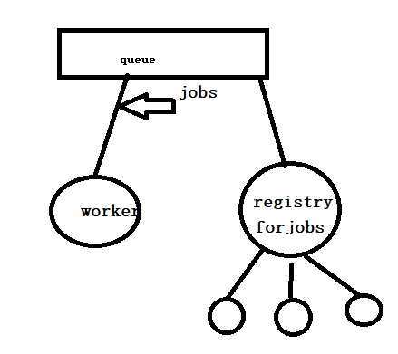

# Architecture

AppManage is develop by Python3.10, use [FastAPI](https://github.com/Websoft9/stackhub/blob/main/appmanage/docs/developer.md), [RQ](https://python-rq.org/), logging packages and Redis, Sqlite for data storage

It have the privilege of host machine, and running below jobs on host:  

* docker and docker compose
* modify file


## Asynchronous jobs - RQ

Create application by docker some time need many time, so we use [RQ](https://python-rq.org/) for queueing jobs and processing them in the background with workers




RQ sample for development:  

```
# Job started
rq worker --url redis://websoft9-redis:6379/0

# RQ 队列创建：
## 指定 Redis 容器的主机名和端口
redis_conn = Redis(host='websoft9-redis', port=6379)

## 使用指定的 Redis 连接创建 RQ 队列
q = Queue(connection=redis_conn,default_timeout=3600)

#RQ 队列新增排队任务：
q.enqueue(install_app_delay, app_name, customer_name, app_version, job_id=app_id)

#获取队列中任务的信息：
## 获取 StartedJobRegistry 实例
started = StartedJobRegistry(queue=q)
finish = FinishedJobRegistry(queue=q)
deferred = DeferredJobRegistry(queue=q)
failed = FailedJobRegistry(queue=q)
scheduled = ScheduledJobRegistry(queue=q)
cancel = CanceledJobRegistry(queue=q)

## 获取正在执行的作业 ID 列表
run_job_ids = started.get_job_ids()
finish_job_ids = finish.get_job_ids()
wait_job_ids = deferred.get_job_ids()
failed_jobs = failed.get_job_ids()
scheduled_jobs = scheduled.get_job_ids()
cancel_jobs = cancel.get_job_ids()
```

## Logs partition

    ```
        logPath = 'logs/'
        if not os.path.exists(logPath):
            os.makedirs(logPath)
        logName = 'app_manage.log'
        logFile = logPath + logName
        formatter = logging.Formatter('%(asctime)s %(levelname)s:  %(message)s')
        # handler
        time_rotating_file_handler = handlers.TimedRotatingFileHandler(filename=logFile, when="MIDNIGHT", interval=1, encoding='utf-8')
        time_rotating_file_handler.setLevel(logging.DEBUG)
        time_rotating_file_handler.setFormatter(formatter)
    ```

## Application Status

Application status is very import for developer to understand AppManage, it combine the [Docker compose status](https://docs.docker.com/engine/reference/commandline/compose_ps/#options) and [RQ status](https://python-rq.org/docs/job_registries/)

- installing(创建中): 来源于 RQ 的queue或StartedJobRegistry， 可进行操作[无法进行任何操作]
- running(运行中):  来源于docker compose，可进行操作[所有操作]
- exited(停止):   来源于docker compose，可进行操作[Start,Restart,Uninstall,日志查看]
- restarting(反复重启):  来源于docker compose，可进行操作[Stop,Restart,Uninstall,日志查看]
- failed(失败): 来源于 docker compose 中的 created || RQ 的 FailedJobRegistry 可进行操作[Uninstall]

> docker compose have status:  [paused | restarting | removing | running | dead | created | exited]


## API

FastAPI can create API and API docs of swagger, you can get [API design details](API-design.md)