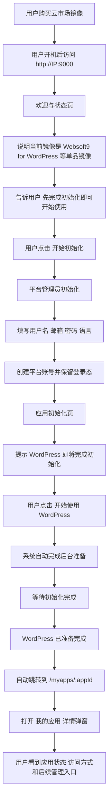

# 云市场镜像初始化引导设计

- 状态: Draft
- 日期: 2026-07-03
- 适用范围: Azure Marketplace、AWS Marketplace、阿里云、华为云等预装 Websoft9 的云市场镜像
- 不适用范围: 用户手工执行 install.sh 的常规安装路径

## 1. 背景

当前 Websoft9 的首次访问流程基于平台视角设计:

1. 用户访问 `http://IP:9000`
2. 系统因 `initialization_required=true` 跳转到 `/auth/setup`
3. 用户创建平台管理员账号
4. 用户登录后进入控制台首页

这条路径对熟悉 Websoft9 的用户是成立的，但对云市场镜像用户并不成立。云市场镜像通常以单品方式售卖，例如 “Websoft9 for WordPress”。用户购买这类镜像时，预期打开后直接理解两件事:

1. 自己买到的是一个面向 WordPress 的可用镜像，而不是一个抽象的平台。
2. 自己现在只需要按步骤完成初始化，完成后就能开始使用应用。

如果首次打开后直接看到平台账号初始化页，用户无法建立 “Websoft9 平台” 与 “WordPress 站点” 的关系，也无法理解为什么要先初始化平台再去启用应用。

## 2. 设计判断

云市场场景下，这个问题本质上不是“再安装一次应用”，而是“让用户用最少步骤完成首次初始化并开始使用”。

因此文档只坚持四个判断:

- 首次引导必须弱化“安装”概念，强化“初始化 / 启用 / 开始使用”。
- mcloud 负责镜像构建和最小应用标识，Websoft9 负责运行时引导。
- 向导必须复用现有 Product Auth、AppHub 和 My Apps，不新增平行体系。
- 非云市场安装路径必须完全不受影响。

## 3. 方案概览

### 3.1 总体职责边界


### 3.2 推荐代码归属

#### mcloud 项目负责

- 云市场镜像构建流程
- 预装应用镜像的拉取与封装
- 写入当前单品镜像对应的应用标识

#### Websoft9 项目负责

- 首次访问状态页
- 平台管理员初始化
- 预装应用初始化向导
- 初始化完成后的 My Apps 收束跳转
- 向导状态持久化与恢复

## 4. 用户旅程

### 4.1 云市场用户首次访问总览图



### 4.2 大步骤说明

#### Step 0: 欢迎与状态页

建议展示内容:

- 镜像名称，例如 “Websoft9 for WordPress”
- 一句简短说明，例如 “先完成管理员设置，再启动 WordPress”
- 初始化步骤预览
- 服务准备状态摘要，例如 “环境已准备完成” 或 “正在准备中”

#### Step 1: 平台管理员初始化

输入项:

- 用户名
- 邮箱
- 密码
- 语言

#### Step 2: 应用初始化

交互要求:

- 默认应尽量少填少写，优先使用模板默认值。
- 页面上应使用“初始化 / 启用 / 开始使用”这类表述，而不是强调“安装”。
- 用户看到的是“开始使用 WordPress”或“完成 WordPress 初始化”，而不是“开始安装”。
- 用户点击后，前端调用现有 AppHub 链路完成后台准备动作。
- 若默认值可用，则直接继续；若默认值缺失或冲突，则只要求用户补充必要字段。

#### Step 3: 初始化完成后的收束跳转

行为要求:

- 初始化链路返回成功后，前端必须导航到 `/myapps/:appId`。
- 该路由在现有控制台中会以 “我的应用” 列表为背景，并自动打开目标应用的详情弹窗。
- 详情弹窗中应直接呈现访问入口、容器状态、卷、Compose、卸载等标准能力。
- 如初始化失败，停留在当前步骤页，展示错误并允许用户重试。

### 4.3 用户说明原则

云市场引导页应采用任务式说明，而不是技术式说明。

- 首屏只回答三件事: 这是什么、现在做什么、做完去哪里。
- 不要求用户理解端口、代理、容器、域名绑定等概念。
- 技术映射可以保留在产品内部实现和运维文档中，但不应成为首次引导的主文案。
- 对用户展示的内容应尽量简化为 “先创建管理员，再启动应用，完成后进入应用管理页面”。

## 5. 运行时契约

建议在产品侧增加独立的向导状态存储，最小模型如下:

| 字段 | 含义 |
|---|---|
| `current_step` | 当前步骤，`welcome/platform_init/app_init/complete` |
| `app_slug` | 当前单品镜像对应的模板应用标识，例如 `wordpress` |
| `installed_app_id` | 初始化成功后用于跳转到 `/myapps/:appId` 的应用标识 |
| `completed_at` | 引导完成时间 |
| `updated_at` | 最近更新时间 |

建议状态持久化在现有产品数据目录下，并由 AppHub 统一读写。

### 5.0 mcloud 到 Websoft9 的最小交接契约

为避免运行时猜测，建议把单品镜像应用标识固定写入一个只读文件，由 Websoft9 启动后读取。

建议约定如下:

| 项目 | 建议值 |
|---|---|
| 文件路径 | `/data/apps/cloud-marketplace/app.json` |
| 文件所有者 | mcloud 构建流程写入 |
| 文件格式 | JSON |
| 最小字段 | `app_slug` |

建议内容示例:

```json
{
    "app_slug": "wordpress"
}
```

读取规则:

1. AppHub 在启动后或首次调用 `GET /api/setup-wizard/app` 时读取该文件。
2. 读取成功且 `app_slug` 非空，则视为存在有效单品标识。
3. 文件不存在、内容非法或字段为空时，视为无效标识，系统直接回落到标准路径。
4. Websoft9 不负责推断 `app_slug`，也不从镜像名、市场 SKU 或其他运行时信息反推。

运行时建议只保留一个开关:

| 变量 | 示例 | 作用 |
|---|---|---|
| `WEBSOFT9_CLOUD_MARKETPLACE_MODE` | `true` | 是否启用云市场初始化向导 |

除此之外，mcloud 只需要在镜像内写入一个最小应用标识，例如 `app_slug=wordpress`，用于告诉平台当前单品镜像对应哪个应用商店模板。

### 5.1 安装参数来源

平台不应自己维护一份独立的安装参数模板，而应复用当前应用商店安装元数据。

- 应用标识来自 mcloud 写入的最小应用标识。
- 默认版本来自应用商店 `distribution` 元数据。
- 默认 `settings` 和端口默认值来自现有安装元数据与模板 `.env`。
- `app_id`、域名相关输入和最终跳转由向导页面补齐。

实现约束:

- 云市场镜像场景默认不向用户暴露完整安装表单。
- 向导只允许补齐“缺省值确实不存在时的最小必要字段”。
- 如果现有应用商店元数据足够，Step 3 必须保持单按钮启动，不得退化成通用安装页。

### 5.2 判定规则

仅当以下条件成立时，控制台进入云市场向导路径:

1. `WEBSOFT9_CLOUD_MARKETPLACE_MODE=true`
2. 当前存在有效的单品应用标识
3. 当前还没有向导完成标记

否则系统回落到现有标准路径。

### 5.3 向导状态机与恢复规则

为保证刷新、退出、重进后的行为一致，建议将状态机固定为以下规则:

| 状态 | 含义 | 刷新后行为 |
|---|---|---|
| `welcome` | 欢迎页未开始 | 留在欢迎页 |
| `platform_init` | 等待创建管理员 | 回到创建管理员页 |
| `app_init_ready` | 管理员已创建，等待点击开始使用 | 回到开始使用页 |
| `app_init_running` | 后台正在准备应用 | 回到进度页并继续轮询 |
| `app_init_failed` | 应用初始化失败 | 回到开始使用页并展示最近错误 |
| `complete` | 向导已完成 | 不再展示向导，直接跳最终落点 |

补充规则:

1. Step 2 成功后必须立即持久化到 `app_init_ready`，避免刷新后重复创建管理员。
2. Step 3 触发后必须先写入 `app_init_running`，再调用后台初始化。
3. 如果用户在 `app_init_running` 期间刷新页面，前端应恢复到“正在准备”页面，而不是再次触发安装。
4. 如果初始化失败，应保存可展示错误摘要，允许用户在当前页重试。
5. 如果状态为 `complete`，访问 `/setup` 时应直接跳转到 `/myapps/:appId`；若目标应用已不存在，再回退到 `/myapps`。

### 5.4 完成态收束契约

向导最终目标不是“安装成功提示页”，而是稳定进入已有应用详情。

因此建议把 Step 3 的后端返回契约明确为两段式:

1. `POST /api/setup-wizard/install` 返回一个可轮询的执行标识，例如 `tracking_id`。
2. 当前端轮询到安装完成后，后端必须返回最终 `installed_app_id`，供前端导航到 `/myapps/:appId`。

收束规则:

- 只有拿到最终 `installed_app_id` 后，前端才能标记完成并跳转。
- 若后台任务成功但应用列表尚未刷新，后端应负责等待或重试查询，避免前端自行猜测。
- 向导页不应继续沿用现有 App Store 页面的查询参数跳转方式，而应以最终 `appId` 为单一成功出口。

### 5.5 安全组提示策略

云市场镜像通常运行在全新主机中，本地端口冲突不是常态；更常见的问题是云平台安全组未放通外部访问端口。

因此建议明确以下边界:

- 安全组问题不作为初始化向导的阻断步骤。
- 向导 Step 3 不做云厂商安全组探测，也不要求用户在此阶段处理网络规则。
- 应用初始化完成后，如访问入口不可达，可在“我的应用”详情页或访问提示区给出“请检查云安全组/防火墙是否已放通对应端口”的轻量提示。
- 安全组提示属于使用后提示，不属于首次初始化主流程。

## 6. 实现要点

建议在控制台新增独立功能模块:

```text
console/src/features/setup-wizard/
```

建议包含:

- `setup-wizard-page.tsx`: 向导主页面
- `setup-wizard-provider.tsx`: 状态管理与 API 封装
- `steps/welcome-step.tsx`: 欢迎与状态页
- `steps/platform-init-step.tsx`: 平台管理员初始化页
- `steps/app-init-step.tsx`: 应用初始化与进度页

前端要求:

- 新增独立路由 `/setup`
- 在云市场模式下，原本跳转 `/auth/setup` 的路径改为跳转 `/setup`
- 常规产品模式维持现有 `/auth/setup` 不变
- 向导不应重新发明安装协议，而应复用现有 App Store 安装链路。
- 向导读取当前模板应用的默认安装元数据，再补齐用户输入后调用 `/api/apps/install`。
- 初始化完成后，沿用现有 My Apps 作为正式产品落点。
- 继续调用现有 `/api/auth/initialize`
- 取消当前 setup 成功后“立即 logout 再跳 login”的行为，仅在云市场向导模式下改为连续下一步
- 账号初始化页面仍使用现有校验规则
- 初始化完成后的目标落点不是一个新的完成页，而是现有 `/myapps/:appId` 路由。
- 现有控制台已支持通过 `/myapps/:appId` 直接打开指定应用的详情弹层，因此向导应复用这一路径。
- 向导页只负责拿到初始化完成后的 `appId` 并执行跳转，不应复制详情页能力。

后端要求:

建议在 AppHub 新增向导服务层和路由层:

```text
apphub/src/services/setup_wizard.py
apphub/src/api/v1/routers/setup_wizard.py
apphub/src/schemas/setupWizard.py
```

- 解析云市场环境变量
- 读取镜像内最小应用标识
- 生成和持久化向导状态
- 对外暴露当前步骤、目标应用和完成状态
- 封装“推进到下一步”的状态变更
- 调用现有应用初始化链路，并返回应用标识

API 建议:

| 方法 | 路径 | 说明 |
|---|---|---|
| `GET` | `/api/setup-wizard/state` | 获取向导当前状态 |
| `GET` | `/api/setup-wizard/app` | 获取当前单品镜像对应的目标应用与默认安装元数据 |
| `POST` | `/api/setup-wizard/platform-init-complete` | 标记管理员初始化已完成并推进到应用初始化准备态 |
| `POST` | `/api/setup-wizard/install` | 触发目标应用的后台初始化，并返回任务标识 |
| `GET` | `/api/setup-wizard/install/{tracking_id}` | 获取初始化进度、错误摘要和最终 `installed_app_id` |
| `POST` | `/api/setup-wizard/complete` | 标记向导完成 |

### 6.1 API 响应示例

以下示例只定义向导自己的最小契约，不替代现有 AppHub 安装模型。

`GET /api/setup-wizard/state`

```json
{
    "enabled": true,
    "current_step": "app_init_ready",
    "app_slug": "wordpress",
    "installed_app_id": null,
    "completed": false,
    "last_error": null,
    "updated_at": "2026-07-06T08:30:00Z"
}
```

`GET /api/setup-wizard/app`

```json
{
    "app_slug": "wordpress",
    "display_name": "WordPress",
    "edition": "latest",
    "default_app_id": "wordpress",
    "is_web_app": true,
    "requires_user_inputs": false,
    "required_inputs": [],
    "settings": {
        "HTTP_PORT": "8080",
        "HTTPS_PORT": "8443"
    }
}
```

`POST /api/setup-wizard/platform-init-complete`

```json
{
    "current_step": "app_init_ready",
    "updated_at": "2026-07-06T08:31:00Z"
}
```

`POST /api/setup-wizard/install`

请求示例:

```json
{
    "app_id": "wordpress",
    "edition": "latest",
    "user_inputs": {}
}
```

响应示例:

```json
{
    "tracking_id": "wiz-7f3b1c92",
    "current_step": "app_init_running"
}
```

`GET /api/setup-wizard/install/wiz-7f3b1c92`

初始化中:

```json
{
    "status": "running",
    "current_step": "app_init_running",
    "installed_app_id": null,
    "last_error": null
}
```

初始化完成:

```json
{
    "status": "succeeded",
    "current_step": "complete",
    "installed_app_id": "wordpress-7gk2p1",
    "last_error": null
}
```

初始化失败:

```json
{
    "status": "failed",
    "current_step": "app_init_failed",
    "installed_app_id": null,
    "last_error": {
        "code": "MISSING_REQUIRED_SETTINGS",
        "message": "缺少必要默认值，请补充后重试。"
    }
}
```

`POST /api/setup-wizard/complete`

```json
{
    "current_step": "complete",
    "installed_app_id": "wordpress-7gk2p1",
    "completed": true,
    "completed_at": "2026-07-06T08:33:10Z"
}
```

### 6.2 字段级 Schema 建议

为减少前后端重复解释，建议把向导层对象收敛为以下几个稳定模型。

#### SetupWizardState

| 字段 | 类型 | 必填 | 说明 |
|---|---|---|---|
| `enabled` | `boolean` | 是 | 当前实例是否启用云市场向导 |
| `current_step` | `SetupWizardStep` | 是 | 当前向导状态 |
| `app_slug` | `string \| null` | 是 | mcloud 提供的单品应用标识 |
| `installed_app_id` | `string \| null` | 是 | 最终已创建应用的实例标识 |
| `completed` | `boolean` | 是 | 是否已完成整个向导 |
| `last_error` | `SetupWizardError \| null` | 是 | 最近一次可展示错误 |
| `updated_at` | `string` | 是 | ISO 8601 时间戳 |
| `completed_at` | `string \| null` | 否 | 完成时间，没有则为空 |

#### SetupWizardApp

| 字段 | 类型 | 必填 | 说明 |
|---|---|---|---|
| `app_slug` | `string` | 是 | 应用模板标识 |
| `display_name` | `string` | 是 | 页面展示名，例如 `WordPress` |
| `edition` | `string` | 是 | 默认版本或分发标识 |
| `default_app_id` | `string` | 是 | 默认实例名建议值 |
| `is_web_app` | `boolean` | 是 | 是否为 Web 应用 |
| `requires_user_inputs` | `boolean` | 是 | 是否存在必须补填的最小字段 |
| `required_inputs` | `SetupWizardInputField[]` | 是 | 仅在缺默认值时返回 |
| `settings` | `Record<string, string>` | 是 | 后端最终用于安装的默认设置快照 |

#### SetupWizardInputField

| 字段 | 类型 | 必填 | 说明 |
|---|---|---|---|
| `name` | `string` | 是 | 字段名，例如 `HTTP_PORT` |
| `label` | `string` | 是 | 前端显示标签 |
| `type` | `"text" \| "number" \| "password"` | 是 | 最小输入类型 |
| `required` | `boolean` | 是 | 是否必填 |
| `default_value` | `string \| null` | 是 | 如果已有默认值则回填 |
| `placeholder` | `string \| null` | 否 | 可选占位文案 |
| `description` | `string \| null` | 否 | 可选简短说明 |

#### SetupWizardError

| 字段 | 类型 | 必填 | 说明 |
|---|---|---|---|
| `code` | `string` | 是 | 稳定错误码，供前端分流 |
| `message` | `string` | 是 | 用户可见错误文案 |
| `retryable` | `boolean` | 是 | 是否允许当前页直接重试 |
| `field_names` | `string[]` | 否 | 若需要补参，则标识关联字段 |

#### SetupWizardInstallRequest

| 字段 | 类型 | 必填 | 说明 |
|---|---|---|---|
| `app_id` | `string` | 是 | 最终实例名 |
| `edition` | `string` | 是 | 目标版本 |
| `user_inputs` | `Record<string, string>` | 是 | 用户补填的最小字段，没有则传空对象 |

#### SetupWizardInstallStatus

| 字段 | 类型 | 必填 | 说明 |
|---|---|---|---|
| `status` | `"running" \| "succeeded" \| "failed"` | 是 | 当前任务状态 |
| `current_step` | `SetupWizardStep` | 是 | 当前向导状态 |
| `installed_app_id` | `string \| null` | 是 | 成功后返回最终实例标识 |
| `last_error` | `SetupWizardError \| null` | 是 | 失败时的错误摘要 |

#### SetupWizardStep 枚举建议

```text
welcome
platform_init
app_init_ready
app_init_running
app_init_failed
complete
```

#### 错误码建议

```text
MISSING_REQUIRED_SETTINGS
INSTALL_TASK_TIMEOUT
INSTALL_TASK_FAILED
APP_METADATA_NOT_FOUND
INVALID_MARKETPLACE_APP
WIZARD_STATE_UNAVAILABLE
```

### 6.3 前后端类型映射建议

为减少命名漂移，建议前后端统一使用 snake_case 的 API 字段，前端内部可在 provider 层转换为 camelCase。

建议映射如下:

| API 字段 | 前端内部字段 | 说明 |
|---|---|---|
| `current_step` | `currentStep` | 向导状态 |
| `app_slug` | `appSlug` | 单品应用标识 |
| `installed_app_id` | `installedAppId` | 最终应用实例 ID |
| `last_error` | `lastError` | 错误摘要 |
| `required_inputs` | `requiredInputs` | 最小补参定义 |
| `default_app_id` | `defaultAppId` | 默认实例名 |
| `updated_at` | `updatedAt` | 最近更新时间 |
| `completed_at` | `completedAt` | 完成时间 |

对应实现建议:

- AppHub `Pydantic` 模型直接使用 API 字段原名。
- 控制台 `setup-wizard-provider` 负责唯一一次字段转换。
- UI 组件只消费转换后的前端模型，不直接解析后端原始 JSON。

### 6.4 异常分流规则

为避免 Step 3 重新膨胀为通用安装器，建议把异常分成三类:

| 类别 | 处理位置 | 示例 |
|---|---|---|
| 可在向导中重试的临时失败 | Step 3 当前页 | 后台任务超时、镜像拉取稍慢、服务短暂未就绪 |
| 需要最小补参的模板缺省问题 | Step 3 当前页就地补参 | 必填设置没有默认值 |
| 不阻断初始化的使用后问题 | 我的应用详情页 | 云安全组未放通、外网访问路径暂不可达 |

约束:

- Step 3 不处理通用运维诊断，不展开高级设置面板。
- 如错误不适合向普通用户解释，应转换为简短可执行文案，例如“准备失败，请稍后重试”。
- 只有 `required_inputs` 非空时，前端才允许展示最小补参区域。

约束:

- 不建议把引导页面放在 mcloud 中
- 不建议在镜像 first-boot shell 脚本里直接生成固定管理员账号给用户
- 不建议新增一套绕开 AppHub 的“快速安装器”

## 7. 兼容与回退

- 若未设置云市场模式环境变量，产品行为不变
- 原有 `/auth/setup`、`/auth/login`、`/dashboard` 流程不变
- 已有管理员账号的实例不应再次进入向导
- 已完成向导的实例升级后不应重新展示欢迎页
- 若向导状态读取失败，回退到现有 `ProductAuth` 流程
- 若应用初始化失败，保留错误反馈并允许重试，不应影响平台账号已创建状态
- 若单品标识文件缺失或非法，视为普通 Websoft9 实例，不进入云市场向导
- 若最终 `installed_app_id` 无法恢复，先回退到 `/myapps`，再由列表页承接用户

## 8. 验收标准

- 云市场用户首次访问时，不直接落到原始平台 setup 页
- 用户能够在第一页理解自己接下来要完成什么操作
- 用户能够在一次连续流程中完成平台管理员初始化与应用启用
- 初始化完成后，系统自动跳转到 `/myapps/:appId` 并打开对应应用详情弹窗
- 用户在 Step 2 或 Step 3 刷新页面后，流程能够从上次状态恢复，而不会重复创建管理员或重复触发初始化
- 云安全组未放通时，初始化流程不被阻断，但用户能在应用详情页看到明确提示
- 云市场模式以外的现有安装与登录流程无行为回归
- 用户不需要手工再去 App Store 或 My Apps 中二次查找刚安装的应用
- 非云市场安装路径零回归
- 账号初始化仍使用现有鉴权体系
- 应用初始化仍使用现有 AppHub 任务体系
- 向导状态可持久化，可恢复，可回退

## 9. 分阶段实施建议

- 仅支持单应用画像，例如 WordPress
- 实现欢迎页、管理员初始化、应用初始化页
- 复用现有安装元数据完成最小闭环
- 支持多画像配置
- 支持品牌化欢迎页文案与素材
- 支持更细的健康状态和诊断反馈
- 将向导完成信息纳入发布验证与回归测试
- 为不同云市场渠道补充差异化说明和遥测

### 9.1 建议任务拆分

前端:

- 新增 `/setup` 路由及页面容器
- 接入 `GET /api/setup-wizard/state` 判定首次落点
- 复用现有管理员初始化表单，并改为成功后推进到下一步而非登出
- 接入 Step 3 单按钮启动、进度轮询、失败重试和完成跳转
- 在 `complete` 态直接导航到 `/myapps/:appId`

后端:

- 新增向导状态持久化文件读写
- 解析 `/data/apps/cloud-marketplace/app.json`
- 封装 `setup-wizard` 路由与状态推进逻辑
- 复用现有应用安装链路并补充 `tracking_id -> installed_app_id` 收束
- 保存 `last_error` 摘要与完成标记

联调:

- 验证首次访问从 `/auth/setup` 正确切到 `/setup`
- 验证 Step 2 后刷新恢复到 `app_init_ready`
- 验证 Step 3 运行中刷新后继续轮询
- 验证成功后自动打开 `/myapps/:appId`
- 验证失败重试不影响已创建的管理员账号

## 10. 结论

云市场镜像初始化引导应当放在 Websoft9 产品内实现，而不是放在 mcloud 中实现运行时页面逻辑。mcloud 负责准备镜像和最小应用标识，Websoft9 负责展示引导、复用现有安装元数据、触发后台初始化流程，并在初始化完成后跳转到 “我的应用” 详情视角。

这能保证:

- 云市场镜像体验与产品运行时能力一致
- 常规安装路径不受影响
- 后续对不同镜像 SKU 的支持只需替换配置，而不是复制整套交互逻辑