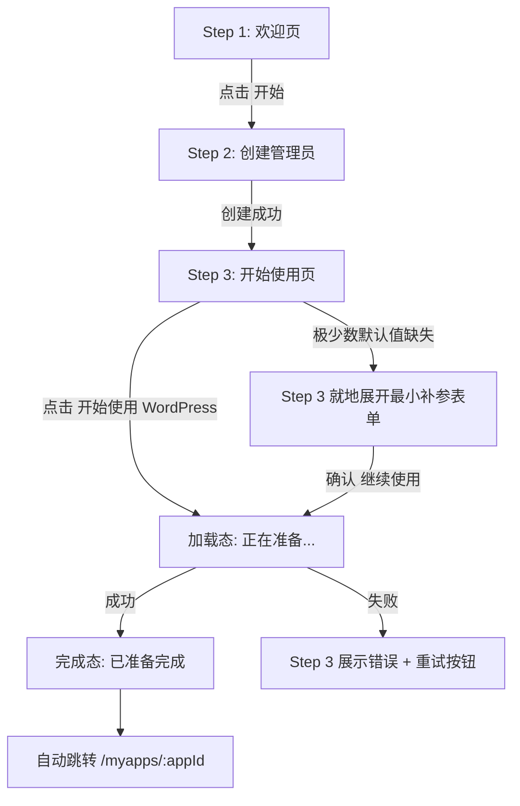

# 云市场初始化引导 - UI 设计稿

- 状态: Draft
- 日期: 2026-07-06
- 关联文档: [云市场镜像初始化引导设计](cloud-marketplace-initialization-wizard_cn.md)

## 设计目标

- 3 步完成初始化
- 每屏只做一件事
- 不出现"安装""端口""代理""容器"等技术词汇
- 优先使用默认值，不出错不问用户

---

## 整体布局

```
┌──────────────────────────────────────────┐
│                                          │
│            🏷️ Websoft9 for WordPress     │
│                                          │
│    ● 欢迎  ──  ● 创建管理员  ──  ○ 开始使用  │
│                                          │
│  ┌────────────────────────────────────┐  │
│  │                                    │  │
│  │         当前步骤内容区               │  │
│  │                                    │  │
│  │                                    │  │
│  └────────────────────────────────────┘  │
│                                          │
│           [ 上一步 ]    [ 下一步 ]        │
│                                          │
└──────────────────────────────────────────┘
```

- 顶部: 镜像品牌名称
- 中部: 步骤指示器 (3 个圆点 + 标签)
- 中央: 当前步骤内容
- 底部: 操作按钮

---

## Step 1 — 欢迎页

```
┌──────────────────────────────────────────────┐
│                                              │
│          🏷️  Websoft9 for WordPress          │
│                                              │
│    ● 欢迎    ○ 创建管理员    ○ 开始使用        │
│                                              │
│  ┌────────────────────────────────────────┐  │
│  │                                        │  │
│  │                                        │  │
│  │      🎯  您的 WordPress 已就绪          │  │
│  │                                        │  │
│  │   只需完成几个简单步骤，即可开始使用。     │  │
│  │                                        │  │
│  │   1. 创建管理员账号                     │  │
│  │   2. 启动 WordPress                    │  │
│  │   3. 进入管理页面                       │  │
│  │                                        │  │
│  │                                        │  │
│  └────────────────────────────────────────┘  │
│                                              │
│                   [ 开始 ]                    │
│                                              │
└──────────────────────────────────────────────┘
```

**文案要点:**
- 标题用"您的 WordPress 已就绪"，暗示镜像已包含一切
- 步骤预览只列 3 条，让用户有预期
- 按钮写"开始"，不写"开始安装"或"初始化"
- 不出现端口、镜像、容器等词汇

---

## Step 2 — 创建管理员

```
┌──────────────────────────────────────────────┐
│                                              │
│          🏷️  Websoft9 for WordPress          │
│                                              │
│    ○ 欢迎    ● 创建管理员    ○ 开始使用        │
│                                              │
│  ┌────────────────────────────────────────┐  │
│  │                                        │  │
│  │       创建管理员账号                     │  │
│  │                                        │  │
│  │   用户名 *                              │  │
│  │   ┌────────────────────────────────┐   │  │
│  │   │ admin                           │   │  │
│  │   └────────────────────────────────┘   │  │
│  │                                        │  │
│  │   邮箱 *                                │  │
│  │   ┌────────────────────────────────┐   │  │
│  │   │ admin@example.com               │   │  │
│  │   └────────────────────────────────┘   │  │
│  │                                        │  │
│  │   密码 *                                │  │
│  │   ┌────────────────────────────────┐   │  │
│  │   │ ********                        │   │  │
│  │   └────────────────────────────────┘   │  │
│  │   ⓘ 至少 8 位，包含大小写、数字、符号    │  │
│  │                                        │  │
│  │   确认密码 *                            │  │
│  │   ┌────────────────────────────────┐   │  │
│  │   │ ********                        │   │  │
│  │   └────────────────────────────────┘   │  │
│  │                                        │  │
│  └────────────────────────────────────────┘  │
│                                              │
│           [ 上一步 ]    [ 下一步 ]            │
│                                              │
└──────────────────────────────────────────────┘
```

**文案要点:**
- 标题只写"创建管理员账号"，不解释平台、鉴权、RBAC
- 只保留 4 个必填字段：用户名、邮箱、密码、确认密码
- 密码规则用简短提示，不放复杂说明
- 创建成功后直接进入下一步，不退出登录

---

## Step 3 — 开始使用

```
┌──────────────────────────────────────────────┐
│                                              │
│          🏷️  Websoft9 for WordPress          │
│                                              │
│    ○ 欢迎    ○ 创建管理员    ● 开始使用        │
│                                              │
│  ┌────────────────────────────────────────┐  │
│  │                                        │  │
│  │                                        │  │
│  │      🚀  一切就绪，开始使用 WordPress    │  │
│  │                                        │  │
│  │   点击下方按钮，系统将自动为您完成         │  │
│  │   最后的准备工作。                       │  │
│  │                                        │  │
│  │         ┌──────────────────┐           │  │
│  │         │ 开始使用 WordPress │           │  │
│  │         └──────────────────┘           │  │
│  │                                        │  │
│  │                                        │  │
│  └────────────────────────────────────────┘  │
│                                              │
│           [ 上一步 ]                          │
│                                              │
└──────────────────────────────────────────────┘
```

**文案要点:**
- 不说"安装"、"部署"
- 说"最后准备"、"自动完成"，暗示不需要用户再操作
- 按钮文案:"开始使用 WordPress"
- 正常情况无参数输入表单

**交互逻辑:**

用户点击「开始使用 WordPress」后，系统直接进入加载态，完成后台初始化。
因为云市场镜像是全新环境，不存在本地端口冲突，所以这一步不需要预检查，
也不需要让用户填参数。

> 例外：如果模板本身缺少必要默认值（极少数情况），才就地展开最小补参表单。
> 这种情况在云市场场景下几乎不会发生，因为 mcloud 构建的镜像已针对目标应用预置了完整默认值。

---

## 加载态 / 进度态

```
┌──────────────────────────────────────────────┐
│                                              │
│          🏷️  Websoft9 for WordPress          │
│                                              │
│    ○ 欢迎    ○ 创建管理员    ● 开始使用        │
│                                              │
│  ┌────────────────────────────────────────┐  │
│  │                                        │  │
│  │              正在准备中…                │  │
│  │                                        │  │
│  │      系统正在完成最后的后台准备工作。     │  │
│  │                                        │  │
│  │      这通常只需要 1 到 2 分钟。          │  │
│  │                                        │  │
│  │      请不要关闭当前页面。               │  │
│  │                                        │  │
│  │            [ 加载动画 / 进度条 ]         │  │
│  │                                        │  │
│  └────────────────────────────────────────┘  │
│                                              │
└──────────────────────────────────────────────┘
```

**文案要点:**
- 只强调“正在准备”，不暴露安装任务、容器编排等内部过程
- 提示用户不要刷新或关闭页面，但即使刷新，系统也应恢复到该进度态
- 不展示技术检查项，不出现端口、代理等词汇

**异常提示:**

- 若后台准备失败，在当前页下方展示简短错误摘要与“重试”按钮
- 若只是等待时间较长，可展示“仍在准备中，请稍候”而不是报错

---

## 完成态 (跳转前)

```
┌──────────────────────────────────────────────┐
│                                              │
│          🏷️  Websoft9 for WordPress          │
│                                              │
│    ○ 欢迎    ○ 创建管理员    ● 开始使用        │
│                                              │
│  ┌────────────────────────────────────────┐  │
│  │                                        │  │
│  │                                        │  │
│  │              ✓                         │  │
│  │                                        │  │
│  │      WordPress 已准备完成！              │  │
│  │                                        │  │
│  │     正在进入管理页面...                  │  │
│  │                                        │  │
│  │                                        │  │
│  └────────────────────────────────────────┘  │
│                                              │
└──────────────────────────────────────────────┘
```

之后自动跳转到 `/myapps/:appId`。

---

## 页面状态流转



- 正常路径下，Step 3 是单按钮启动，不出现预检查步骤
- 补参不增加步骤，仅在模板默认值缺失时才在当前页就地展开
- 安全组问题不在向导中处理，完成后由“我的应用”详情页提示用户检查云网络放通

---

## 文案规范

| 场景 | ✅ 推荐 | ❌ 避免 |
|---|---|---|
| 按钮 | 开始使用 WordPress | 安装 WordPress |
| 状态 | 正在准备 | 正在安装 |
| 结果 | 已准备完成 | 安装成功 |
| 异常 | 准备失败，请重试 | Host port conflict detected |
| 提示 | 请检查云安全组或防火墙是否已放通访问端口 | 请处理安全组入站规则 80/443/9000 |
| 步骤 | 创建管理员 | 平台账号初始化 |
| 步骤 | 开始使用 | 应用部署 |

---

## 技术约束

- 前端模块位置: `console/src/features/setup-wizard/`
- 路由: `/setup`
- 仅当 `WEBSOFT9_CLOUD_MARKETPLACE_MODE=true` 时启用
- 复用现有 `/api/auth/initialize`
- 复用现有 `/api/apps/install`
- 安装完成后跳转 `/myapps/:appId`
