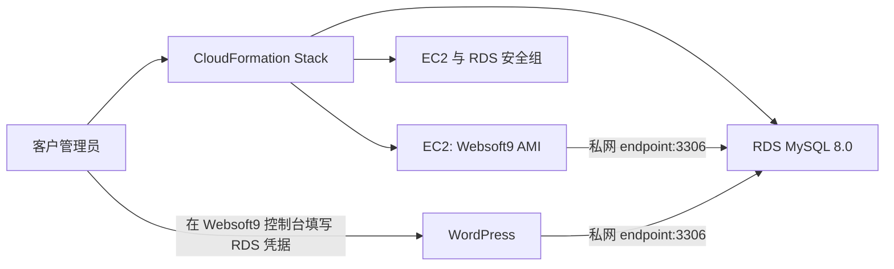

# AWS CloudFormation 部署 Websoft9、WordPress 与 RDS 方案

## 1. 目标与范围

本文描述在 AWS 中使用 CloudFormation 部署下列组合的推荐方案：

- 一台运行 Websoft9 的 EC2 实例；
- 一个私有 Amazon RDS for MySQL 实例；
- 必要的安全组；
- 客户在 Websoft9 控制台中安装的 WordPress 外接 RDS 应用。

目标是让客户通过创建一个 CloudFormation Stack 获得 Websoft9 与私有 RDS 基础设施，再在 Websoft9 控制台中使用 `external-db` profile 安装 WordPress。

首期范围：

- 支持 RDS MySQL 8.0；
- WordPress 通过 RDS endpoint 和标准用户名密码连接数据库；
- RDS 保持私网访问；
- CloudFormation 负责 AWS 基础设施，客户通过 Websoft9 负责 WordPress 安装与应用生命周期。

不在首期范围内：

- 自动迁移已有 WordPress 数据；
- 通过首启脚本自动安装 WordPress；
- RDS IAM Database Authentication；
- Websoft9 当前外接数据库之外的应用模板；
- 通过 CloudFormation 自动变更或删除外部数据库数据。

## 2. 方案选择

面向 AWS Marketplace 客户，使用 CloudFormation 作为交付入口：

- 客户在 AWS 控制台或 CI 中创建 Stack；
- 模板创建或引用 AWS 资源；
- 模板引用 Websoft9 Marketplace AMI；
- 客户登录 Websoft9 控制台，选择 WordPress 的“自定义”数据库 profile；
- 客户填写 RDS endpoint、端口、数据库名、用户名和密码后安装 WordPress。

AMI 是平台基座，CloudFormation 是方案编排层。二者互补，不互相替代。

可直接体验的“自带 VPC”模板见：[websoft9-wordpress-rds.yaml](templates/websoft9-wordpress-rds.yaml)。创建 Stack 前，请确认已订阅并可使用所选 Region 中的 Websoft9 Marketplace AMI。

使用模板时，依次执行：

1. 在 CloudFormation 控制台上传模板并填写已有 VPC、EC2 子网、两个 RDS 私有子网、Websoft9 AMI 与访问 CIDR；
2. 等待 Stack 完成，从 Outputs 复制 RDS endpoint 和端口；
3. 使用 RDS 管理员账号创建 `wordpress` 数据库及其专用低权限账号；
4. 登录 Websoft9，在 WordPress 的“自定义”数据库 profile 中填写 endpoint 和该专用账号。

不要将 RDS 管理员账号填写到 WordPress 中。

## 3. 推荐架构



推荐采用“自带网络（Bring Your Own VPC）”模式：

- 客户在参数中提供 VPC、EC2 子网和至少两个 RDS 私有子网；
- 模板创建 EC2、RDS 和数据库安全组；
- RDS 的 `PubliclyAccessible` 设为 `false`；
- RDS 安全组仅允许来自 Websoft9 EC2 安全组的 TCP `3306`；
- Websoft9 EC2 可以位于公有子网以承接用户访问，但访问 RDS 仍通过 VPC 私网地址进行。

Quick Start 模板可以额外提供新建 VPC 的能力，但应作为独立模板发布。它会引入 NAT Gateway、路由和更高的费用与权限需求，不宜作为企业默认方案。

## 4. CloudFormation 资源职责

| 资源 | 职责 | 关键配置 |
|---|---|---|
| `AWS::EC2::Instance` 或 Launch Template | 运行 Websoft9 AMI | EBS 加密、IMDSv2 |
| `AWS::RDS::DBInstance` | 托管 WordPress 数据库 | MySQL 8.0、私网、加密、备份、删除保护 |
| `AWS::RDS::DBSubnetGroup` | 放置 RDS | 至少两个可用区的私有子网 |
| `AWS::EC2::SecurityGroup` | 约束网络访问 | RDS 仅向 EC2 安全组开放 3306 |
| `AWS::Logs::*`（可选） | 保存 EC2 与平台日志 | CloudWatch Logs 或 CloudWatch Agent |

生产 RDS 应至少配置：

- Storage encryption；
- 自动备份和合理的保留期；
- Multi-AZ 是否启用由服务等级决定；
- `DeletionPolicy: Snapshot` 或 `Retain`；
- `DeletionProtection: true`，生产环境由显式流程解除；
- CloudWatch 监控和告警。

## 5. 网络与安全组

### 5.1 RDS 私网连接

Websoft9 与 RDS 应在同一个 VPC 或已建立受控路由的网络之间通信。WordPress 使用 RDS DNS endpoint，例如：

```text
wordpress-prod.abc123.ap-southeast-1.rds.amazonaws.com:3306
```

不得使用 RDS 解析出的 IP 地址。RDS 故障转移时底层 IP 可能变化，endpoint 会保持可用。

### 5.2 安全组规则

| 目标 | 入站来源 | 端口 | 用途 |
|---|---|---:|---|
| Websoft9 EC2 | 客户管理网段或负载均衡器 | 80 / 443 / 9000 | 网站访问与管理控制台 |
| RDS | Websoft9 EC2 安全组 | 3306 | WordPress 与安装前连接测试 |

RDS 安全组禁止将 `3306` 开放给 `0.0.0.0/0`。即使 RDS 设置为公开可访问，也不应将其作为本方案的常规部署方式。

## 6. 数据库凭据与初始化

CloudFormation 首期只负责创建 RDS 实例。RDS 管理员用户名和密码由客户在创建 Stack 时填写；密码参数应使用 `NoEcho: true`，并且不得写入 Stack Output、EC2 User Data、Tag 或日志。

Websoft9 的 `external-db` 安装流程只验证连接并安装 WordPress，不创建数据库、账号或权限。因此在 WordPress 安装前，客户需要通过 RDS Query Editor、数据库客户端或既有运维流程完成：

1. 创建 `wordpress` 数据库；
2. 创建 `wordpress_user`；
3. 仅向该数据库授予 WordPress 所需权限；
4. 妥善保存应用账号密码，并在 Websoft9 安装表单中填写。

RDS 管理员密码与 WordPress 应用账号应区分。WordPress 应使用仅授权目标数据库的专用账号。

## 7. 在 Websoft9 中安装 WordPress

1. 等待 RDS 状态变为 `available`；
2. 登录 Websoft9 控制台；
3. 在应用商店选择 WordPress，进入安装；
4. 在“应用数据库”中选择“自定义”；
5. 填写 RDS endpoint、`3306`、数据库名、WordPress 专用账号与密码；
6. 使用“测试连接”验证私网连通性和数据库凭据；
7. 完成安装。

Websoft9 将连接参数保存为 WordPress 的运行配置。修改 RDS 密码后，客户必须同步更新该应用的配置并重部署，否则 WordPress 会因继续使用旧密码而连接失败。

## 8. WordPress 外接数据库参数映射

Websoft9 当前 WordPress `external-db` profile 使用以下标准连接信息：

| Websoft9 设置 | AWS RDS 值 |
|---|---|
| `W9_DB_HOST_SET` | RDS endpoint |
| `W9_DB_PORT_SET` | `3306` |
| `W9_DB_NAME_SET` | 预创建的 WordPress 数据库名 |
| `W9_DB_USER_SET` | WordPress 专用 RDS 用户 |
| `W9_DB_PASSWORD_SET` | 客户填写的 WordPress 专用用户密码 |

安装前，Websoft9 使用这些字段连接数据库并执行只读连接验证；成功后 WordPress 使用同一连接参数运行。Websoft9 不管理 RDS 生命周期，也不删除外部数据库或账号。

RDS MySQL 8.0 与当前 WordPress 兼容性声明相匹配。Aurora MySQL 应作为独立兼容性与运维验证范围处理后再纳入商品承诺。

## 9. TLS 与 IAM Database Authentication

### 9.1 TLS

RDS 支持 TLS，是否强制由客户的 RDS Parameter Group 和安全策略决定。若客户启用 MySQL `require_secure_transport=ON`，应用端必须同时具备 TLS 参数与 AWS RDS CA 证书。

当前外接数据库 profile 仅包含主机、端口、数据库名、用户名和密码。它尚未定义 TLS 模式、CA 证书分发或 WordPress 运行时 TLS 参数。因此首期 CloudFormation 方案应：

- 明确声明使用 RDS 密码认证；
- 不将“强制 TLS”列为已支持能力；
- 在产品实现支持 SSL mode、CA 文件注入以及安装前/运行时一致校验后，再提供 TLS 强制部署选项。

### 9.2 IAM Database Authentication

IAM Database Authentication 使用短时 token，不是永久数据库密码。WordPress 当前将固定连接凭据用于运行时连接，不能自动刷新 IAM token。因此首期不建议为 WordPress 启用 IAM Database Authentication。

高合规场景可后续评估 RDS Proxy、Secrets Manager 密码轮换与应用侧连接凭据刷新；这些不是当前外接数据库 profile 的能力。

## 10. 权限模型

CloudFormation 部署者不应被要求使用 `AdministratorAccess`，但需具备创建模板所列资源的权限。首期最小权限应覆盖指定 VPC 范围内的 EC2、RDS、Security Group、CloudFormation 以及可选 CloudWatch Logs 操作。

企业客户通常要求自带 VPC、子网、KMS Key、日志桶或安全组。模板应支持这些参数，而不试图创建或接管客户全部网络资源。

## 11. 失败、回滚与删除

| 场景 | 建议行为 |
|---|---|
| RDS 未就绪或网络不可达 | 客户等待 RDS 就绪并检查安全组、路由与 DNS；不尝试更改 RDS 数据 |
| 数据库连接验证失败 | Websoft9 不安装 WordPress；客户修正 endpoint、网络或凭据后再次测试 |
| WordPress 安装失败 | 查看 Websoft9 安装状态和无敏感信息的日志；不删除 RDS 数据 |
| Stack 创建失败 | 非生产测试可回滚临时资源；生产 RDS 应按 Snapshot/Retain 策略保留 |
| 删除 Stack | 默认保留或创建 RDS 快照；不得由 Websoft9 删除 RDS 数据库或账号 |
| 更新 Stack | 避免默认替换 EC2 或 RDS；AMI、应用版本、数据库变更须显式版本化与维护窗口 |

CloudFormation 删除 RDS 与 Websoft9 卸载 WordPress 是两条独立生命周期。产品文档必须明确：Websoft9 的外部数据库卸载不会删除 RDS、数据库、账号或数据。

## 12. 可观测性与验收

应提供以下可观测信息：

- CloudFormation Stack Events；
- Websoft9 容器与 AppHub 日志；
- WordPress 安装跟踪 ID；
- RDS CloudWatch 指标、错误日志和备份状态；
- 不包含密码的部署结果与故障原因。

建议验收标准：

1. RDS 没有公网入站规则，且 `PubliclyAccessible=false`；
2. 只有 Websoft9 EC2 安全组可访问 RDS `3306`；
3. WordPress 通过 RDS endpoint 成功安装和访问；
4. 数据库密码未出现在 Stack Output、User Data 或日志；
5. 删除或卸载 WordPress 不会删除 RDS 数据；
6. RDS 故障转移后，WordPress 仍通过 endpoint 恢复连接。

## 13. 实施阶段

### 阶段一：验证模板

- 自带 VPC/子网参数；
- 单可用区 RDS MySQL 8.0；
- Websoft9 AMI；
- 外接数据库安装验证；
- 手工数据库初始化；
- 不启用 TLS 强制与 IAM Database Authentication。

### 阶段二：可交付方案

- CloudWatch 日志、告警与部署状态输出；
- RDS 备份、快照保留和删除保护；
- 最小 IAM 权限文档；
- WordPress + RDS 安装操作说明。

### 阶段三：企业能力

- Multi-AZ、KMS、私有访问、客户自带安全组/KMS；
- RDS TLS 端到端支持；
- 密码轮换与 RDS Proxy；
- Secrets Manager 与受控首启自动安装器；
- AWS Marketplace 商品参数、升级和支持流程。

## 14. 结论

CloudFormation 可以将 Websoft9 AMI、RDS 和网络编排为可重复部署的 AWS 基础设施。首期最可靠的基线是：私网 RDS MySQL 8.0、安全组到安全组放行、WordPress 专用低权限数据库账号，以及客户在 Websoft9 控制台中完成外接数据库安装。

在当前 Websoft9 外接数据库实现中，标准密码认证可直接适配 RDS。TLS 强制、IAM Database Authentication、Secrets Manager 与首启自动安装应在补齐运行时凭据与连接配置支持后，作为后续增强能力交付。
