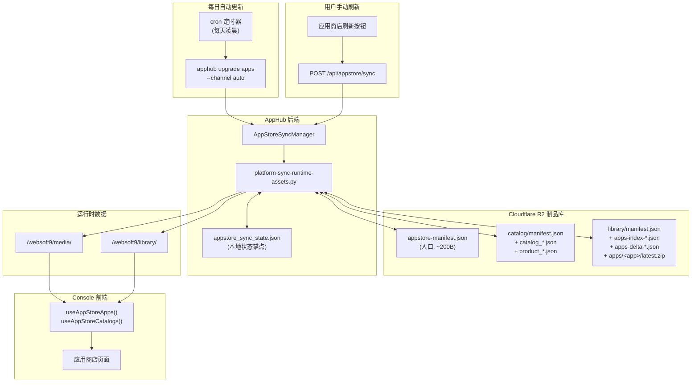
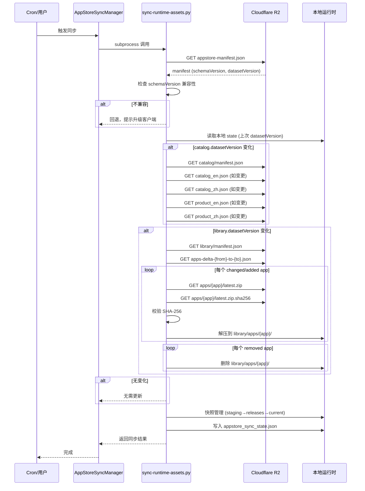

# App Store 刷新功能升级设计文档

> 状态：待确认  
> 日期：2026-06-10  
> 关联规范：[appstore-release-spec.md](https://github.com/Websoft9/docker-library/blob/dev/docs/appstore-release-spec.md)

---

## 1. 背景与目标

### 1.1 现状

当前 Console 项目中的应用商店采用**全量下载 + 覆盖安装**的更新机制：

| 维度 | 当前机制 |
|------|---------|
| **自动更新** | 每天定时触发，从 `artifact.websoft9.com/{channel}/websoft9/plugin/` 下载完整 `media-latest.zip` + `library-latest.zip`，解压覆盖到 `/websoft9/media` 和 `/websoft9/library` |
| **手动刷新** | 应用商店页面右上角刷新按钮 → 调用 `POST /api/appstore/sync` → 触发同样的全量同步脚本 → 前端 refetch 数据 |
| **版本判断** | 对比本地 `version.json` 与远程 `version.json` 的 `PLUGINS.LIBRARY` 版本号 |
| **数据消费** | Console 前端优先读取 `/media/json/product_{locale}.json` 静态文件，fallback 到 `/api/apps/available/{locale}` API |

**痛点：**
- 全量下载浪费带宽和时间（每次数百 MB）
- 无法感知单应用的增量变更
- 版本号对比粗糙，无内容校验
- 旧制品路径与新版 v2 制品体系不一致

### 1.2 目标

1. **保留每日自动更新**，但切换到 docker-library 的新 v2 增量更新机制
2. **支持用户手动刷新**，从 R2 制品库拉取最新 manifest 对比，按需增量同步
3. **向前兼容**：确保旧版数据消费路径在过渡期仍能正常工作

---

## 2. 新制品体系概览（docker-library v2）

### 2.1 发布流程

```
push to dev/main → CI (appstore-publish.yml)
  → 1. 从 Contentful 拉取 catalog 源数据
  → 2. 运行 library_publish.py 构建 v2 + legacy 双轨制品
  → 3. 上传到 Cloudflare R2
  → 4. 清除 CDN 缓存
```

**关键脚本：**
- `.github/workflows/appstore-publish.yml` — CI 流水线
- `build/library_publish.py` — 核心构建脚本（~500 行）
- `build/fetch_catalog.py` — 从 Contentful 拉取 catalog 数据

### 2.2 R2 目录结构

```
artifact/appstore/<channel>/           ← v2 新路径
├── catalog/
│   ├── manifest.json                  ← catalog 清单
│   ├── catalog_en.json / catalog_zh.json
│   ├── product_en.json / product_zh.json
│   ├── full/catalog-<dsv>.zip         ← 全量包（兜底）
│   └── *.sha256                       ← SHA-256 校验
├── library/
│   ├── manifest.json                  ← library 清单
│   ├── apps-index-<dsv>.json          ← 全量 app 索引
│   ├── apps-delta-<from>-to-<to>.json ← 增量变更描述
│   ├── full/
│   │   ├── library-<dsv>.zip          ← 版本化全量包（immutable）
│   │   └── library-<channel>.zip      ← 通道最新全量包
│   ├── apps/<app>/latest.zip          ← 单 app 制品
│   └── *.sha256
└── manifests/
    └── appstore-manifest.json         ← 根 manifest（入口文件）
```

### 2.3 版本语义

| 版本 | 含义 | 触发条件 |
|------|------|---------|
| `schemaVersion` | 数据契约版本 | 删字段、改类型、改布局 |
| `datasetVersion` | 数据快照版本 | **任何**内容变更（SHA-256 前 16 位 hex） |
| `channel` | 稳定性通道 | `dev` / `rc` / `release` |

**关键设计：99% 的日常变更只触发 `datasetVersion` 递增，不触发 `schemaVersion` 升级。**

### 2.4 增量更新粒度

| 数据集 | 粒度 | 变更类型 |
|--------|------|---------|
| **catalog** | 全量文件 | 任一 JSON 变化 → 新快照 |
| **library** | app 级 | `addedApps` / `changedApps` / `removedApps` |

### 2.5 消费者更新策略（来自规范 §11）

**首次安装（冷启动）：**
1. 下载 `appstore-manifest.json`
2. 检查 `schemaVersion` 兼容性
3. 下载 catalog 全量包 + library 全量包
4. 保存 manifest 作为本地状态锚点

**增量更新：**
1. 下载最新 `appstore-manifest.json`
2. 对比 `catalog.datasetVersion` 和 `library.datasetVersion`
3. 按需下载变更部分（catalog 单文件 或 library delta app zips）
4. 更新成功后替换本地缓存 manifest

**典型场景开销：**

| 场景 | HTTP 请求数 |
|------|-----------|
| 无变化 | 1（appstore-manifest.json，~200B） |
| 仅 catalog 变 1 文件 | 3 |
| 仅 library 变 2 个 app | 4（根 manifest + library manifest + delta + 2 个 zip） |

---

## 3. 现有代码分析

### 3.1 后端同步链路

```
Console 前端
  ↓ POST /api/appstore/sync
apphub/src/api/v1/routers/appstore_sync.py
  ↓ AppStoreSyncManager().sync()
apphub/src/services/appstore_sync_manager.py
  ↓ subprocess 调用
docker/scripts/platform-sync-runtime-assets.py  ← 核心同步脚本（~900 行）
  ↓ 下载 + 解压 + 校验 + 快照管理
/websoft9/media/   ← 静态资产运行时目录
/websoft9/library/
```

### 3.2 platform-sync-runtime-assets.py 现状

该脚本**已经具备 v2 支持基础**，关键函数：

| 函数 | 功能 |
|------|------|
| `fetch_appstore_manifests()` | 从 R2 拉取三层 manifest（appstore/catalog/library） |
| `determine_package_sync_plan()` | 对比 datasetVersion 决定 media/library 是否需要同步 |
| `resolve_library_delta_context()` | 解析 library delta，提取 changedApps/addedApps/removedApps |
| `resolve_library_apps_index()` | 解析 app 级制品索引 |
| `sync_library_package_delta()` | **增量同步核心**：复用已有快照 + 下载变更 app zip |
| `sync_library_app_artifacts_delta()` | 单 app 级别增量：下载 latest.zip → 校验 → 解压 |
| `hydrate_app_sidecar()` | 下载 app 关联文件（如 .env、variables.json） |
| `stage_snapshot()` | 快照管理：staging → releases → current |

**当前 manifest URL 路径：**
```python
# 脚本中使用的路径（第 196 行附近）
appstore_manifest_url = f"{artifact_base}/websoft9/v2/{channel}/appstore/manifests/appstore.json"
```

### 3.3 Console 前端现状

**数据流：**
```
useAppStoreApps() hook (react-query)
  ↓ staleTime: 60s
  ↓ 优先: fetch(/media/json/product_{locale}.json)  ← 静态文件
  ↓ fallback: fetch(/api/apps/available/{locale})     ← API
  ↓ mergeInstallMetadata(/media/json/app-store-install-metadata.json)
useAppStoreCatalogs() hook
  ↓ 优先: fetch(/media/json/catalog_{locale}.json)    ← 静态文件
  ↓ fallback: fetch(/api/apps/catalog/{locale})        ← API
```

**刷新按钮（app-store-page.tsx 第 1566-1600 行）：**
```typescript
async function handleRefreshStore() {
    setIsRefreshingStore(true)
    // 1. 触发后端同步
    const syncResult = await requestJson<AppStoreSyncResponse>('/api/appstore/sync', { method: 'POST' })
    // 2. 并行 refetch 前端数据
    const [appsResult, catalogsResult, favoritesResult] = await Promise.all([
        refetch(),          // useAppStoreApps
        refetchCatalogs(),  // useAppStoreCatalogs
        refetchFavorites(),
        new Promise(resolve => setTimeout(resolve, 450)), // 最小延迟确保后端完成
    ])
    setIsRefreshingStore(false)
}
```

### 3.4 定时自动更新现状

- **cron 守护进程**：容器中运行 `cron -f`（supervisord 管理）
- **容器启动时**：Dockerfile 中 `RUN python3 /websoft9/script/platform-sync-runtime-assets.py` 进行首次同步（`WEBSOFT9_RUNTIME_ASSET_SYNC_MODE=build`）
- **CLI 升级**：`apphub upgrade apps` → `AppStoreSyncManager().sync(trigger='cli')`
- **每日定时**：需要确认 cron 配置，当前代码中未见显式的 crontab 文件，可能是通过外部 crontab 调用 `apphub upgrade apps` 命令

---

## 4. 差距分析

### 4.1 Manifest URL 路径对齐

| 项目 | 当前代码 | 新规范 | 需要变更？ |
|------|---------|--------|-----------|
| 根 manifest URL | `{base}/websoft9/v2/{channel}/appstore/manifests/appstore.json` | `{base}/appstore/{channel}/manifests/appstore-manifest.json` | **是** |
| catalog manifest 字段 | 代码中查找 `domains.catalog` | 规范中根 manifest 使用 `catalog.manifest` | **需要核实** |
| library manifest 字段 | 代码中查找 `domains.library` | 规范中根 manifest 使用 `library.manifest` | **需要核实** |
| app 包路径 | 代码中使用 `appsIndex` + 单 app 下载 | 规范中 `apps/{app}/latest.zip` | **基本对齐** |

### 4.2 Manifest 结构差异

**当前代码期望的结构（推测）：**
```json
{
  "domains": {
    "catalog": "catalog/manifest.json",
    "library": "library/manifest.json"
  }
}
```

**新规范结构（appstore-manifest.json）：**
```json
{
  "schemaVersion": "1",
  "datasetVersion": "2dccc0f5e5f0d21f",
  "channel": "release",
  "catalog": {
    "manifest": "catalog/manifest.json",
    "datasetVersion": "7ee7a10b7da49f38"
  },
  "library": {
    "manifest": "library/manifest.json",
    "datasetVersion": "85f687824c03ef93"
  },
  "generatedAt": "2026-06-09T12:00:00Z"
}
```

**差异：** 字段名从 `domains` 变为 `catalog` / `library`，并增加了 `datasetVersion` 直接暴露在根 manifest 中。

### 4.3 现有功能已具备的部分

以下功能当前代码**已经支持**，无需大改：

- ✅ `POST /api/appstore/sync` API 端点
- ✅ `AppStoreSyncManager` 同步管理器
- ✅ 快照管理（staging → releases → current）
- ✅ SHA-256 校验
- ✅ 增量同步基础框架（`sync_library_package_delta`）
- ✅ 前端刷新按钮 UI 和交互
- ✅ react-query 数据 refetch

### 4.4 需要新增/修改的部分

| 变更项 | 类型 | 优先级 |
|--------|------|--------|
| 对齐 manifest URL 路径到新规范 | 修改 | P0 |
| 修复 manifest 结构解析（`domains` → `catalog`/`library`） | 修改 | P0 |
| 增加 `schemaVersion` 兼容性检查 | 新增 | P1 |
| 增加 catalog 增量更新支持（当前只有 library 增量） | 新增 | P1 |
| 增加每日定时自动更新 cron 配置 | 新增/确认 | P0 |
| 前端刷新按钮增加状态提示（显示上次更新时间） | 增强 | P2 |
| Legacy 路径兼容过渡（旧 `plugin/library/` 路径） | 保留 | P1 |
| 同步状态持久化到 `appstore_sync_state.json` | 已有，需验证 | P1 |

---

## 5. 设计方案

### 5.1 总体架构



### 5.2 增量更新流程



### 5.3 关键设计决策

#### 决策 1：Manifest URL 路径对齐

**当前路径：**
```
{artifact_base}/websoft9/v2/{channel}/appstore/manifests/appstore.json
```

**新路径（按规范）：**
```
{artifact_base}/appstore/{channel}/manifests/appstore-manifest.json
```

**方案：** 修改 `platform-sync-runtime-assets.py` 中的 URL 构建逻辑。同时保留对旧路径的 fallback 探测，确保过渡期平滑。

#### 决策 2：Catalog 增量支持

当前脚本对 catalog 已有增量判断（`determine_package_sync_plan` 中的 `plan["media"]` 分支），但实际下载仍可能走全量路径。需要：

1. 从 catalog manifest 中解析 `files` 字段，逐文件对比 checksum
2. 仅下载变更的 JSON 文件
3. 保留全量包作为灾备回退

#### 决策 3：每日自动更新 cron 实现

容器中 cron 守护进程已在运行。需要添加 crontab 配置：

```cron
# 每天凌晨 3:00 自动同步应用商店
0 3 * * * /usr/local/bin/apphub upgrade apps --channel release >> /var/log/websoft9/appstore-sync.log 2>&1
```

**或**更轻量的方式：在 `platform-sync-runtime-assets.py` 中增加 `--mode cron` 模式，每天定时执行轻量 manifest 比较。

#### 决策 4：前端刷新体验增强

当前刷新按钮已工作，建议增强：
- 显示**上次同步时间**（从 `appstore_sync_state.json` 的 `lastSyncedAt` 读取）
- 同步完成后显示**变更摘要**（如"更新了 3 个应用"）
- 刷新过程中**禁用**分类筛选和搜索，防止数据不一致

---

## 6. 实施计划

### Phase 1：核心路径对齐（P0）

| # | 任务 | 文件 | 说明 |
|---|------|------|------|
| 1.1 | 更新 manifest URL 路径 | `docker/scripts/platform-sync-runtime-assets.py` | 将 `websoft9/v2/{channel}/appstore/manifests/appstore.json` 改为 `appstore/{channel}/manifests/appstore-manifest.json` |
| 1.2 | 修复 manifest 结构解析 | 同上 | 将 `domains.catalog`/`domains.library` 改为 `catalog.manifest`/`library.manifest`；直接从根 manifest 读取 `catalog.datasetVersion` / `library.datasetVersion` |
| 1.3 | 增加 schemaVersion 兼容性检查 | 同上 | 检查 `schemaVersion` 是否在支持的列表中，不兼容时中止并提示 |
| 1.4 | 验证增量同步正确性 | 同上 | 端到端测试：首次全量 → 增量更新 → 无变化跳过 |

### Phase 2：自动更新完善（P0）

| # | 任务 | 文件 | 说明 |
|---|------|------|------|
| 2.1 | 添加 crontab 配置 | `docker/` 新增 crontab 文件 | 每天定时触发增量同步 |
| 2.2 | 确保 cron 模式静默运行 | `platform-sync-runtime-assets.py` | 无变化时不产生噪音日志 |
| 2.3 | 增加同步状态 API | `apphub/src/api/v1/routers/appstore_sync.py` | `GET /appstore/state` 返回上次同步时间和状态 |

### Phase 3：前端体验增强（P2）

| # | 任务 | 文件 | 说明 |
|---|------|------|------|
| 3.1 | 显示上次同步时间 | `app-store-page.tsx` | 在刷新按钮旁显示 |
| 3.2 | 同步结果反馈 | `app-store-page.tsx` | Toast 提示变更数量 |
| 3.3 | 刷新中禁用交互 | `app-store-page.tsx` | 已有基本实现，增强覆盖范围 |

### Phase 4：验证与清理（P1）

| # | 任务 | 说明 |
|---|------|------|
| 4.1 | 端到端集成测试 | 覆盖：冷启动首装、增量更新、手动刷新、schemaVersion 不兼容 |
| 4.2 | Legacy 路径兼容确认 | 确保旧 `plugin/library/` 路径在过渡期仍可工作 |
| 4.3 | 性能基准 | 对比全量同步 vs 增量同步的时间和带宽 |

---

## 7. 风险与缓解

| 风险 | 概率 | 影响 | 缓解措施 |
|------|------|------|---------|
| 新 manifest URL 尚未就绪 | 中 | 高 | 保留旧路径 fallback；先验证 R2 上 dev channel 已有数据 |
| manifest 结构字段不匹配 | 中 | 高 | 在 dev channel 上先行测试；增加健壮的字段缺失处理 |
| 增量 delta 计算错误导致数据不一致 | 低 | 高 | 保留全量包兜底；SHA-256 校验作为门禁 |
| schemaVersion 升级时旧客户端不兼容 | 低 | 中 | 规范承诺同 schemaVersion 内兼容；提前公告升级窗口 |
| cron 环境变量未正确传递 | 低 | 中 | 在 crontab 中显式设置必要的环境变量 |

---

## 8. 待确认事项

1. **R2 上新 v2 路径是否已就绪？** 需要在 dev channel 上验证 `appstore/dev/manifests/appstore-manifest.json` 是否可访问
2. **当前 cron 配置在哪里？** 代码中未见显式的 crontab 文件，需要确认当前每日更新是如何触发的
3. **前端数据消费路径是否需要调整？** 当前从 `/media/json/` 读取静态文件，增量更新后文件路径保持不变，应无需调整
4. **是否需要同步更新 apphub 的 `get_available_apps` API？** 当前 API 从 `/websoft9/library/` 读取数据，增量更新后数据自动就位

---

## 9. 附录

### A. 关键文件索引

| 文件 | 作用 |
|------|------|
| `docker/scripts/platform-sync-runtime-assets.py` | 核心同步脚本（~900 行） |
| `apphub/src/services/appstore_sync_manager.py` | 同步管理器 |
| `apphub/src/api/v1/routers/appstore_sync.py` | 同步 API 路由 |
| `apphub/src/cli/apphub_cli.py` | CLI 命令（`upgrade apps`） |
| `console/src/features/app-store/app-store-page.tsx` | 应用商店页面 |
| `console/src/features/app-store/use-app-store-apps.ts` | 数据获取 hook |
| `console/src/features/app-store/use-app-store-catalogs.ts` | 分类数据 hook |
| `console/src/features/app-store/app-store-model.ts` | 数据模型 |
| `docker/Dockerfile` | 容器构建（含首次同步） |

### B. 新规范三层 Manifest 结构速查

```
appstore-manifest.json          → 根入口
  ├── catalog.datasetVersion    → 判断 catalog 是否变化
  ├── catalog.manifest          → catalog/manifest.json
  ├── library.datasetVersion    → 判断 library 是否变化
  └── library.manifest          → library/manifest.json

catalog/manifest.json           → catalog 清单
  ├── datasetVersion
  ├── fullPackage               → full/catalog-<dsv>.zip
  └── files: { catalogEn, catalogZh, productEn, productZh }

library/manifest.json           → library 清单
  ├── datasetVersion
  ├── fullPackage: { versioned, latest }
  ├── appsIndex                 → apps-index-<dsv>.json
  ├── appsDelta                 → apps-delta-<from>-to-<to>.json
  ├── supportsPartialUpdate: true
  └── appPackagesBase: "apps/"
```
