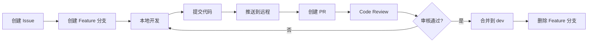

# DevOps 流程规范

**Websoft9 项目 - Git 工作流 & Docker 部署流程**

**创建日期**: 2026-01-04  
**维护者**: Winston (Architect Agent)  
**版本**: 1.0  
**状态**: Active

---

## 目录

1. [Git 工作流](#1-git-工作流)
2. [分支策略](#2-分支策略)
3. [代码审查流程](#3-代码审查流程)
4. [Docker 部署](#4-docker-部署)
5. [CI/CD 配置](#5-cicd-配置)
6. [版本发布](#6-版本发布)
7. [环境管理](#7-环境管理)
8. [故障排查](#8-故障排查)

---

## 1. Git 工作流

### 1.1 开发流程



### 1.2 工作流步骤

```bash
# 1. 从最新的 dev 分支创建 feature 分支
git checkout dev
git pull origin dev
git checkout -b feature/add-app-backup

# 2. 开发功能
# 编辑代码...

# 3. 提交更改
git add .
git commit -m "feat(apps): add application backup functionality

- Implement backup API endpoint
- Add backup service layer
- Create backup tests

Closes #123"

# 4. 推送到远程
git push origin feature/add-app-backup

# 5. 在 GitHub 创建 Pull Request
# 标题: feat(apps): add application backup functionality
# 描述: 参考 PR 模板填写

# 6. Code Review 后合并
# 合并方式: Squash and merge (推荐)

# 7. 删除本地和远程分支
git checkout dev
git pull origin dev
git branch -d feature/add-app-backup
git push origin --delete feature/add-app-backup
```

---

## 2. 分支策略

### 2.1 分支模型

Websoft9 采用 **GitHub Flow** 简化模型:

```
main (生产环境)
 ↑
 └── dev (开发环境)
      ↑
      ├── feature/xxx (功能开发)
      ├── bugfix/xxx (Bug 修复)
      ├── hotfix/xxx (紧急修复)
      └── release/vX.Y.Z (发布准备)
```

### 2.2 分支说明

| 分支类型 | 命名规范 | 生命周期 | 用途 |
|---------|---------|---------|------|
| **main** | `main` | 永久 | 生产环境代码,只接受来自 `release/*` 的合并 |
| **dev** | `dev` | 永久 | 开发环境代码,所有功能首先合并到此 |
| **feature** | `feature/<issue-id>-<desc>` | 临时 | 新功能开发 |
| **bugfix** | `bugfix/<issue-id>-<desc>` | 临时 | Bug 修复 |
| **hotfix** | `hotfix/<issue-id>-<desc>` | 临时 | 生产环境紧急修复 |
| **release** | `release/v<major>.<minor>.<patch>` | 临时 | 发布准备 |

### 2.3 分支创建示例

```bash
# Feature 分支 (从 dev 创建)
git checkout dev
git pull origin dev
git checkout -b feature/123-app-backup

# Bugfix 分支 (从 dev 创建)
git checkout -b bugfix/456-fix-port-conflict

# Hotfix 分支 (从 main 创建)
git checkout main
git pull origin main
git checkout -b hotfix/789-critical-security-fix

# Release 分支 (从 dev 创建)
git checkout dev
git pull origin dev
git checkout -b release/v2.1.0
```

---

## 3. 代码审查流程

### 3.1 Commit Message 规范

遵循 [Conventional Commits](https://www.conventionalcommits.org/):

```
<type>(<scope>): <subject>

<body>

<footer>
```

**Type (类型)**:
- `feat`: 新功能
- `fix`: Bug 修复
- `docs`: 文档更新
- `style`: 代码格式 (不影响功能)
- `refactor`: 代码重构
- `perf`: 性能优化
- `test`: 测试相关
- `chore`: 构建/工具链更新
- `ci`: CI/CD 配置
- `revert`: 回滚提交

**Scope (范围)**:
- `apps`: 应用管理
- `proxy`: 反向代理
- `settings`: 系统设置
- `docker`: Docker 集成
- `api`: API 相关
- `db`: 数据库
- `tests`: 测试

**示例**:

```bash
# 功能开发
git commit -m "feat(apps): add application backup endpoint

Implement POST /api/v1/apps/{id}/backup endpoint that creates
a backup of application data and configuration.

Closes #123"

# Bug 修复
git commit -m "fix(proxy): resolve CORS issue for Portainer access

Update Nginx configuration to properly set Origin headers
for Portainer container access.

Fixes #456"

# 文档更新
git commit -m "docs: update API documentation for backup endpoint"

# 性能优化
git commit -m "perf(apps): optimize container listing query

Use asyncio.gather for concurrent container status checks,
reducing response time by 50%.

Related #789"
```

### 3.2 Pull Request 模板

```markdown
## 📝 Description

简要描述此 PR 的变更内容

## 🎯 Type of Change

- [ ] 🚀 New feature (feat)
- [ ] 🐛 Bug fix (fix)
- [ ] 📚 Documentation update (docs)
- [ ] ♻️ Code refactoring (refactor)
- [ ] ⚡ Performance improvement (perf)
- [ ] ✅ Test addition/update (test)

## 🔗 Related Issues

Closes #123
Relates to #456

## 🧪 Testing

- [ ] Unit tests added/updated
- [ ] Integration tests passed
- [ ] Manual testing completed
- [ ] Test coverage ≥ 80%

## ✅ Checklist

- [ ] Code follows [coding standards](../standards/coding-standards.md)
- [ ] API follows [API design standards](../standards/api-design.md)
- [ ] All tests pass (`pytest`)
- [ ] Type checking passes (`mypy src/`)
- [ ] Code formatted (`black src/`)
- [ ] No new warnings
- [ ] Documentation updated (if needed)
- [ ] CHANGELOG.md updated (for user-facing changes)

## 📸 Screenshots (if applicable)

Add screenshots here...

## 🔍 Additional Notes

Any additional information...
```

### 3.3 Code Review 检查清单

**审查者需要检查**:

**代码质量**:
- [ ] 代码符合 [Coding Standards](./coding-standards.md)
- [ ] 函数/类命名清晰,职责单一
- [ ] 复杂逻辑有注释说明
- [ ] 没有硬编码魔法数字/字符串
- [ ] 类型注解完整

**API 设计**:
- [ ] API 设计符合 [API Design Standards](./api-design.md)
- [ ] URL 命名规范 (复数名词)
- [ ] HTTP 方法使用正确
- [ ] 错误处理完整
- [ ] API 文档更新

**测试**:
- [ ] 新功能有对应的测试
- [ ] 测试覆盖率 ≥ 80%
- [ ] 关键路径有集成测试
- [ ] 测试命名清晰

**安全**:
- [ ] 输入经过验证
- [ ] 没有 SQL 注入风险
- [ ] 没有硬编码密钥
- [ ] 敏感数据已加密

**性能**:
- [ ] 没有 N+1 查询
- [ ] I/O 操作使用 async
- [ ] 合理使用缓存
- [ ] 避免阻塞事件循环

---

## 4. Docker 部署

### 4.1 本地开发环境

```bash
# 启动所有服务
cd docker
docker-compose up -d

# 查看日志
docker-compose logs -f apphub

# 停止服务
docker-compose down

# 重建某个服务
docker-compose up -d --build apphub

# 进入容器
docker-compose exec apphub bash
```

### 4.2 Dockerfile 最佳实践

```dockerfile
# apphub/Dockerfile

# 使用指定版本的基础镜像
FROM python:3.11-slim

# 设置工作目录
WORKDIR /app

# 安装系统依赖
RUN apt-get update && apt-get install -y \
    gcc \
    && rm -rf /var/lib/apt/lists/*

# 复制依赖文件
COPY requirements.txt .

# 安装 Python 依赖 (分层缓存优化)
RUN pip install --no-cache-dir -r requirements.txt

# 复制应用代码
COPY src/ ./src/

# 创建非 root 用户
RUN useradd -m -u 1000 appuser && \
    chown -R appuser:appuser /app
USER appuser

# 暴露端口
EXPOSE 8080

# 健康检查
HEALTHCHECK --interval=30s --timeout=3s --start-period=5s --retries=3 \
    CMD python -c "import requests; requests.get('http://localhost:8080/api/health')"

# 启动命令
CMD ["uvicorn", "src.main:app", "--host", "0.0.0.0", "--port", "8080"]
```

### 4.3 docker-compose.yml 规范

```yaml
# docker/docker-compose.yml

version: '3.8'

services:
  apphub:
    build:
      context: ../apphub
      dockerfile: Dockerfile
    container_name: websoft9-apphub
    restart: unless-stopped
    environment:
      - ENV=${ENV:-production}
      - API_KEY=${API_KEY}
      - DATABASE_URL=${DATABASE_URL}
    volumes:
      - apphub-data:/app/data
      - /var/run/docker.sock:/var/run/docker.sock:ro
    networks:
      - websoft9
    ports:
      - "8080:8080"
    depends_on:
      - redis
    healthcheck:
      test: ["CMD", "curl", "-f", "http://localhost:8080/api/health"]
      interval: 30s
      timeout: 5s
      retries: 3
      start_period: 10s
  
  redis:
    image: redis:7-alpine
    container_name: websoft9-redis
    restart: unless-stopped
    volumes:
      - redis-data:/data
    networks:
      - websoft9
    command: redis-server --appendonly yes
  
  proxy:
    image: jc21/nginx-proxy-manager:latest
    container_name: websoft9-proxy
    restart: unless-stopped
    ports:
      - "80:80"
      - "443:443"
      - "81:81"
    volumes:
      - proxy-data:/data
      - proxy-letsencrypt:/etc/letsencrypt
    networks:
      - websoft9

networks:
  websoft9:
    name: websoft9_network
    driver: bridge

volumes:
  apphub-data:
  redis-data:
  proxy-data:
  proxy-letsencrypt:
```

---

## 5. CI/CD 配置

### 5.1 GitHub Actions Workflow

```yaml
# .github/workflows/ci.yml

name: CI/CD Pipeline

on:
  push:
    branches: [ main, dev ]
  pull_request:
    branches: [ main, dev ]

env:
  REGISTRY: ghcr.io
  IMAGE_NAME: ${{ github.repository }}

jobs:
  test:
    name: Test
    runs-on: ubuntu-latest
    
    steps:
    - name: Checkout code
      uses: actions/checkout@v3
    
    - name: Set up Python
      uses: actions/setup-python@v4
      with:
        python-version: '3.11'
    
    - name: Cache dependencies
      uses: actions/cache@v3
      with:
        path: ~/.cache/pip
        key: ${{ runner.os }}-pip-${{ hashFiles('**/requirements.txt') }}
    
    - name: Install dependencies
      run: |
        cd apphub
        pip install -r requirements.txt
        pip install -r requirements-dev.txt
    
    - name: Lint with flake8
      run: |
        cd apphub
        flake8 src/ --count --select=E9,F63,F7,F82 --show-source --statistics
    
    - name: Type check with mypy
      run: |
        cd apphub
        mypy src/
    
    - name: Run tests
      run: |
        cd apphub
        pytest tests/ -v --cov=src --cov-report=xml
    
    - name: Upload coverage
      uses: codecov/codecov-action@v3
      with:
        file: ./apphub/coverage.xml
  
  build:
    name: Build Docker Image
    runs-on: ubuntu-latest
    needs: test
    if: github.event_name == 'push'
    
    steps:
    - name: Checkout code
      uses: actions/checkout@v3
    
    - name: Set up Docker Buildx
      uses: docker/setup-buildx-action@v2
    
    - name: Log in to Container Registry
      uses: docker/login-action@v2
      with:
        registry: ${{ env.REGISTRY }}
        username: ${{ github.actor }}
        password: ${{ secrets.GITHUB_TOKEN }}
    
    - name: Extract metadata
      id: meta
      uses: docker/metadata-action@v4
      with:
        images: ${{ env.REGISTRY }}/${{ env.IMAGE_NAME }}
        tags: |
          type=ref,event=branch
          type=sha,prefix={{branch}}-
          type=semver,pattern={{version}}
    
    - name: Build and push
      uses: docker/build-push-action@v4
      with:
        context: ./apphub
        push: true
        tags: ${{ steps.meta.outputs.tags }}
        labels: ${{ steps.meta.outputs.labels }}
        cache-from: type=gha
        cache-to: type=gha,mode=max
  
  deploy-dev:
    name: Deploy to Development
    runs-on: ubuntu-latest
    needs: build
    if: github.ref == 'refs/heads/dev'
    
    steps:
    - name: Deploy to dev server
      uses: appleboy/ssh-action@master
      with:
        host: ${{ secrets.DEV_HOST }}
        username: ${{ secrets.DEV_USER }}
        key: ${{ secrets.DEV_SSH_KEY }}
        script: |
          cd /opt/websoft9
          docker-compose pull apphub
          docker-compose up -d apphub
  
  deploy-prod:
    name: Deploy to Production
    runs-on: ubuntu-latest
    needs: build
    if: github.ref == 'refs/heads/main'
    environment: production
    
    steps:
    - name: Deploy to production
      uses: appleboy/ssh-action@master
      with:
        host: ${{ secrets.PROD_HOST }}
        username: ${{ secrets.PROD_USER }}
        key: ${{ secrets.PROD_SSH_KEY }}
        script: |
          cd /opt/websoft9
          docker-compose pull apphub
          docker-compose up -d apphub
          docker system prune -f
```

---

## 6. 版本发布

### 6.1 语义化版本

遵循 [Semantic Versioning 2.0.0](https://semver.org/):

```
v<major>.<minor>.<patch>

示例: v2.1.3
```

- **Major (主版本)**: 不兼容的 API 变更
- **Minor (次版本)**: 向后兼容的功能新增
- **Patch (修订号)**: 向后兼容的 Bug 修复

### 6.2 发布流程

```bash
# 1. 从 dev 创建 release 分支
git checkout dev
git pull origin dev
git checkout -b release/v2.1.0

# 2. 更新版本号
# 编辑 version.json
{
  "version": "2.1.0",
  "release_date": "2026-01-04"
}

# 3. 更新 CHANGELOG
# 编辑 CHANGELOG.md,添加版本说明

# 4. 提交版本变更
git add version.json CHANGELOG.md
git commit -m "chore(release): prepare v2.1.0 release"

# 5. 合并到 main 和 dev
git checkout main
git merge --no-ff release/v2.1.0
git tag -a v2.1.0 -m "Release version 2.1.0"
git push origin main --tags

git checkout dev
git merge --no-ff release/v2.1.0
git push origin dev

# 6. 删除 release 分支
git branch -d release/v2.1.0

# 7. 在 GitHub 创建 Release
# 标题: Websoft9 v2.1.0
# 内容: 从 CHANGELOG.md 复制
```

### 6.3 CHANGELOG 格式

```markdown
# Changelog

All notable changes to Websoft9 AppHub will be documented in this file.

The format is based on [Keep a Changelog](https://keepachangelog.com/en/1.0.0/),
and this project adheres to [Semantic Versioning](https://semver.org/spec/v2.0.0.html).

## [2.1.0] - 2026-01-04

### Added
- Application backup and restore功能 (#123)
- Bulk application operations API (#145)
- Redis caching layer for improved performance (#156)

### Changed
- 升级 FastAPI 到 0.109.0 (#167)
- 优化 Docker 容器启动时间 (#178)

### Fixed
- 修复端口冲突检测Bug (#189)
- 解决应用删除后残留配置文件问题 (#201)

### Security
- 修复 API Key 泄露风险 (CVE-2026-xxxx) (#234)

## [2.0.0] - 2025-12-01

### Added
- 全新 FastAPI 架构重写
- 支持 200+ 应用模板
...
```

---

## 7. 环境管理

### 7.1 环境变量管理

```bash
# .env.example (模板文件,提交到 Git)

# Application
ENV=production
DEBUG=false
API_KEY=your-api-key-here

# Database
DATABASE_URL=sqlite:///./apphub.db

# Redis
REDIS_URL=redis://localhost:6379/0

# Docker
DOCKER_HOST=unix:///var/run/docker.sock

# Security
SECRET_KEY=your-secret-key-here
ENCRYPTION_KEY=your-encryption-key-here

# Logging
LOG_LEVEL=INFO
LOG_FILE=/var/log/websoft9/apphub.log
```

**使用方式**:

```bash
# 复制模板
cp .env.example .env

# 编辑配置 (不要提交 .env 到 Git!)
vim .env

# 加载环境变量
source .env

# 或使用 docker-compose 自动加载
docker-compose --env-file .env up -d
```

### 7.2 环境差异配置

| 配置项 | 开发环境 | 测试环境 | 生产环境 |
|--------|---------|---------|---------|
| `ENV` | `development` | `testing` | `production` |
| `DEBUG` | `true` | `false` | `false` |
| `LOG_LEVEL` | `DEBUG` | `INFO` | `WARNING` |
| `CORS` | `*` | 特定域名 | 特定域名 |
| `数据库` | SQLite | PostgreSQL | PostgreSQL |
| `缓存` | 本地内存 | Redis | Redis Cluster |

---

## 8. 故障排查

### 8.1 日志查看

```bash
# 查看 AppHub 日志
docker-compose logs -f apphub

# 查看最近 100 行
docker-compose logs --tail=100 apphub

# 查看特定时间段
docker-compose logs --since="2026-01-04T10:00:00" apphub

# 导出日志
docker-compose logs apphub > apphub.log
```

### 8.2 常见问题排查

**问题 1: 容器启动失败**

```bash
# 检查容器状态
docker ps -a

# 查看容器日志
docker logs websoft9-apphub

# 检查端口占用
netstat -tulnp | grep 8080

# 检查 Docker 网络
docker network inspect websoft9_network
```

**问题 2: API 响应慢**

```bash
# 检查容器资源占用
docker stats websoft9-apphub

# 检查数据库连接
docker-compose exec apphub python -c "from db.session import test_connection; test_connection()"

# 查看 Redis 连接
docker-compose exec redis redis-cli ping
```

**问题 3: 数据库错误**

```bash
# 进入数据库
docker-compose exec apphub sqlite3 /app/data/apphub.db

# 检查表结构
.schema apps

# 备份数据库
docker-compose exec apphub cp /app/data/apphub.db /app/data/apphub_backup.db
```

### 8.3 回滚策略

```bash
# 回滚到上一个版本
git checkout main
git revert HEAD
git push origin main

# 或使用 Docker 镜像回滚
docker-compose down
docker pull ghcr.io/websoft9/websoft9:v2.0.0
docker-compose up -d

# 数据库回滚 (谨慎操作!)
# 1. 停止服务
docker-compose stop apphub

# 2. 恢复备份
docker-compose exec apphub cp /app/data/apphub_backup.db /app/data/apphub.db

# 3. 重启服务
docker-compose start apphub
```

---

## 9. 最佳实践总结

### 9.1 开发者日常工作流

```bash
# 每天开始工作
git checkout dev
git pull origin dev
git checkout -b feature/my-feature

# 编码...
# 运行测试
pytest tests/

# 提交代码
git add .
git commit -m "feat: add new feature"

# 推送并创建 PR
git push origin feature/my-feature
# 在 GitHub 创建 PR

# PR 合并后清理
git checkout dev
git pull origin dev
git branch -d feature/my-feature
```

### 9.2 部署检查清单

**部署前**:
- [ ] 所有测试通过
- [ ] Code Review 完成
- [ ] CHANGELOG 已更新
- [ ] 数据库迁移脚本准备好
- [ ] 环境变量配置检查
- [ ] 备份当前生产环境

**部署中**:
- [ ] 监控系统日志
- [ ] 验证健康检查
- [ ] 测试关键 API 端点
- [ ] 检查性能指标

**部署后**:
- [ ] 验证所有功能正常
- [ ] 检查错误日志
- [ ] 通知团队部署完成
- [ ] 更新部署文档

---

## 附录

### A. 工具推荐

- **Git**: GitHub Desktop, GitKraken
- **Docker**: Docker Desktop, Portainer
- **CI/CD**: GitHub Actions, GitLab CI
- **监控**: Grafana, Prometheus
- **日志**: ELK Stack, Loki

### B. 参考资源

- [Git Flow](https://nvie.com/posts/a-successful-git-branching-model/)
- [Conventional Commits](https://www.conventionalcommits.org/)
- [Semantic Versioning](https://semver.org/)
- [Docker Best Practices](https://docs.docker.com/develop/dev-best-practices/)
- [GitHub Actions](https://docs.github.com/en/actions)

---

**文档维护**: Winston (Architect Agent)  
**审核状态**: Active  
**相关文档**: [API Design](./api-design.md) | [Coding Standards](./coding-standards.md) | [Testing Standards](./testing-standards.md)
