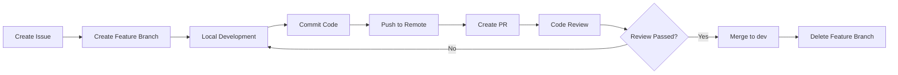

# DevOps Process Standards

**Websoft9 Project - Git Workflow & Docker Deployment Process**

**Created**: 2026-01-04  
**Maintainer**: Winston (Architect Agent)  
**Version**: 1.0  
**Status**: Active

---

## Table of Contents

1. [Git Workflow](#1-git-workflow)
2. [Branch Strategy](#2-branch-strategy)
3. [Code Review Process](#3-code-review-process)
4. [Docker Deployment](#4-docker-deployment)
5. [CI/CD Configuration](#5-cicd-configuration)
6. [Version Release](#6-version-release)
7. [Environment Management](#7-environment-management)
8. [Troubleshooting](#8-troubleshooting)

---

## 1. Git Workflow

### 1.1 Development Process



### 1.2 Workflow Steps

```bash
# 1. Create feature branch from latest dev branch
git checkout dev
git pull origin dev
git checkout -b feature/add-app-backup

# 2. Develop feature
# Edit code...

# 3. Commit changes
git add .
git commit -m "feat(apps): add application backup functionality

- Implement backup API endpoint
- Add backup service layer
- Create backup tests

Closes #123"

# 4. Push to remote
git push origin feature/add-app-backup

# 5. Create Pull Request on GitHub
# Title: feat(apps): add application backup functionality
# Description: Fill according to PR template

# 6. Merge after Code Review
# Merge method: Squash and merge (recommended)

# 7. Delete local and remote branch
git checkout dev
git pull origin dev
git branch -d feature/add-app-backup
git push origin --delete feature/add-app-backup
```

---

## 2. Branch Strategy

### 2.1 Branch Model

Websoft9 adopts a simplified **GitHub Flow** model:

```
main (production environment)
 ↑
 └── dev (development environment)
      ↑
      ├── feature/xxx (feature development)
      ├── bugfix/xxx (bug fixes)
      ├── hotfix/xxx (critical fixes)
      └── release/vX.Y.Z (release preparation)
```

### 2.2 Branch Descriptions

| Branch Type | Naming Convention | Lifecycle | Purpose |
|------------|------------------|-----------|---------|
| **main** | `main` | Permanent | Production code, only accepts merges from `release/*` |
| **dev** | `dev` | Permanent | Development code, all features merge here first |
| **feature** | `feature/<issue-id>-<desc>` | Temporary | New feature development |
| **bugfix** | `bugfix/<issue-id>-<desc>` | Temporary | Bug fixes |
| **hotfix** | `hotfix/<issue-id>-<desc>` | Temporary | Production emergency fixes |
| **release** | `release/v<major>.<minor>.<patch>` | Temporary | Release preparation |

### 2.3 Branch Creation Examples

```bash
# Feature branch (created from dev)
git checkout dev
git pull origin dev
git checkout -b feature/123-app-backup

# Bugfix branch (created from dev)
git checkout -b bugfix/456-fix-port-conflict

# Hotfix branch (created from main)
git checkout main
git pull origin main
git checkout -b hotfix/789-critical-security-fix

# Release branch (created from dev)
git checkout dev
git pull origin dev
git checkout -b release/v2.1.0
```

---

## 3. Code Review Process

### 3.1 Commit Message Standards

Follow [Conventional Commits](https://www.conventionalcommits.org/):

```
<type>(<scope>): <subject>

<body>

<footer>
```

**Type**:
- `feat`: New feature
- `fix`: Bug fix
- `docs`: Documentation update
- `style`: Code formatting (no functional changes)
- `refactor`: Code refactoring
- `perf`: Performance optimization
- `test`: Testing related
- `chore`: Build/toolchain updates
- `ci`: CI/CD configuration
- `revert`: Revert commit

**Scope**:
- `apps`: Application management
- `proxy`: Reverse proxy
- `settings`: System settings
- `docker`: Docker integration
- `api`: API related
- `db`: Database
- `tests`: Testing

**Examples**:

```bash
# Feature development
git commit -m "feat(apps): add application backup endpoint

Implement POST /api/v1/apps/{id}/backup endpoint that creates
a backup of application data and configuration.

Closes #123"

# Bug fix
git commit -m "fix(proxy): resolve CORS issue for Portainer access

Update Nginx configuration to properly set Origin headers
for Portainer container access.

Fixes #456"

# Documentation update
git commit -m "docs: update API documentation for backup endpoint"

# Performance optimization
git commit -m "perf(apps): optimize container listing query

Use asyncio.gather for concurrent container status checks,
reducing response time by 50%.

Related #789"
```

### 3.2 Pull Request Template

```markdown
## 📝 Description

Brief description of changes in this PR

## 🎯 Type of Change

- [ ] 🚀 New feature (feat)
- [ ] 🐛 Bug fix (fix)
- [ ] 📚 Documentation update (docs)
- [ ] ♻️ Code refactoring (refactor)
- [ ] ⚡ Performance improvement (perf)
- [ ] ✅ Test addition/update (test)

## 🔗 Related Issues

Closes #123
Relates to #456

## 🧪 Testing

- [ ] Unit tests added/updated
- [ ] Integration tests passed
- [ ] Manual testing completed
- [ ] Test coverage ≥ 80%

## ✅ Checklist

- [ ] Code follows [coding standards](../standards/coding-standards.md)
- [ ] API follows [API design standards](../standards/api-design.md)
- [ ] All tests pass (`pytest`)
- [ ] Type checking passes (`mypy src/`)
- [ ] Code formatted (`black src/`)
- [ ] No new warnings
- [ ] Documentation updated (if needed)
- [ ] CHANGELOG.md updated (for user-facing changes)

## 📸 Screenshots (if applicable)

Add screenshots here...

## 🔍 Additional Notes

Any additional information...
```

### 3.3 Code Review Checklist

**Reviewers need to check**:

**Code Quality**:
- [ ] Code follows [Coding Standards](./coding-standards.md)
- [ ] Clear function/class naming, single responsibility
- [ ] Complex logic has comments
- [ ] No hardcoded magic numbers/strings
- [ ] Complete type annotations

**API Design**:
- [ ] API design follows [API Design Standards](./api-design.md)
- [ ] URL naming standards (plural nouns)
- [ ] Correct HTTP method usage
- [ ] Complete error handling
- [ ] API documentation updated

**Testing**:
- [ ] New features have corresponding tests
- [ ] Test coverage ≥ 80%
- [ ] Critical paths have integration tests
- [ ] Clear test naming

**Security**:
- [ ] Input validated
- [ ] No SQL injection risk
- [ ] No hardcoded secrets
- [ ] Sensitive data encrypted

**Performance**:
- [ ] No N+1 queries
- [ ] I/O operations use async
- [ ] Proper use of caching
- [ ] Avoid blocking event loop

---

## 4. Docker Deployment

### 4.1 Local Development Environment

```bash
# Start all services
cd docker
docker-compose up -d

# View logs
docker-compose logs -f apphub

# Stop services
docker-compose down

# Rebuild a service
docker-compose up -d --build apphub

# Enter container
docker-compose exec apphub bash
```

### 4.2 Dockerfile Best Practices

```dockerfile
# apphub/Dockerfile

# Use specific version base image
FROM python:3.11-slim

# Set working directory
WORKDIR /app

# Install system dependencies
RUN apt-get update && apt-get install -y \
    gcc \
    && rm -rf /var/lib/apt/lists/*

# Copy dependency file
COPY requirements.txt .

# Install Python dependencies (layer caching optimization)
RUN pip install --no-cache-dir -r requirements.txt

# Copy application code
COPY src/ ./src/

# Create non-root user
RUN useradd -m -u 1000 appuser && \
    chown -R appuser:appuser /app
USER appuser

# Expose port
EXPOSE 8080

# Health check
HEALTHCHECK --interval=30s --timeout=3s --start-period=5s --retries=3 \
    CMD python -c "import requests; requests.get('http://localhost:8080/api/health')"

# Startup command
CMD ["uvicorn", "src.main:app", "--host", "0.0.0.0", "--port", "8080"]
```

### 4.3 docker-compose.yml Standards

```yaml
# docker/docker-compose.yml

version: '3.8'

services:
  apphub:
    build:
      context: ../apphub
      dockerfile: Dockerfile
    container_name: websoft9-apphub
    restart: unless-stopped
    environment:
      - ENV=${ENV:-production}
      - API_KEY=${API_KEY}
      - DATABASE_URL=${DATABASE_URL}
    volumes:
      - apphub-data:/app/data
      - /var/run/docker.sock:/var/run/docker.sock:ro
    networks:
      - websoft9
    ports:
      - "8080:8080"
    depends_on:
      - redis
    healthcheck:
      test: ["CMD", "curl", "-f", "http://localhost:8080/api/health"]
      interval: 30s
      timeout: 5s
      retries: 3
      start_period: 10s
  
  redis:
    image: redis:7-alpine
    container_name: websoft9-redis
    restart: unless-stopped
    volumes:
      - redis-data:/data
    networks:
      - websoft9
    command: redis-server --appendonly yes
  
  proxy:
    image: jc21/nginx-proxy-manager:latest
    container_name: websoft9-proxy
    restart: unless-stopped
    ports:
      - "80:80"
      - "443:443"
      - "81:81"
    volumes:
      - proxy-data:/data
      - proxy-letsencrypt:/etc/letsencrypt
    networks:
      - websoft9

networks:
  websoft9:
    name: websoft9_network
    driver: bridge

volumes:
  apphub-data:
  redis-data:
  proxy-data:
  proxy-letsencrypt:
```

---

## 5. CI/CD Configuration

### 5.1 GitHub Actions Workflow

```yaml
# .github/workflows/ci.yml

name: CI/CD Pipeline

on:
  push:
    branches: [ main, dev ]
  pull_request:
    branches: [ main, dev ]

env:
  REGISTRY: ghcr.io
  IMAGE_NAME: ${{ github.repository }}

jobs:
  test:
    name: Test
    runs-on: ubuntu-latest
    
    steps:
    - name: Checkout code
      uses: actions/checkout@v3
    
    - name: Set up Python
      uses: actions/setup-python@v4
      with:
        python-version: '3.11'
    
    - name: Cache dependencies
      uses: actions/cache@v3
      with:
        path: ~/.cache/pip
        key: ${{ runner.os }}-pip-${{ hashFiles('**/requirements.txt') }}
    
    - name: Install dependencies
      run: |
        cd apphub
        pip install -r requirements.txt
        pip install -r requirements-dev.txt
    
    - name: Lint with flake8
      run: |
        cd apphub
        flake8 src/ --count --select=E9,F63,F7,F82 --show-source --statistics
    
    - name: Type check with mypy
      run: |
        cd apphub
        mypy src/
    
    - name: Run tests
      run: |
        cd apphub
        pytest tests/ -v --cov=src --cov-report=xml
    
    - name: Upload coverage
      uses: codecov/codecov-action@v3
      with:
        file: ./apphub/coverage.xml
  
  build:
    name: Build Docker Image
    runs-on: ubuntu-latest
    needs: test
    if: github.event_name == 'push'
    
    steps:
    - name: Checkout code
      uses: actions/checkout@v3
    
    - name: Set up Docker Buildx
      uses: docker/setup-buildx-action@v2
    
    - name: Log in to Container Registry
      uses: docker/login-action@v2
      with:
        registry: ${{ env.REGISTRY }}
        username: ${{ github.actor }}
        password: ${{ secrets.GITHUB_TOKEN }}
    
    - name: Extract metadata
      id: meta
      uses: docker/metadata-action@v4
      with:
        images: ${{ env.REGISTRY }}/${{ env.IMAGE_NAME }}
        tags: |
          type=ref,event=branch
          type=sha,prefix={{branch}}-
          type=semver,pattern={{version}}
    
    - name: Build and push
      uses: docker/build-push-action@v4
      with:
        context: ./apphub
        push: true
        tags: ${{ steps.meta.outputs.tags }}
        labels: ${{ steps.meta.outputs.labels }}
        cache-from: type=gha
        cache-to: type=gha,mode=max
  
  deploy-dev:
    name: Deploy to Development
    runs-on: ubuntu-latest
    needs: build
    if: github.ref == 'refs/heads/dev'
    
    steps:
    - name: Deploy to dev server
      uses: appleboy/ssh-action@master
      with:
        host: ${{ secrets.DEV_HOST }}
        username: ${{ secrets.DEV_USER }}
        key: ${{ secrets.DEV_SSH_KEY }}
        script: |
          cd /opt/websoft9
          docker-compose pull apphub
          docker-compose up -d apphub
  
  deploy-prod:
    name: Deploy to Production
    runs-on: ubuntu-latest
    needs: build
    if: github.ref == 'refs/heads/main'
    environment: production
    
    steps:
    - name: Deploy to production
      uses: appleboy/ssh-action@master
      with:
        host: ${{ secrets.PROD_HOST }}
        username: ${{ secrets.PROD_USER }}
        key: ${{ secrets.PROD_SSH_KEY }}
        script: |
          cd /opt/websoft9
          docker-compose pull apphub
          docker-compose up -d apphub
          docker system prune -f
```

---

## 6. Version Release

### 6.1 Semantic Versioning

Follow [Semantic Versioning 2.0.0](https://semver.org/):

```
v<major>.<minor>.<patch>

Example: v2.1.3
```

- **Major (Major version)**: Incompatible API changes
- **Minor (Minor version)**: Backward-compatible feature additions
- **Patch (Patch version)**: Backward-compatible bug fixes

### 6.2 Release Process

```bash
# 1. Create release branch from dev
git checkout dev
git pull origin dev
git checkout -b release/v2.1.0

# 2. Update version number
# Edit version.json
{
  "version": "2.1.0",
  "release_date": "2026-01-04"
}

# 3. Update CHANGELOG
# Edit CHANGELOG.md, add version notes

# 4. Commit version changes
git add version.json CHANGELOG.md
git commit -m "chore(release): prepare v2.1.0 release"

# 5. Merge to main and dev
git checkout main
git merge --no-ff release/v2.1.0
git tag -a v2.1.0 -m "Release version 2.1.0"
git push origin main --tags

git checkout dev
git merge --no-ff release/v2.1.0
git push origin dev

# 6. Delete release branch
git branch -d release/v2.1.0

# 7. Create Release on GitHub
# Title: Websoft9 v2.1.0
# Content: Copy from CHANGELOG.md
```

### 6.3 CHANGELOG Format

```markdown
# Changelog

All notable changes to Websoft9 AppHub will be documented in this file.

The format is based on [Keep a Changelog](https://keepachangelog.com/en/1.0.0/),
and this project adheres to [Semantic Versioning](https://semver.org/spec/v2.0.0.html).

## [2.1.0] - 2026-01-04

### Added
- Application backup and restore functionality (#123)
- Bulk application operations API (#145)
- Redis caching layer for improved performance (#156)

### Changed
- Upgrade FastAPI to 0.109.0 (#167)
- Optimize Docker container startup time (#178)

### Fixed
- Fix port conflict detection bug (#189)
- Resolve residual configuration files after application deletion (#201)

### Security
- Fix API Key exposure risk (CVE-2026-xxxx) (#234)

## [2.0.0] - 2025-12-01

### Added
- Complete rewrite with new FastAPI architecture
- Support for 200+ application templates
...
```

---

## 7. Environment Management

### 7.1 Environment Variable Management

```bash
# .env.example (Template file, commit to Git)

# Application
ENV=production
DEBUG=false
API_KEY=your-api-key-here

# Database
DATABASE_URL=sqlite:///./apphub.db

# Redis
REDIS_URL=redis://localhost:6379/0

# Docker
DOCKER_HOST=unix:///var/run/docker.sock

# Security
SECRET_KEY=your-secret-key-here
ENCRYPTION_KEY=your-encryption-key-here

# Logging
LOG_LEVEL=INFO
LOG_FILE=/var/log/websoft9/apphub.log
```

**Usage**:

```bash
# Copy template
cp .env.example .env

# Edit configuration (don't commit .env to Git!)
vim .env

# Load environment variables
source .env

# Or use docker-compose to auto-load
docker-compose --env-file .env up -d
```

### 7.2 Environment-Specific Configuration

| Configuration | Development | Testing | Production |
|--------------|-------------|---------|------------|
| `ENV` | `development` | `testing` | `production` |
| `DEBUG` | `true` | `false` | `false` |
| `LOG_LEVEL` | `DEBUG` | `INFO` | `WARNING` |
| `CORS` | `*` | Specific domains | Specific domains |
| `Database` | SQLite | PostgreSQL | PostgreSQL |
| `Cache` | Local memory | Redis | Redis Cluster |

---

## 8. Troubleshooting

### 8.1 View Logs

```bash
# View AppHub logs
docker-compose logs -f apphub

# View last 100 lines
docker-compose logs --tail=100 apphub

# View specific time period
docker-compose logs --since="2026-01-04T10:00:00" apphub

# Export logs
docker-compose logs apphub > apphub.log
```

### 8.2 Common Issue Troubleshooting

**Issue 1: Container fails to start**

```bash
# Check container status
docker ps -a

# View container logs
docker logs websoft9-apphub

# Check port usage
netstat -tulnp | grep 8080

# Check Docker network
docker network inspect websoft9_network
```

**Issue 2: Slow API response**

```bash
# Check container resource usage
docker stats websoft9-apphub

# Check database connection
docker-compose exec apphub python -c "from db.session import test_connection; test_connection()"

# View Redis connection
docker-compose exec redis redis-cli ping
```

**Issue 3: Database errors**

```bash
# Enter database
docker-compose exec apphub sqlite3 /app/data/apphub.db

# Check table structure
.schema apps

# Backup database
docker-compose exec apphub cp /app/data/apphub.db /app/data/apphub_backup.db
```

### 8.3 Rollback Strategy

```bash
# Rollback to previous version
git checkout main
git revert HEAD
git push origin main

# Or rollback using Docker image
docker-compose down
docker pull ghcr.io/websoft9/websoft9:v2.0.0
docker-compose up -d

# Database rollback (use with caution!)
# 1. Stop service
docker-compose stop apphub

# 2. Restore backup
docker-compose exec apphub cp /app/data/apphub_backup.db /app/data/apphub.db

# 3. Restart service
docker-compose start apphub
```

---

## 9. Best Practices Summary

### 9.1 Developer Daily Workflow

```bash
# Start of workday
git checkout dev
git pull origin dev
git checkout -b feature/my-feature

# Coding...
# Run tests
pytest tests/

# Commit code
git add .
git commit -m "feat: add new feature"

# Push and create PR
git push origin feature/my-feature
# Create PR on GitHub

# After PR merge, cleanup
git checkout dev
git pull origin dev
git branch -d feature/my-feature
```

### 9.2 Deployment Checklist

**Pre-deployment**:
- [ ] All tests pass
- [ ] Code Review completed
- [ ] CHANGELOG updated
- [ ] Database migration scripts ready
- [ ] Environment variable configuration checked
- [ ] Current production environment backed up

**During deployment**:
- [ ] Monitor system logs
- [ ] Verify health checks
- [ ] Test critical API endpoints
- [ ] Check performance metrics

**Post-deployment**:
- [ ] Verify all features working
- [ ] Check error logs
- [ ] Notify team of deployment completion
- [ ] Update deployment documentation

---

## Appendix

### A. Recommended Tools

- **Git**: GitHub Desktop, GitKraken
- **Docker**: Docker Desktop, Portainer
- **CI/CD**: GitHub Actions, GitLab CI
- **Monitoring**: Grafana, Prometheus
- **Logging**: ELK Stack, Loki

### B. Reference Resources

- [Git Flow](https://nvie.com/posts/a-successful-git-branching-model/)
- [Conventional Commits](https://www.conventionalcommits.org/)
- [Semantic Versioning](https://semver.org/)
- [Docker Best Practices](https://docs.docker.com/develop/dev-best-practices/)
- [GitHub Actions](https://docs.github.com/en/actions)

---

**Document Maintainer**: Winston (Architect Agent)  
**Review Status**: Active  
**Related Documentation**: [API Design](./api-design.md) | [Coding Standards](./coding-standards.md) | [Testing Standards](./testing-standards.md)
