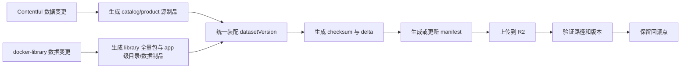
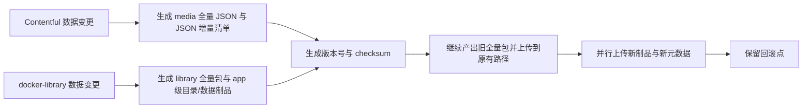
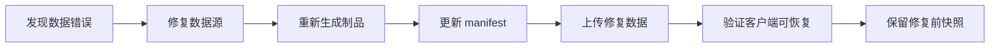

# 应用商店数据发布治理规范

创建时间：2026-06-05
状态：可实施
适用对象：DevOps、发布负责人、应用商店维护者、客户端开发者
所属阶段：Phase 3 / Phase 6 数据制品治理执行包

## 1. 文档定位

这份文档是 Websoft9 应用商店数据发布治理的主规范。

它不负责定义应用商店作为平台能力本身是什么，只负责它的数据如何发布、版本化、兼容、回滚和演进。

它统一回答四类问题：

1. `main` 分支上的旧应用商店数据发布链路到底怎么运行
2. 新的应用商店数据制品模型准备怎么演进
3. 哪些旧链路、旧路径、旧包名和旧运行方式绝对不能被破坏
4. 第一阶段和后续阶段分别做什么

完整路径、当前完成度、阶段顺序与后续推进优先级，统一以 [roadmap_cn.md](./roadmap_cn.md) 为准。

如果需要理解应用商店作为平台能力本身的归属、模块边界和运行时关系，统一看 [../../platform/app-store-foundation_cn.md](../../platform/app-store-foundation_cn.md)。

本规范采用“行业最佳实践方向 + 贴合当前项目现状的轻量落地”原则。

这意味着：

1. 方向上参考成熟制品治理模型
2. 落地上优先做最小闭环，不强行一次补齐大厂级全套机制
3. 能分阶段完成的能力，不在第一阶段全部设为强制项

本文覆盖：

1. Catalog 数据
2. Library 数据
3. Manifest
4. 全量快照
5. 增量包或增量描述
6. Checksum
7. 兼容性元数据
8. 旧流程约束与分阶段实施要求

本文不覆盖：

1. Docker 镜像本体发布规范
2. 应用程序 zip 包发布规范
3. GitHub Release 附件通用规范
4. 应用商店作为平台能力的业务归属与模块定义
5. 平台安装、升级、卸载与迁移兼容

## 2. 主干旧流程基线

以下基线只以 `main` 分支为准，不以当前改造分支为准。

### 2.1 旧制品生产链路

1. `websoft9` 主分支当前没有 `build-appstore-catalog.yml`，而是使用 `.github/workflows/media.yml` 与 `.github/workflows/media_dev.yml`
2. `media.yml` / `media_dev.yml` 会直接从 Contentful GraphQL 拉取 `catalog_{locale}.json` 与 `product_{locale}.json`
3. `media.yml` / `media_dev.yml` 会继续下载 `logos` 与 `screenshots` 资源，并把 `json + logos + screenshots` 打包成 `media.zip` 或 `media-dev.zip`
4. `media_dev.yml` 会额外从 R2 下载 `library-dev.zip`，解压后读取 `apps/<app>/variables.json` 中的 `edition` 信息，再把版本分发信息合并进 `product_{locale}.json`
5. `websoft9` 主分支当前对外发布的展示侧制品路径是 `plugin/media`
6. `docker-library` 是独立项目，不是 `websoft9` 仓库内的一个普通目录；它在主分支上有自己的 `release.yml`、`release-dev.yml`、`sync_contentful.yml`
7. `docker-library` 的 `release.yml` / `release-dev.yml` 会打包并上传 `library` 制品到 R2 的 `plugin/library` 路径
8. `docker-library` 的 `sync_contentful.yml` 会在 `apps/*/variables.json` 变化时把相关数据同步回 Contentful

### 2.2 旧运行时消费链路

1. `apphub` 主分支中的 `upgrade apps` 会分别拉取 `media-dev.zip` / `media-latest.zip` 与 `library-dev.zip` / `library-latest.zip` 到运行时目录
2. `apphub` 主分支中的 `get_catalog_apps()` 直接读取 `/websoft9/media/json/catalog_{locale}.json`
3. `apphub` 主分支中的 `get_available_apps()` 直接读取 `/websoft9/media/json/product_{locale}.json`，并结合 docker-library 中对应 app 的 `.env` 生成 `settings` 与 `is_web_app`
4. `apphub` 主分支仍然暴露 `/apps/catalog/{locale}` 与 `/apps/available/{locale}` 接口
5. 旧路径 `plugin/library` 仍然是主分支运行链路的一部分
6. 图片兼容在主分支仍然是现实问题，因为 `media` 包中仍包含 `logos` 与 `screenshots`

### 2.3 旧自动更新链路

1. 旧平台运行时仍存在 `cron -> update.sh -> update_zip.sh` 的每日自动全量更新链路
2. 当前仓库中可直接核对的相关文件面包括 `scripts/update_zip.sh`、`apphub/src/cli/apphub_cli.py` 与 `docker/supervisord.conf`
3. `apphub/src/cli/apphub_cli.py` 当前仍会调用 `/websoft9/script/update_zip.sh` 拉取 `media-latest.zip` 与 `library-latest.zip`
4. `docker/supervisord.conf` 中 `cron` 是常驻进程，这意味着旧的每日自动全量更新不是文档约定，而是主干运行机制的一部分
5. `cron` 的具体调度条目与容器内 `/websoft9/script/update.sh` 落点不在当前仓库文件面中，实施时应按“运行时链路存在”处理，而不要把它误认成当前仓库里的可编辑源文件

### 2.4 基线结论

1. 当前 `main` 的真实模型仍然是“media bundle + library bundle”的双包模式
2. 当前 `main` 中，这个仓库里还没有统一的 `datasetVersion` manifest、checksum、历史 manifest、数据 hotfix 脚本或 catalog / library 共享数据集校验脚本
3. 旧的应用商店更新链路当前仍依赖“每天自动全量更新 `media` 和 `library` 包”的模式
4. 后续任何新方案都必须从这条已运行主干链路上做并行演进，而不能假设旧链路不存在

补充说明：

1. 本节只描述 `main` 分支当前事实，不等于新项目的目标实现方式
2. 如果面向新项目或新一代运行时重构，旧脚本名、旧目录名、旧包名不是强制保留对象
3. 新项目真正需要保留的是能力目标：自动同步、手动同步、本地静态资源消费、增量更新、校验、回滚
4. 因此像 `update_zip.sh`、`media-latest.zip`、`plugin/media` 这类名称，在新体系中都可以按领域语义重新命名，只需在需要兼容旧系统时保留适配层

## 3. 不可破坏约束

这是后续所有设计和实现都必须遵守的红线。

### 3.1 旧更新模式不可中断

1. 旧的每日自动全量更新 `media` / `library` 包模式必须继续保留
2. 对已经在运行的旧平台，旧链路的行为契约必须保持可用
3. 如果新链路失败，旧链路仍必须能独立完成更新

### 3.2 已运行系统不可受影响

1. 已经在运行的旧版本应用商店不能受影响
2. 已经在运行的平台不能受影响
3. 旧客户端在兼容窗口内必须继续按原方式工作，不能被迫迁移到新模型

### 3.3 旧路径与旧消费方式不可先删

1. 不能立即删除旧路径
2. 不能假设所有客户端都能马上切到新格式
3. 不能把当前改造分支里的新模型误写成主干现状
4. 不能只发布“一个 zip 包”就认为数据治理完成

补充说明：

1. 这里约束的是 brownfield 迁移策略，不是 greenfield 命名策略
2. 对新项目本身，旧脚本名、旧文件名、旧目录名都不是必须继承的资产
3. 是否保留旧名称，只取决于是否还要兼容既有运行面

### 3.4 新能力只能并行增加

1. 在 brownfield 迁移阶段，新增制品、manifest、增量能力应先并行增加，再逐步接管默认行为
2. 必须同时定义“上游源制品”和“对外消费制品”
3. 当前主干首先要承认自己还处在“media / library 双包”阶段，再从这个基线演进到统一数据集模型

## 4. 目标升级模型

从本节开始，以下内容是目标方案，不代表 `main` 分支已落地。

目标模型遵循以下原则：

1. 兼容优先：旧客户端在支持窗口内必须继续可用
2. 双轨优先：旧版路径兼容层和新版规范层并行存在
3. 版本优先：所有数据制品必须显式版本化
4. 回滚优先：每次发布都必须能回滚到上一个有效数据版本
5. 渐进优先：先保留旧模型，再逐步引入 manifest、全量、增量、checksum
6. 源头优先：必须明确 Contentful 和 docker-library 各自负责什么，不能混淆
7. 组装优先：对外发布的数据集必须由统一装配层生成，而不是直接把任一上游源头当成最终制品
8. 轻量优先：先建立最小治理基线，再逐步提高颗粒度与自动化程度
9. 旧链路优先：现有“每日自动全量更新 media / library 包”的生产链路在新方案上线后必须继续保留
10. 运行无感优先：已运行旧版本应用商店和平台必须继续按原方式工作，不能因为新制品模型而被迫改造或停机

### 4.1 新项目同步模型

如果按新项目或新一代运行时实现，应用商店更新应统一为“远端制品作为源、本地静态资源作为消费面”的模型。

统一要求：

1. 应用商店更新只允许两类触发源：每日自动任务与用户手动同步刷新
2. 两类触发源最终都必须进入同一套同步服务，而不是各自维护一套独立逻辑
3. 同步服务先读取远端 manifest，再比较本地 `datasetVersion`，优先执行增量同步
4. 同步结果必须先落到本地 staging，再原子切换为当前静态快照
5. Console 与其他前端只消费本地静态资源或 AppHub 提供的本地 API，不直接读取远端制品仓
6. 手动刷新本质上是“请求 AppHub 执行一次同步”，不是前端直接重新拉远端 JSON
7. 自动任务与手动刷新共享同一个同步状态、校验逻辑、回滚逻辑和激活逻辑
8. 当 manifest 中存在 delta 描述时，应先按域判断是否真的有变化；无变化的域可以跳过包同步，避免无效下载和无效激活
9. delta 跳过策略必须校验 `fromVersion -> toVersion` 是否与本地已激活版本和目标 datasetVersion 一致；版本链不匹配时必须回退到全量同步
10. 当前 runtime 第一阶段对 library 的 delta 应用策略是“旧基线复用 + 新 library 全包抽取 + apps 目录按 `addedApps/changedApps/removedApps` 激活”，而不是直接对 JSON 或 ZIP 做二进制 patch
11. 当 library manifest 声明 `compatibility.appLevelArtifacts=true` 且 `appsIndex` 可用时，runtime 应优先下载变更 app 的 bundle 制品做激活；只有 app 级制品缺失、无效或版本链不成立时，才回退到 library 全包 delta 路径
12. app 级激活必须校验 `appsIndex.checksum.bundle`，且当 `variables` 或 `env` 快照存在时也必须校验其 checksum；任何校验失败都不得继续激活该 app artifact，而应回退到已验证的整包路径
13. 当 app-level `variables` / `env` 快照存在且校验通过时，runtime 应将其视为该 app 在目标 datasetVersion 下的规范快照，并覆盖 bundle 内的同名文件

推荐的本地目录结构：

1. `appstore/staging/<datasetVersion>/media`
2. `appstore/staging/<datasetVersion>/library`
3. `appstore/releases/<datasetVersion>/media`
4. `appstore/releases/<datasetVersion>/library`
5. `appstore/current/media`
6. `appstore/current/library`
7. `config/appstore_sync_state.json`

### 4.2 新项目命名原则

如果不再受旧运行面约束，则命名应按领域职责，而不是按历史实现细节。

推荐原则：

1. 不再使用 `update_zip`、`media_dev` 这类历史实现导向命名作为新体系主名
2. 新名称应直接表达领域动作，例如 `appstore-sync`、`appstore-activate`、`appstore-publish`、`appstore-reconcile`
3. 本地目录名应表达快照与状态，例如 `current`、`staging`、`releases`、`state`
4. 旧名称如果需要保留，只作为兼容适配入口，不作为新架构内部主对象

## 5. 分阶段实施原则

为了避免设计过重，本文将能力拆成三层。

### 5.1 第一层：当前项目必须具备

这一层是必须落地的最小闭环：

1. Contentful 产出的展示数据要进入 R2，并可区分 `dev / rc / release`
2. docker-library 产出的 library 全量包要进入 R2，并可区分 `dev / rc / release`
3. docker-library 的 app 目录级和 app 数据级制品也要在第一阶段一起进入 R2
4. 至少要有一个可追踪版本号，能用于发布、回滚和问题定位
5. 至少要有 checksum 或等价校验能力
6. 旧路径和旧消费方式在兼容窗口内不能被破坏
7. 旧的每日自动全量更新 `media` / `library` 包模式必须继续保留
8. 新增制品、manifest、增量能力只能并行增加，不能替代旧链路的默认行为

### 5.2 第二层：本项目建议具备

这一层是建议在本轮或下一轮完成的增强项：

1. 统一 manifest
2. 历史版本保留
3. library 的 app 级变更索引
4. Catalog JSON 的轻量增量描述
5. 数据 hotfix 与版本切换辅助能力

### 5.3 第三层：暂不强制

以下能力属于增强方向，不要求第一阶段一次做完：

1. 完整的 app 级目录制品体系
2. 每个 app 独立的 env / variables / bundle 全量快照
3. 复杂的多层 delta 链
4. 大规模审计、审批、追责类字段

## 6. 数据制品分层模型

应用商店数据在目标上不应再被视为“单一 zip 包”，但结合当前项目现状，第一阶段只要求先建立“全量包 + 版本 + 校验 + 兼容”的最小基线，三层模型用于指导后续演进。

### 6.1 上游源制品层

#### A. Contentful 源制品

来源：Contentful

职责：

1. 生成展示侧分类数据
2. 生成展示侧应用数据
3. 生成中英文静态消费数据

最低输出应包括：

1. `catalog_zh.json`
2. `catalog_en.json`
3. `product_zh.json`
4. `product_en.json`

#### B. Docker Library 源制品

来源：独立的 `docker-library` 项目

职责：

1. 提供安装版本与 edition 真相
2. 提供安装变量与运行时设置真相
3. 提供 library 全量包
4. 提供按应用拆分的目录级制品与数据级制品
5. 通过自身 workflow 产出 `library-dev.zip`、`library-latest.zip` 或版本化 library 包

最低输入事实包括：

1. `apps/<app>/variables.json`
2. `apps/<app>/.env`
3. `apps/<app>/...` 其他安装模板文件

目标要求：

1. `docker-library` 不仅要上传全量 `library` 包到 R2，还要上传按 app 粒度可追踪的目录/数据制品
2. 每个 app 的目录制品和数据制品都必须可版本化、可校验、可回滚
3. 增量更新不应只围绕整个 `library.zip`，还必须支持 app 级目录与数据变更识别

### 6.2 统一数据集制品层

来源：由 `websoft9` 仓库中的组装工作流统一装配

职责：

1. 将 Contentful 源制品与 docker-library 源制品绑定到同一个 `datasetVersion`
2. 为外部消费面提供唯一 manifest
3. 管理增量包、全量包、checksum、兼容元数据

最低输出应包括：

1. catalog 制品
2. library 制品
3. 最新 manifest
4. 历史 manifest
5. checksum
6. 增量索引或增量包

说明：

1. 对当前项目而言，第一阶段必须同时保留旧的全量 `media` / `library` 制品，并新增 app 级目录与数据制品
2. 只要全量 `media` / `library` 制品、app 级目录与数据制品、版本号、checksum、兼容策略成立，就满足第一阶段最小治理基线
3. 更复杂的 app 级差量包与自动化编排属于下一阶段增强项

### 6.3 旧版兼容制品层

职责：

1. 继续保留 `/media/json/*` 静态消费形态
2. 继续保留 `plugin/media` 与 `plugin/library` 路径
3. 继续保留旧版图片字段结构与必要资源映射
4. 继续保留 AppHub fallback API 可消费的数据结构

## 7. 数据制品分类

### 7.1 Catalog 数据

作用：

1. 提供应用目录、分类、应用元数据、展示字段
2. 给前端和 API 提供应用商店基础展示信息
3. 当前主来源是 Contentful 拉取后的 `catalog_*.json` 与 `product_*.json`
4. 第一阶段除了全量 JSON 外，也应补上可用的轻量增量能力

第一阶段要求：

1. 必须发布全量 `catalog_zh.json`、`catalog_en.json`、`product_zh.json`、`product_en.json`
2. 必须能识别从上一个版本到当前版本哪些 catalog 或 product 发生变化
3. 增量能力可以先采用“变更索引”或“差异清单”形式，不强制第一天就产出复杂 patch 包

建议最小增量产物：

1. `catalog-delta-<fromVersion>-to-<toVersion>.json`
2. `product-delta-<fromVersion>-to-<toVersion>.json`

### 7.2 Library 数据

作用：

1. 提供安装所需的版本信息和变量信息
2. 当前主来源是独立 docker-library 项目中的 `variables.json`、`.env` 与模板文件
3. 不应再由 Contentful 直接替代 library 作为安装真相源
4. 第一阶段至少应以全量包形式发布到 R2
5. app 目录级和 app 数据级发布能力需要在第一阶段一起完成

第一阶段要求：

1. 发布 `library` 全量包
2. 发布每个 app 的目录级制品
3. 发布每个 app 的数据级制品，例如 `variables.json`、必要的环境或元数据快照
4. 每个 app 制品都必须具备可追踪版本号和基础校验信息

### 7.3 安装元数据侧车

作用：

1. 作为展示数据与安装真相源之间的桥接层
2. 为前端静态消费面补充 `settings`、`is_web_app` 等安装期字段
3. 避免把 docker-library 原始目录结构直接暴露给 Console

建议输出：

1. `app-store-install-metadata.json`

### 7.4 App 目录与数据制品

作用：

1. 让 `docker-library` 不再只有一个整包 zip，而是拥有按应用追踪的制品层
2. 为增量更新提供 app 级别的最小变更单元
3. 让回滚可以定位到单个 app，而不必每次回滚整个 library

定位：

1. 这是第一阶段就要完成的能力，但可以先采用轻量实现
2. 轻量实现的意思是：不要求一开始就把所有 app 都做成复杂独立流水线，但至少要有稳定的 app 级目录和数据制品输出

建议输出：

1. `apps/<app>/bundle-<datasetVersion>.zip`
2. `apps/<app>/variables-<datasetVersion>.json`
3. `apps/<app>/env-<datasetVersion>.env`
4. `apps/<app>/manifest-<datasetVersion>.json`

### 7.5 Manifest

作用：

1. 告诉客户端当前有哪些数据版本
2. 告诉客户端应该下载全量还是增量
3. 告诉客户端最低兼容版本和校验信息

### 7.6 Full Snapshot

作用：

1. 首次安装或恢复时提供完整基线
2. 在增量链不可用时作为兜底数据源

### 7.7 Incremental Patch

作用：

1. 提供每日或高频差量更新
2. 降低客户端全量下载开销

## 8. R2 目录规范

### 8.1 推荐逻辑目录

```text
artifact/
  dev/
    websoft9/
      plugin/
        catalog/
        library/
        manifest/
  rc/
    websoft9/
      plugin/
        catalog/
        library/
        manifest/
  release/
    websoft9/
      plugin/
        catalog/
        library/
        manifest/
```

第一阶段至少应保留：

```text
library/
  full/
  apps/
  metadata/
```

增强阶段再细分为：

```text
library/
  full/
  apps/
  metadata/
  delta/
  manifests/
```

### 8.2 兼容要求

在兼容窗口内，以下旧路径必须继续保留：

1. `plugin/media`
2. `plugin/library`
3. 旧的 `media-dev.zip` / `media-latest.zip` 获取方式
4. 旧的 `library-dev.zip` / `library-latest.zip` 获取方式

原因：

1. 旧客户端可能仍然直接依赖这些路径
2. 现有脚本和运行时逻辑仍可能通过这些路径取数据
3. 新路径不能以“替换旧路径”为前提上线
4. 已运行的旧版本应用商店仍可能每天按全量包模式自动更新
5. 平台现有升级逻辑仍可能默认依赖全量包路径与文件名

### 8.3 第一阶段执行清单

第一阶段必须真正产出以下文件，并能在 R2 中稳定找到。

Catalog 侧至少包含：

1. 旧链路继续使用的 `media-dev.zip` 或 `media-latest.zip`
2. `catalog_zh.json`
3. `catalog_en.json`
4. `product_zh.json`
5. `product_en.json`
6. `catalog-delta-<fromVersion>-to-<toVersion>.json`
7. `product-delta-<fromVersion>-to-<toVersion>.json`
8. 上述文件对应的 checksum

Library 侧至少包含：

1. 旧链路继续使用的 `library-dev.zip` 或 `library-latest.zip`
2. `apps/<app>/bundle-<datasetVersion>.zip`
3. `apps/<app>/variables-<datasetVersion>.json`
4. 如存在运行时必要环境：`apps/<app>/env-<datasetVersion>.env`
5. `apps-index-<datasetVersion>.json`
6. `library-delta-<fromVersion>-to-<toVersion>.json`
7. `apps-delta-<fromVersion>-to-<toVersion>.json`
8. 上述文件对应的 checksum

第一阶段推荐落位为：

1. 旧链路继续保留在 `artifact/<channel>/websoft9/plugin/media/`、`artifact/<channel>/websoft9/plugin/catalog/` 与 `artifact/<channel>/websoft9/plugin/library/`
2. 新版规范根目录单独建立为 `artifact/websoft9/v2/<channel>/appstore/`
3. Catalog 新制品发布到 `artifact/websoft9/v2/<channel>/appstore/catalog/`
4. Library 新制品发布到 `artifact/websoft9/v2/<channel>/appstore/library/`
5. App Store 级汇总 manifest 发布到 `artifact/websoft9/v2/<channel>/appstore/manifests/`
6. 旧路径继续作为兼容输出，`artifact/websoft9/v2/<channel>/appstore` 作为新版主数据面

推荐先创建的目录结构如下：

```text
artifact/
  websoft9/
    v2/
      dev/
        appstore/
          catalog/
          library/
          manifests/
      rc/
        appstore/
          catalog/
          library/
          manifests/
      release/
        appstore/
          catalog/
          library/
          manifests/
```

你现在实际需要手工创建的空目录只有这 9 个：

```text
artifact/websoft9/v2/dev/appstore/catalog/
artifact/websoft9/v2/dev/appstore/library/
artifact/websoft9/v2/dev/appstore/manifests/
artifact/websoft9/v2/rc/appstore/catalog/
artifact/websoft9/v2/rc/appstore/library/
artifact/websoft9/v2/rc/appstore/manifests/
artifact/websoft9/v2/release/appstore/catalog/
artifact/websoft9/v2/release/appstore/library/
artifact/websoft9/v2/release/appstore/manifests/
```

当前不要手工预建的目录：

1. 不要先手工创建 `apps/<app>/...` 这类按应用展开的深层目录，等流水线真正产出时再由发布过程写入
2. 不要先手工创建版本号目录，因为当前版本化策略是“同目录内保留版本化文件”，不是“每个版本一个目录”
3. 不要在 `artifact/websoft9/v2/<channel>/appstore/` 下额外创建 `checksums/`、`delta/`、`full/` 等新目录，除非后续规范明确要求单独拆层

第一阶段最短验收表如下。

| 目录 | 第一阶段至少应出现的文件 | 说明 |
|---|---|---|
| `dev/appstore/catalog/` | `manifest.json`、`catalog_zh.json`、`catalog_en.json`、`product_zh.json`、`product_en.json`、Catalog 全量 zip、对应 `.sha256` | dev 通道允许文件频繁变化，但文件集合不应缺主项 |
| `dev/appstore/library/` | `manifest.json`、library 主包、`apps-index.json`、`library-delta-*.json`、`apps-delta-*.json`、对应 `.sha256` | 如果是首版 bootstrap，delta 文件名允许以 bootstrap 开头 |
| `dev/appstore/manifests/` | `appstore.json`、`appstore-<datasetVersion>.json` | 根级汇总 manifest 必须同时能指向 catalog 和 library |
| `rc/appstore/catalog/` | 与 dev catalog 同类文件 | RC 文件名可以带版本或 rc 标识，但目录结构不变 |
| `rc/appstore/library/` | 与 dev library 同类文件 | RC 允许从 dev 升版，但不应改变主文件语义 |
| `rc/appstore/manifests/` | `appstore.json`、`appstore-<datasetVersion>.json` | RC 根级汇总 manifest 必须可独立回滚 |
| `release/appstore/catalog/` | 与 dev catalog 同类文件 | release 通道允许使用 `latest` 或正式版本命名，但必须保留 manifest 和 checksum |
| `release/appstore/library/` | 与 dev library 同类文件 | release 主包可叫 `library-latest.zip` 或正式版本包，但 manifest 必须稳定 |
| `release/appstore/manifests/` | `appstore.json`、`appstore-<datasetVersion>.json` | release 汇总 manifest 是客户端读取新版数据域的主入口 |

验收时的最小判断方法：

1. 先看 `manifests/appstore.json` 是否存在，并能同时指向 `catalog/manifest.json` 与 `library/manifest.json`
2. 再看 `catalog/manifest.json` 与 `library/manifest.json` 的 `datasetVersion` 是否一致
3. 再看 catalog 四个基础 JSON、library 主包、`apps-index.json` 是否齐全
4. 最后看 `.sha256` 与历史版本 manifest 是否同步存在

其中各目录职责如下：

1. `catalog/`：Catalog 全量 zip、`catalog_zh/en.json`、`product_zh/en.json`、catalog/product delta、catalog manifest 与对应 checksum
2. `library/`：`library-dev.zip` / `library-latest.zip`、`apps-index`、`library-delta`、`apps-delta`、按 app 拆分制品、library manifest 与对应 checksum
3. `manifests/`：App Store 根级汇总 manifest，例如 `appstore.json` 与带版本的 `appstore-<datasetVersion>.json`

建议按下面的文件清单理解和验收 `appstore` 目录。

#### Catalog 目录文件清单

必须项：

1. `catalog/manifest.json`
2. `catalog/catalog_zh.json`
3. `catalog/catalog_en.json`
4. `catalog/product_zh.json`
5. `catalog/product_en.json`
6. `catalog/catalog-dev.zip` 或当前通道对应的 Catalog 全量 zip
7. 上述主文件对应的 `.sha256`

建议项：

1. `catalog/catalog-delta-<fromVersion>-to-<toVersion>.json`
2. `catalog/product-delta-<fromVersion>-to-<toVersion>.json`
3. `catalog/catalog-delta-<fromVersion>-to-<toVersion>.json.sha256`
4. `catalog/product-delta-<fromVersion>-to-<toVersion>.json.sha256`

历史归档项：

1. `catalog/manifest-<datasetVersion>.json`

#### Library 目录文件清单

必须项：

1. `library/manifest.json`
2. `library/library-dev.zip`、`library/library-latest.zip` 或当前通道对应的 library 主包
3. `library/apps-index.json`
4. `library/library-delta-<fromVersion>-to-<toVersion>.json`
5. `library/apps-delta-<fromVersion>-to-<toVersion>.json`
6. 上述主文件对应的 `.sha256`

建议项：

1. `library/app-store-install-metadata.json`
2. `library/app-store-install-metadata.json.sha256`
3. `library/apps/<app>/bundle-<datasetVersion>.zip`
4. `library/apps/<app>/variables-<datasetVersion>.json`
5. `library/apps/<app>/env-<datasetVersion>.env`
6. `library/apps/<app>/manifest-<datasetVersion>.json`

历史归档项：

1. `library/manifest-<datasetVersion>.json`
2. `library/apps-index-<datasetVersion>.json`
3. `library/apps-index-<datasetVersion>.json.sha256`

#### Manifests 目录文件清单

必须项：

1. `manifests/appstore.json`

历史归档项：

1. `manifests/appstore-<datasetVersion>.json`

实施时的判断原则：

1. 你当前手工建立目录时，只需要先创建目录，不需要预先创建上述文件
2. `必须项` 代表第一阶段流水线运行后应稳定存在的文件
3. `建议项` 代表第一阶段最好补齐，但允许在不破坏主链路的前提下分批进入
4. `历史归档项` 代表同一目录下保留可回滚、可追踪的版本化快照

执行要求：

1. 旧的全量包必须继续发布到原有路径
2. 新制品必须并行发布到 `artifact/websoft9/v2/<channel>/appstore/` 下的新路径
3. 新旧两套根目录必须可以同时存在，互不覆盖
4. 任一新制品失败时，旧链路不能受影响
5. 至少要能根据 `datasetVersion` 追踪到同一次发布涉及的 catalog 和 library 制品
6. 新版客户端和后续平台能力只应消费 `artifact/websoft9/v2/<channel>/appstore` 数据域，不再继续绑定旧 `plugin/*` 语义

命名约定：

1. 新版 v2 数据域目录统一使用 `appstore`，即 `artifact/websoft9/v2/<channel>/appstore/`
2. 这里使用 `appstore` 而不是 `app-store`，目的是把新版制品目录当作稳定标识符处理，减少路径层级里的分词歧义和后续脚本拼接复杂度
3. 当前这次统一只作用于新版 v2 制品目录和新版根级 manifest 名，不强制重命名历史文档文件名、专题文件名或既有数据文件名
4. 因此像 `app-store-release-governance_cn.md`、`app-store-foundation_cn.md`、`app-store-install-metadata.json` 这类历史命名暂时保留，不作为本轮目录规范冲突处理

补充说明：

1. 上述“历史命名暂时保留”仅适用于当前仓库现状与迁移期文件面
2. 如果进入新项目或新运行时重构阶段，可以直接采用新的领域命名，不必继承 `update_zip`、`media-latest`、`plugin/media` 等旧名

### 8.4 仓库落地映射

第一阶段实施时，默认按下面的仓库文件面落地。

Catalog 侧：

1. `.github/workflows/media.yml`：正式通道的 media 全量包与基础 JSON 产出
2. `.github/workflows/media_dev.yml`：开发通道的 media 全量包、基础 JSON 和轻量增量产出
3. `.github/workflows/sync_contentful.yml`：Contentful 环境同步

Library 侧：

1. `docker-library` 仓库的 `release.yml` / `release-dev.yml`：旧全量 library 包继续发布
2. `docker-library` 仓库：补齐 app 级目录与数据制品的产出
3. 本仓库仅消费和约束其产物，不替代 docker-library 作为安装真相源

运行时与兼容链路：

1. `apphub/src/cli/apphub_cli.py`：当前仓库中的应用商店同步触发入口
2. `apphub/src/services/app_manager.py`：当前平台读取本地静态资源和本地 library 信息的运行时入口
3. `docker/supervisord.conf`：容器内自动任务调度相关配置
4. 当前仓库中的旧脚本与旧下载链路，只用于理解 brownfield 兼容边界，不应继续主导新项目命名与结构设计
5. 新项目建议单独建立统一的同步服务、同步状态存储、manifest 客户端和快照激活模块

新增脚本与校验面：

1. 本仓库新增的脚本应优先放在 `scripts/` 目录
2. 新增校验优先接入 `.github/workflows/ci.yml` 或与应用商店制品直接相关的 workflow
3. 如果是新项目或新运行时，新增脚本可以直接替代旧脚本，并按新领域命名落地
4. 如果是当前 brownfield 迁移期，才需要额外保留旧脚本的兼容入口

## 9. 命名规范

本章分为两层：

1. 第一层是当前迁移期仍需识别的历史制品命名
2. 第二层是新项目推荐采用的领域命名

### 9.1 Catalog 命名

推荐规则：

1. 开发通道：`media-dev.zip` 或 `catalog-dev-<date>.<seq>.zip`
2. RC 通道：`media-<version>-rc.<n>.zip` 或 `catalog-<version>-rc.<n>.zip`
3. 正式通道：`media-latest.zip` 或 `catalog-<version>.zip`
4. 全量快照：`catalog-full-<datasetVersion>.json.gz`
5. 增量包：`catalog-delta-<fromVersion>-to-<toVersion>.json.gz`

说明：

1. 第一阶段允许保留当前 `media` 命名体系
2. 不要求为了规范化立刻强制重命名所有历史包
3. 如果第一阶段先做轻量增量，允许先产出 json 形式的变更清单，而不是复杂 patch 包

### 9.4 新项目推荐命名

如果进入新项目或新运行时阶段，推荐按下列方式命名：

1. 同步命令或脚本：`appstore-sync`
2. 发布命令或脚本：`appstore-publish`
3. 激活命令或脚本：`appstore-activate`
4. 版本比对命令或脚本：`appstore-reconcile`
5. 热修复命令或脚本：`appstore-hotfix`
6. 本地当前快照目录：`current`
7. 本地预激活目录：`staging`
8. 本地历史快照目录：`releases/<datasetVersion>`
9. 本地同步状态文件：`state/appstore-sync-state.json`

要求：

1. 新体系名称必须表达领域职责，不表达历史实现细节
2. 不再推荐把 `zip`、`media_dev`、`latest` 这类历史技术痕迹直接放进主命名
3. 如果确需对接旧系统，可以在最外层保留兼容包装器，但新内部模块仍按上述语义命名

### 9.2 Library 命名

推荐规则：

1. 开发通道：`library-dev.zip` 或 `library-dev-<date>.<seq>.zip`
2. RC 通道：`library-<version>-rc.<n>.zip`
3. 正式通道：`library-latest.zip` 或 `library-<version>.zip`
4. 应用级增量索引：`library-delta-<fromVersion>-to-<toVersion>.json`
5. 应用目录全量包：`apps/<app>/bundle-<datasetVersion>.zip`
6. 应用数据快照：`apps/<app>/variables-<datasetVersion>.json`
7. 应用环境快照：`apps/<app>/env-<datasetVersion>.env`
8. 应用级变更包：`apps/<app>/delta-<fromVersion>-to-<toVersion>.zip`

说明：

1. 第一阶段允许继续保留 `library-dev.zip` / `library-latest.zip`
2. 版本化命名可以先通过 manifest 补充，不要求第一天全部切换到新文件名
3. 但 app 级目录和数据制品在第一阶段就必须有稳定输出路径

### 9.3 Manifest 命名

推荐规则：

1. 通道最新 manifest：`manifest.json`
2. 历史 manifest：`manifest-<datasetVersion>.json`

## 10. Manifest 规范

### 10.1 最小字段集

```json
{
  "schemaVersion": "2",
  "datasetVersion": "2026.06.05.1",
  "channel": "release",
  "contentful": {
    "catalogZh": "catalog/catalog_zh.json",
    "catalogEn": "catalog/catalog_en.json",
    "productZh": "catalog/product_zh.json",
    "productEn": "catalog/product_en.json"
  },
  "library": {
    "package": "library/library-2.3.0.zip",
    "installMetadata": "library/app-store-install-metadata.json",
    "appsIndex": "library/manifests/apps-index-2026.06.05.1.json"
  },
  "delta": {
    "catalogDeltaFrom": "2026.06.04.1",
    "catalogDelta": "catalog/catalog-delta-2026.06.04.1-to-2026.06.05.1.json.gz",
    "productDelta": "catalog/product-delta-2026.06.04.1-to-2026.06.05.1.json.gz",
    "libraryDelta": "library/library-delta-2026.06.04.1-to-2026.06.05.1.json",
    "appDeltas": "library/delta/apps-delta-2026.06.04.1-to-2026.06.05.1.json"
  },
  "checksum": {
    "catalogZh": "checksums/catalog_zh.sha256",
    "catalogEn": "checksums/catalog_en.sha256",
    "productZh": "checksums/product_zh.sha256",
    "productEn": "checksums/product_en.sha256",
    "libraryPackage": "checksums/library-2.3.0.sha256",
    "installMetadata": "checksums/app-store-install-metadata.sha256",
    "appsIndex": "checksums/apps-index-2026.06.05.1.sha256"
  },
  "compatibility": {
    "minClientVersion": "2.2.0",
    "legacyPluginPaths": true,
    "legacyMediaJson": true,
    "legacyImageFields": true,
    "embeddedMediaRequired": false,
    "schemaVersion": "2"
  },
  "generatedAt": "2026-06-05T08:00:00Z"
}
```

轻量化说明：

1. 第一阶段不要求 manifest 一次包含所有增强字段
2. 第一阶段最少保留 `datasetVersion`、`channel`、主包路径、checksum、generatedAt`
3. `appsIndex` 应在第一阶段提供
4. `appDeltas` 等更细粒度字段可以在增强阶段补齐

### 10.2 必填字段说明

1. `schemaVersion`：manifest 协议版本
2. `datasetVersion`：数据版本号，必须唯一
3. `channel`：当前通道
4. `contentful`：展示数据制品定位
5. `library`：安装真相制品定位
6. `delta`：增量更新定位，至少要能描述 library 整体增量和 app 级增量
7. `checksum`：校验信息
8. `compatibility`：兼容性元数据
9. `generatedAt`：生成时间

第一阶段最小要求：

1. manifest 至少能指向当前通道的 catalog 主制品
2. manifest 至少能指向当前通道的 library 主制品
3. manifest 至少能指向 `appsIndex`
4. manifest 至少要包含 checksum 与 `datasetVersion`

## 11. 增量更新策略

### 11.1 Contentful 增量

Contentful 侧应优先采用“语义增量”，而不是二进制 zip 差分。

建议：

1. 第一阶段就应对 `catalog_zh/en.json` 计算分类级 diff
2. 第一阶段就应对 `product_zh/en.json` 计算应用级 diff
3. 第一阶段允许先输出 `catalog-delta-*` 与 `product-delta-*` 的 json 变更清单
4. 不建议第一阶段就做复杂二进制 patch

结论：

1. Catalog 数据是简单 JSON，所以应该做增量更新
2. 但第一阶段做“轻量 JSON 增量”就够了，不需要一开始就做复杂 patch 链

### 11.2 Docker Library 增量

docker-library 侧不建议直接对整个 `library.zip` 做二进制差分。

建议：

1. 第一阶段先保留一个可完整回退的全量 `library` 包
2. 第一阶段就按 app 目录计算 hash
3. 第一阶段就生成应用级变更索引
4. 第一阶段就输出 app 级目录与数据制品
5. 第二阶段再按需输出更复杂的 app 级变更包
6. 如实现成本可控，再区分“目录变更”和“数据变更”两类输出
7. app 目录制品与 app 数据制品的版本号应和统一 `datasetVersion` 关联

建议最小增量产物：

1. 第一阶段：`library-delta-<from>-to-<to>.json`
2. 第一阶段：`apps-delta-<from>-to-<to>.json`
3. 第一阶段：`apps/<app>/variables-<to>.json`
4. 第二阶段：`apps/<app>/delta-<from>-to-<to>.zip`
5. 第二阶段：更细粒度的目录变更包

### 11.3 客户端选择策略

1. 新客户端优先读统一 manifest
2. 若 `delta` 可用且兼容，则先走增量
3. 若增量链失效，则退回全量
4. 旧客户端继续读兼容文件与兼容路径
5. 旧平台继续按既有 `cron -> update.sh -> update_zip.sh` 全量更新链路工作

## 12. 版本与保留策略

### 12.1 绝对禁止

1. 只保留最新一份 catalog
2. 只保留最新一份 library
3. 直接删除旧版兼容路径
4. 在未退出支持窗口前删除旧版图片兼容资源

### 12.2 正式版保留规则

正式版数据至少应满足：

1. 保留最近 2 到 3 个客户端兼容代际
2. 每个兼容代际至少保留：
   - 1 份全量 catalog
   - 1 份可用 library 包
   - 1 份 manifest
   - 对应 checksum
3. 如该版本仍在支持窗口内，不得删除

### 12.3 RC 保留规则

1. 保留最近若干个 RC 数据版本
2. 至少保留当前候选版本和上一个候选版本
3. RC 数据可在正式发布后按策略清理，但必须保留短期审计窗口

### 12.4 Dev 保留规则

1. Dev 数据可按时间窗口清理
2. 推荐保留最近 7 到 30 天
3. 仍需保留最近一次有效回退点

## 13. 图片兼容策略

### 13.1 当前迁移背景

历史版本中，图片资源可能由包内资源提供；新版本逐渐改为在线图片 URL。

### 13.2 兼容规则

在兼容窗口内应遵循：

1. 新客户端：允许使用在线图片 URL
2. 旧客户端：继续使用旧版资源组织或兼容资源映射
3. 新版数据发布不得导致旧版客户端图片全部失效
4. 清理包内图片资源前，必须确认旧版客户端已退出支持窗口

### 13.3 文档化要求

每次涉及图片模式变更时，必须记录：

1. 哪些版本仍依赖包内图片
2. 哪些版本已切换到在线 URL
3. 兼容窗口截止时间
4. 清理旧资源的前置条件

## 14. 发布流程

### 14.1 正常数据发布



对当前项目，第一阶段可简化为：



第一阶段执行约束：

1. 旧的每日自动全量更新链路必须继续跑
2. 旧链路的包名、路径、调用方式默认不变
3. 新增 manifest、delta、app 级制品只能并行追加，不能抢占旧链路
4. 如果新链路失败，旧链路仍必须能独立完成更新

### 14.2 数据热修复



## 15. 回滚规则

### 15.1 触发条件

以下情况可以触发数据回滚：

1. catalog 数据格式错误
2. library 数据导致安装失败
3. manifest 指向错误
4. 图片兼容层失效导致旧客户端异常

### 15.2 回滚动作

回滚至少包括：

1. 将 manifest 指回上一份已知可用版本
2. 恢复上一个 catalog 全量版本
3. 恢复上一个 library 包
4. 保留本次失败版本，便于事后排查

## 16. 客户端更新规则

客户端更新逻辑应遵循：

1. 先读 manifest
2. 先判断兼容性
3. 能用增量就优先增量
4. 增量不可用时回退到全量
5. 下载后先做 checksum 校验
6. 应用失败时不得破坏本地上一个可用版本

## 17. 近期实施建议

### 17.1 实施顺序

#### Step 1：明确目标实施模式

动作：

1. 明确当前工作是 brownfield 渐进迁移，还是 greenfield 新项目落地
2. 如果是 brownfield，保留旧链路作为兼容边界，但新同步模型按本地静态快照设计
3. 如果是 greenfield，旧脚本名、旧目录名、旧包名全部不作为设计前提
4. 明确自动任务与手动刷新必须共用同一套同步服务

输出：

1. 当前项目类型判断
2. 统一同步模型结论

验证：

1. 实施清单中没有把旧事实基线误写成新项目目标规范

#### Step 2：建立统一同步服务

动作：

1. 在 AppHub 侧建立统一同步服务，负责 manifest 读取、版本比较、增量决策、checksum 校验、staging 激活、失败回滚
2. 自动任务入口与手动刷新入口都改为调用这套同步服务
3. 统一维护本地同步状态文件，而不是让前端直接决定是否有新数据
4. 统一维护 `staging/releases/current` 本地快照结构，为后续增量激活和回滚做准备
5. 当 delta 仅表明某一域无变化时，应允许跳过该域同步，只更新真正变化的域

输出：

1. 统一同步服务
2. 本地同步状态
3. 自动与手动共用的同步入口
4. 本地快照目录结构

验证：

1. 自动任务与手动刷新都能触发同一个同步流程
2. 同步失败时本地上一个可用版本不会被破坏

#### Step 3：补齐 Catalog 基础制品并建立 v2 根

动作：

1. 继续产出旧链路所需的 `media-dev.zip` / `media-latest.zip`
2. 在 `artifact/websoft9/v2/<channel>/appstore/catalog/` 中并行产出 `catalog_zh.json`、`catalog_en.json`、`product_zh.json`、`product_en.json`
3. 为 Catalog 侧制品生成 checksum
4. 在 `artifact/websoft9/v2/<channel>/appstore/manifests/` 中生成 App Store 级汇总 manifest

输出：

1. 旧全量包
2. 四个基础 JSON
3. 对应 checksum
4. App Store 级汇总 manifest

验证：

1. 旧平台仍可通过全量包更新
2. `artifact/websoft9/v2/<channel>/appstore` 路径中四个 JSON 可以独立访问和校验
3. `artifact/websoft9/v2/<channel>/appstore/manifests` 下的汇总 manifest 能同时指向 catalog 与 library 当前版本

#### Step 4：补齐 Catalog 轻量增量

动作：

1. 对 `catalog_zh/en.json` 计算分类级 diff
2. 对 `product_zh/en.json` 计算应用级 diff
3. 产出轻量 json 变更清单，不做复杂 patch

输出：

1. `catalog-delta-<fromVersion>-to-<toVersion>.json`
2. `product-delta-<fromVersion>-to-<toVersion>.json`

验证：

1. 能够准确识别本次变更涉及的分类和应用
2. 增量文件缺失时，旧链路仍然不受影响

#### Step 5：补齐 Library 全量与 app 级制品

动作：

1. 继续保留旧链路所需的 `library-dev.zip` / `library-latest.zip`
2. 并行产出 app 级目录制品
3. 并行产出 app 级数据制品，如 `variables.json` 和必要环境快照
4. 生成 `apps-index-<datasetVersion>.json`
5. 为 Library 侧制品生成 checksum

输出：

1. 旧全量 library 包
2. `apps/<app>/bundle-<datasetVersion>.zip`
3. `apps/<app>/variables-<datasetVersion>.json`
4. `apps/<app>/env-<datasetVersion>.env`（如适用）
5. `apps-index-<datasetVersion>.json`
6. 对应 checksum

验证：

1. 旧平台继续从全量包更新 `/websoft9/library`
2. 新路径能按 app 找到目录和数据制品

#### Step 6：补齐 Library 轻量增量索引

动作：

1. 按 app 目录计算 hash
2. 产出 library 整体增量索引
3. 产出 app 级变更索引

输出：

1. `library-delta-<from>-to-<to>.json`
2. `apps-delta-<from>-to-<to>.json`

验证：

1. 能够识别本次变更涉及哪些 app
2. 索引失败时不影响旧全量更新链路

#### Step 6：补齐统一 manifest 与历史版本

动作：

1. 生成当前通道的 `manifest.json`
2. 生成历史 `manifest-<datasetVersion>.json`
3. 在 manifest 中指向 catalog 主制品、library 主制品、appsIndex 和 checksum

输出：

1. 最新 manifest
2. 历史 manifest

验证：

1. 同一 `datasetVersion` 下，catalog 和 library 指向一致
2. manifest 缺失时旧链路仍能继续工作

#### Step 7：补齐轻量 hotfix 与回滚入口

动作：

1. 提供切换指定 `datasetVersion` 的入口
2. 提供列出历史版本的入口
3. 提供最小回滚说明

输出：

1. 历史版本列表
2. 指向旧版本的切换入口
3. 热修复执行说明

验证：

1. 可以从当前版本回退到上一版本
2. 回退时旧平台仍按原路径读取数据

当前实现入口：

1. AppHub API：`GET /appstore/versions` 用于列出本地 `releases` 中可激活的 `datasetVersion`
2. AppHub API：`POST /appstore/activate?dataset_version=<datasetVersion>` 用于从本地 snapshot `releases` 激活指定版本
3. CLI：`appstore-versions` 用于列出本地历史版本
4. CLI：`activate-appstore --dataset-version <datasetVersion>` 用于切换到本地历史版本
5. 当前实现仍以本地 `appstore/releases/<datasetVersion>` 为唯一回退源，不会在回退动作中重新访问远端制品仓

#### Step 8：做不破坏验证

动作：

1. 验证旧的每日自动全量更新模式不受影响
2. 验证旧应用商店页面读取 `/websoft9/media/json/*.json` 不受影响
3. 验证本地版本列表与本地回退入口进入门禁，但不会替代旧全量更新链路

当前门禁要点：

1. CI 应继续保留 `scripts/update_zip.sh` 的旧链路 smoke，且至少覆盖 `media-latest.zip` 与 `library-latest.zip` 两条全量包路径
2. CI 应执行 AppHub 的聚焦测试，验证 `upgrade apps`、`appstore-versions`、`activate-appstore` 三类入口行为稳定
3. `appstore_data` 变更检测应覆盖 runtime 同步脚本、AppHub 同步服务、回退入口 API、CLI 与对应聚焦测试文件
3. 验证旧平台读取 `/websoft9/library` 结构不受影响

输出：

1. 一次完整的不破坏验证结果

验证：

1. 旧链路成功
2. 新链路成功或失败都不会拖垮旧链路

### 17.2 下轮增强

1. Contentful 更细粒度语义增量优化
2. library 更细粒度差量包自动生成
3. app 目录与 app 数据差量自动生成
4. 兼容矩阵自动化
5. 数据回滚自动化
6. CDN 缓存失效策略细化

### 17.3 第一阶段验收标准

只有同时满足以下条件，第一阶段才算达到可实施状态：

1. `media-latest.zip` 和 `library-latest.zip` 的旧更新链路未被破坏
2. 已运行平台上的 `cron -> update.sh -> update_zip.sh` 仍可完成每日自动全量更新
3. Catalog 四个基础 JSON 与两个增量清单可以在 R2 中找到且具备 checksum
4. Library 全量包、apps 索引、每个 app 的目录级/数据级制品可以在 R2 中找到且具备 checksum
5. 同一 `datasetVersion` 下，catalog 和 library 制品能互相对应，不发生版本漂移
6. 新制品发布失败时，旧全量更新链路仍能独立成功
7. 当前实施分支中的 `.github/workflows/build-appstore-catalog.yml`、`docker-library` 发布链路、`scripts/update_zip.sh` / 运行时自动更新链路之间的职责边界保持清晰
8. 执行人员只需依赖本文即可知道先改哪些 workflow、哪些脚本、哪些路径不能动
9. 旧版本应用商店页面读取 `/websoft9/media/json/*.json` 不受影响
10. 旧平台读取 `/websoft9/library` 中现有结构不受影响

### 17.4 第一批实施文件清单

第一批实施不要全仓扩面，先只看下面这些文件：

| 目的 | 文件 |
|---|---|
| 应用商店数据构建 | `.github/workflows/build-appstore-catalog.yml` |
| 平台正式发布附带脚本 | `.github/workflows/release.yml` |
| 旧链路底层下载脚本 | `scripts/update_zip.sh` |
| 定时进程配置 | `docker/supervisord.conf` |
| AppHub 运行时升级入口 | `apphub/src/cli/apphub_cli.py` |
| AppHub 读取 catalog/product | `apphub/src/services/app_manager.py` |

补充说明：

1. 运行时 `cron -> update.sh` 链路在当前仓库中没有对应的可直接编辑源文件路径，不应继续把它写成 `docker/apphub/...` 这类不存在的文件面
2. 第一批实施时，仓库内真正可改、可核对的旧链路文件面以 `scripts/update_zip.sh`、`apphub/src/cli/apphub_cli.py`、`apphub/src/services/app_manager.py`、`docker/supervisord.conf` 为准

如果需要联动独立仓库，还要同步核对：

1. `docker-library` 的 `release.yml`
2. `docker-library` 的 `release-dev.yml`
3. `docker-library` 的 `sync_contentful.yml`

### 17.5 第一批批次交付模板

每一批实际实施都必须回写下面 5 项，不再口头推进：

1. 本批目标：这次只补哪个能力
2. 文件落点：改了哪些 workflow、脚本、服务读取入口
3. 产出结果：新增了哪些制品、索引、manifest 或校验能力
4. 验证结果：旧链路是否仍成功，新链路是否成功
5. 风险结论：是否影响 `media-latest.zip` / `library-latest.zip` 旧链路

## 18. 最终要求

对于 Websoft9，R2 中的应用商店数据必须被视为正式制品，而不是临时静态文件。

这意味着：

1. 必须版本化
2. 必须可回滚
3. 必须有保留策略
4. 必须有兼容策略
5. 必须允许数据问题单独修复，而不强迫发布完整代码版本
6. 必须保证旧版本已运行系统继续按原有每日全量更新模式工作
