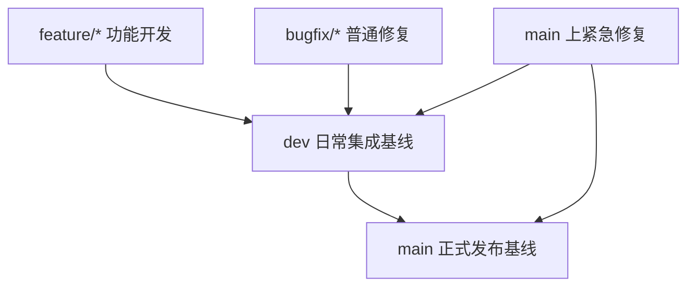

# DevOps 分支、通道与制品说明

创建时间：2026-06-05
最后更新：2026-06-12
状态：说明文档
适用对象：开发、发布负责人、DevOps 工程师、新成员

## 1. 文档定位

这份文档是解释型文档，只负责说明 Websoft9 的分支、发布通道和制品模型应该如何理解。

它不负责维护整体完成度、阶段顺序和当前推进状态；这些内容统一以 [roadmap_cn.md](./roadmap_cn.md) 为准。

对于应用商店数据升级与兼容的执行细节，统一以 [app-store-release-governance_cn.md](./app-store-release-governance_cn.md) 为准。

本文重点回答 4 个问题：

1. `main` 分支上的旧工作流今天到底是什么
2. 新版本目标上应该采用什么分支模型和通道模型
3. 应用程序制品和应用商店数据制品为什么要分开治理
4. 新旧模型之间应该怎么迁移，才不会影响旧平台运行

## 2. 当前基线事实

以下内容描述当前仓库在新版本发布重构后的程序制品基线，同时说明应用商店数据发布已经迁移到独立的 `docker-library` 仓库。

### 2.1 当前程序制品工作流事实

1. 程序制品的长期分支已经收敛为 `dev` 和 `main`
2. `dev` 分支上的 [ci-main.yml](../../../.github/workflows/ci-main.yml) 负责候选镜像构建、漏洞扫描与 smoke test，镜像仓库名为 `websoft9dev/websoft9`
3. `main` 分支上的 [release.yml](../../../.github/workflows/release.yml) 负责正式镜像标签、安装制品上传、GitHub Release、Pages 与通知；R2 发布根目录为 `artifact/websoft9/{channel}`
4. 程序制品通道当前只保留 `dev` 和 `release` 两层，不再把 `rc` 作为默认常设通道
5. 程序制品正式发布不再自动创建 `hotfix/*` 分支，也不再依赖手工 `channel` 推断

### 2.2 当前应用商店数据工作流事实

1. `websoft9` 仓库不再负责 catalog / library 制品发布，这部分已经迁移到 `docker-library` 仓库的独立 workflow
2. `docker-library` 是独立项目，负责 catalog、library 以及兼容 legacy media/library 制品的独立发布，不应被误写成 `websoft9` 仓库内部普通目录
3. 旧平台侧真正稳定存在的长期运行链路，仍然是消费 R2 上的 legacy 全量包，而不是由本仓库重新生成这些数据制品

### 2.3 当前应用商店制品事实

1. 展示数据来自 Contentful，经 `media.yml` / `media_dev.yml` 生成 `media.zip` 或 `media-dev.zip`
2. `media` 包中仍包含 `json`、`logos`、`screenshots`
3. 安装数据来自 `docker-library`，以 `library-latest.zip` 或 `library-dev.zip` 形式进入平台
4. 运行时仍直接依赖 `/websoft9/media/json/*.json` 与 `/websoft9/library/...`
5. 旧平台每天自动更新的对象就是 `media-latest.zip` 和 `library-latest.zip`

### 2.4 当前自动更新事实

1. 旧平台在运行时存在 `cron -> update.sh -> update_zip.sh` 的自动全量更新链路
2. 当前仓库里可直接核对的旧链路文件面是 `scripts/update_zip.sh`、`apphub/src/cli/apphub_cli.py` 与 `docker/supervisord.conf`
3. 因此，旧的每日自动全量更新不是附加逻辑，而是现网运行机制的一部分

## 3. 先区分 4 个概念

### 3.1 分支

分支是代码协作线。

例子：

1. `main`
2. `dev`
3. `feature/*`
4. `bugfix/*`

### 3.2 通道

通道是制品稳定级别。

例子：

1. `dev`
2. `release`

### 3.3 环境

环境是真正运行软件的地方。

例子：

1. 开发验证环境
2. 候选验证环境
3. 生产环境

### 3.4 制品

制品是流水线产出的可交付物。

在 Websoft9 中，至少包括：

1. Docker 镜像
2. 发布 zip 包
3. `media` 全量包
4. `library` 全量包
5. Catalog / Product JSON
6. app 级目录与数据制品
7. manifest、checksum、兼容性元数据

## 4. 目标模型应该怎么理解

### 4.1 推荐的分支模型

当前阶段更适合 Websoft9 新版本的默认模型是：

1. 长期分支只有 `main` 和 `dev`
2. 短期协作分支只用于开发过程，如 `feature/*`、`bugfix/*`、`chore/*`、`refactor/*`、`docs/*`、`test/*`
3. 不再把 `hotfix/*` 和 `release/*` 作为常设治理模型的一部分

### 4.2 为什么长期只保留 `main` 和 `dev`

1. 当前项目最需要的是把构建、验证、发布边界理顺，而不是引入更多分支类型
2. 两个长期分支已经足够表达“日常集成”和“正式发布”两类职责
3. `hotfix/*` 和 `release/*` 会把流程成本抬高，但当前项目体量和团队节奏并不需要这类复杂度
4. 对新版本来说，真正要治理的是制品发布门禁，而不是分支命名数量

因此更合理的默认流程是：

1. 日常开发：短期分支合回 `dev`
2. 准备发布：`dev` 合回 `main`
3. 紧急修复：直接基于 `main` 修复，再回合并到 `dev`

默认协作流可以直接理解为：短期分支 -> `dev` -> `main`。

### 4.3 推荐的通道模型

在新版本阶段，通道建议收敛为两层，而不是继续维持 `dev / rc / release` 三层常态化运营。

| 通道 | 含义 | 面向对象 | 稳定性 |
|---|---|---|---|
| `dev` | 候选与内部验证制品 | 开发与内部验证 | 中低 |
| `release` | 正式对外制品 | 用户与正式交付 | 高 |

补充原则：

1. `dev` 是候选通道，不是正式交付通道
2. `release` 是唯一正式对外交付通道
3. 如果未来确实需要 `rc`，应作为临时候选状态引入，而不是先把它设计成长期必经层级

### 4.4 推荐的版本身份

每次构建最好同时具备三类身份：

1. 不可变身份：如 commit / sha
2. 通道身份：如 `dev`、`latest`
3. 版本身份：如 `3.0.0`

对当前这套新版本发布体系，正式版本号基线从 `3.0.0` 开始，而不是沿用旧版本线继续递增。

这样才能同时满足：

1. 可追踪
2. 可验证
3. 可回滚
4. 可读

## 5. 制品为什么必须分两类治理

### 5.1 应用程序制品

这类制品代表 Websoft9 程序本体。

包括：

1. Docker 镜像
2. 发布 zip 包
3. 安装脚本
4. `version.json`
5. `CHANGELOG.md`

补充说明：

1. `version.json` 现在仍然需要保留，但它应该被视为“程序发布元数据文件”，而不是运行时全局配置中心。
2. 当前活动工作流真正需要的是发布身份信息，例如 `version` 和 `edition.key`。
3. `edition.name`、`edition.max_apps` 这类展示或运行时字段，应该继续留在代码目录或镜像内生成的产品元数据里，而不是回写到 `version.json`。
4. 运行时实际消费的产品元数据，应该优先落到镜像内生成的 `apphub/src/config/product_metadata.json`，而不是继续把所有运行时信息塞回 `version.json`。
5. `plugins` 不再属于 `version.json` 的职责范围；如果旧升级链还需要这类信息，应改由升级入口或独立 legacy 数据承接。
6. OS 支持矩阵已经迁移到安装文档维护，不再属于 `version.json` 的职责范围。
7. 旧版本兼容不应通过污染新版本主线发布元数据来完成。

### 5.2 应用商店数据制品

这类制品代表应用商店内容和安装元数据，不等同于程序本体。

包括：

1. Catalog / Product JSON
2. `media` 全量包
3. `library` 全量包
4. app 级目录与数据制品
5. manifest
6. checksum
7. 兼容性元数据

### 5.3 为什么要分开

因为这两类制品节奏不同：

| 维度 | 应用程序制品 | 应用商店数据制品 |
|---|---|---|
| 更新频率 | 中低频 | 高频，可每日更新 |
| 绑定源码 | 强绑定 | 弱绑定 |
| 发布方式 | 更严格受控 | 更像内容发布 |
| 紧急修复 | 代码 hotfix | 数据 hotfix |

## 6. 新版本发布门禁应该怎么理解

对新版本程序制品，推荐采用下面的简单模型：

1. `dev` 上的 push 负责构建候选镜像并完成验证
2. `main` 上的 push 或手工发布负责生成正式标签与正式制品
3. `latest` 只能从 `main` 的正式发布流程产生
4. 发布时应优先围绕不可变 SHA 或 digest 做追踪，而不是依赖分支名推断真实版本

这意味着：

1. `dev` 负责“能不能发布”
2. `main` 负责“正式对外发布什么”
3. 分支模型保持简单，发布门禁通过工作流和制品标识来体现

## 7. 兼容约束应该怎么理解

目标方案不是替换旧链路，而是并行增强旧链路。

必须同时成立的约束是：

1. 旧的 `media-latest.zip` / `library-latest.zip` 每日自动全量更新继续保留
2. 旧平台继续通过 `cron -> update.sh -> update_zip.sh` 工作
3. 旧应用商店继续读取 `/websoft9/media/json/*.json`
4. 旧平台继续读取 `/websoft9/library/...`
5. 新增 manifest、增量、app 级制品只能并行增加，不能抢占旧链路默认行为

## 8. 迁移路径应该怎么走

推荐按下面的顺序迁移：

### 8.1 第一阶段

1. 保留旧的 `media` / `library` 全量包
2. 为 Catalog 补齐基础 JSON、checksum 和轻量增量清单
3. 为 `docker-library` 补齐全量包、app 级目录制品和数据制品
4. 为新制品补齐最小 manifest

### 8.2 第二阶段

1. 补齐历史 manifest
2. 补齐 library 的 app 级变更索引
3. 补齐数据 hotfix 和回滚入口

### 8.3 第三阶段

1. 做更细粒度的 delta
2. 做兼容矩阵自动化
3. 在支持窗口结束后再讨论收缩旧结构

## 9. 这份文档和其他文档的关系

1. 本文档负责解释“为什么这样设计”
2. [roadmap_cn.md](./roadmap_cn.md) 负责维护整体阶段、当前状态和推进顺序
3. [app-store-release-governance_cn.md](./app-store-release-governance_cn.md) 负责应用商店数据治理的执行细节
4. [entry-baseline_cn.md](./entry-baseline_cn.md) 负责作为执行入口和阅读顺序说明

## 10. 最终结论

这轮重构不应该继续被旧工作流绑架，也不应该脱离 `main` 分支现状空谈目标。

正确理解应当是：

1. `main` 今天的旧链路必须先被看清
2. 长期只保留 `main + dev` 是当前更适合的新版本默认分支模型
3. `dev / release` 先是制品通道，再谈环境映射
4. 应用程序制品和应用商店数据制品必须分开治理
5. 新模型必须建立在旧平台稳定运行、不破坏每日全量更新的前提上
