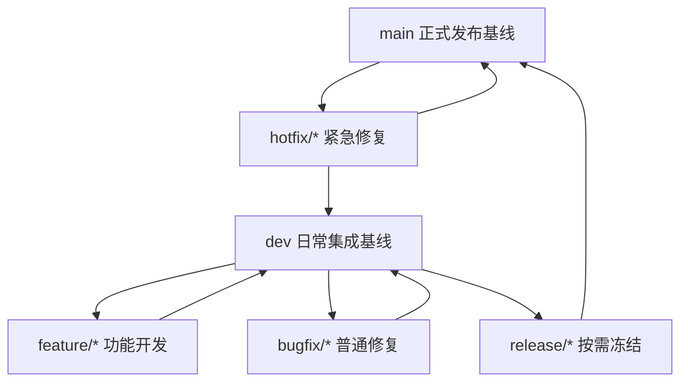

# DevOps 分支、通道与制品说明

创建时间：2026-06-05
最后更新：2026-06-08
状态：说明文档
适用对象：开发、发布负责人、DevOps 工程师、新成员

## 1. 文档定位

这份文档是解释型文档，只负责说明 Websoft9 的分支、发布通道和制品模型应该如何理解。

它不负责维护整体完成度、阶段顺序和当前推进状态；这些内容统一以 [roadmap_cn.md](./roadmap_cn.md) 为准。

对于应用商店数据升级与兼容的执行细节，统一以 [app-store-release-governance_cn.md](./app-store-release-governance_cn.md) 为准。

本文重点回答 4 个问题：

1. `main` 分支上的旧工作流今天到底是什么
2. 目标上应该采用什么分支模型和通道模型
3. 应用程序制品和应用商店数据制品为什么要分开治理
4. 新旧模型之间应该怎么迁移，才不会影响旧平台运行

## 2. 主干旧流程事实

以下内容只描述 `main` 分支上的真实情况，不把现状自动当成目标方案。

### 2.1 当前分支与工作流事实

1. 主干可见的核心 workflow 包括：`docker.yml`、`media.yml`、`media_dev.yml`、`release.yml`、`release_hotfix.yml`、`sync_contentful.yml`
2. `websoft9` 主分支当前没有新的统一应用商店数据构建 workflow，应用商店展示数据仍主要由 `media.yml` / `media_dev.yml` 负责
3. `docker-library` 是独立项目，负责 `library` 包的独立发布，不应被误写成 `websoft9` 仓库内部普通目录
4. `main` 上真正稳定存在的长期运行链路，是旧的全量包更新链路，而不是新的 manifest / dataset 模型

### 2.2 当前应用商店制品事实

1. 展示数据来自 Contentful，经 `media.yml` / `media_dev.yml` 生成 `media.zip` 或 `media-dev.zip`
2. `media` 包中仍包含 `json`、`logos`、`screenshots`
3. 安装数据来自 `docker-library`，以 `library-latest.zip` 或 `library-dev.zip` 形式进入平台
4. 运行时仍直接依赖 `/websoft9/media/json/*.json` 与 `/websoft9/library/...`
5. 旧平台每天自动更新的对象就是 `media-latest.zip` 和 `library-latest.zip`

### 2.3 当前自动更新事实

1. 旧平台在运行时存在 `cron -> update.sh -> update_zip.sh` 的自动全量更新链路
2. 当前仓库里可直接核对的旧链路文件面是 `scripts/update_zip.sh`、`apphub/src/cli/apphub_cli.py` 与 `docker/supervisord.conf`
3. 因此，旧的每日自动全量更新不是附加逻辑，而是现网运行机制的一部分

## 3. 先区分 4 个概念

### 3.1 分支

分支是代码协作线。

例子：

1. `main`
2. `dev`
3. `feature/*`
4. `bugfix/*`
5. `hotfix/*`

### 3.2 通道

通道是制品稳定级别。

例子：

1. `dev`
2. `rc`
3. `release`

### 3.3 环境

环境是真正运行软件的地方。

例子：

1. 开发验证环境
2. 候选验证环境
3. 生产环境

### 3.4 制品

制品是流水线产出的可交付物。

在 Websoft9 中，至少包括：

1. Docker 镜像
2. 发布 zip 包
3. `media` 全量包
4. `library` 全量包
5. Catalog / Product JSON
6. app 级目录与数据制品
7. manifest、checksum、兼容性元数据

## 4. 目标模型应该怎么理解

### 4.1 推荐的分支模型

当前阶段更适合 Websoft9 的默认模型是：

1. `main`
2. `dev`
3. `feature/*`
4. `bugfix/*`
5. `hotfix/*`
6. `release/*` 作为按需启用，而不是日常必经

### 4.2 为什么 `release/*` 不是日常强制步骤

1. 当前项目并没有一套成熟稳定的预发冻结体系
2. 如果把 `release/*` 设成每次发布都必须经过的步骤，会显著提高成本
3. 对当前阶段来说，更重要的是把制品链路和兼容策略做对，而不是引入更复杂的流程

所以更合理的用法是：

1. 日常发布：`dev -> rc -> main -> release`
2. 大版本或高风险版本：`dev -> release/* -> rc -> main -> release`

### 4.3 推荐的通道模型

在当前阶段，`dev`、`rc`、`release` 首先是制品通道，而不是必须一一对应到长期物理环境。

| 通道 | 含义 | 面向对象 | 稳定性 |
|---|---|---|---|
| `dev` | 开发制品 | 开发与内部验证 | 低 |
| `rc` | 候选制品 | 发布负责人和候选验证 | 中 |
| `release` | 正式制品 | 用户与正式交付 | 高 |

### 4.4 推荐的版本身份

每次构建最好同时具备三类身份：

1. 不可变身份：如 commit / sha
2. 通道身份：如 `dev`、`rc`、`latest`
3. 版本身份：如 `2.3.0`、`2.4.0-rc.1`

这样才能同时满足：

1. 可追踪
2. 可验证
3. 可回滚
4. 可读

## 5. 制品为什么必须分两类治理

### 5.1 应用程序制品

这类制品代表 Websoft9 程序本体。

包括：

1. Docker 镜像
2. 发布 zip 包
3. 安装脚本
4. `version.json`
5. `CHANGELOG.md`

### 5.2 应用商店数据制品

这类制品代表应用商店内容和安装元数据，不等同于程序本体。

包括：

1. Catalog / Product JSON
2. `media` 全量包
3. `library` 全量包
4. app 级目录与数据制品
5. manifest
6. checksum
7. 兼容性元数据

### 5.3 为什么要分开

因为这两类制品节奏不同：

| 维度 | 应用程序制品 | 应用商店数据制品 |
|---|---|---|
| 更新频率 | 中低频 | 高频，可每日更新 |
| 绑定源码 | 强绑定 | 弱绑定 |
| 发布方式 | 更严格受控 | 更像内容发布 |
| 紧急修复 | 代码 hotfix | 数据 hotfix |

## 6. 兼容约束应该怎么理解

目标方案不是替换旧链路，而是并行增强旧链路。

必须同时成立的约束是：

1. 旧的 `media-latest.zip` / `library-latest.zip` 每日自动全量更新继续保留
2. 旧平台继续通过 `cron -> update.sh -> update_zip.sh` 工作
3. 旧应用商店继续读取 `/websoft9/media/json/*.json`
4. 旧平台继续读取 `/websoft9/library/...`
5. 新增 manifest、增量、app 级制品只能并行增加，不能抢占旧链路默认行为

## 7. 迁移路径应该怎么走

推荐按下面的顺序迁移：

### 7.1 第一阶段

1. 保留旧的 `media` / `library` 全量包
2. 为 Catalog 补齐基础 JSON、checksum 和轻量增量清单
3. 为 `docker-library` 补齐全量包、app 级目录制品和数据制品
4. 为新制品补齐最小 manifest

### 7.2 第二阶段

1. 补齐历史 manifest
2. 补齐 library 的 app 级变更索引
3. 补齐数据 hotfix 和回滚入口

### 7.3 第三阶段

1. 做更细粒度的 delta
2. 做兼容矩阵自动化
3. 在支持窗口结束后再讨论收缩旧结构

## 8. 这份文档和其他文档的关系

1. 本文档负责解释“为什么这样设计”
2. [roadmap_cn.md](./roadmap_cn.md) 负责维护整体阶段、当前状态和推进顺序
3. [app-store-release-governance_cn.md](./app-store-release-governance_cn.md) 负责应用商店数据治理的执行细节
4. [entry-baseline_cn.md](./entry-baseline_cn.md) 负责作为执行入口和阅读顺序说明

## 9. 最终结论

这轮重构不应该继续被旧工作流绑架，也不应该脱离 `main` 分支现状空谈目标。

正确理解应当是：

1. `main` 今天的旧链路必须先被看清
2. `main + dev + feature/bugfix/hotfix` 是当前更适合的默认分支模型
3. `dev / rc / release` 先是制品通道，再谈环境映射
4. 应用程序制品和应用商店数据制品必须分开治理
5. 新模型必须建立在旧平台稳定运行、不破坏每日全量更新的前提上
