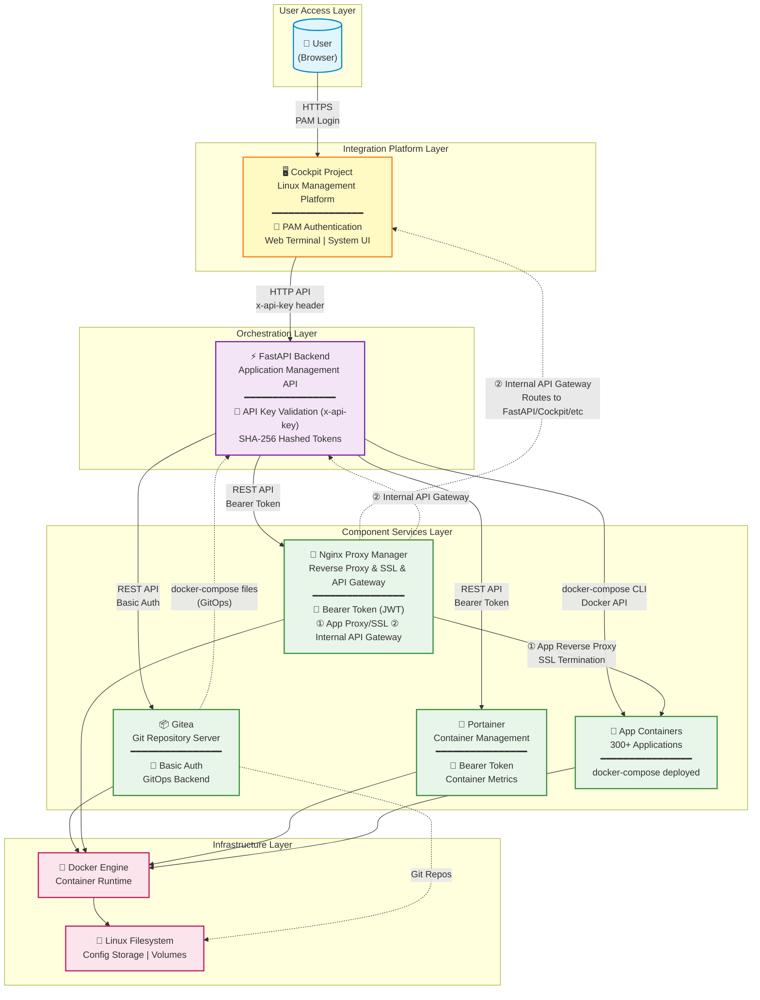

# Architecture Decision Document - websoft9

_This document builds collaboratively through step-by-step discovery. Sections are appended as we work through each architectural decision together._

## Technology Stack Decisions

### Architecture Approach

**Integration-Based Architecture**: websoft9 adopts a strategy of integrating existing mature open-source components rather than building all functionality from scratch. Leverages battle-tested components, reduces development burden, provides enterprise-grade features without enterprise complexity.

### Core Technology Stack

**Backend**: Python 3.x + FastAPI (high performance, async, auto-docs) | Cockpit Project (Linux management, plugin platform)

**Frontend**: React + Webpack (embedded as Cockpit module)

**Data Persistence**: None (stateless) - Git repositories for config (GitOps), Docker volumes for runtime state

**Container Orchestration**: docker-compose (single-server optimized, simple, no K8s overhead)

### Integrated Third-Party Components

**1. Cockpit Project** - Linux management platform, web UI host, container-internal user management

**2. Nginx Proxy Manager** - Dual role: ① Application reverse proxy + SSL management ② Internal API gateway for websoft9 services

**3. Portainer** - Container management, metrics visualization, Docker API abstraction

**4. Gitea** - GitOps backend, compose file storage, version control

### Configuration Management Infrastructure

**websoft9.service (systemd)** - Configuration Synchronization Center

**Purpose**: Synchronizes config between apphub config.ini (source of truth) and system components (Cockpit, Nginx)

**Key Functions**:
1. **Credential Sync**: Extracts credentials from component containers → apphub config.ini (retry mechanism)
2. **Config Sync**: Bidirectional inotifywait-based monitoring, syncs `docker0_ip`, `cockpit_port`, `ssl_cert/key` between apphub and Cockpit/Nginx configs, auto-reloads services
3. **System Init**: Updates `/etc/issue` with system info and console URL

**Rationale**: Needed because Cockpit (host) and Nginx (container) require filesystem-level config coordination

### Authentication & Authorization

**Two-Layer Model**:
- **Layer 1**: Cockpit container-internal users (default: websoft9/websoft9)
- **Layer 2**: FastAPI API Key (`x-api-key` header, SHA-256 hashed, global dependency)
- **Components**: Gitea (Basic Auth), NPM (Bearer/JWT), Portainer (Bearer token)

**Flow**: User → Cockpit (Container Users) → FastAPI (API Key) → Components (Token/Basic Auth)

**Trade-off**: No SSO (components have separate credentials), API key shared across all users, container-scoped user management

### Key Architectural Decisions

**No Custom Database**: GitOps principle - config in Git, state in Docker. Simpler but requires filesystem/Git operations for queries.

**Component Integration**: Reuse mature tools for non-differentiating features. Faster time-to-market, dependency risk accepted.

**Cockpit Platform**: System-level access, familiar to sysadmins. Tied to Cockpit's release cycle.

**docker-compose**: Single-server optimized, simple. No horizontal scaling but meets 80% user needs.

### Technology Constraints & Limitations

**Single-Server Boundary**:
- No distributed systems considerations
- No service mesh or advanced networking
- Local filesystem for data persistence

**Integration Dependency**:
- Relies on stability and compatibility of 4 major third-party components
- Version management complexity across components
- Upgrade coordination required

**Scalability Limits**:
- Vertical scaling only (add more CPU/RAM to single server)
- Not designed for horizontal scaling or load balancing

## Core Architectural Decisions

### System Architecture Overview



**Architecture Layers**:
- **User Access**: Browser-based access with Cockpit PAM authentication
- **Integration Platform**: Cockpit provides unified web UI and authentication boundary
- **Orchestration**: FastAPI coordinates all component services via REST APIs
- **Component Services**: Specialized containers for Git, proxy, container management, and applications
- **Infrastructure**: Docker runtime with filesystem-based persistence

**Key Flows**:
1. **Authentication**: User → Cockpit (PAM) → FastAPI (API Key) → Components (Token/Basic Auth)
2. **GitOps**: FastAPI retrieves docker-compose files from Gitea for deployment
3. **Reverse Proxy (Dual Role)**:
   - **Application Traffic**: NPM routes external domain requests to application containers with SSL termination
   - **Internal API Gateway**: NPM serves as unified entry point for websoft9 internal services (Cockpit UI, FastAPI endpoints)
4. **Deployment**: FastAPI orchestrates docker-compose via Docker Engine

### Component Communication Architecture

**Network Flow**: External → NPM (API Gateway) → Cockpit/FastAPI (Internal) or AppContainers (Apps)

**API Integration**: FastAPI orchestrates Portainer (containers), Gitea (compose files), NPM (proxy config) via REST APIs. All communications through Docker network, no direct UI-to-component access.

### Configuration Management & Deployment

**GitOps**: docker-compose files stored in Gitea (flat storage, no versioning in MVP). FastAPI fetches on-demand during deployment.

**Deployment Flow**: User (Cockpit UI) → FastAPI → Gitea (fetch compose) → Portainer API (execute stack) → Docker (run containers)

**Key Decision**: FastAPI never calls Docker directly, always through Portainer for abstraction and stack management.

### Monitoring

**Two-Tier Model**: Cockpit (server metrics: CPU/memory/disk/systemd) + Portainer (container metrics/logs). No centralized aggregation in MVP.

### Key Trade-offs

**Portainer Proxy**: Abstracts Docker complexity, adds indirection. Accepted for reduced FastAPI complexity.

**No Versioning**: Simpler MVP, no rollback. Can add Git commits post-MVP.

**Component APIs**: Reuses mature UIs, tight coupling risk. Aligns with integration philosophy.

**Cockpit Auth**: Familiar to sysadmins, credential propagation complexity. Reduces auth friction.

## Implementation Patterns

### Project Structure

**Backend (apphub/):**
```
apphub/
├── src/
│   ├── api/v1/routers/      # API routes (versioned)
│   ├── core/                # Core utilities (config, logger, exceptions)
│   ├── schemas/             # Pydantic models
│   ├── services/            # Business logic layer
│   ├── utils/               # Helper functions
│   ├── config/              # Configuration files
│   └── main.py              # FastAPI app entry
└── tests/                   # Test suite (separate directory)
```

**Rationale**: Clean separation of concerns (routes → services → external APIs), versioned API structure

### Coding Conventions

**Python/FastAPI:**
- **Naming**: snake_case for functions/variables (`get_user_data`, `api_key`)
- **Files**: snake_case (`error_response.py`, `routers.py`)
- **API Routes**: `/api/v1/{resource}` (versioned, lowercase)
- **Error Format**: `{message: str, details: str}` (Pydantic ErrorResponse schema)
- **Exception Handling**: Custom `CustomException` class, global exception handlers in main.py
- **API Security**: API key header authentication (`x-api-key`)

**React/Frontend:**
- Integrated as Cockpit module
- Standard React/Webpack conventions

---

## Architecture Validation Results

### Coherence Validation ✅

**Decision Compatibility:**
All technology choices work together without conflicts. Python 3.x + FastAPI is fully compatible with docker-compose orchestration. Cockpit Project (system-level) integrates seamlessly with containerized services. React frontend embeds cleanly as Cockpit module. The stateless architecture (no database + GitOps) maintains consistency throughout. All 4 integrated components (Gitea, NPM, Portainer, Cockpit) communicate via REST APIs without version conflicts.

**Pattern Consistency:**
Implementation patterns align perfectly with technology choices. Snake_case naming and versioned APIs support FastAPI conventions. Project structure (apphub/src with routers/services/schemas) follows FastAPI best practices. Communication patterns (REST APIs, Docker network) are consistent with microservice-style integration. Error handling pattern (CustomException, global handlers) is standardized across the FastAPI backend.

**Structure Alignment:**
Project structure properly separates concerns with clear boundaries. Integration boundaries are well-defined (FastAPI orchestrates components via APIs, no direct UI-to-component access). GitOps structure (Gitea storage, FastAPI fetch-on-demand) fully supports the deployment flow. Configuration sync structure (websoft9.service ↔ apphub config.ini) correctly handles host/container coordination requirements.

### Requirements Coverage Validation ✅

**Functional Requirements Coverage:**
- **App Store (300+ apps)**: Fully supported via Gitea storage + docker-compose + Portainer orchestration
- **One-Click Deployment**: Complete flow implemented: Cockpit UI → FastAPI → Gitea (fetch compose) → Portainer (execute stack)
- **Domain & SSL Management**: Nginx Proxy Manager handles both application proxy and internal API gateway roles
- **Container Management**: Portainer provides visualization and Docker API abstraction
- **System Management**: Cockpit delivers Linux server management and terminal access
- **GitOps Workflow**: Gitea stores compose files with full Git version control and history

**Non-Functional Requirements Coverage:**
- **Single-Server Optimization**: docker-compose eliminates Kubernetes overhead, vertical scaling only
- **Security**: Two-layer authentication (Cockpit PAM + FastAPI API key) with component-specific tokens
- **Monitoring**: Two-tier model (Cockpit server metrics + Portainer container metrics)
- **Simplicity**: Integration-based architecture reuses mature components, achieving "just right" complexity
- **Performance**: FastAPI async support, no database overhead, direct Docker network communication

**Epic/Feature Coverage:**
All product brief and PRD requirements are architecturally supported. Target users (4 segments) benefit from Cockpit familiarity and simple deployment. Core value propositions (app store, GitOps, complete integration) are fully enabled. Differentiators (lightweight, fully integrated, tech-neutral) are architecturally realized.

### Implementation Readiness Validation ✅

**Decision Completeness:**
All critical decisions documented with specific versions (Python 3.x, FastAPI, React, docker-compose). Integration patterns are comprehensive with REST API specifications and authentication mechanisms for all 4 components. Consistency rules are clear (snake_case naming, versioned APIs, error format). Architecture diagram provides visual reference for all layers and flows.

**Structure Completeness:**
Project structure is fully specified (apphub/src with 7 subdirectories). Component boundaries are well-defined (FastAPI orchestration layer, no direct UI-to-component communication). Integration points are clearly specified (REST APIs, Docker network, config sync via systemd service). File organization supports proper separation of concerns (routes → services → external APIs).

**Pattern Completeness:**
Naming conventions are comprehensive (snake_case files/functions, lowercase API routes). Communication patterns are fully specified (FastAPI as orchestrator, NPM as gateway, Docker network). Error handling pattern is complete (CustomException class, global handlers, ErrorResponse schema). Authentication flow is documented end-to-end (User → Cockpit PAM → FastAPI API Key → Component tokens).

### Gap Analysis Results

**Critical Gaps:** None identified. All essential architectural elements are complete and implementation-ready.

**Important Gaps:** None identified. All architectural decisions align with design intent:
- **Git Version Control**: Gitea provides native Git version control with full commit history, rollback capability, and audit trail
- **API Key Design**: Shared API key across users is an intentional architectural choice that aligns with the current permission model and simplifies the architecture for the target user base
- **Monitoring Architecture**: Two-tier monitoring (Cockpit + Portainer) is a deliberate design decision that follows the single-server optimization principle without introducing unnecessary complexity

**Nice-to-Have Enhancements:**
- Add deployment flow sequence diagram for visualizing the 8-step process
- Add configuration sync mechanism diagram for websoft9.service bidirectional sync
- Document testing strategy and patterns (unit/integration/e2e)

### Architecture Completeness Checklist

**✅ Requirements Analysis**
- [x] Project context thoroughly analyzed
- [x] Scale and complexity assessed
- [x] Technical constraints identified
- [x] Cross-cutting concerns mapped

**✅ Architectural Decisions**
- [x] Critical decisions documented with versions
- [x] Technology stack fully specified
- [x] Integration patterns defined
- [x] Performance considerations addressed

**✅ Implementation Patterns**
- [x] Naming conventions established
- [x] Structure patterns defined
- [x] Communication patterns specified
- [x] Process patterns documented

**✅ Project Structure**
- [x] Complete directory structure defined
- [x] Component boundaries established
- [x] Integration points mapped
- [x] Requirements to structure mapping complete

### Architecture Readiness Assessment

**Overall Status:** ✅ **READY FOR IMPLEMENTATION**

**Confidence Level:** **VERY HIGH** - All essential architectural elements are complete with no critical or important gaps identified.

**Key Strengths:**
- Comprehensive technology stack decisions with clear rationale and version specifications
- Visual architecture diagram covering all 5 layers (User Access, Integration Platform, Orchestration, Component Services, Infrastructure) with detailed flows
- All 4 major architectural decisions documented with explicit trade-offs
- Integration-based approach minimizes custom development complexity while maximizing reliability
- Clear boundaries and communication patterns prevent potential agent conflicts during implementation
- Configuration management infrastructure (websoft9.service) properly documented with bidirectional sync mechanism
- Native Git version control via Gitea provides rollback and audit capabilities
- Authentication model (PAM + API Key) aligns with permission design and simplifies architecture
- Two-tier monitoring follows single-server optimization without unnecessary tooling

**Areas for Future Enhancement:**
- Add deployment flow sequence diagram for improved visualization
- Add configuration sync mechanism diagram for websoft9.service
- Document testing strategy and patterns for comprehensive quality assurance

### Implementation Handoff

**AI Agent Guidelines:**
- Follow all architectural decisions exactly as documented in this architecture document
- Use implementation patterns consistently across all components (snake_case, versioned APIs, error formats)
- Respect project structure and boundaries (no direct UI-to-component communication, FastAPI orchestration only)
- Refer to this document for all architectural questions and consistency checks
- Maintain the integration-based philosophy: reuse mature components rather than custom development

**First Implementation Priority:**
Begin with FastAPI backend setup following the documented project structure (apphub/src). Implement the API key authentication mechanism as the foundation, then proceed with component API integrations (Portainer, Gitea, NPM) following the documented REST API patterns.

**Architecture Status:** Complete and validated. Ready for development phase.
